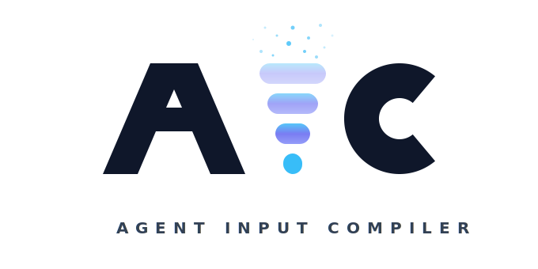
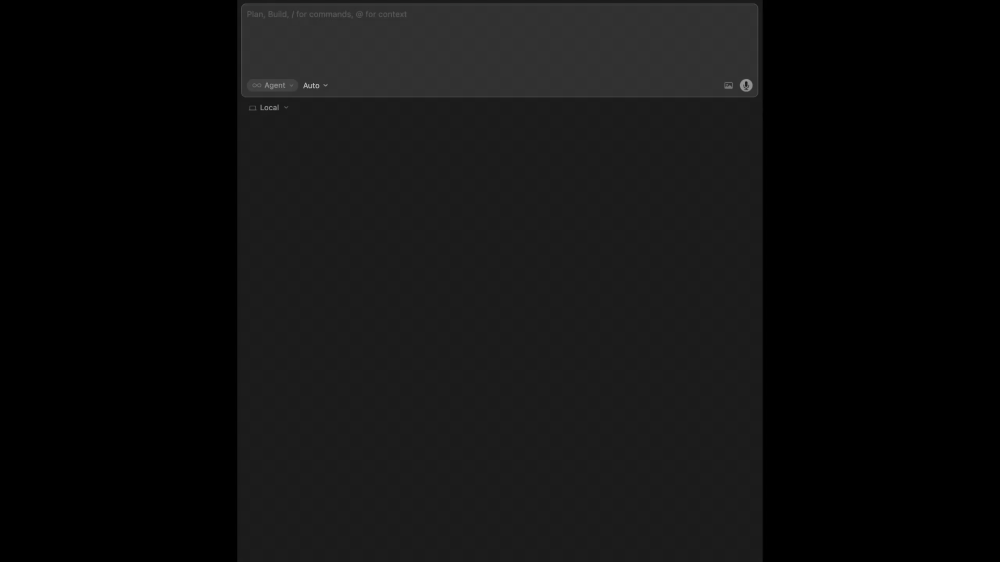

<p align="center">
  <picture>
    <source media="(prefers-color-scheme: dark)" srcset="logotype.svg" />
    <source media="(prefers-color-scheme: light)" srcset="logotype-light.svg" />
    
  </picture>
</p>

<p align="center">
  
  <a href="https://www.npmjs.com/package/@jatbas/aic"></a>
  
  
  
  <a href="https://cursor.directory/plugins/aic"></a>
</p>

Local-first MCP server that compiles focused context for Cursor and Claude Code — classifies intent, selects relevant files, strips noise, and blocks secrets before they reach the model.

AIC does **not** replace your editor. It runs alongside MCP-compatible editors and improves the context they send to the model.

<p align="center">
  
</p>

---

## Why developers use AIC

AI coding tools often pull in too much irrelevant context. That wastes tokens, weakens instruction-following, and increases hallucinations.

AIC adds a compilation step before the model runs:

- classifies the task
- selects the most relevant files
- blocks sensitive or irrelevant content
- compresses the result to fit a token budget
- returns a bounded context package the model can reason over

The result is a smaller, more relevant, and more inspectable input.

### What it helps with

| Problem                               | What AIC does                                                                                                                                                                                                       |
| ------------------------------------- | ------------------------------------------------------------------------------------------------------------------------------------------------------------------------------------------------------------------- |
| Too much irrelevant context           | Selects and compresses only the files that matter                                                                                                                                                                   |
| Inconsistent context quality          | Produces deterministic compiled context for the same task and codebase                                                                                                                                              |
| Wasted tokens                         | Strips noise and progressively compresses content to stay within budget                                                                                                                                             |
| Secret exposure risk                  | Blocks secrets, excluded paths, and suspicious prompt injection strings locally                                                                                                                                     |
| No visibility into what the model saw | Shows compilation summaries, the on-disk compiled prompt under `.aic/` in the project, and optional per-file selection scores via MCP `aic_last` (see **Selection detail** after the samples below)                 |
| Editor lag from context compaction    | Compiled context is bounded by a hard token budget, so its contribution to window fill is predictable regardless of repo size; this leaves stable headroom in the context window and reduces pressure on compaction |

### Real captured output

The examples below mirror the **shared stdout frame** printed by the diagnostic CLI (`status`, `last`, `chat-summary`, `projects`, `quality` — or `pnpm aic` when developing this repo with `devMode`): each table starts with a title line and full-width rule, then a **hero** line (always present), another rule, fixed-width **body** rows (`padRow` labels are 30 characters wide except the multi-column **projects** roster), and an optional closing rule plus **footnote** (both omitted on the **projects** roster, which ends after its body rows). Values are **representative** (not a single verbatim session); totals come from your **local** database (`~/.aic/aic.sqlite`) and the **current project**, so your output will not match these figures exactly.

#### `show aic status`

```text
Status = project-level AIC status.
──────────────────────────────────────────────────────────────────────────────
AIC optimised context across 7,784 context builds; repo size → context sent 5.78B → 65.90M (88:1 ratio); 36.9% cache hit rate; 98.9% avg context precision.
──────────────────────────────────────────────────────────────────────────────
Context builds (total)          7,784
Context builds (today)          147
Repo size → context sent        5.78B → 65.90M (88:1 ratio)
Tokens excluded                 5,718,696,860
──────────────────────────────────────────────────────────────────────────────
Context window used (last run)  0.5%
Cache hit rate                  36.9%
Avg context precision           98.9%
──────────────────────────────────────────────────────────────────────────────
Guard scans (lifetime)          command-injection: 648,063, excluded-file: 59, prompt-injection: 3,185, secret: 16
Top request types               count  share
  general                       4,530  70.3%
  docs                            994  15.4%
  bugfix                          921  14.3%
Last compilation                fix SqliteSpecCompileCacheStore migration
                                5 / 629 files · 595 tokens · 2 min ago
──────────────────────────────────────────────────────────────────────────────
Installation                    OK
──────────────────────────────────────────────────────────────────────────────
Avg context precision: % of repo content automatically filtered per context build.
Context window used: % of token budget filled.
```

#### `show aic last`

```text
Last = most recent compilation.
──────────────────────────────────────────────────────────────────────────────
AIC optimised context by intent: 5 of 567 files forwarded (0.3% of budget, 99.9% excluded).
──────────────────────────────────────────────────────────────────────────────
Context builds                  7,666
Intent                          task 318 spec-compile-cache migration 004 SqliteSpecCompileCacheStore
Files                           5 selected / 567 total
Tokens compiled                 595
Context window used             0.3%
Compiled                        2 min ago
Editor                          claude-code
Cache                           miss
Guard (this run)                2 finding(s), 2 blocked
Compiled prompt                 Available (595 tokens) — .aic/last-compiled-prompt.txt (project root)
──────────────────────────────────────────────────────────────────────────────
Context window used: % of token budget filled.
```

#### `show aic chat summary`

```text
Chat = this conversation's AIC compilations.
──────────────────────────────────────────────────────────────────────────────
AIC optimised context by intent across 42 compilations (88:1 ratio, 40.0% cache hit rate).
──────────────────────────────────────────────────────────────────────────────
Project path                    /dev/AIC
Context builds                  42
Repo size → context sent        8.80M → 100,000 (88:1 ratio)
Tokens excluded                 5.00M
──────────────────────────────────────────────────────────────────────────────
Cache hit rate                  40.0%
Avg context precision           55.2%
──────────────────────────────────────────────────────────────────────────────
Last compilation                refactor diagnostic output · 2 min ago
Top request types               count  share
  refactor                         20  62.5%
  general                          12  37.5%
──────────────────────────────────────────────────────────────────────────────
Avg context precision: % of repo content automatically filtered per context build.
```

#### `show aic projects`

```text
Projects = known AIC projects.
──────────────────────────────────────────────────────────────────────────────
1 project(s); 7,796 compilations; latest activity 2 min ago.
──────────────────────────────────────────────────────────────────────────────
Project ID                              Path                              Last seen       Compilations
018f0000-0000-7000-8000-00000000aa01    /Users/dev/AIC                    2 min ago              7,784
```

#### `show aic quality`

```text
Quality = context build quality metrics.
──────────────────────────────────────────────────────────────────────────────
AIC optimised context by intent across 137 compilations in the last 7 days (median 99.6% filtered, 38.0% cache hit rate).
──────────────────────────────────────────────────────────────────────────────
Time range                      Last 7 days
Compilations                    137
──────────────────────────────────────────────────────────────────────────────
Median context precision        99.6%
Median selection ratio          1.1%
Median budget used              3.1%
Cache hit rate                  38.0%
Tier mix
  full          100.0%
  sig+doc       0.0%
  sigs          0.0%
  names         0.0%
Task class mix                  count  share     budget
refactor                            4   2.9%       0.4%
bugfix                             12   8.8%       0.7%
feature                             9   6.6%       0.5%
docs                               24  17.5%       3.1%
test                                4   2.9%       0.7%
general                            84  61.3%      14.6%
Classifier mean                 7.5%
Daily compilations              ▁▁▁▁▁▁█
                                Tue Wed Thu Fri Sat Sun Mon
──────────────────────────────────────────────────────────────────────────────
Context precision  % of repo content automatically filtered per context build.
Selection ratio: % of repo files selected per build.
Budget used: % of token budget consumed per build.
Cache hit rate: % of builds served from cache without recompiling.
Tiers: full = entire file · sig+doc = signatures + docs · sigs = signatures only · names = symbol names only.
Compilations     Builds AIC performed in this window (cache hits included).
Task class mix   How AIC classified each build, with its share and median
                 token budget used. Higher "budget" means AIC allocated
                 more context for that task type. "general" is the
                 classifier's fallback when confidence is low.
Classifier mean  Mean confidence of the task classifier (0-100%). Low values
                 mean frequent fallback to "general" — not a quality
                 problem by itself, but worth noting when most builds
                 are "general".
```

> The CLI defaults to a **7-day** window when you omit flags (`show aic quality` or `aic quality`). With compilations in the window, the body also includes median rows, tier mix, task-class columns, optional sparklines, and the same multi-line glossary footnote shown below for the empty case.

---

## Quick start

Requirements: Node.js >= 22 (see `.nvmrc` for the reference Node major used to develop and test AIC).

### Cursor

1. **Install the MCP server** — install from the [Cursor Directory](https://cursor.directory/plugins/aic), use the one-click link below, or copy the URL into your browser:

   [](https://jatbas.github.io/agent-input-compiler/install/cursor-install.html)

   Or copy this URL:

   ```text
   cursor://anysphere.cursor-deeplink/mcp/install?name=aic&config=eyJjb21tYW5kIjoibnB4IiwiYXJncyI6WyIteSIsIkBqYXRiYXMvYWljQGxhdGVzdCJdfQ==
   ```

   Cursor will prompt to add the server to your global MCP config (`~/.cursor/mcp.json`). Confirm and you're done. AIC is now available in every workspace — no per-project setup needed.

2. **Start prompting** — approve the tools when prompted and start coding. On the first `aic_compile` for the project (or when the server first sees the project via workspace roots), AIC writes `aic.config.json`, the `.aic/` directory, ignore-file entries, and the Cursor trigger rule. When Cursor is in use, bootstrap also installs **Cursor lifecycle hooks** (`.cursor/hooks.json` and the `AIC-*.cjs` scripts) by running the installer bundled in `@jatbas/aic`, unless your project already contains `integrations/cursor/install.cjs` (that in-repo copy takes precedence). All projects share one database at `~/.aic/aic.sqlite`; other per-project files stay in the project directory. See [Installation — Cursor](documentation/installation.md#cursor) for full detail.

### Claude Code

1. Add the AIC marketplace: `/plugin marketplace add Jatbas/agent-input-compiler`
2. Install the plugin: `/plugin install aic@aic-tools`

The plugin starts the MCP server and registers hooks so every project gets compiled context automatically. Nothing else to install or configure. For prerequisites, direct installer, and troubleshooting, see [Installation — Claude Code](documentation/installation.md#claude-code).

### Disabling AIC for a specific project

Add `"enabled": false` to `aic.config.json` in the project root. AIC returns immediately with no compilation and no database writes. Set it back to `true` (or remove the field) to re-enable. The `show aic status` command reflects the current state.

For the full list of available configuration options, see [§6 Configuration in the Project Plan](documentation/project-plan.md#6-configuration--aicconfigjson).

### Other editors

AIC requires a dedicated integration layer to compile context automatically. Cursor and Claude Code have first-class integration layers; other editors do not yet have one. To request support for your editor or contribute an integration layer, [open an issue](https://github.com/Jatbas/agent-input-compiler/issues).

## Uninstall

Use Node.js >= 22 (matching `engines.node`). Download the standalone uninstall script:

```bash
curl -fsSL -o aic-uninstall-standalone.cjs https://raw.githubusercontent.com/Jatbas/agent-input-compiler/main/integrations/aic-uninstall-standalone.cjs
```

Run it against your project:

```bash
node aic-uninstall-standalone.cjs --project-root /path/to/project
```

By default this removes artifacts for both editors. Pass `--cursor` to limit cleanup to Cursor only, or `--claude` to limit to Claude Code only.

For `--global`, database removal, and the full flag list, see [Installation — Uninstall](documentation/installation.md#uninstall).

---

## Commands

These are natural-language prompts for your editor's AI, not terminal commands. Use only the words before `#` on each line; everything after `#` is a reminder for you, not part of the prompt.

```text
show aic status         # project-level status and lifetime stats
show aic last           # most recent compilation (table); MCP JSON may include selection trace
show aic chat summary   # per-conversation compilation stats for this workspace
show aic projects       # known AIC projects (IDs, paths, last seen, compilation counts)
show aic quality        # rolling-window compile transparency metrics (default 7 days; pass --window <1-365>)
run aic model test      # MCP-only: agent capability probe (aic_model_test + aic_compile)
```

---

## Verify your setup

Run the phrases in [Commands](#commands) above, then check the following.

What to look for:

- **Installation: OK** in `show aic status`
- a recent compilation in `show aic last` (send a normal coding message first if nothing has compiled yet), including the **Cache** row (`hit` / `miss` / `—`)
- per-conversation compilation stats in `show aic chat summary` after AIC has recorded at least one compilation for the current editor conversation (in Cursor, Task-tool subagent compilations are reparented to the parent chat via the `subagentStop` hook so they count on that thread)
- selected file count, compiled tokens, and context precision figures that make sense for the task
- AIC blocking sensitive or excluded content
- your project path listed in `show aic projects` after AIC has seen the workspace
- optional: **run aic model test** returns a pass/fail table if the agent can call `aic_model_test` and `aic_compile` in sequence (see [Installation — AIC Server](documentation/installation.md#aic-server))

> If there is no recent compilation, the model may not be calling AIC automatically. Check that the AIC tools are approved in your editor's MCP settings and try starting a new chat.

---

## Team setup

For team use, the practical split is simple:

- each developer installs the MCP server on their machine
- commit shared `aic.config.json` and editor rule files when you want the whole team on the same settings — bootstrap adds `aic.config.json` to ignore files by default, so remove that ignore entry (or add an exception) if the file should live in git; see [Per-Project Artifacts](documentation/installation.md#per-project-artifacts)
- `.aic/` (local cache and runtime data) stays on each developer's machine and should not be committed

AIC is useful for individuals, but it becomes more valuable when teams want more consistent context quality across the same codebase.

---

## How AIC fits into the workflow

1. Your editor integration (hooks and/or the trigger rule) is set up to call `aic_compile` before or as part of handling each user message — see [installation.md](documentation/installation.md) for how that differs by editor
2. AIC classifies the task, selects relevant files, applies guardrails, and compresses content
3. AIC returns a bounded context package
4. The editor continues the normal model workflow using that compiled context

AIC compiles context. It does not call models, replace the editor, or act as a separate coding environment.

---

## Security

AIC is local-first. All processing runs on the developer's machine.

AIC's Context Guard excludes the following from compiled context before it reaches the model:

- common secrets and credentials
- excluded paths such as `.env`, keys, and similar sensitive files
- suspicious prompt-injection strings in selected content

> This prevents sensitive content from being included in bulk context. It does not prevent the model from reading files directly through editor tools — that is the editor's responsibility. For details, see [`security.md`](documentation/security.md).
>
> Telemetry is local by default. AIC stores compilation metadata locally and does not need an AIC account or API key.

---

## Documentation

Use the README for orientation. Use the docs below for implementation detail.

| Document                                                         | Description                                                  |
| ---------------------------------------------------------------- | ------------------------------------------------------------ |
| [`installation.md`](documentation/installation.md)               | Installation, delivery, bootstrap, and per-editor details    |
| [`CHANGELOG.md`](CHANGELOG.md)                                   | Version history and release notes                            |
| [`CONTRIBUTING.md`](CONTRIBUTING.md)                             | Development setup, run from source, contribution process     |
| [`architecture.md`](documentation/architecture.md)               | Core pipeline, integration layer, editor capability model    |
| [`best-practices.md`](documentation/best-practices.md)           | Practical usage guidance                                     |
| [`security.md`](documentation/security.md)                       | Security model and hardening details                         |
| [`privacy.md`](privacy.md)                                       | Privacy overview — local data, telemetry, and network use    |
| [`implementation-spec.md`](documentation/implementation-spec.md) | Detailed pipeline and implementation behavior                |
| [`project-plan.md`](documentation/project-plan.md)               | Product architecture, ADRs, and full configuration reference |

---

## Contributing

Contributions are welcome.

> This is a structured codebase with a defined architecture; small, focused changes are reviewed and merged faster than broad refactors.

See [CONTRIBUTING.md](CONTRIBUTING.md) for development setup, local MCP testing, RFC requirements, and the PR checklist.

---

## License

Licensed under the [Apache License, Version 2.0](LICENSE).
