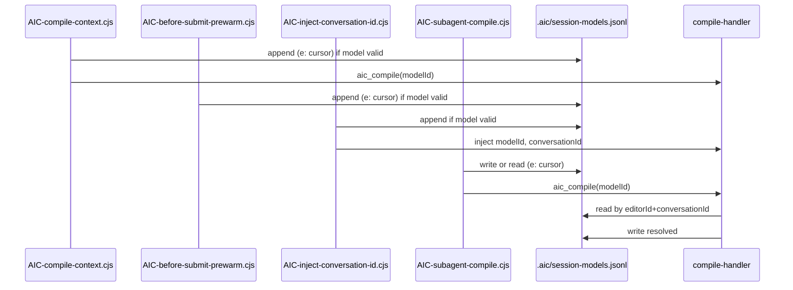
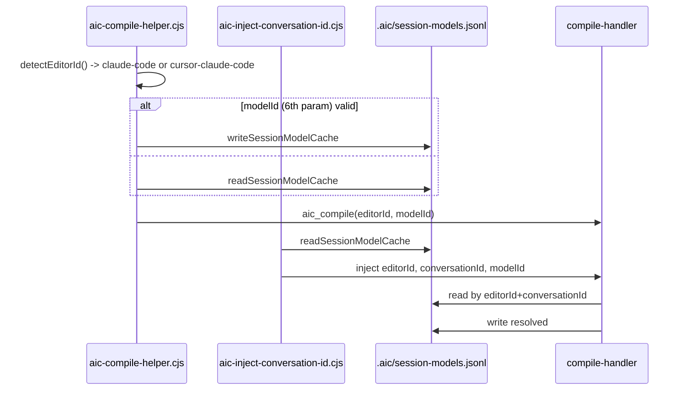

# Model ID flow per editor

This document describes the **current** model ID lifecycle: where each editor captures the model identifier, where it is written to or read from the session cache, and how the server resolves the final value. The three editor identities covered are Cursor (`cursor`), Claude Code (`claude-code`), and Cursor-running-Claude-Code (`cursor-claude-code`).

## Session cache

- **Path:** `<projectRoot>/.aic/session-models.jsonl`
- **Format:** One JSON object per line (JSONL). Each entry has:
  - `c` — conversation ID (string; may be empty)
  - `m` — model ID (string; 1–256 chars, printable ASCII)
  - `e` — editor ID (`cursor`, `claude-code`, or `cursor-claude-code`)
  - `timestamp` — ISO 8601 string
- **Normalization:** The **model ID** value `"default"` (case-insensitive) is normalized to `"auto"` when writing and when reading; all other values are used as-is.
- **Validation:** `isValidModelId(s)` requires length 1–256 and `/^[\x20-\x7E]+$/`. When reading the cache, invalid rows are skipped.

## Server-side resolution

The compile handler resolves the model ID in this order:

1. `args.modelId` (from the `aic_compile` tool arguments)
2. `modelIdOverride` (from project config `model.id`, if set)
3. `readSessionModelCache(projectRoot, conversationId, editorId)` — last matching line by `e` and optionally `c`
4. `getModelId(editorId)` — default from editor detector (e.g. `mcp/src/detect-editor-id.ts`, config, env)

The resolved value is normalized; if non-null, it is written back to the cache. Implementation: `resolveAndCacheModelId` in `mcp/src/handlers/compile-handler.ts`.

## Cursor (editorId `cursor`)

**Cursor.** Model capture and cache write happen in four hooks:

| Hook               | File                             | Behavior                                                                                                                                                                                                                                                               |
| ------------------ | -------------------------------- | ---------------------------------------------------------------------------------------------------------------------------------------------------------------------------------------------------------------------------------------------------------------------- |
| sessionStart       | `AIC-compile-context.cjs`        | Reads `hookInput.model`; if valid, normalizes, appends to cache with `e: "cursor"`, passes `modelId` in compile args to `aic_compile`.                                                                                                                                 |
| beforeSubmitPrompt | `AIC-before-submit-prewarm.cjs`  | Reads `input.model`; if valid, normalizes, appends to cache. Does not call `aic_compile`.                                                                                                                                                                              |
| preToolUse         | `AIC-inject-conversation-id.cjs` | If tool is `aic_compile`: when `input.model` is valid, normalizes, appends to cache, injects `modelId` and `conversationId` into tool input.                                                                                                                           |
| subagentStart      | `AIC-subagent-compile.cjs`       | Model ID is taken from `modelIdFromSubagentStartPayload(hookInput)` (which reads `subagent_model` via `subagent-start-model-id.cjs`). If present: write cache, use it; else read cache (filter `e === "cursor"`), use cached value. Passes `modelId` to `aic_compile`. |

Participant names in the diagram match hook events (PascalCase for display).

## Claude Code (editorId `claude-code` or `cursor-claude-code`)

**Claude Code.** Editor ID is chosen by `detectEditorId()`: if `CURSOR_TRACE_ID` is set and non-empty, `cursor-claude-code`; else `claude-code`. SessionStart, UserPromptSubmit, SubagentStart, and other hooks that call the MCP server go through `aic-compile-helper.cjs`; PreToolUse is handled by `aic-inject-conversation-id.cjs`. Hook / path in the table below: event name or code path.

| Hook / path                                         | File                             | Behavior                                                                                                                                                                                                                                                                                                                              |
| --------------------------------------------------- | -------------------------------- | ------------------------------------------------------------------------------------------------------------------------------------------------------------------------------------------------------------------------------------------------------------------------------------------------------------------------------------- |
| SessionStart, UserPromptSubmit, SubagentStart, etc. | `aic-compile-helper.cjs`         | `editorId = detectEditorId()`. If 6th param `modelId` valid: normalize, `writeSessionModelCache(projectRoot, resolved, conversationId, editorId)`. Else: `cached = readSessionModelCache(projectRoot, conversationId, editorId)`; if non-null, use `normalizeModelId(cached)`. Passes `editorId` and `modelId` in `aic_compile` args. |
| PreToolUse                                          | `aic-inject-conversation-id.cjs` | `eid = detectEditorId()`; `cachedModelId = readSessionModelCache(projectRoot, conversationId, eid)`. Injects `editorId`, `conversationId`, `modelId` (cached) into tool input. Does not write to cache.                                                                                                                               |

## Cursor–Claude Code (editorId `cursor-claude-code`)

Same implementation as Claude Code. Differentiation is only by editor ID and environment; behavior and cache shape match Claude Code. When the Claude Code integration runs inside Cursor, `CURSOR_TRACE_ID` is set, so `detectEditorId()` returns `cursor-claude-code`. Cache entries use `e: "cursor-claude-code"`. The server's `getModelId(editorId)` uses the same resolution order as for other editors; for this editor ID it may use Cursor config when applicable.
