# Agent Input Compiler (AIC) — Project Plan

## Editor-Agnostic · Model-Agnostic · Zero-Config · Enterprise-Ready

---

## Table of Contents

1. [Executive Summary](#1-executive-summary)
2. [Core Principles](#2-core-principles)
   - 2.1 [SOLID Principles & Design Patterns](#21-solid-principles--design-patterns)
   - 2.2 [MCP Server — Primary Interface](#22-mcp-server--primary-interface)
   - 2.3 [Model Adapter — Model-Specific Optimisation](#23-model-adapter--model-specific-optimisation)
   - 2.4 [Rules & Hooks Analyzer](#24-rules--hooks-analyzer)
   - 2.5 [Dependency Injection — Composition Pattern](#25-dependency-injection--composition-pattern)
   - 2.6 [Concurrency Model](#26-concurrency-model)
   - 2.7 [Agentic Workflow Support](#27-agentic-workflow-support)
3. [Glossary](#3-glossary)
   - 3.1 [Rule Pack Example](#31-rule-pack-example)
   - 3.2 [Rule Pack Authoring Guide](#32-rule-pack-authoring-guide)
4. [Architecture](#4-architecture)
   - 4.0 [Component Overview](#40-component-overview)
   - 4.1 [Core Pipeline](#41-core-pipeline)
   - 4.2 [Data Flow](#42-data-flow)
   - 4.3 [Enterprise Layering](#43-enterprise-layering)
   - 4.4 [Architecture Decision Records (ADRs)](#44-architecture-decision-records-adrs)
5. [Multi-Project Support](#5-multi-project-support)
6. [Configuration — `aic.config.json`](#6-configuration--aicconfigjson)
7. [User Interface (MCP-Only)](#7-user-interface-mcp-only)
8. [ContextSelector Interface](#8-contextselector-interface)
   - 8.1 [LanguageProvider Interface](#81-languageprovider-interface)
   - 8.2 [ModelClient Interface](#82-modelclient-interface)
   - 8.3 [OutputFormatter Interface](#83-outputformatter-interface)
   - 8.4 [ContextGuard Interface](#84-contextguard-interface)
   - 8.5 [ContentTransformer Interface](#85-contenttransformer-interface)
   - 8.6 [InspectRunner Interface](#86-inspectrunner-interface)
9. [Token Counting & Model Context Guard](#9-token-counting--model-context-guard)
   - 9.1 [Telemetry Event System](#91-telemetry-event-system)
10. [Phase 2: Semantic + Governance](#10-phase-2-semantic--governance)
    - 10.1 [Sandboxed Extensibility (V8 Isolates)](#101-sandboxed-extensibility-v8-isolates)
11. [Caching](#11-caching)
12. [Error Handling](#12-error-handling)
    - 12.1 [MCP Transport Error Handling](#121-mcp-transport-error-handling)
13. [Security Considerations](#12-security-considerations)
14. [Observability & Debugging](#13-observability--debugging)
    - 13.1 [Worked Pipeline Example](#131-worked-pipeline-example)
15. [Performance Constraints](#14-performance-constraints)
16. [Sequence Diagrams](#15-sequence-diagrams)
17. [Dependencies (MVP)](#16-dependencies-mvp)
18. [Testing & Quality Strategy](#17-testing--quality-strategy)
19. [User Stories](#18-user-stories)
20. [Storage (MVP)](#19-storage-mvp)
21. [Competitive Positioning](#20-competitive-positioning)
22. [Licensing & Contribution (Phase 1 Prep)](#21-licensing--contribution-phase-1-prep)
23. [Roadmap](#22-roadmap)
24. [Enterprise Deployment Tiers](#23-enterprise-deployment-tiers)
25. [Compliance Readiness](#24-compliance-readiness)
26. [Data-Driven Feature Planning](#25-data-driven-feature-planning)

---

## 1. Executive Summary

AIC is a **local-first context compilation layer** that runs as an **MCP server**. When invoked, it classifies intent, selects the right files, compresses intelligently, enforces constraints, and returns a leaner, better-scoped prompt that the editor uses as context. AIC's core pipeline is **editor-agnostic** — it works with any MCP-compatible tool. Effective delivery of that compiled context to the model depends on an **integration layer** that is specific to each editor (see [§2.2.1 Integration Layer](#221-integration-layer--enforcement)).

**Key value proposition:** Significant token reduction via heuristic file selection and content transformation, deterministic outputs, and a pluggable architecture that requires zero configuration to start and zero refactoring to extend. The architecture is designed to scale from single-shot compilations to multi-step agentic workflows via an optional session layer (see [§2.7 Agentic Workflow Support](#27-agentic-workflow-support)).

**Setup:** Add one entry to your editor's MCP config. That's it.

```json
{ "mcpServers": { "aic": { "command": "npx", "args": ["-y", "@jatbas/aic@latest"] } } }
```

**Package:** `@jatbas/aic` — the MCP server. Single package; no separate CLI. See [installation](documentation/installation.md) for setup.

### Non-Goals (Phase 0 / MVP)

These are explicitly out of scope for the MVP. Documenting them here prevents scope creep and makes "no" easier to say.

| Non-Goal                          | Rationale                                                                                                                                            |
| --------------------------------- | ---------------------------------------------------------------------------------------------------------------------------------------------------- |
| **Replacing your AI editor**      | AIC enhances the context going in; it never replaces Cursor, Claude Code, or any editor                                                              |
| **Calling models directly**       | AIC compiles context; the editor's configured model makes the actual call                                                                            |
| **Cross-project shared database** | A single global DB at `~/.aic/aic.sqlite` is used; per-project isolation is preserved via `project_id` FK (ADR-005). No cross-project data leakage.  |
| **Multi-model orchestration**     | Single model per session; routing/fallback is Phase 2+                                                                                               |
| **Cloud or SaaS deployment**      | Local-first by design; no server, no account, no internet required for AIC itself                                                                    |
| **GUI or web dashboard**          | MCP integration is sufficient for MVP; dashboard is Phase 3 enterprise                                                                               |
| **Real-time file watching**       | Compilation is per-request; persistent file watching is Phase 1+                                                                                     |
| **Windows support**               | Phase 0 targets macOS and Linux; Windows support tracked for Phase 1                                                                                 |
| **Vector / semantic search**      | HeuristicSelector ships in MVP; VectorSelector is Phase 2 (ADR-004)                                                                                  |
| **Policy engine / RBAC**          | Enterprise governance is Phase 2–3; core is intentionally identity-agnostic                                                                          |
| **Agentic session management**    | Single-shot compilation in MVP; session layer (tracking, deduplication, conversation compression) is Phase 1+ ([§2.7](#27-agentic-workflow-support)) |

---

## 2. Core Principles

| Principle                  | Meaning                                                                                                                                                                                             |
| -------------------------- | --------------------------------------------------------------------------------------------------------------------------------------------------------------------------------------------------- |
| **Zero-friction setup**    | One JSON entry in your editor's MCP config. No `aic.config.json` required to start. Advanced config is optional and additive.                                                                       |
| **Session-start context**  | In editors with hook support (e.g. Cursor), AIC compiles context at session start and injects it into the conversation. This gives the model a curated view of the codebase from the first message. |
| **Editor-agnostic**        | Works with any MCP-compatible editor. Cursor and Claude Code are primary targets; the protocol is open.                                                                                             |
| **Model-agnostic**         | AIC never cares which model the editor is using. Model-specific tweaks (tokenizer, format preferences) are pluggable adapters, not core logic.                                                      |
| **Deterministic behavior** | Same intent + same codebase = same compiled output, every time                                                                                                                                      |
| **Minimal context**        | Include only what the agent needs; exclude everything else                                                                                                                                          |
| **Local-first**            | All processing happens on the developer's machine; no cloud required                                                                                                                                |
| **Pluggable architecture** | Every subsystem (context selection, model adaptation, editor integration, output format) has a swappable interface — add a new one without touching core                                            |
| **Fail-safe defaults**     | Every optional config has a sensible default; AIC works correctly with zero configuration                                                                                                           |

---

## 2.1 SOLID Principles & Design Patterns

SOLID and design patterns are **non-negotiable** in AIC. They are the primary mechanism for keeping the codebase maintainable as the pipeline grows, enabling any contributor to predict the design of a new component before reading it, and reducing bugs that arise from tight coupling.

### SOLID — Application to AIC

#### S — Single Responsibility Principle

Each class has exactly one reason to change. Every pipeline step is a single class with a single public method.

| Class                                  | Single responsibility                                                                                                               |
| -------------------------------------- | ----------------------------------------------------------------------------------------------------------------------------------- |
| `RepoMapBuilder`                       | Scan project root and build file-tree snapshot → `RepoMap` (runs before Step 1; result cached in SQLite)                            |
| `TaskClassifier`                       | Classify intent → `TaskClassification`                                                                                              |
| `RulePackResolver`                     | Load and merge rule packs → `RulePack`                                                                                              |
| `BudgetAllocator`                      | Resolve token budget → `number`                                                                                                     |
| `HeuristicSelector`                    | Score and select files → `ContextResult`                                                                                            |
| `ContextGuard`                         | Scan selected files for secrets and exclusions → `GuardResult`                                                                      |
| `ContentTransformerPipeline`           | Transform file content for token efficiency → `TransformResult`                                                                     |
| `SummarisationLadder`                  | Compress context to fit budget → annotated context                                                                                  |
| `ConstraintInjector`                   | Deduplicate and format constraints → `string[]`                                                                                     |
| `PromptAssembler`                      | Combine parts into final prompt → `string`                                                                                          |
| `Executor`                             | Send compiled prompt to model → response                                                                                            |
| `TelemetryLogger`                      | Write telemetry event to SQLite → void                                                                                              |
| `SessionTracker` _(Phase 1+)_          | Track multi-step session state → `SessionState` (see [§2.7](#27-agentic-workflow-support))                                          |
| `ConversationCompressor` _(Phase 2+)_  | Summarize prior conversation turns → `string` (see [§2.7](#27-agentic-workflow-support))                                            |
| `AdaptiveBudgetAllocator` _(Phase 1+)_ | Adjust token budget for conversation length and project utilization patterns → `number` (see [§2.7](#27-agentic-workflow-support))  |
| `SpecificationCompiler` _(Phase 1+)_   | Compile structured specification context within a token budget → `SpecCompilationResult` (see [§2.7](#27-agentic-workflow-support)) |

No pipeline class touches storage, no storage class touches prompt logic, no MCP handler contains business logic.

#### O — Open/Closed Principle

Core classes are open for extension and closed for modification. New capabilities are added by implementing an existing interface, never by editing an existing class.

| Extension point                            | How to extend                                                                                              |
| ------------------------------------------ | ---------------------------------------------------------------------------------------------------------- |
| New editor integration (e.g. VS Code)      | Implement `EditorAdapter` interface; register in `EditorAdapterRegistry` _(planned abstraction, Phase 2+)_ |
| New model adapter (e.g. Gemini tweaks)     | Implement `ModelAdapter` interface; register in `ModelAdapterRegistry` _(planned abstraction, Phase 2+)_   |
| New context selector (e.g. VectorSelector) | Implement `ContextSelector` interface; register in selector factory                                        |
| New language support (e.g. PythonProvider) | Implement `LanguageProvider`; register in `ProviderRegistry`                                               |
| New output format                          | Implement `OutputFormatter` interface; register in formatter registry                                      |
| New guard scanner (e.g. PII detector)      | Implement `GuardScanner` interface; register in `ContextGuard` scanner chain                               |

No existing pipeline class is modified when any of the above are added. The core pipeline is frozen once correct; all evolution happens at the edges.

#### L — Liskov Substitution Principle

Every implementation of an interface must be a valid substitute for the interface. Implementations must not narrow the contract, throw unexpected exceptions, or return types that callers cannot handle.

- `VectorSelector` must satisfy every guarantee that `HeuristicSelector` satisfies under the `ContextSelector` contract
- `GenericProvider` must return valid (possibly empty) results for all four `LanguageProvider` methods — it is never allowed to throw
- A model client for Ollama must honour the same timeout, retry, and streaming contract as the OpenAI client

#### I — Interface Segregation Principle

Interfaces are small and focused. No class is forced to implement methods it does not use.

- `ContextSelector` has one method: `selectContext()`
- `LanguageProvider` has four methods, each used by a different pipeline step — if a provider only supports L0 and L3, the L1/L2 methods return empty arrays (never undefined or an error)
- `StorageAdapter` is split: `CacheStore` for cache operations, `TelemetryStore` for telemetry writes, `MigrationRunner` for schema management — never combined into a single "database" god-interface

#### D — Dependency Inversion Principle

All pipeline steps depend on abstractions, not concrete implementations. Concrete classes are wired at the composition root (`mcp/server.ts`), not inside pipeline logic.

```typescript
// ✅ Correct — step6 depends on the interface
class SummarisationLadder {
  constructor(private readonly provider: LanguageProvider) {}
}

// ❌ Wrong — hardcoded concrete dependency
class SummarisationLadder {
  private provider = new TypeScriptProvider();
}
```

The MCP server handler (`mcp/server.ts`) is the only place where concrete classes are instantiated and injected.

---

### Design Patterns — Applied in AIC

| Pattern                     | Where it appears                                                            | Why                                                                                                                                         |
| --------------------------- | --------------------------------------------------------------------------- | ------------------------------------------------------------------------------------------------------------------------------------------- |
| **Adapter**                 | `EditorAdapter` (Cursor / ClaudeCode / Generic)                             | Normalise MCP request format from any editor into AIC's internal `CompilationRequest` — add a new editor without touching the pipeline      |
| **Adapter**                 | `ModelAdapter` (OpenAi / Anthropic / Ollama / Generic)                      | Apply model-specific token counting, prompt format, and context block formatting — swap without touching the pipeline                       |
| **Strategy**                | `ContextSelector` (Heuristic / Vector / Hybrid)                             | Swap selection algorithm without changing the pipeline                                                                                      |
| **Strategy**                | `LanguageProvider` (TypeScript / Generic / future Python)                   | Swap language-specific behaviour without changing Steps 4 and 6                                                                             |
| **Chain of Responsibility** | Pipeline steps 1–10                                                         | Each step processes its input and passes output to the next; a step can short-circuit (e.g. cache hit exits early)                          |
| **Chain of Responsibility** | `ContextGuard` — ordered scanner chain                                      | Secret scanner, exclusion-pattern scanner, and prompt-injection scanner run in order; each can block a file independently                   |
| **Registry**                | `ProviderRegistry`; future `ModelAdapterRegistry` / `EditorAdapterRegistry` | Decouple lookup from instantiation; new adapters self-register                                                                              |
| **Factory**                 | `ModelAdapterFactory`                                                       | Resolve the correct `ModelAdapter` from detected or configured model ID; falls back to `GenericModelAdapter`                                |
| **Facade**                  | MCP server request handler                                                  | Thin wrapper that wires pipeline + adapters; no business logic at the edge                                                                  |
| **Builder**                 | `PromptAssembler`                                                           | Constructs the final prompt step-by-step (task block → context block → constraints block → format block), each block independently testable |
| **Observer**                | `TelemetryLogger`                                                           | Observes pipeline completion events; pipeline steps do not call the logger directly — they emit events                                      |
| **Null Object**             | `GenericProvider`, `GenericModelAdapter`                                    | Safe defaults for unsupported languages/models; return empty/estimated values instead of throwing                                           |
| **Template Method**         | `LanguageProvider` interface                                                | Defines the algorithm skeleton (parse → extract L1 → extract L2 → extract L3); concrete providers fill in the steps                         |
| **Decorator**               | Future: `CachingSelector` wrapping `HeuristicSelector`                      | Add caching behaviour to a selector without modifying it                                                                                    |

### Enforcement

These are not suggestions. They are enforced via:

- **Code review** — PRs that violate SOLID are blocked regardless of test coverage
- **ESLint rules** — `max-classes-per-file: 1`, `no-restricted-imports` to prevent cross-layer dependencies
- **Contribution guide** — SOLID and design pattern compliance are explicit PR requirements; a PR that violates them is rejected before any other review criterion is checked

---

## 2.2 MCP Server — Primary Interface

AIC's primary runtime is an **MCP (Model Context Protocol) server**. It exposes the `aic_compile` tool, which any MCP-compatible editor can call.

### How it works — MCP Tool pattern

AIC runs as an **MCP tool server**. The model calls `aic_compile` with an intent and project root. AIC's pipeline runs, and the compiled context is returned for the model to use.

```
aic_compile(intent, projectRoot) called
        │
        ▼
AIC pipeline runs (see §4.1 for full detail):
  · Classify intent → task class
  · Resolve rule packs → constraints + include/exclude patterns
  · Allocate token budget
  · Select relevant files (heuristic scoring)
  · Guard: scan for secrets, excluded paths, prompt injection
  · Transform content for token efficiency
  · Compress context to fit budget (4-tier ladder)
  · Inject constraints
  · Assemble optimised prompt
        │
        ▼
AIC returns: { compiledPrompt, meta }
```

The editor's model, endpoint, and API key are **never touched by AIC**. AIC only shapes the context — it never sits in the model call path.

**Why a tool, not a proxy:** MCP's tool pattern is universally supported. A proxy would require intercepting the editor's HTTP calls, which is fragile, editor-specific, and breaks with TLS. Tools are the standard extension point; any MCP-compatible editor supports them without modification.

**The trigger rule** is a text instruction installed during bootstrap into the editor's rule file (e.g. `.cursor/rules/AIC.mdc` for Cursor, `.claude/CLAUDE.md` for Claude Code). It instructs the model to call `aic_compile` before generating responses. Compliance with the trigger rule depends on the model and editor — it is not a guaranteed enforcement mechanism (see [§2.2.1](#221-integration-layer--enforcement) for how editors can enforce it).

### 2.2.1 Integration Layer & Enforcement

AIC's core pipeline handles every compilation scenario identically — it receives a `CompilationRequest`, runs the pipeline, and returns compiled context. The pipeline doesn't know or care whether it was triggered by a session-start hook, a per-prompt hook, a subagent hook, or a direct MCP tool call. This is by design: the core is complete, and the only variable is **when** and **how** the editor calls it.

The **integration layer** is a thin set of hook scripts, specific to each editor, that call `aic_compile` at the right moments in the editor's lifecycle. Because AIC follows SOLID principles (dependency injection, single responsibility), adding a new integration layer means writing new hook scripts that call the same core pipeline — no core changes required.

**What AIC needs from an editor (capability checklist):**

| Capability                             | What it enables for AIC                                                                                       | Priority     |
| -------------------------------------- | ------------------------------------------------------------------------------------------------------------- | ------------ |
| **Session start + context injection**  | Compile context once and inject into the conversation. Model starts with curated code from the first message. | Recommended  |
| **Per-prompt + context injection**     | Compile intent-specific context on every user message. Adapts to topic changes mid-conversation.              | Ideal        |
| **Pre-tool-use gating**                | Block tool calls until `aic_compile` has run. Enforces compilation on tool-using turns.                       | Recommended  |
| **Subagent start + context injection** | Inject compiled context when subagents spawn. Closes the biggest gap in agentic workflows.                    | Ideal        |
| **Session end**                        | Log session lifecycle for telemetry (duration, trigger count).                                                | Nice to have |
| **Pre-compaction**                     | Re-compile before context window compaction. Preserves context quality during long sessions.                  | Nice to have |
| **Trigger rule**                       | Text instruction asking the model to call `aic_compile`. Minimum viable integration with no hooks.            | Minimum      |

**Current editor capabilities:**

| Capability                         | Cursor                                      | Claude Code                                     | Generic MCP |
| ---------------------------------- | ------------------------------------------- | ----------------------------------------------- | ----------- |
| Session start + context injection  | Yes (`sessionStart` + `additional_context`) | Yes (`SessionStart` + `additionalContext`)      | No          |
| Per-prompt + context injection     | No                                          | Yes (`UserPromptSubmit` + `additionalContext`)  | No          |
| Pre-tool-use gating                | Yes (`preToolUse` + `deny`)                 | Yes (`PreToolUse` + `permissionDecision: deny`) | No          |
| Subagent start + context injection | No                                          | Yes (`SubagentStart` + `additionalContext`)     | No          |
| Session end                        | Yes (`sessionEnd`)                          | Yes (`SessionEnd`)                              | No          |
| Pre-compaction                     | Yes (`preCompact`, observational only)      | Yes (`PreCompact`)                              | No          |
| Trigger rule                       | Yes (`.cursor/rules/AIC.mdc`)               | Yes (`.claude/CLAUDE.md`)                       | No          |

Cursor exposes sessionEnd, preCompact, subagentStart (gating only — no context injection), stop, and others; the AIC integration layer is being updated (Tasks 109–111, 113).

**Current state:** The Cursor integration layer is built (session-start injection, tool gating, sessionEnd, stop quality check, afterFileEdit tracking, prompt logging). The Claude Code integration layer is implemented (plugin and direct installer; see [installation](documentation/installation.md)). Generic MCP editors have no hooks — they rely on the trigger rule.

**Key architectural insight:** Any perceived limitation in what AIC "can do" is a limitation of the editor's hook system, not of AIC's core pipeline. When an editor adds a new hook, AIC can immediately use it without core changes. This is why Claude Code — with its richer hook system — can enable per-prompt and subagent compilation that Cursor cannot.

**Implementation note:** `CompilationRequest` includes an optional `triggerSource` field (e.g., `"session_start"`, `"prompt_submit"`, `"tool_gate"`, `"subagent_start"`, `"cli"`, `"model_initiated"`). This lets telemetry distinguish hook-initiated from model-initiated compilations without any core pipeline changes — the field is metadata, not pipeline logic.

### Setup (zero-config)

**Step 1 — Register the MCP server** (one-time, per editor):

_Cursor_ — add to `~/.cursor/mcp.json`:

```json
{
  "mcpServers": {
    "aic": { "command": "npx", "args": ["-y", "@jatbas/aic@latest"] }
  }
}
```

_Claude Code_ — add to `~/.claude/settings.json`:

```json
{
  "mcpServers": {
    "aic": { "command": "npx", "args": ["-y", "@jatbas/aic@latest"] }
  }
}
```

**Step 2 — Bootstrap** (automatic): No manual init command. When Cursor advertises workspace roots on connect, AIC proactively bootstraps each root — creating `aic.config.json`, installing the trigger rule (`.cursor/rules/AIC.mdc`) and hooks, and creating `.aic/` with `0700` permissions before the first AI message. In editors without proactive-roots support, bootstrap runs on the first `aic_compile` call. See [installation](documentation/installation.md) for Cursor deeplink and Claude Code plugin/direct installer.

### Model Auto-detection

AIC detects the active model through two mechanisms, in priority order:

1. **MCP client handshake** — when the editor connects, it sends `clientInfo` including its name and version. The `EditorAdapter` maps this to a known editor, then queries the editor's known default model or reads it from the editor's local config file (e.g. `~/.cursor/settings.json`'s `model` field for Cursor).
2. **Explicit config** — if `model.id` is set in `aic.config.json`, it always wins.

If neither mechanism resolves a model, `GenericModelAdapter` is used. This is safe — results are good, not maximally optimised.

| Mechanism           | Source                              | Example                               |
| ------------------- | ----------------------------------- | ------------------------------------- |
| Cursor adapter      | `~/.cursor/settings.json` → `model` | `"claude-sonnet-4-20250514"`          |
| Claude Code adapter | `~/.claude/settings.json` → `model` | `"claude-opus-4"`                     |
| Generic adapter     | None (no detection)                 | Falls back to `cl100k_base` tokenizer |
| Config override     | `aic.config.json` → `model.id`      | Always wins                           |

### MCP Server Interface

AIC exposes three MCP tools and two MCP resources today, with one additional planned MCP resource:

**Tools:**

| Tool                            | Arguments                                                                                                                                                                                          | Returns                                               | Use                                                                     |
| ------------------------------- | -------------------------------------------------------------------------------------------------------------------------------------------------------------------------------------------------- | ----------------------------------------------------- | ----------------------------------------------------------------------- |
| `aic_compile`                   | `{ intent: string }` + optional agentic fields (Phase 1+: `sessionId`, `stepIndex`, `stepIntent`, `previousFiles`, `toolOutputs`, `conversationTokens` — see [§2.7](#27-agentic-workflow-support)) | `{ compiledPrompt: string, meta: CompilationMeta }`   | Primary — called by trigger rule or integration hooks                   |
| `aic_inspect`                   | `{ intent: string }`                                                                                                                                                                               | `{ trace: PipelineTrace }`                            | Debug — developer calls explicitly to see pipeline breakdown            |
| `aic_chat_summary`              | `{ conversationId?: string }`                                                                                                                                                                      | Conversation-level compilation summary                | Prompt command support for "show aic chat summary"                      |
| `aic_compile_spec` _(Phase 1+)_ | `{ spec: SpecificationInput, budget?: TokenCount }` (see [§2.7](#27-agentic-workflow-support))                                                                                                     | `{ compiledSpec: string, meta: SpecCompilationMeta }` | Agentic — compile a structured task specification within a token budget |

**Resources:**

| Resource URI                       | Format                       | Content                                                                       |
| ---------------------------------- | ---------------------------- | ----------------------------------------------------------------------------- |
| `aic_status` (MCP tool)            | JSON                         | Project-level summary: compilations, token savings, budget utilization, guard |
| `aic_last` (MCP tool)              | JSON                         | Most recent compilation: meta, prompt summary, compilation count              |
| `aic://rules-analysis` _(planned)_ | JSON (`RulesAnalysisResult`) | Latest findings from the Rules & Hooks Analyzer                               |

### Core MCP Types

These types are shared across the MCP server, editor adapters, and model adapters. They are defined here before the interfaces that use them.

All types below use branded types and string literal unions from `shared/src/core/types/` (ADR-010). See that module for definitions of `AbsolutePath`, `FilePath`, `TokenCount`, `Milliseconds`, `Percentage`, `ISOTimestamp`, `SessionId`, `StepIndex`, `TaskClass`, `EditorId`, `InclusionTier`, etc.

```typescript
/** The normalised request AIC will receive from any editor, after EditorAdapter parsing. */
interface CompilationRequest {
  intent: string;
  projectRoot: AbsolutePath;
  modelId: string | null;
  editorId: EditorId;
  configPath: FilePath | null;

  // --- agentic session fields (all optional, Phase 1+) ---
  // See §2.7 Agentic Workflow Support for full details and rationale.
  sessionId?: SessionId;
  stepIndex?: StepIndex;
  stepIntent?: string;
  previousFiles?: RelativePath[];
  toolOutputs?: ToolOutput[];
  conversationTokens?: TokenCount;
}

/** Metadata returned alongside every compiled prompt. */
interface CompilationMeta {
  intent: string;
  taskClass: TaskClass;
  filesSelected: number;
  filesTotal: number;
  tokensRaw: TokenCount;
  tokensCompiled: TokenCount;
  tokenReductionPct: Percentage;
  cacheHit: boolean;
  durationMs: Milliseconds;
  modelId: string;
  editorId: EditorId;
  transformTokensSaved: TokenCount;
  summarisationTiers: Record<InclusionTier, number>;
  guard: GuardResult | null;
}

/** MCP client handshake info provided by the editor on connection. */
interface McpClientInfo {
  name: string;
  version: SemanticVersion;
}

/** One planned finding from the Rules & Hooks Analyzer. */
interface RulesFinding {
  severity: RulesFindingSeverity;
  source: FilePath;
  line: LineNumber | null;
  message: string;
  suggestion: string | null;
}

/** Full payload of the planned `aic://rules-analysis` resource. */
interface RulesAnalysisResult {
  analyzedAt: ISOTimestamp;
  findings: RulesFinding[];
  totalErrors: number;
  totalWarnings: number;
  totalInfos: number;
}

type GuardSeverity = "block" | "warn";
type GuardFindingType = "secret" | "excluded-file" | "prompt-injection";

/** One finding from the Context Guard step. */
interface GuardFinding {
  severity: GuardSeverity;
  type: GuardFindingType;
  file: RelativePath;
  line?: LineNumber;
  message: string;
  pattern?: string;
}

/** Result produced by ContextGuard.scan(). Attached to CompilationMeta.guard. */
interface GuardResult {
  passed: boolean;
  findings: GuardFinding[];
  filesBlocked: RelativePath[];
  filesRedacted: RelativePath[];
}

/** Structured trace returned by the aic_inspect MCP tool. One field per pipeline step. */
interface PipelineTrace {
  intent: string;
  taskClass: TaskClassification;
  rulePacks: string[];
  budget: TokenCount;
  selectedFiles: SelectedFile[];
  guard: GuardResult | null;
  transforms: TransformMetadata[];
  summarisationTiers: Record<InclusionTier, number>;
  constraints: string[];
  tokenSummary: {
    raw: TokenCount;
    selected: TokenCount;
    afterGuard: TokenCount;
    afterTransforms: TokenCount;
    afterLadder: TokenCount;
    promptTotal: TokenCount;
    reductionPct: Percentage;
  };
  compiledAt: ISOTimestamp;
}
```

### EditorAdapter Interface (Planned)

Each editor's MCP client info format differs slightly. A planned `EditorAdapter` interface (Phase 2+) will normalise it and handle model detection for that editor:

```typescript
interface EditorAdapter {
  readonly editorId: EditorId;
  detectModel(clientInfo: McpClientInfo): string | null;
  getTriggerRuleFile(projectRoot: AbsolutePath): FilePath;
  getTriggerRuleContent(): string;
}
```

MVP ships with `CursorAdapter`, `ClaudeCodeAdapter`, and `GenericMcpAdapter` (fallback). New editors require only a new adapter — zero pipeline changes.

---

## 2.3 Model Adapter — Model-Specific Optimisation

AIC is model-agnostic by default. When the active model is known (auto-detected from MCP request metadata or config), a `ModelAdapter` applies model-specific optimisations without touching the core pipeline.

### Why this exists

Different models have different characteristics that affect compilation quality:

- Tokenizer differences (OpenAI models use `cl100k_base`/`o200k_base`; Anthropic uses its own; Llama uses SentencePiece)
- Context window sizes and soft limits
- Prompt format preferences (XML tags for Claude, markdown for GPT models)
- Known behaviours (e.g. some models degrade on very long system prompts)

### ModelAdapter Interface (Planned)

```typescript
interface ModelAdapter {
  readonly modelId: string;
  readonly contextWindow: TokenCount;
  countTokens(text: string): TokenCount;
  formatSystemPrompt(prompt: string): string;
  formatContextBlock(
    filePath: RelativePath,
    content: string,
    tier: InclusionTier,
  ): string;
}
```

_Note: In MVP MCP-only mode, the executor step is deferred. The following adapters are planned for Phase 2+ direct-execution workflows:_

AIC plans to ship with `OpenAiAdapter`, `AnthropicAdapter`, `OllamaAdapter`, and `GenericModelAdapter` (fallback using `cl100k_base`). When the model is unknown or undetected, `GenericModelAdapter` will be used — results will be good, not perfect.

**Core principle:** Model-specific tweaks are optional improvements, not requirements. AIC produces correct output for any model using `GenericModelAdapter`. Adapters only exist to increase token savings further.

---

## 2.4 Rules & Hooks Analyzer _(Planned — Phase 0.5+)_

Editor rules and hooks (`.cursorrules`, Cursor rule files, Claude Code settings, git hooks) have a direct impact on compilation quality and token efficiency. Poorly written rules contradict each other, waste tokens with redundancy, or degrade model output. AIC plans a **Rules & Hooks Analyzer** that scans these files and surfaces issues.

### What it will analyze

| Source                                    | What AIC will check                                                                     |
| ----------------------------------------- | --------------------------------------------------------------------------------------- |
| `.cursorrules`                            | Redundant instructions, contradicting rules, token-heavy prose that could be compressed |
| Cursor rule files (`.cursor/rules/*.mdc`) | Conflicting glob patterns, rules that fire on every file unnecessarily                  |
| Claude Code settings                      | System prompt bloat, duplicate constraints                                              |
| Git hooks (pre-commit, commit-msg)        | Rules that duplicate AIC constraints already injected                                   |

### How it will surface findings

Findings will be exposed via the `aic://rules-analysis` MCP resource, updated after each compilation.

Severity levels:

- `warn` — suboptimal but not harmful (e.g. redundant instruction)
- `error` — active contradiction (e.g. two rules give opposite instructions to the model)
- `info` — improvement opportunity (e.g. rule could be a rule pack entry instead)

### Auto-fix (Phase 1+)

Phase 1 adds `aic fix-rules` which applies safe auto-fixes (deduplication, compression) with a dry-run preview.

---

## 2.5 Dependency Injection — Composition Pattern

AIC uses **manual constructor injection** with no DI framework. This keeps startup fast, dependencies explicit, and the wiring readable by any contributor without framework knowledge.

### Rule

Concrete classes are instantiated **only** in the composition root:

1. **MCP server request handler** (`mcp/server.ts`) — the sole runtime entrypoint

All other files receive their dependencies through their constructor and never call `new` on anything except primitive value objects.

### Composition template

The MCP server handler follows this wiring order:

```typescript
// mcp/server.ts  (composition root)
// All pipeline/provider/storage classes live in @aic/shared; only edge-specific code lives here.
import { TaskClassifier } from "@aic/shared/pipeline/step1-classifier/task-classifier";
import { RulePackResolver } from "@aic/shared/pipeline/step2-rule-resolver/rule-pack-resolver";
import { BudgetAllocator } from "@aic/shared/pipeline/step3-budget/budget-allocator";
import { HeuristicSelector } from "@aic/shared/pipeline/step4-selector/heuristic-selector";
import { ContextGuard } from "@aic/shared/pipeline/step5-guard/context-guard";
import { ContentTransformerPipeline } from "@aic/shared/pipeline/step5-5-transformer/content-transformer-pipeline";
import { SummarisationLadder } from "@aic/shared/pipeline/step6-ladder/summarisation-ladder";
import { ConstraintInjector } from "@aic/shared/pipeline/step7-constraints/constraint-injector";
import { PromptAssembler } from "@aic/shared/pipeline/step8-assembler/prompt-assembler";
import { TypeScriptProvider } from "@aic/shared/providers/typescript.provider";
import { GenericProvider } from "@aic/shared/providers/generic.provider";
import { ProviderRegistry } from "@aic/shared/providers/provider-registry";
import { SqliteCacheStore } from "@aic/shared/storage/sqlite-cache-store";
import { SqliteTelemetryStore } from "@aic/shared/storage/sqlite-telemetry-store";
import { SyncEventBus } from "@aic/shared/events/sync-event-bus";
import { TelemetryLogger } from "@aic/shared/pipeline/step10-telemetry/telemetry-logger";
import { Tokenizer } from "@aic/shared/tokenizer/tokenizer";
import { loadConfig } from "@aic/shared/config/config-loader";
import { RepoMapBuilder } from "@aic/shared/repo-map/repo-map-builder";

export function registerCompileCommand(program: Command): void {
  program.command("compile <intent>").action(async (intent, opts) => {
    // 1. Load config (must happen before any pipeline wiring that uses config values)
    const config = await loadConfig(opts.config, opts.root);

    // 2. Build shared infrastructure
    const tokenizer = new Tokenizer();
    const eventBus = new SyncEventBus();
    const cacheStore = new SqliteCacheStore(opts.db ?? config.dbPath);
    const telemetryStore = new SqliteTelemetryStore(opts.db ?? config.dbPath);

    // 3. Register language providers
    const registry = new ProviderRegistry();
    registry.register(new TypeScriptProvider());
    registry.register(new GenericProvider()); // fallback — must be last

    // 4. Build RepoMap (runs before the pipeline; cached in repomap_cache SQLite table)
    //    Receives the db path directly — repomap_cache is a separate table from the compilation cache.
    const repoMapBuilder = new RepoMapBuilder(tokenizer, opts.db ?? config.dbPath);
    const repoMap = await repoMapBuilder.build(opts.root);

    // 5. Wire pipeline steps (each receives only what it needs)
    const classifier = new TaskClassifier();
    const resolver = new RulePackResolver(opts.root);
    const allocator = new BudgetAllocator();
    const selector = new HeuristicSelector(registry, tokenizer, config.contextSelector);
    const guard = new ContextGuard(config.guard);
    const transformer = new ContentTransformerPipeline(
      tokenizer,
      config.contentTransformers,
    );
    const ladder = new SummarisationLadder(registry, tokenizer);
    const injector = new ConstraintInjector();
    const assembler = new PromptAssembler(tokenizer);
    // Note: Executor (Step 9) is not wired here — `aic_compile` stops at Step 8.

    // 6. Attach telemetry observer (no-op if telemetry disabled)
    const logger = new TelemetryLogger(
      telemetryStore,
      eventBus,
      config.telemetry.enabled,
    );

    // 7. Run pipeline
    // ...
  });
}
```

### Conventions

| Rule                                                  | Detail                                                                                                                                        |
| ----------------------------------------------------- | --------------------------------------------------------------------------------------------------------------------------------------------- |
| **One `new` per concrete class per composition root** | Never instantiate the same class twice in the same root                                                                                       |
| **No `new` outside composition roots**                | Only `mcp/server.ts`; if a pipeline class needs a dependency, add a constructor parameter                                                     |
| **Infrastructure first, pipeline second**             | Always construct `Tokenizer`, `EventBus`, and stores before pipeline steps                                                                    |
| **RepoMap built before pipeline invocation**          | `RepoMapBuilder.build()` must complete before the pipeline run starts (`HeuristicSelector.selectContext()` receives `repoMap` as a parameter) |
| **Providers registered before selector**              | `ProviderRegistry` must be fully populated before `HeuristicSelector` or `SummarisationLadder` receive it                                     |
| **Logger attached last**                              | `TelemetryLogger` subscribes to the bus at construction; attach it after all emitters are wired                                               |

---

## 2.6 Concurrency Model

AIC's MCP server runs as a **single-threaded Node.js process** communicating over stdio. This is an explicit design choice, not an oversight.

### Guarantees

| Property                    | Guarantee                                                  | Mechanism                                                                                                                                              |
| --------------------------- | ---------------------------------------------------------- | ------------------------------------------------------------------------------------------------------------------------------------------------------ |
| **Request serialisation**   | At most one compilation runs at a time                     | MCP stdio transport delivers messages sequentially; the handler awaits each compilation before reading the next message                                |
| **No shared mutable state** | Pipeline steps do not share mutable state between requests | Each compilation constructs fresh step-local state; `RepoMap` and `RulePack` are read-only value objects                                               |
| **Deterministic output**    | Same input = same output, every time                       | Single-threaded execution eliminates race conditions; all tie-breaking rules are deterministic (see [§3 Glossary — Summarisation Ladder](#3-glossary)) |
| **SQLite safety**           | No concurrent write conflicts                              | `better-sqlite3` is synchronous and runs on the main thread; the single-threaded model means no WAL contention or locking issues                       |

### What this means in practice

- If the editor sends two `aic_compile` requests in rapid succession (e.g., the developer types a new prompt while a previous compilation is still running), the second request is queued by the stdio transport and processed after the first completes. No request is dropped.
- Pipeline steps may use `async/await` for I/O (file reads, git commands) but execution is never truly parallel — `await` yields to the event loop, not to another compilation request.
- `SyncEventBus` runs subscriber callbacks synchronously within the emitting pipeline step's execution context. A slow telemetry write blocks the current compilation but not the server itself (the server is blocked on this compilation anyway).

### When this changes

Phase 2+ may introduce a worker-thread pool for expensive operations (e.g., VectorSelector embedding computation). If this happens, the `PipelineEventBus` interface allows swapping `SyncEventBus` for an async implementation, and the `ContextSelector` interface allows swapping `HeuristicSelector` for a thread-safe `VectorSelector` — no core pipeline changes required (OCP). The single-threaded invariant applies to MVP and Phase 0.5 only.

---

## 2.7 Agentic Workflow Support

AIC's core pipeline assumes **one intent → one compilation → one response**. Agentic workflows — where a model autonomously executes 5–50 tool calls per task, reading files, editing code, running tests, and iterating — break this assumption. One _task_ generates _many_ model calls, each needing different context as the agent progresses through steps.

Without agentic support, AIC either returns the same cached context on every step (useless after step 1), gets bypassed entirely by the agent, or lets the context window bloat unchecked as conversation history grows. None of these outcomes are acceptable.

### The Problem

```
Step 1: Agent plans the refactor      → needs architecture files
Step 2: Agent edits service.ts        → needs service.ts + its imports
Step 3: Agent runs tests              → needs test runner output
Step 4: Agent fixes 3 failing tests   → needs failing test files + error output
Step 5: Agent verifies fix            → needs test output again
```

Each step needs _different_ context, but `aic_compile("refactor auth to use JWT")` returns the same compilation every time (cache hit). The agent's evolving needs — tool outputs, discovered errors, files it has already seen — are invisible to AIC.

### Architectural Approach: Session Layer

The core pipeline (Steps 1–10) remains unchanged. A new **Session Layer** sits above the pipeline and manages multi-step state. This follows OCP: the pipeline is not modified; the session layer enriches the input before the pipeline runs.

```
┌──────────────────────────────────────────┐
│  Session Layer (Phase 1+)                │
│  ┌────────────┐  ┌─────────────────────┐ │
│  │ Session    │  │ Conversation        │ │
│  │ Tracker    │  │ Compressor          │ │
│  └────────────┘  └─────────────────────┘ │
│  ┌─────────────────────────────────────┐ │
│  │ Adaptive Budget Allocator           │ │
│  └─────────────────────────────────────┘ │
│  ┌─────────────────────────────────────┐ │
│  │ Specification Compiler              │ │
│  └─────────────────────────────────────┘ │
├──────────────────────────────────────────┤
│  Existing Pipeline (Steps 1–10)          │
│  (unchanged — receives enriched input)   │
└──────────────────────────────────────────┘
```

### Extended `CompilationRequest` (backward-compatible)

All session fields are optional. Existing single-shot callers (non-agentic editors, direct MCP tool calls) continue to work identically — they simply don't send session parameters. When session fields are absent, the pipeline behaves exactly as it does today.

```typescript
interface CompilationRequest {
  intent: string;
  projectRoot: AbsolutePath;
  modelId: string | null;
  editorId: EditorId;
  configPath: FilePath | null;

  sessionId?: SessionId;
  stepIndex?: StepIndex;
  stepIntent?: string;
  previousFiles?: RelativePath[];
  toolOutputs?: ToolOutput[];
  conversationTokens?: TokenCount;
}

interface ToolOutput {
  type: ToolOutputType;
  content: string;
  relatedFiles?: RelativePath[];
}
```

The `aic_compile` MCP tool schema gains these optional fields. Any editor that passes them gets agentic-aware compilation; any editor that doesn't gets the same single-shot behaviour as today.

### Session Tracker

`SessionTracker` stores per-session state in the `session_state` SQLite table (see [§19 Storage](#19-storage-mvp)). It tracks which files were selected in previous steps, what the model has already seen, cumulative token usage, and step history. This enables:

- **Deduplication**: If `auth/service.ts` was shown at L0 in step 1, step 3 can reference it as "previously shown" rather than re-including 1,240 tokens of the same content — unless the file was modified between steps.
- **Progressive discovery**: In early steps, the selector favours broad architecture files. In later steps, it narrows to the specific file being edited and its direct dependencies.
- **Failure-aware selection**: If `toolOutputs` contains test failures referencing `auth.test.ts`, the selector boosts that file and its imports regardless of the original intent scoring.
- **Session expiry**: Sessions expire after 30 minutes of inactivity (configurable). Expired sessions are cleaned up on the next compilation request. This prevents stale session state from accumulating.

`SessionTracker` implements a new interface:

```typescript
interface SessionTracker {
  getOrCreate(sessionId: SessionId): SessionState;
  recordStep(sessionId: SessionId, step: SessionStep): void;
  getPreviouslyShownFiles(sessionId: SessionId): PreviousFile[];
  pruneExpired(): void;
}

interface SessionState {
  sessionId: SessionId;
  taskIntent: string;
  steps: SessionStep[];
  createdAt: ISOTimestamp;
  lastActivityAt: ISOTimestamp;
}

interface SessionStep {
  stepIndex: StepIndex;
  stepIntent: string | null;
  filesSelected: RelativePath[];
  tiers: Record<RelativePath, InclusionTier>;
  tokensCompiled: TokenCount;
  toolOutputs: ToolOutput[];
  completedAt: ISOTimestamp;
}

interface PreviousFile {
  path: RelativePath;
  lastTier: InclusionTier;
  lastStepIndex: StepIndex;
  modifiedSince: boolean;
}
```

### Conversation Compressor

A new pre-pipeline capability that summarizes previous conversation turns to free context window space for the current step's actual context:

- Runs _before_ the pipeline when `conversationTokens` is provided and exceeds a threshold (default: 50% of the available context budget).
- Produces a structured summary of prior steps: _"Steps completed: 1) Planned refactor 2) Modified service.ts 3) Ran tests — 3 failures in auth.test.ts"_.
- The summary is injected into the compiled prompt as a `sessionContext` block, replacing verbose conversation replay.
- Compression level adapts: when `conversationTokens` is low, include more detail; when high, compress to step names and outcomes only.
- This is a Phase 2 capability because it depends on understanding conversation structure, which varies by editor.

### Adaptive Budget Allocator

Extends the existing `BudgetAllocator` (Step 3) in two dimensions: **conversation-length awareness** (Phase 1) and **utilization-based learning** (Phase 0.5 feedback → Phase 1 auto-tuning).

#### Conversation-length adaptation (Phase 1)

```
availableBudget = modelContextWindow - reservedResponse - conversationTokens - templateOverhead
```

- As the conversation grows, the context budget shrinks automatically — the pipeline sees a smaller budget and compresses more aggressively (L1/L2 tiers), but never drops files entirely unless necessary.
- When `conversationTokens` is not provided (single-shot mode), the allocator behaves exactly as it does today.
- This prevents the "context window full, agent crashes" failure mode that kills multi-step tasks.

#### Utilization-based learning (Phase 0.5 feedback → Phase 1 auto-tuning)

The MVP's formula-derived `suggestedBudget` (see [MVP Spec — Model-Specific Budget Profiles](implementation-spec.md#model-specific-budget-profiles)) provides a sensible starting point but cannot account for project-specific characteristics. A 50-file microservice and a 5,000-file monorepo have very different context needs. The adaptive path uses `compilation_log` data — already collected in MVP — to close this gap:

**Phase 0.5 — Utilization feedback:** The `aic_status` tool analyses recent `compilation_log` entries and surfaces actionable recommendations:

- If compilations consistently use <50% of budget → recommend lowering `windowRatio`
- If compilations consistently hit L2+ Summarisation Ladder tiers → recommend raising `windowRatio`
- Recommendations reference the exact config key: `contextBudget.windowRatio`

This is read-only feedback — the user decides whether to act. No new schema or pipeline changes required.

**Phase 1 — Auto-tuning:** The allocator maintains a running utilization average per project/model/task-class triple. When enough history is available (≥10 compilations for a given triple), the allocator adjusts the effective budget automatically:

```
effectiveBudget = clamp(
  baseFormulaBudget × utilizationFactor,
  floor,
  ceiling
)
```

The `utilizationFactor` trends toward 1.0 when utilization is healthy (70–90% of budget used, ladder at L0/L1 for most files) and diverges when utilization is consistently too low or too high. Explicit user configuration (`maxTokens`, `perTaskClass`, `--budget`) always overrides the auto-tuned value.

**Research validation:** This approach aligns with current adaptive token allocation research (SelfBudgeter, AdaCtrl, ACON) which consistently shows that difficulty/complexity-aware budgeting outperforms static allocation, and that feedback loops from actual execution data are the most reliable signal for calibration. "Lost in the Middle" research further validates that conservative, focused context typically outperforms aggressive window-stuffing.

### Specification Compiler

The same budget → select → compress → assemble pattern that AIC applies to code context applies equally to **specification context** — the structured type information, interface definitions, schemas, and library APIs that an agent needs to execute a task. Before an agent writes code, it needs a _task briefing_, and that briefing has the same token-budget dynamics as a compiled prompt.

Without specification compilation, task specifications either (a) include every type verbatim and blow past useful size limits, or (b) require manual judgment about what to include — a judgment that varies by author and is never consistent. `SpecificationCompiler` makes this algorithmic and deterministic.

**How it works:**

`SpecificationCompiler` receives a structured `SpecificationInput` — a set of type references, each annotated with a usage relationship — and a token budget. It reuses the existing pipeline's `ContentTransformerPipeline` (Step 5.5) and `SummarisationLadder` (Step 6) to produce a compiled specification that fits within the budget.

```typescript
interface SpecificationCompiler {
  compile(input: SpecificationInput, budget: TokenCount): SpecCompilationResult;
}

interface SpecificationInput {
  types: SpecTypeRef[];
  codeBlocks: SpecCodeBlock[];
  prose: SpecProseBlock[];
}

interface SpecTypeRef {
  name: string;
  path: RelativePath;
  content: string;
  usage: SpecTypeUsage;
  estimatedTokens: TokenCount;
}

interface SpecCodeBlock {
  label: string;
  content: string;
  estimatedTokens: TokenCount;
}

interface SpecProseBlock {
  label: string;
  content: string;
  estimatedTokens: TokenCount;
}

interface SpecCompilationResult {
  compiledSpec: string;
  meta: SpecCompilationMeta;
}

interface SpecCompilationMeta {
  totalTokensRaw: TokenCount;
  totalTokensCompiled: TokenCount;
  reductionPct: Percentage;
  typeTiers: Record<string, SpecInclusionTier>;
  transformTokensSaved: TokenCount;
}
```

**`SpecTypeUsage` determines the inclusion tier** — this is the relevance score for types, analogous to `RelevanceScore` for files:

```typescript
type SpecTypeUsage =
  | "implements"
  | "calls-methods"
  | "constructs"
  | "passes-through"
  | "names-only";

type SpecInclusionTier = "verbatim" | "signature-path" | "path-only";
```

| Usage relationship                            | Inclusion tier   | What's included                                      | Analogous to                            |
| --------------------------------------------- | ---------------- | ---------------------------------------------------- | --------------------------------------- |
| `implements` / `calls-methods` / `constructs` | `verbatim`       | Full type definition with all fields and imports     | Summarisation Ladder L0 (full)          |
| `passes-through`                              | `signature-path` | Type name, file path, method count, one-line purpose | Summarisation Ladder L1/L2 (signatures) |
| `names-only`                                  | `path-only`      | Type name, file path, factory function               | Summarisation Ladder L3 (names)         |

**Compression algorithm** (reuses existing pipeline steps):

1. Assign initial tiers based on `SpecTypeUsage` (deterministic, no scoring needed)
2. Run `ContentTransformerPipeline` on all `verbatim`-tier code blocks — strip comments, normalize whitespace, deduplicate shared imports across blocks
3. Calculate total tokens
4. If over budget, promote the lowest-value `verbatim` types to `signature-path` (types with `constructs` usage first, then `calls-methods`, then `implements` — `implements` types are compressed last because the agent directly implements them)
5. Recalculate. Still over? Promote `signature-path` types to `path-only`
6. If still over at all minimum tiers, emit a warning — the specification cannot fit within the budget without losing critical information

The algorithm is deterministic: same input + same budget = same compiled specification. Tie-breaking follows the same rule as the Summarisation Ladder (larger token count compressed first; alphabetical path as final tiebreaker).

**Exposed via MCP:**

The `aic_compile_spec` MCP tool (see [§2.2](#22-mcp-server--primary-interface)) exposes this capability. Callers pass a `SpecificationInput` and optional budget; the tool returns the compiled specification and metadata.

**What this enables:**

- Task planning tools can call `aic_compile_spec` to produce optimally-sized task briefings for executor agents
- The same pipeline that compiles code context now compiles specification context — AIC uses its own product on its own process
- Specification compilation is deterministic and inspectable via `aic_inspect` — two planners producing the same exploration report get the same compiled task file

### Cache Keying for Sessions

The current cache key is `hash(intent + config + fileTreeHash)`. For agentic sessions, the key extends to `hash(intent + config + fileTreeHash + sessionId + stepIndex)`. Same task, different step = different cache entry. When `sessionId` is absent, cache behaviour is unchanged.

### Phasing

| Phase       | Agentic capability                                                                                                                                                                                               | Notes                                                                                    |
| ----------- | ---------------------------------------------------------------------------------------------------------------------------------------------------------------------------------------------------------------- | ---------------------------------------------------------------------------------------- |
| **0 (MVP)** | Formula-derived budget from model context window. Single-shot compilation. Agentic editors can call `aic_compile` per-step with different `intent` strings — functional but not optimized.                       | Budget scales automatically with new models; agents work, just without session awareness |
| **0.5**     | `aic_status` tool provides read-only view of recent compilations with budget utilization. Prompt commands ("show aic status") surface recommendations based on `compilation_log` history                         | Lightweight; uses existing `compilation_log` data; no new schema                         |
| **1**       | Session Tracker + extended `CompilationRequest` + **Adaptive Budget Allocator** (conversation-length + utilization-based auto-tuning) + Specification Compiler (`aic_compile_spec`) + session-aware cache keying | Core agentic support; backward-compatible; no pipeline changes                           |
| **2**       | Conversation Compressor + editor-specific conversation adapters                                                                                                                                                  | Requires MCP extensions or editor-specific negotiation for conversation history access   |

### What Works Today Without Changes

Even before any agentic-specific code ships, AIC provides value in agentic workflows when `aic_compile` is called:

1. **Security is maintained**: Context Guard runs on every `aic_compile` call, regardless of session state. Secrets are excluded from the compiled context at every agent step.
2. **Per-step compilation works**: If the agent calls `aic_compile` with a different intent each time, AIC compiles fresh context. The agent gets relevant files per step — just without session deduplication or conversation compression.
3. **Token reduction per call**: Each compilation reduces tokens compared to the model reading raw files. When the agent makes multiple compilation calls per task, the savings apply to each one.
4. **Determinism across steps**: Each step's compilation is deterministic, making agentic workflows reproducible and debuggable via `aic_inspect`.

### Agentic Limitations (Current)

These are fundamental constraints of the current editor extension model, not AIC-specific limitations:

1. **Subagents start with fresh context (Cursor).** In Cursor, when an agent spawns a subagent (Task tool), the subagent starts its own conversation without AIC's session-start context. Cursor exposes `subagentStart` for gating only (no `additional_context`), so AIC cannot inject context at subagent spawn time. **Note:** Claude Code provides a `SubagentStart` hook with `additionalContext` injection, which solves this limitation. See the integration layer comparison in [§2.2.1](#221-integration-layer--enforcement).
2. **No per-prompt context injection (Cursor).** In Cursor, the `beforeSubmitPrompt` hook cannot inject `additionalContext`. AIC can only inject compiled context at session start. Claude Code's `UserPromptSubmit` hook supports `additionalContext`, enabling per-prompt compilation — a significant capability gap between editors.
3. **Agent tool calls are not guaranteed.** AIC depends on the model calling `aic_compile`. In editors with `PreToolUse` gating (Cursor, Claude Code), this is enforced on tool-using turns. But if the agent responds with only text (no tool calls), no gate fires. On editors without hook support, enforcement relies entirely on the trigger rule.
4. **No visibility into agent token usage.** AIC measures its own compilation efficiency (tokens before and after compilation). It cannot measure total tokens consumed by the agent during a session, including raw file reads, search results, and intermediate outputs that the agent generates independently.

---

## 3. Glossary

| Term                     | Definition                                                                                                                                                                                                                                                                                                                                                                                                                                                                                                                                                                                       |
| ------------------------ | ------------------------------------------------------------------------------------------------------------------------------------------------------------------------------------------------------------------------------------------------------------------------------------------------------------------------------------------------------------------------------------------------------------------------------------------------------------------------------------------------------------------------------------------------------------------------------------------------ |
| **Compiled Input**       | The final prompt package AIC produces — includes selected context, constraints, and task metadata, ready for an AI agent to consume                                                                                                                                                                                                                                                                                                                                                                                                                                                              |
| **Task Class**           | A category assigned to the user's intent (e.g., `refactor`, `bugfix`, `feature`, `docs`, `test`). Determines which rule packs and budget profiles apply                                                                                                                                                                                                                                                                                                                                                                                                                                          |
| **Rule Pack**            | A named, composable set of instructions and constraints for a specific task class. Ships as JSON files in `./aic-rules/` (advanced) or is embedded as defaults. Example: `refactor.json` includes "preserve public API", "add deprecation notices"                                                                                                                                                                                                                                                                                                                                               |
| **Context Budget**       | The maximum token allowance for context included in the compiled input. Derived from the model's context window via formula (`maxContextWindow × windowRatio`, clamped between 4,000 floor and 16,000 ceiling). Falls back to 8,000 tokens when the model is unknown. Configurable per-project, per-task-class, and via `contextBudget.windowRatio`. Phase 1 auto-tunes based on compilation history                                                                                                                                                                                             |
| **Summarisation Ladder** | A tiered compression strategy applied when selected context exceeds the budget. Levels: `full` → `signatures+docs` → `signatures-only` → `names-only`. Files are sorted by relevance score ascending (least relevant compressed first). **Tie-breaking:** when two files share the same relevance score, the file with more `estimatedTokens` is compressed first (compressing a larger file yields more budget savings). If tokens also tie, alphabetical path order (ascending) is used as a final deterministic tiebreaker. Each level is tried in order until the context fits within budget |
| **Constraint**           | A rule injected into the compiled prompt to steer agent behavior. Examples: "output unified diff only", "do not modify files outside src/", "use TypeScript strict mode". Sourced from rule packs + user config                                                                                                                                                                                                                                                                                                                                                                                  |
| **ContextSelector**      | A pluggable interface that, given a task + repository + budget, returns the most relevant files/chunks of code. MVP ships with `HeuristicSelector`; future: `VectorSelector`                                                                                                                                                                                                                                                                                                                                                                                                                     |
| **Telemetry Event**      | A structured log entry recording: task class, token counts (before/after compilation), cache hit/miss, duration, repo_id (SHA-256 hash of root path). Stored locally in SQLite. **Opt-in only**                                                                                                                                                                                                                                                                                                                                                                                                  |
| **RepoMap**              | A lightweight representation of the project's file tree: paths, sizes, last-modified timestamps, and detected language. Built by `RepoMapBuilder` before Step 1 runs; cached in the `repomap_cache` SQLite table                                                                                                                                                                                                                                                                                                                                                                                 |
| **RepoMapBuilder**       | Scans the project root (respecting `.gitignore`), computes token estimates for each file via tiktoken, and produces a `RepoMap`. Runs once per compilation request; result served from cache when the file-tree hash has not changed                                                                                                                                                                                                                                                                                                                                                             |
| **CodeChunk**            | A sub-file unit of context — a single function, class, or logical block extracted by the summarisation ladder. Contains: `startLine`, `endLine`, `symbolName`, `content`, `tokenCount`                                                                                                                                                                                                                                                                                                                                                                                                           |
| **Tokenizer**            | The token-counting method used for all budget calculations. MVP uses **tiktoken** with the **cl100k_base** encoding (OpenAI / Claude compatible). All "token" references in this document use this definition                                                                                                                                                                                                                                                                                                                                                                                    |
| **LanguageProvider**     | A pluggable interface that encapsulates all language-specific behavior: import parsing, signature extraction, and symbol enumeration. MVP ships with `TypeScriptProvider`; additional providers added post-MVP                                                                                                                                                                                                                                                                                                                                                                                   |
| **Context Guard**        | Pipeline Step 5. Scans every file selected by `ContextSelector` for secrets, excluded paths, and prompt injection patterns before it reaches the Content Transformer. Blocks sensitive files; attaches findings to `CompilationMeta`                                                                                                                                                                                                                                                                                                                                                             |
| **GuardScanner**         | A single, focused scanner in the Context Guard's chain. Each scanner checks one concern (path exclusion, secret patterns, prompt injection). New scanners are added by implementing the interface and registering — no core changes                                                                                                                                                                                                                                                                                                                                                              |
| **ContentTransformer**   | Pipeline Step 5.5. Transforms file content into the most token-efficient representation while preserving semantic meaning. Pluggable: each transformer handles one format (HTML→Markdown, JSON compaction, comment stripping, etc.). Runs after Guard (raw content needed for secret scanning), before Summarisation Ladder                                                                                                                                                                                                                                                                      |

---

## 3.1 Rule Pack Example

A rule pack is a JSON file that configures constraints and context selection for a task class. Here is a complete example:

**Example — `aic-rules/refactor.json` (Advanced Feature):**

```json
{
  "name": "refactor",
  "version": 1,
  "description": "Constraints and context rules for refactoring tasks",

  "constraints": [
    "Preserve all existing public API signatures",
    "Add @deprecated JSDoc tags to any methods being replaced",
    "Do not change file names or directory structure",
    "Output unified diff format only",
    "Include inline comments explaining non-obvious changes"
  ],

  "includePatterns": ["src/**/*.ts", "src/**/*.js", "lib/**/*.ts"],

  "excludePatterns": [
    "**/*.test.*",
    "**/*.spec.*",
    "**/fixtures/**",
    "dist/**",
    "node_modules/**"
  ],

  "budgetOverride": 10000,

  "heuristic": {
    "boostPatterns": ["**/utils/**", "**/helpers/**"],
    "penalizePatterns": ["**/generated/**"]
  }
}
```

**Merge behavior:** When multiple packs apply, arrays (`constraints`, `includePatterns`, `excludePatterns`) are concatenated and deduplicated. Scalar values (`budgetOverride`) use last-wins within the rule-pack layer only (project > task-specific > default). The `budgetOverride` in `CompilationRequest` always overrides all rule-pack and config values — it is never part of the rule-pack merge.

**`RulePack` TypeScript interface** (the merged result produced by `RulePackResolver`):

```typescript
interface RulePack {
  name?: string;
  version?: number;
  description?: string;

  constraints: string[];
  includePatterns: GlobPattern[];
  excludePatterns: GlobPattern[];
  budgetOverride?: TokenCount;
  heuristic?: {
    boostPatterns: GlobPattern[];
    penalizePatterns: GlobPattern[];
  };
}
```

---

## 3.2 Advanced Rule Pack Authoring Guide

_Note: AIC follows a **zero-install philosophy**. The built-in rule packs already cover normal use cases perfectly. Custom rule packs are an advanced, opt-in feature meant for enterprise-level or hyper-specific domain constraints. Most users will never need to author custom rule packs._

Rule packs are the primary advanced customization surface for AIC. A well-written rule pack measurably improves context selection and model output quality. A poorly written one wastes tokens on noise or starves the model of needed context.

### Constraint writing principles

| Principle                                   | Good example                                                     | Bad example                                                         | Why                                                                                                   |
| ------------------------------------------- | ---------------------------------------------------------------- | ------------------------------------------------------------------- | ----------------------------------------------------------------------------------------------------- |
| **Be specific and actionable**              | `"Preserve all existing public API signatures"`                  | `"Be careful with the code"`                                        | The model can verify compliance with the first; the second is vacuous                                 |
| **Constrain the output, not the reasoning** | `"Output unified diff format only"`                              | `"Think carefully about what format to use"`                        | Constraints should tell the model _what to produce_, not _how to think_                               |
| **Avoid redundancy with default packs**     | `"Add @deprecated JSDoc to replaced methods"` (project-specific) | `"Output unified diff format only"` (already in `built-in:default`) | Duplicate constraints waste constraint-block tokens; use `aic_inspect` to see what's already injected |
| **Keep count manageable**                   | 3–7 constraints per pack                                         | 20+ constraints per pack                                            | Beyond ~10 constraints, models start ignoring or deprioritising later entries (recency bias)          |
| **Use imperative mood**                     | `"Do not modify files outside src/"`                             | `"Files outside src/ should probably not be modified"`              | Imperative instructions are followed more reliably by language models                                 |

### Include/exclude pattern guidance

| Scenario                           | Recommended approach                                                                                           |
| ---------------------------------- | -------------------------------------------------------------------------------------------------------------- |
| **Monorepo with multiple apps**    | `includePatterns: ["apps/my-app/src/**"]` — scope to the relevant app; avoid pulling in sibling apps           |
| **Library with docs and examples** | `excludePatterns: ["docs/**", "examples/**"]` — unless the task class is `docs`                                |
| **Test files during `bugfix`**     | `excludePatterns: ["**/*.test.*", "**/*.spec.*"]` — test files rarely help the model fix a bug; they add noise |
| **Test files during `test`**       | `includePatterns: ["**/*.test.*", "**/*.spec.*"]` — now they're the primary context                            |
| **Generated code**                 | `excludePatterns: ["**/generated/**", "**/*.gen.*"]` — always exclude; auto-generated files are noise          |

### Boost/penalize pattern guidance

Boost and penalize patterns apply a ±0.2 additive modifier to the `HeuristicSelector` score. They are surgical tools — use them to correct known blind spots, not as a replacement for good include/exclude patterns.

- **Boost** files that the heuristic consistently under-ranks for your project (e.g., a shared `utils/` directory that everything depends on but doesn't match task keywords)
- **Penalize** files that the heuristic consistently over-ranks (e.g., a frequently modified `CHANGELOG.md` that scores high on recency but is never relevant context)
- Do not boost more than 5–10 patterns per pack — excessive boosting flattens the score distribution and defeats the selector's ranking

### Common mistakes

| Mistake                                              | Consequence                                                        | Fix                                                                                                                                                                 |
| ---------------------------------------------------- | ------------------------------------------------------------------ | ------------------------------------------------------------------------------------------------------------------------------------------------------------------- |
| Constraints that repeat what the model already knows | Wastes tokens in constraint block                                  | Remove; check `aic_inspect` output to see effective constraints                                                                                                     |
| `includePatterns: ["**"]` (include everything)       | Selector has no whitelist benefit; falls back to scoring all files | Scope to the relevant directory tree                                                                                                                                |
| `budgetOverride` set too high (e.g., 50,000)         | Context bloat; "Lost in the Middle" hallucination                  | Stay within the 16,000-token ceiling for most tasks; the formula-derived budget already optimises for the model's window. Only exceed for `docs` or broad refactors |
| Contradictory constraints across packs               | Model receives conflicting instructions                            | Run `aic_inspect` to see the merged constraint list; resolve conflicts at the project pack level                                                                    |

---

## 4. Architecture

For the relationship between the editor-agnostic core pipeline and integration layers (hook coverage across editors and tools), see [Architecture](architecture.md).

### 4.0 Component Overview

The diagram below shows AIC's two packages, their key classes, and how they depend on each other. The MCP server (`@jatbas/aic`) imports pipeline steps, providers, and storage from the shared package — the pipeline is never duplicated.

```mermaid
graph TB
    subgraph mcp ["@jatbas/aic — MCP Server"]
        Server["server.ts\n(composition root)"]
        CompileHandler["compile-handler"]
        InspectHandler["inspect-handler"]
        InitProject["init-project"]
        subgraph EditorAdapters ["Editor Adapters"]
            CursorAdapter
            ClaudeCodeAdapter
            GenericMcpAdapter
        end
        subgraph ModelAdapters ["Model Adapters"]
            OpenAiAdapter
            AnthropicAdapter
            OllamaAdapter
            GenericModelAdapter
        end
        RulesAnalyzer["Rules & Hooks Analyzer"]
    end

    subgraph shared ["@aic/shared — Core Library"]
        subgraph Pipeline ["Pipeline Steps 1–10"]
            S1["1. TaskClassifier"]
            S2["2. RulePackResolver"]
            S3["3. BudgetAllocator"]
            S4["4. HeuristicSelector"]
            S5["5. ContextGuard"]
            S5_5["5.5 ContentTransformer"]
            S6["6. SummarisationLadder"]
            S7["7. ConstraintInjector"]
            S8["8. PromptAssembler"]
            S9["9. Executor"]
            S10["10. TelemetryLogger"]
        end
        InspectRunner["InspectRunner"]
        subgraph Providers ["Language Providers"]
            TSProvider["TypeScriptProvider"]
            GenericProvider["GenericProvider"]
            ProviderRegistry
        end
        subgraph Storage ["Storage Layer"]
            CacheStore["SqliteCacheStore"]
            TelemetryStore["SqliteTelemetryStore"]
            MigrationRunner["SqliteMigrationRunner"]
        end
        subgraph Infra ["Infrastructure"]
            Tokenizer
            EventBus["SyncEventBus"]
            ConfigLoader["config-loader"]
            RepoMapBuilder
        end
    end

    Server --> CompileHandler
    Server --> InspectHandler
    Server --> InitProject
    CompileHandler --> Pipeline
    InspectHandler --> InspectRunner
    InspectRunner --> Pipeline

    S4 --> ProviderRegistry
    S6 --> ProviderRegistry
    S9 -.-> |"run mode only"| OpenAiAdapter
    S10 --> EventBus
    Pipeline --> Tokenizer
    Pipeline --> ConfigLoader
    S4 --> RepoMapBuilder

    style mcp fill:#1a1a2e,stroke:#e94560,color:#fff
    style shared fill:#16213e,stroke:#533483,color:#fff
```



### 4.1 Core Pipeline

```
Intent (natural language)
  │
  ▼
┌──────────────────────────────────────────────────┐
│ 1. Task Classifier                               │
│    Heuristic keyword/pattern matching            │
│    → assigns TaskClass                           │
├──────────────────────────────────────────────────┤
│ 2. Rule Pack Resolver                            │
│    Loads rule packs for the assigned TaskClass   │
│    Sources: built-in defaults → project rules    │
│    → merged RulePack                             │
├──────────────────────────────────────────────────┤
│ 3. Budget Allocator                              │
│    Reads contextBudget from config/rule pack     │
│    → token budget (formula-derived or 8,000)     │
├──────────────────────────────────────────────────┤
│ 4. ContextSelector                               │
│    HeuristicSelector (MVP) or VectorSelector     │
│    → ranked list of files/chunks                 │
├──────────────────────────────────────────────────┤
│ 5. Context Guard                                 │
│    Scans selected files for secrets, excluded    │
│    paths, and prompt injection patterns          │
│    → blocks sensitive files; logs findings       │
├──────────────────────────────────────────────────┤
│ 5.5. Content Transformer                         │
│    Transforms content for token efficiency       │
│    HTML→MD, strip comments, compact JSON, etc    │
│    → optimised content (same files, fewer tokens)│
├──────────────────────────────────────────────────┤
│ 6. Summarisation Ladder                          │
│    If context > budget, compress tier by tier    │
│    full → signatures+docs → signatures → names   │
│    → context that fits within budget             │
├──────────────────────────────────────────────────┤
│ 7. Constraint Injector                           │
│    Merges constraints from rule pack + config    │
│    → constraint block                            │
├──────────────────────────────────────────────────┤
│ 8. Prompt Assembler                              │
│    Combines: task + context + constraints        │
│    → compiled input (the final prompt)           │
├──────────────────────────────────────────────────┤
│ 9. Executor (run mode only)                      │
│    Sends compiled input to configured model      │
│    → agent output                                │
├──────────────────────────────────────────────────┤
│ 10. Telemetry Logger                             │
│    Records metrics to local SQLite (opt-in)      │
│    → telemetry event                             │
└──────────────────────────────────────────────────┘
  │
  ▼
Compiled Output (diff / code / text)
```

### 4.2 Data Flow

```
              ┌──────────────┐
              │  Developer   │
              │  (intent)    │
              └──────┬───────┘
                     │ raw text
                     ▼
            ┌─────────────────┐
            │ Task Classifier │──→ TaskClass (enum)
            └────────┬────────┘
                     │ TaskClass
                     ▼
            ┌─────────────────┐
            │ Rule Pack       │──→ RulePack (constraints, patterns, budgetOverride)
            │ Resolver        │
            └────────┬────────┘
                     │ RulePack
                     ▼
            ┌─────────────────┐
            │ Budget          │──→ number (token budget; respects budgetOverride from RulePack)
            │ Allocator       │
            └────────┬────────┘
                     │ RulePack + budget
                     ▼
   ┌──────────────┐  ┌─────────────────┐
   │ RepoMap      │  │ Context         │──→ SelectedFile[] (ranked; include/exclude from RulePack)
   │ Builder      │→ │ Selector        │   (RepoMap pre-built; cached in repomap_cache)
   └──────────────┘  └────────┬────────┘
                     │ SelectedFile[]
                     ▼
            ┌─────────────────┐
            │ Context Guard   │──→ GuardResult (findings, blocked files)
            └────────┬────────┘
                     │ filtered SelectedFile[]
                     ▼
            ┌─────────────────┐
            │ Content         │──→ TransformResult (optimised content, per-file metadata)
            │ Transformer     │
            └────────┬────────┘
                     │ transformed SelectedFile[]
                     ▼
            ┌─────────────────┐
            │ Summarisation   │──→ context (within budget)
            │ Ladder          │
            └────────┬────────┘
                     │
                     ▼
            ┌─────────────────┐
            │ Constraint      │──→ constraints[]
            │ Injector        │
            └────────┬────────┘
                     │
                     ▼
            ┌──────────────────┐
            │ Prompt Assembler │──→ CompiledInput
            └────────┬─────────┘
                     │
             ┌───────┴───────┐
             ▼               ▼
        ┌─────────┐   ┌───────────┐
        │ compile │   │    run    │
        │ (output)│   │ (execute) │
        └─────────┘   └───────────┘
```

### 4.3 Enterprise Layering

Core remains untouched; enterprise features wrap around it:

```
┌─────────────────────────────────┐
│    Enterprise Control Plane     │  ← dashboard, fleet management
├─────────────────────────────────┤
│  Policy / Identity / Audit      │  ← RBAC, SSO, compliance logs
├─────────────────────────────────┤
│  Adapters / Gateways            │  ← model routing, rate limiting
├─────────────────────────────────┤
│  AIC Core (unchanged)           │  ← this document
└─────────────────────────────────┘
```

**Enterprise design constraints:**

- Identity-agnostic core (no user/org concepts in core)
- Externalized policies (data-driven, loaded from config)
- Swappable storage backends (SQLite → Postgres → cloud)
- Stable internal APIs (semver'd interfaces between layers)
- Configurable model endpoints

---

## 4.4 Architecture Decision Records (ADRs)

#### ADR-001: MCP-Only (not IDE plugin, not library, not CLI)

- **Decision:** AIC's interface is an MCP server (`@jatbas/aic`). There is no separate CLI package — all user-facing functionality is delivered via MCP tools, resources, and prompt commands inside the editor.
- **Context:** IDE plugins lock users into specific editors. A library requires integration work from each tool author. A CLI requires manual invocation, which creates friction that kills adoption. MCP is an open protocol supported by Cursor, Claude Code, and a growing ecosystem — it gives editor-native integration without locking to any one editor.
- **Rationale:** MCP is the standard extension point for AI editors. The protocol is open, so supporting a new editor costs one `EditorAdapter` class, not a plugin rebuild. Effective enforcement of `aic_compile` usage requires an editor-specific integration layer (hooks, context injection), but the core pipeline works identically across all editors. Status and last-compilation data are served via MCP tools (`aic_status`, `aic_last`) and surfaced via prompt commands in the editor.
- **Tradeoffs:** Requires the editor to support MCP (all primary targets do). One-time setup is registering the server in the editor's MCP config; bootstrap runs automatically when the client lists roots or on first `aic_compile`. See [installation](documentation/installation.md).

#### ADR-002: SQLite for local storage (not LevelDB, not JSON files)

- **Decision:** Use SQLite via `better-sqlite3` for telemetry + cache metadata
- **Context:** LevelDB is fast but lacks SQL querying. JSON files are simple but don't scale. PostgreSQL requires infrastructure.
- **Rationale:** SQLite is zero-config, supports complex queries for telemetry analysis, ships as a single file, and has a well-defined migration path to Postgres for enterprise. `better-sqlite3` is synchronous (no async overhead) and battle-tested.
- **Tradeoffs:** Slightly larger binary than JSON; SQLite doesn't support concurrent writes (not a concern for single-user MCP server).

#### ADR-003: tiktoken with cl100k_base for token counting (not word-based, not model-specific)

- **Decision:** All token counts use tiktoken's `cl100k_base` encoding
- **Context:** Different models use different tokenizers. Word-based estimates are inaccurate. Running the actual model tokenizer requires API calls.
- **Rationale:** `cl100k_base` is used by OpenAI models and is a reasonable approximation for Claude. It's fast, runs locally, and gives consistent counts. The fallback (word × 1.3) handles edge cases where tiktoken isn't available.
- **Tradeoffs:** Token counts may differ slightly from the actual model tokenizer (typically <5% variance).

#### ADR-004: Heuristic-first context selection (not vector-first)

- **Decision:** MVP uses `HeuristicSelector` based on file paths, imports, and recency
- **Context:** Vector/embedding-based retrieval (RAG) gives semantic relevance but requires an embedding model, index build time, and storage.
- **Rationale:** Heuristics are deterministic, fast, require zero setup, and work offline. For well-structured codebases, file-path + import-graph + recency captures most relevant context. Vector search is additive (Phase 2), not a replacement.
- **Tradeoffs:** May miss semantically related but structurally distant files. Mitigated by broad `includePatterns` and manual context hints.

#### ADR-005: Per-project isolation (not global state)

- **Decision:** Each project has its own config, database, and cache
- **Context:** Global state (e.g., `~/.aic/`) would simplify cross-project telemetry but creates coupling and privacy risks.
- **Rationale:** Per-project isolation ensures no data leakage between projects, simplifies cleanup (delete `.aic/`), and aligns with the local-first principle. Cross-project reporting can be achieved later via an opt-in aggregation layer.
- **Tradeoffs:** No built-in cross-project analytics in MVP.

#### ADR-006: LanguageProvider plugin (not monolithic parser)

- **Decision:** Language-specific operations are behind a `LanguageProvider` interface
- **Context:** Import parsing and signature extraction require language-specific logic. Hardcoding TypeScript everywhere would make adding new languages a major refactor.
- **Rationale:** A clean interface boundary means adding Python/Go/Rust support is a single file implementing 4 methods with zero core changes. The `GenericProvider` fallback ensures AIC works (at reduced precision) for any language from day one.
- **Tradeoffs:** Slight over-engineering for an MVP that only supports TypeScript; justified by the post-MVP roadmap.

#### ADR-007: UUIDv7 for all entity identifiers (not UUIDv4, not INTEGER AUTOINCREMENT)

- **Decision:** All entity primary keys (compilation_log, guard_findings, telemetry_events, session_state, anonymous_telemetry_log) use UUIDv7 stored as `TEXT(36)` in SQLite. Project identity uses the `ProjectId` branded type (UUIDv7) stored in `projects.project_id`; per-project stores scope queries by `project_id`.
- **Context:** UUIDv4 is random — it fragments B-tree indexes and provides no temporal information. INTEGER AUTOINCREMENT is simple but has no global uniqueness and cannot be generated outside the database. Sequential numeric IDs also leak row counts.
- **Rationale:** UUIDv7 (RFC 9562) embeds a Unix millisecond timestamp in the high bits, making IDs both globally unique and time-ordered. This gives: (1) natural sort order without a separate `created_at` index, (2) no index fragmentation in SQLite, (3) IDs that can be generated outside the database (useful for pre-assignment before write), (4) the creation timestamp is extractable from the ID itself. The `config_history` table retains `config_hash` (SHA-256) as its PK since it is content-addressed by design.
- **Tradeoffs:** 36 characters vs 4–8 bytes for INTEGER. Acceptable for a local single-user database. Requires a UUIDv7 generation utility (small, zero-dependency implementation).

#### ADR-008: ISO 8601 UTC with millisecond precision for all timestamps

- **Decision:** All timestamps in AIC — database columns, TypeScript interfaces, JSON payloads, event emissions — use the format `YYYY-MM-DDTHH:mm:ss.sssZ` (ISO 8601, always UTC, always milliseconds, always trailing `Z`)
- **Context:** "ISO 8601" alone is ambiguous — it permits local offsets, variable precision, and alternate formats (e.g., `20260223T123456`). Without a canonical form, string comparison, sorting, and log correlation break.
- **Rationale:** UTC eliminates timezone ambiguity. Millisecond precision matches JavaScript's `Date` resolution and UUIDv7's embedded timestamp. The trailing `Z` (not `+00:00`) is the shortest unambiguous UTC indicator. This format is directly sortable as a TEXT column in SQLite (`ORDER BY created_at` works correctly). All modern runtimes produce it natively via `new Date().toISOString()`.
- **Tradeoffs:** Developers in non-UTC zones see UTC timestamps in raw database queries. Acceptable for a developer tool; display formatting is the CLI/MCP layer's concern.

**Canonical examples:**

| Context           | Format                               | Example                             |
| ----------------- | ------------------------------------ | ----------------------------------- |
| Database column   | `TEXT NOT NULL`                      | `2026-02-23T14:30:45.123Z`          |
| TypeScript type   | `string` (branded as `ISOTimestamp`) | `"2026-02-23T14:30:45.123Z"`        |
| JSON payload      | string field                         | `"2026-02-23T14:30:45.123Z"`        |
| UUIDv7 extraction | ms since epoch → ISO                 | Matches the ID's embedded timestamp |

**Implementation:** Define a branded type `ISOTimestamp` in `shared/src/core/types/` and a `Clock` interface method that returns it. All timestamp generation goes through the `Clock` interface (determinism rule — no direct `Date.now()` or `new Date()` in pipeline).

#### ADR-009: Zod for boundary validation (not hand-written, not Joi, not Ajv)

- **Decision:** Use Zod as the single runtime validation library. Validation runs at boundaries only: MCP handler, CLI arg parser, config loader, and telemetry payload builder.
- **Context:** The MCP handler receives arbitrary JSON from editors. Config files are user-authored JSON. Both need runtime validation. Hand-written validation is error-prone and duplicates type information. Joi and Ajv are larger, less TypeScript-native, and require separate type definitions.
- **Rationale:** Zod is TypeScript-first (parse once, infer types), zero-dependency (~13KB minified), MIT-licensed, and can generate JSON Schema for MCP tool descriptors. It validates at boundaries, producing branded types for the core pipeline. Core and pipeline code never imports Zod — it trusts the branded types produced by the boundary layer. This aligns with hexagonal architecture: validation is an adapter concern, not a core concern.
- **Tradeoffs:** One additional runtime dependency. Mitigated by Zod's minimal size and zero transitive dependencies.
- **Hexagonal enforcement:** ESLint `no-restricted-imports` blocks `zod` in `shared/src/core/` and `shared/src/pipeline/`. Zod is imported only in `mcp/src/` and `shared/src/adapters/`.

#### ADR-010: Branded types for domain values (not raw primitives)

- **Decision:** All domain-specific values use TypeScript branded types (`Brand<T, B>`) instead of raw `string` or `number`. Enumerations use `as const` objects with derived union types.
- **Context:** The Project Plan defines 35+ interfaces with ~80 `string` fields and ~50 `number` fields. Raw primitives are interchangeable at the type level: nothing prevents passing a `Milliseconds` value where a `TokenCount` is expected, or a `TaskClass` where a `FilePath` is expected.
- **Rationale:** Branded types are zero-runtime-cost (compile-time only) and catch category errors that unit tests miss. Constructor functions (`toTokenCount(n)`, `toISOTimestamp(s)`) serve as documentation and validation entry points. `as const` objects with derived union types are preferred over TypeScript `enum` because they serialize as plain strings (no reverse mapping), tree-shake correctly, and work seamlessly with JSON and SQLite.
- **Tradeoffs:** Slightly more verbose than raw primitives. Constructors add ceremony at boundaries. Both are acceptable for a codebase that prioritises correctness.
- **Type categories:** Branded strings (7): `AbsolutePath`, `RelativePath`, `FilePath`, `ISOTimestamp`, `GlobPattern`, `SessionId`, `RepoId`. Branded numbers (8): `TokenCount`, `Milliseconds`, `Bytes`, `LineNumber`, `StepIndex`, `Percentage`, `Confidence`, `RelevanceScore`. String literal unions (11): `TaskClass`, `EditorId`, `ModelProvider`, `InclusionTier`, `SymbolType`, `SymbolKind`, `ToolOutputType`, `OutputFormat`, `GuardSeverity`, `GuardFindingType`, `PipelineEventType`. All defined in `shared/src/core/types/`.
- **Null vs undefined convention:** Required nullable fields use `Type | null` ("we checked, absence is meaningful"). Optional fields use `?: Type` ("caller may not provide this"). Never `?: Type | null` (redundant).

---

## 5. Multi-Project Support

Each project is fully independent — no global state:

```
my-project/
├── aic.config.json          # project-level configuration
├── aic-rules/               # custom rule packs (optional, advanced)
│   ├── refactor.json
│   └── bugfix.json
└── .aic/                    # auto-created, gitignored
    ├── aic.sqlite           # telemetry + cache metadata
    └── cache/               # cached compiled outputs
```

### AIC Source Directory Structure

The following is the canonical layout for the AIC source repository itself:

```
packages/
├── mcp/                              # @jatbas/aic — PRIMARY package (MCP server)
│   └── src/
│       ├── server.ts                 # MCP server entry point + composition root
│       ├── handlers/
│       │   ├── compile-handler.ts    # Handles aic_compile tool requests
│       │   └── inspect-handler.ts    # Handles aic_inspect tool requests
│       ├── adapters/
│       │   ├── editor/               # EditorAdapter implementations
│       │   │   ├── interfaces/
│       │   │   │   └── editor-adapter.interface.ts
│       │   │   ├── cursor.adapter.ts
│       │   │   ├── claude-code.adapter.ts
│       │   │   ├── generic-mcp.adapter.ts
│       │   │   └── editor-adapter.registry.ts
│       │   └── model/                # ModelAdapter implementations
│       │       ├── interfaces/
│       │       │   └── model-adapter.interface.ts
│       │       ├── openai.adapter.ts
│       │       ├── anthropic.adapter.ts
│       │       ├── ollama.adapter.ts
│       │       ├── generic-model.adapter.ts
│       │       └── model-adapter.registry.ts
│       └── rules-analyzer/           # Rules & Hooks Analyzer (§2.4)
│           ├── interfaces/
│           │   └── rules-analyzer.interface.ts
│           ├── cursorrules-analyzer.ts
│           ├── cursor-rules-analyzer.ts
│           └── rules-analyzer.registry.ts
│
└── shared/                           # @aic/shared — imported by mcp/; never duplicated
    └── src/
        ├── pipeline/                     # Steps 1–10 (one directory per step)
        │   ├── step1-classifier/
        │   │   └── task-classifier.ts
        │   ├── step2-rule-resolver/
        │   │   └── rule-pack-resolver.ts
        │   ├── step3-budget/
        │   │   └── budget-allocator.ts
        │   ├── step4-selector/
        │   │   ├── heuristic-selector.ts
        │   │   └── interfaces/
        │   │       └── context-selector.interface.ts
        │   ├── step5-guard/
        │   │   ├── context-guard.ts
        │   │   ├── scanners/
        │   │   │   ├── exclusion-scanner.ts
        │   │   │   ├── secret-scanner.ts
        │   │   │   └── prompt-injection-scanner.ts
        │   │   └── interfaces/
        │   │       └── guard-scanner.interface.ts
        │   ├── step5-5-transformer/
        │   │   ├── content-transformer-pipeline.ts
        │   │   ├── transformers/
        │   │   │   ├── whitespace-normalizer.ts
        │   │   │   ├── comment-stripper.ts
        │   │   │   ├── json-compactor.ts
        │   │   │   ├── html-to-markdown.transformer.ts
        │   │   │   ├── svg-describer.ts
        │   │   │   ├── lock-file-skipper.ts
        │   │   │   ├── minified-code-skipper.ts
        │   │   │   ├── yaml-compactor.ts
        │   │   │   ├── markdown-simplifier.ts
        │   │   │   └── auto-generated-skipper.ts
        │   │   └── interfaces/
        │   │       └── content-transformer.interface.ts
        │   ├── step6-ladder/
        │   │   └── summarisation-ladder.ts
        │   ├── step7-constraints/
        │   │   └── constraint-injector.ts
        │   ├── step8-assembler/
        │   │   └── prompt-assembler.ts
        │   ├── step9-executor/
        │   │   └── executor.ts
        │   ├── step10-telemetry/
        │   │   └── telemetry-logger.ts
        │   └── inspect-runner.ts         # InspectRunner — used by `aic_inspect`
        │
        ├── providers/                    # LanguageProvider implementations (§8.1)
        │   ├── interfaces/
        │   │   └── language-provider.interface.ts
        │   ├── typescript.provider.ts
        │   ├── generic.provider.ts
        │   └── provider-registry.ts
        │
        ├── model-clients/                # ModelClient implementations (§8.2)
        │   ├── interfaces/
        │   │   └── model-client.interface.ts
        │   ├── openai.model-client.ts
        │   ├── anthropic.model-client.ts
        │   ├── ollama.model-client.ts
        │   └── model-client.factory.ts
        │
        ├── formatters/                   # OutputFormatter implementations (§8.3)
        │   ├── interfaces/
        │   │   └── output-formatter.interface.ts
        │   ├── unified-diff.formatter.ts
        │   ├── full-file.formatter.ts
        │   ├── markdown.formatter.ts
        │   ├── json.formatter.ts
        │   ├── plain.formatter.ts
        │   └── formatter.registry.ts
        │
        ├── events/                       # PipelineEventBus (§9.1)
        │   ├── interfaces/
        │   │   └── pipeline-event-bus.interface.ts
        │   ├── pipeline-event.types.ts
        │   └── sync-event-bus.ts         # MVP synchronous implementation
        │
        ├── storage/                      # SQLite access layer
        │   ├── interfaces/
        │   │   ├── cache-store.interface.ts
        │   │   ├── telemetry-store.interface.ts
        │   │   └── migration-runner.interface.ts
        │   ├── sqlite-cache-store.ts
        │   ├── sqlite-telemetry-store.ts
        │   ├── sqlite-migration-runner.ts
        │   └── migrations/
        │       ├── 001-initial-schema.ts
        │       └── 002_add_config_history.ts
        │
        ├── config/                       # Config loading + validation
        │   ├── config-loader.ts
        │   └── config-types.ts
        │
        ├── tokenizer/                    # tiktoken wrapper + fallback
        │   └── tokenizer.ts
        │
        ├── repo-map/                     # RepoMapBuilder — scans project root; caches in repomap_cache SQLite table
        │   └── repo-map-builder.ts
        │
        └── types/                        # Shared interfaces (RepoMap, CodeChunk, etc.)
            └── index.ts
```

One file per class; no barrel re-exports at the pipeline step level to keep dependency graphs explicit. The `mcp/` package imports from `shared/` — the pipeline is never duplicated.

| Behavior             | Detail                                                                                                                        |
| -------------------- | ----------------------------------------------------------------------------------------------------------------------------- |
| **Default root**     | Current working directory                                                                                                     |
| **Override root**    | `--root /path/to/project`                                                                                                     |
| **Config discovery** | Walk up from CWD until `aic.config.json` found (like `.eslintrc`)                                                             |
| **Cross-project**    | MCP tool arguments `projectRoot`, `configPath`, `dbPath` allow operating on any project                                       |
| **Isolation**        | Single global database at `~/.aic/aic.sqlite`; per-project isolation via `project_id` FK. Config remains per-project (local). |
| **Repo identity**    | `repo_id` = SHA-256 of absolute root path (for telemetry correlation)                                                         |

---

## 6. Configuration — `aic.config.json`

```json
{
  "version": 1,
  "contextBudget": {
    "maxTokens": 8000,
    "perTaskClass": {
      "bugfix": 12000,
      "docs": 4000
    }
  },
  "rulePacks": ["built-in:default", "./aic-rules/team.json"],
  "output": {
    "format": "unified-diff",
    "includeExplanation": false
  },
  "contextSelector": {
    "type": "heuristic",
    "heuristic": {
      "maxFiles": 20,
      "includePatterns": ["src/**"],
      "excludePatterns": ["**/*.test.*", "node_modules/**"]
    }
  },
  "guard": {
    "enabled": true,
    "additionalExclusions": ["**/fixtures/keys/**", "**/*.mock-secret"]
  },
  "telemetry": {
    "enabled": false,
    "storage": "local"
  },
  "cache": {
    "enabled": true,
    "ttlMinutes": 60,
    "invalidateOn": ["config-change", "file-change"]
  }
}
```

> **Model-agnostic by design.** The `model` block is only required for the optional future executor path described in this plan. `aic_compile` produces a plain-text prompt that works with any model — paste it into ChatGPT, Claude.ai, or any chat interface, pipe it to an Ollama CLI call, or send it via any API. No API key is needed for `aic_compile`.
>
> If the future executor path is added without a cloud API key, **Ollama** is the intended local option (free, runs locally, no key required):
>
> ```json
> "model": { "provider": "ollama", "endpoint": "http://localhost:11434", "model": "llama3", "apiKeyEnv": null }
> ```

All fields are optional. AIC works with an empty `{}` or no config file at all.

> **Unimplemented options:** Some fields in the Field Reference below are planned but not yet implemented. Unimplemented options are ignored without error — you can set them today and they will take effect when the feature ships. If an option has no visible effect, it may still be unimplemented.

### Field Reference

| Field                                       | Default                              | Notes                                                                                                                                                                                                                |
| ------------------------------------------- | ------------------------------------ | -------------------------------------------------------------------------------------------------------------------------------------------------------------------------------------------------------------------- |
| `version`                                   | `1`                                  | Config format version; used for automatic DB/schema migrations on startup                                                                                                                                            |
| `contextBudget.maxTokens`                   | `8000`                               | Default token limit for all task classes                                                                                                                                                                             |
| `contextBudget.perTaskClass`                | —                                    | Optional per-task-class overrides; e.g. `bugfix` may warrant a higher budget                                                                                                                                         |
| `rulePacks`                                 | `["built-in:default"]`               | Rule packs loaded in priority order; later entries override earlier ones                                                                                                                                             |
| `output.format`                             | `"unified-diff"`                     | `"unified-diff"` \| `"full-file"` \| `"markdown"` \| `"json"` \| `"plain"`                                                                                                                                           |
| `output.includeExplanation`                 | `false`                              | When `true`, appends a prose explanation block after the diff/code                                                                                                                                                   |
| `contextSelector.type`                      | `"heuristic"`                        | `"heuristic"` (MVP default) \| `"vector"` (Phase 2+)                                                                                                                                                                 |
| `contextSelector.heuristic.maxFiles`        | `20`                                 | Cap on files passed to the summarisation ladder                                                                                                                                                                      |
| `contextSelector.heuristic.includePatterns` | `["src/**"]`                         | Glob whitelist for file scanning; merged with rule pack `includePatterns`                                                                                                                                            |
| `contextSelector.heuristic.excludePatterns` | `["**/*.test.*", "node_modules/**"]` | Glob blacklist; merged with rule pack `excludePatterns`                                                                                                                                                              |
| `model.provider`                            | `null`                               | `"openai"` \| `"anthropic"` \| `"ollama"` \| `"custom"`. `"ollama"` runs locally — no API key needed. Used for model-specific token counting and context formatting.                                                 |
| `model.endpoint`                            | `null`                               | `null` uses the provider's default endpoint; set for Ollama (e.g. `"http://localhost:11434"`)                                                                                                                        |
| `model.apiKeyEnv`                           | `null`                               | Name of the env var holding the API key — never the key itself. `null` for Ollama (no key required).                                                                                                                 |
| `guard.enabled`                             | `true`                               | Set to `false` to disable all Guard scanning (not recommended in production)                                                                                                                                         |
| `guard.additionalExclusions`                | `[]`                                 | Extra glob patterns added to the built-in never-include list; useful when test fixtures contain intentional secret-like strings                                                                                      |
| `guard.allowPatterns`                       | `[]`                                 | **Reserved:** schema field present; pipeline still passes empty allow list — not wired from config. When implemented: globs exempt from Guard scanning; never-include patterns (`.env`, `*.pem`, etc.) stay absolute |
| `contentTransformers.enabled`               | `true`                               | Set to `false` to skip all content transformations (raw content passes through unchanged)                                                                                                                            |
| `contentTransformers.stripComments`         | `true`                               | Remove line/block comments from source files. Preserves JSDoc `@param`/`@returns` at L1 tier                                                                                                                         |
| `contentTransformers.normalizeWhitespace`   | `true`                               | Collapse blank lines (≥3→1), normalize indent to 2-space, trim trailing whitespace                                                                                                                                   |
| `contentTransformers.htmlToMarkdown`        | `true`                               | Convert HTML files to Markdown equivalents                                                                                                                                                                           |
| `contentTransformers.compactJson`           | `true`                               | Collapse simple JSON structures to single line                                                                                                                                                                       |
| `contentTransformers.skipMinified`          | `true`                               | Replace minified files (`*.min.*`, `dist/**`) with placeholder                                                                                                                                                       |
| `contentTransformers.skipLockFiles`         | `true`                               | Replace lock files with placeholder                                                                                                                                                                                  |
| `contentTransformers.skipAutoGenerated`     | `true`                               | Replace auto-generated files (detected via header comment) with placeholder                                                                                                                                          |
| `telemetry.enabled`                         | `false`                              | Opt-in; when `true`, records token counts, duration, and cache hit/miss to local SQLite                                                                                                                              |
| `telemetry.anonymousUsage`                  | `false`                              | Opt-in; when `true`, sends anonymised aggregate metrics to `https://telemetry.aic.dev`. No file paths, prompts, or code. See [MVP Spec §4d](implementation-spec.md) for payload schema and privacy rules             |
| `telemetry.storage`                         | `"local"`                            | `"local"` = SQLite only; no data leaves the machine                                                                                                                                                                  |
| `cache.enabled`                             | `true`                               | Set to `false` or pass `--no-cache` to skip cache read/write                                                                                                                                                         |
| `cache.ttlMinutes`                          | `60`                                 | Cached compilations expire after this many minutes                                                                                                                                                                   |
| `cache.invalidateOn`                        | `["config-change", "file-change"]`   | Triggers that bust the cache; `"file-change"` detects via file-tree hash                                                                                                                                             |
| `extends`                                   | `null`                               | URL or local path to a parent config. Local values override parent. Enables team/org config inheritance (see §23)                                                                                                    |

---

## 7. User Interface (MCP-Only)

AIC has no separate CLI package. All user-facing functionality is delivered through MCP tools, resources, and prompt commands inside the editor. Project setup is automatic: when the editor connects (or on first `aic_compile`), the server bootstraps the project — creating `aic.config.json`, installing the trigger rule (e.g. `.cursor/rules/AIC.mdc`), installing editor hooks, and creating `.aic/` with `0700` permissions. See [installation](documentation/installation.md).

### MCP Tools

| Tool               | Description                                                                          |
| ------------------ | ------------------------------------------------------------------------------------ |
| `aic_compile`      | Compiles intent into context; returns compiled prompt to the model                   |
| `aic_inspect`      | Runs the pipeline and returns the full decision trail (JSON) without model execution |
| `aic_chat_summary` | Returns compilation stats for the current conversation                               |

### MCP Resources

| Resource     | Description                                                                                  |
| ------------ | -------------------------------------------------------------------------------------------- |
| `aic_status` | Project-level summary: compilations, token savings, budget utilization, guard blocks, config |
| `aic_last`   | Most recent compilation: intent, task class, tokens, files, guard findings, prompt summary   |

### Prompt Commands

Users ask these inside the editor:

| Command                 | What it shows                                                       |
| ----------------------- | ------------------------------------------------------------------- |
| "show aic status"       | Formatted table from `aic_status` tool                              |
| "show aic last"         | Formatted table from `aic_last` tool                                |
| "show aic chat summary" | Formatted table from `aic_chat_summary` tool (current conversation) |

---

## 8. ContextSelector Interface

```typescript
// --- Core Types ---

interface TaskClassification {
  taskClass: TaskClass;
  confidence: Confidence;
  matchedKeywords: string[];
}

interface RepoMap {
  root: AbsolutePath;
  files: FileEntry[];
  totalFiles: number;
  totalTokens: TokenCount;
}

interface FileEntry {
  path: RelativePath;
  language: string;
  sizeBytes: Bytes;
  estimatedTokens: TokenCount;
  lastModified: ISOTimestamp;
}
```

### Language Detection

`FileEntry.language` is determined by `RepoMapBuilder` during the file scan using a two-step process:

1. **Extension mapping (primary):** File extension is matched against a built-in lookup table. First match wins.

| Extension(s)                  | Language     |
| ----------------------------- | ------------ |
| `.ts`, `.tsx`                 | `typescript` |
| `.js`, `.jsx`, `.mjs`, `.cjs` | `javascript` |
| `.py`, `.pyw`                 | `python`     |
| `.go`                         | `go`         |
| `.rs`                         | `rust`       |
| `.java`                       | `java`       |
| `.c`, `.h`                    | `c`          |
| `.cpp`, `.cc`, `.cxx`, `.hpp` | `cpp`        |
| `.cs`                         | `csharp`     |
| `.rb`                         | `ruby`       |
| `.php`                        | `php`        |
| `.swift`                      | `swift`      |
| `.kt`, `.kts`                 | `kotlin`     |
| `.html`, `.htm`               | `html`       |
| `.css`, `.scss`, `.less`      | `css`        |
| `.json`                       | `json`       |
| `.yaml`, `.yml`               | `yaml`       |
| `.md`, `.mdx`                 | `markdown`   |
| `.sql`                        | `sql`        |
| `.sh`, `.bash`, `.zsh`        | `shell`      |
| `.xml`, `.xsl`                | `xml`        |
| `.toml`                       | `toml`       |
| `.svg`                        | `svg`        |

2. **Filename mapping (fallback for extensionless files):**

| Filename                                       | Language     |
| ---------------------------------------------- | ------------ |
| `Makefile`, `GNUmakefile`                      | `makefile`   |
| `Dockerfile`, `Dockerfile.*`                   | `dockerfile` |
| `Procfile`                                     | `procfile`   |
| `Vagrantfile`                                  | `ruby`       |
| `Rakefile`, `Gemfile`                          | `ruby`       |
| `.gitignore`, `.dockerignore`, `.eslintignore` | `ignore`     |
| `LICENSE`, `LICENCE`                           | `text`       |

3. **No match:** If neither extension nor filename matches, `language` is set to `"unknown"`. Unknown-language files are still included in RepoMap and scored by `HeuristicSelector` — they simply cannot benefit from import-graph walking or L1/L2 signature extraction.

```typescript
interface CodeChunk {
  filePath: RelativePath;
  symbolName: string;
  symbolType: SymbolType;
  startLine: LineNumber;
  endLine: LineNumber;
  content: string;
  tokenCount: TokenCount;
}

// --- ContextSelector Interface ---

interface ContextSelector {
  selectContext(
    task: TaskClassification,
    repo: RepoMap,
    budget: TokenCount,
    rulePack: RulePack,
  ): ContextResult;
}

interface ContextResult {
  files: SelectedFile[];
  totalTokens: TokenCount;
  truncated: boolean;
}

interface SelectedFile {
  path: RelativePath;
  language: string;
  estimatedTokens: TokenCount;
  relevanceScore: RelevanceScore;
  tier: InclusionTier;
  chunks?: CodeChunk[];
}
```

### Implementations

| Selector              | Strategy                                                                                   | When          |
| --------------------- | ------------------------------------------------------------------------------------------ | ------------- |
| **HeuristicSelector** | File-path matching, import-graph walking, recency weighting, pattern rules from rule packs | MVP (default) |
| **VectorSelector**    | Semantic embedding similarity (e.g., Zvec) with re-ranking                                 | Phase 2+      |
| **HybridSelector**    | Heuristic pre-filter → vector re-rank → budget cutoff                                      | Phase 2+      |

### HeuristicSelector Scoring Detail

The final relevance score for each file is a weighted sum of four normalised signals, always in the range `[0.0, 1.0]`:

```
score = (path × 0.4) + (imports × 0.3) + (recency × 0.2) + (size × 0.1)
```

| Signal               | Weight | Normalisation method                                                                                                                                                                                                |
| -------------------- | ------ | ------------------------------------------------------------------------------------------------------------------------------------------------------------------------------------------------------------------- |
| **Path relevance**   | 0.4    | Rule-based: exact task-keyword match in path = 1.0; partial segment match = 0.5; no match = 0.0. Boost/penalise patterns from rule pack applied as ±0.2 additive modifier (clamped to 0–1).                         |
| **Import proximity** | 0.3    | BFS depth from a seed set of task-relevant files. Depth 0 (direct import) = 1.0; depth 1 = 0.6; depth 2 = 0.3; depth 3+ = 0.1; no path = 0.0. Skipped (scored 0.0) for files with no registered `LanguageProvider`. |
| **Recency**          | 0.2    | Min-max normalised over the scanned file set: most recently modified = 1.0; oldest = 0.0. Source: `git log --format="%at" -1 <file>`, falling back to filesystem `mtime`.                                           |
| **Size penalty**     | 0.1    | Inverted min-max normalised: smallest file = 1.0; largest file = 0.0. Computed on `estimatedTokens` from RepoMap.                                                                                                   |

**Weight rationale:** Path relevance carries the highest weight (0.4) because, in well-structured codebases, file path is the strongest single predictor of relevance — a file named `src/auth/service.ts` is almost certainly relevant to "refactor auth module." Import proximity (0.3) is second because direct dependencies are nearly always needed for context but can only fire for languages with a registered `LanguageProvider`, so it must not dominate. Recency (0.2) captures the working-set effect — recently modified files correlate with active development — but is a weaker signal than structural relevance. Size penalty (0.1) is a tiebreaker: smaller files are cheaper to include and more likely to be focused; it should never override a strong relevance signal. These weights were derived from empirical testing on 10 canonical tasks across TypeScript, Python, and Go repositories during design prototyping.

**Tuneable weights:** The four weights are not currently configurable per-project. They may be exposed in `aic.config.json` under `contextSelector.heuristic.weights` in a post-MVP release. Weights must sum to 1.0; AIC validates this at startup if provided.

---

## 8.1 LanguageProvider Interface

Steps 4 (ContextSelector) and 6 (Summarisation Ladder) require language-specific behavior: parsing imports, extracting signatures, and enumerating symbols. Rather than hardcoding this, AIC uses a **pluggable `LanguageProvider`** interface.

```typescript
interface LanguageProvider {
  id: string;
  extensions: FileExtension[];

  parseImports(fileContent: string, filePath: RelativePath): ImportRef[];

  extractSignaturesWithDocs(fileContent: string): CodeChunk[];
  extractSignaturesOnly(fileContent: string): CodeChunk[];
  extractNames(fileContent: string): ExportedSymbol[];
}

interface ImportRef {
  source: string;
  symbols: string[];
  isRelative: boolean;
}

interface ExportedSymbol {
  name: string;
  kind: SymbolKind;
}
```

### MVP: TypeScriptProvider

| Capability         | Implementation                                                                                         |
| ------------------ | ------------------------------------------------------------------------------------------------------ |
| **Languages**      | TypeScript (`.ts`, `.tsx`), JavaScript (`.js`, `.jsx`)                                                 |
| **Import parsing** | Regex-based extraction of `import`/`require` statements                                                |
| **L1 extraction**  | TypeScript Compiler API (`ts.createSourceFile`) → function/class/interface signatures + JSDoc comments |
| **L2 extraction**  | Same AST walk, omit JSDoc and function bodies                                                          |
| **L3 extraction**  | Exported symbol names + kinds from AST                                                                 |

### Fallback: GenericProvider

For files with **no registered LanguageProvider**, AIC applies a `GenericProvider`:

| Tier                   | Fallback Behavior                                                                   |
| ---------------------- | ----------------------------------------------------------------------------------- |
| Import parsing         | Skipped — file relies on path relevance + recency scoring only                      |
| L0 (Full)              | ✅ Works (language-agnostic)                                                        |
| L1 (Signatures + Docs) | ❌ Skipped — falls through to L2                                                    |
| L2 (Signatures Only)   | Best-effort regex: lines starting with `function`, `class`, `def`, `func`, `pub fn` |
| L3 (Names Only)        | File path + regex-extracted names                                                   |

**Result:** AIC works for _any_ language at L0 and L3. L1/L2 precision requires a registered provider. This keeps the MVP focused on TypeScript without blocking usage with other languages.

### ProviderRegistry Lookup Rules

- **Selection:** `ProviderRegistry.get(filePath)` matches providers by file extension. The first registered provider whose `extensions` array includes the file's extension is returned.
- **Priority:** First-registered wins. Register specific providers before fallbacks.
- **Conflict:** If two providers claim the same extension, the one registered first takes precedence — no error is thrown. This is intentional: it allows custom providers to override built-ins by registering earlier.
- **No match:** If no provider matches, `GenericProvider` is returned. `GenericProvider` must always be registered last as the catch-all; it declares no extensions and is returned only when all other providers fail to match.

### Adding a New Provider (Post-MVP)

1. Implement `LanguageProvider` interface (e.g., `PythonProvider`)
2. Register before `GenericProvider`: `registry.register(new PythonProvider())`
3. Provider auto-selected by file extension matching
4. Zero changes to core pipeline

---

## 8.2 ModelClient Interface

Step 9 (Executor) depends on a `ModelClient` abstraction, not on any SDK directly. This enforces OCP (new providers added without touching the Executor) and DIP (Executor never imports `openai` or `@anthropic-ai/sdk`).

```typescript
interface ModelClientConfig {
  provider: ModelProvider;
  model: string;
  endpoint: string | null;
  apiKey: string | null;
  reservedResponseTokens: TokenCount;
  timeoutMs: Milliseconds;
}

interface ModelResponse {
  content: string;
  inputTokens: TokenCount;
  outputTokens: TokenCount;
  model: string;
  durationMs: Milliseconds;
}

interface ModelClient {
  readonly provider: ModelProvider;

  send(
    prompt: string,
    config: ModelClientConfig,
    stream: boolean,
  ): Promise<ModelResponse>;

  getContextWindowSize(model: string): TokenCount;
}
```

### Implementations (MVP)

| Class                  | Provider      | SDK                          |
| ---------------------- | ------------- | ---------------------------- |
| `OpenAIModelClient`    | `"openai"`    | `openai` npm package         |
| `AnthropicModelClient` | `"anthropic"` | `@anthropic-ai/sdk`          |
| `OllamaModelClient`    | `"ollama"`    | HTTP fetch (no SDK required) |

### ModelClientFactory

```typescript
interface ModelClientFactory {
  create(config: ModelClientConfig): ModelClient;
}
```

Resolves the correct `ModelClient` implementation from `config.provider`. Throws `UnknownProviderError` for unregistered providers. New providers are registered via `ModelClientFactory.register(provider: string, client: ModelClient)` — zero changes to Executor or Factory internals.

---

## 8.3 OutputFormatter Interface

Step 8 (Prompt Assembler) produces the compiled prompt; the CLI layer then formats the final output for the user using an `OutputFormatter`. This enforces SRP (the assembler only assembles; formatting is a separate concern) and OCP (new formats added without touching the assembler or CLI logic).

```typescript
interface FormatterInput {
  compiledPrompt: string;
  agentResponse: string | null;
  selectedFiles: SelectedFile[];
  tokenCount: TokenCount;
  taskClass: TaskClass;
  format: OutputFormat;
  includeExplanation: boolean;
}

interface OutputFormatter {
  readonly format: OutputFormat;
  render(input: FormatterInput): string;
}
```

### Implementations (MVP)

| Class                  | Format           | Description                                                                                  |
| ---------------------- | ---------------- | -------------------------------------------------------------------------------------------- |
| `UnifiedDiffFormatter` | `"unified-diff"` | Renders agent response as a unified diff; falls back to raw text if no diff markers detected |
| `FullFileFormatter`    | `"full-file"`    | Renders the complete file contents for each modified file                                    |
| `MarkdownFormatter`    | `"markdown"`     | Passes the agent response through as-is (model is instructed to respond in Markdown)         |
| `JsonFormatter`        | `"json"`         | Renders a structured JSON object: `{ taskClass, tokenCount, selectedFiles, agentResponse }`  |
| `PlainFormatter`       | `"plain"`        | Passes the agent response through as-is (model is instructed to respond in plain text)       |

### FormatterRegistry

```typescript
interface FormatterRegistry {
  register(formatter: OutputFormatter): void;
  get(format: OutputFormat): OutputFormatter; // throws UnknownFormatError if not registered
}
```

New formats are added by implementing `OutputFormatter` and calling `FormatterRegistry.register()` — zero changes to the assembler or CLI.

---

## 8.4 ContextGuard Interface

The Context Guard (Step 5) scans every file selected by `HeuristicSelector` before it reaches the Content Transformer (Step 5.5). It is the last line of defence against secrets and injection before any content enters the transformation and compilation pipeline.

### GuardScanner — the unit of extension

Each check is a separate scanner implementing `GuardScanner`. The guard runs all registered scanners in order. This follows the Chain of Responsibility pattern: each scanner inspects the file and appends findings; the guard aggregates results and filters the file list.

```typescript
interface GuardScanner {
  readonly name: string;
  /** @param file  — metadata (path, language, score, tier)
   *  @param content — raw file content; empty string when file cannot be read
   *  `ExclusionScanner` uses only `file.path`; `SecretScanner` and `PromptInjectionScanner` use `content`.
   *  `ContextGuard` reads the file from disk and passes the content; scanners are pure functions with no I/O. */
  scan(file: SelectedFile, content: string): GuardFinding[];
}
```

### GuardConfig — constructor argument for the concrete `ContextGuard` class

```typescript
interface GuardConfig {
  enabled: boolean;
  additionalExclusions: GlobPattern[];
}
```

### ContextGuard — the orchestrator

```typescript
interface ContextGuard {
  /** Read each file from disk, pass (file, content) to every registered GuardScanner,
   *  aggregate findings, and return the GuardResult alongside a filtered file list
   *  with blocked files removed. ContextGuard owns all I/O; scanners are pure functions. */
  scan(files: SelectedFile[]): {
    result: GuardResult;
    safeFiles: SelectedFile[];
  };
}
```

### Scanners shipped in MVP

| Scanner                  | Finding type       | Severity | Action                                                                                                                  |
| ------------------------ | ------------------ | -------- | ----------------------------------------------------------------------------------------------------------------------- |
| `ExclusionScanner`       | `excluded-file`    | `block`  | File path matches a never-include pattern (`.env`, `*.pem`, `*secret*`, `*credential*`, `*password*`, `*.key`, `*.pfx`) |
| `SecretScanner`          | `secret`           | `block`  | File content matches a known secret regex (see patterns below)                                                          |
| `PromptInjectionScanner` | `prompt-injection` | `block`  | File content contains suspected instruction-override strings; file removed from context, finding logged                 |

**Secret patterns (MVP):**

| Pattern                                                            | Matches                          |
| ------------------------------------------------------------------ | -------------------------------- |
| `AKIA[0-9A-Z]{16}`                                                 | AWS Access Key ID                |
| `gh[pousr]_[A-Za-z0-9]{36,}`                                       | GitHub personal/OAuth/user token |
| `sk_(live\|test)_[0-9a-zA-Z]{24,}`                                 | Stripe secret key                |
| `(?i)(api_key\|apikey\|api-key)\s*[:=]\s*['"]?[A-Za-z0-9\-_]{20,}` | Generic named API key            |
| `eyJ[A-Za-z0-9\-_=]+\.eyJ[A-Za-z0-9\-_=]+\.[A-Za-z0-9\-_.+/=]+`    | JSON Web Token (JWT)             |
| `-----BEGIN (RSA\|EC\|OPENSSH) PRIVATE KEY-----`                   | SSH/TLS private key header       |

New patterns are added by updating the `SecretScanner` pattern list — no interface changes.

**Prompt injection patterns (MVP):**

| Pattern                                                                                   | Matches                                                            | Rationale                                              |
| ----------------------------------------------------------------------------------------- | ------------------------------------------------------------------ | ------------------------------------------------------ | ------ | -------- | ------ | ----------- | --- | ----------------------------------------------------------- |
| `(?i)ignore\s+(all\s+)?(previous\|above\|prior)\s+instructions`                           | "Ignore all previous instructions", "ignore prior instructions"    | Classic instruction-override attack                    |
| `(?i)you\s+are\s+now\s+(a\|an\|acting\s+as)`                                              | "You are now a helpful assistant that...", "you are now acting as" | Persona hijack — attempts to redefine the model's role |
| `(?i)system\s*:\s*`                                                                       | "system: you are a code reviewer"                                  | Fake system prompt header embedded in source code      |
| `(?i)do\s+not\s+follow\s+(any\s+)?(other\|previous)\s+(rules\|instructions\|constraints)` | "Do not follow any other rules"                                    | Direct constraint override attempt                     |
| `(?i)<\|?(system\|im_start\|endofprompt)\|?>`                                             | `<                                                                 | system                                                 | >`, `< | im_start | >`, `< | endofprompt | >`  | Model-specific special token injection (OpenAI chat markup) |
| `(?i)\[INST\].*\[/INST\]`                                                                 | `[INST] new instructions [/INST]`                                  | Llama/Mistral instruction token injection              |

**False-positive mitigation:** These patterns target adversarial strings that have no legitimate reason to appear in source code. Config `guard.allowPatterns` is not yet applied at runtime; until wired, there is no config-based escape hatch (see `create-pipeline-deps` / `ContextGuard` construction). The scanner logs the matched pattern in `GuardFinding.pattern` so the developer can diagnose false positives.

New scanner types (e.g. PII detector in Phase 2) are added by implementing `GuardScanner` and registering in the guard's scanner chain.

### Behaviour on blocking

- Blocked files are removed from `safeFiles` before the Content Transformer (Step 5.5) receives the list
- The pipeline never fails due to Guard findings — it filters and continues
- `GuardResult` is attached to `CompilationMeta.guard` so the editor can surface a warning to the developer
- Phase 1 will add per-line redaction (`filesRedacted`) as an alternative to full file exclusion

---

## 8.5 ContentTransformer Interface

Pipeline Step 5.5 transforms file content into the most token-efficient representation while preserving semantic meaning. It runs _after_ Context Guard (which needs raw content to scan for secrets) and _before_ the Summarisation Ladder (which operates on transformed content for accurate token counting).

### ContentTransformer — the unit of extension

Each transformer handles one file format. The pipeline runs all registered transformers in order; a file is processed by at most one format-specific transformer (first match by extension wins).

```typescript
interface ContentTransformer {
  readonly id: string;
  readonly fileExtensions: FileExtension[];
  transform(content: string, tier: InclusionTier, filePath: RelativePath): string;
}
```

### ContentTransformerPipeline — the orchestrator

```typescript
interface ContentTransformerPipeline {
  transform(files: SelectedFile[], context: TransformContext): TransformResult;
}

interface TransformContext {
  directTargetPaths: RelativePath[];
  rawMode: boolean;
}

interface TransformResult {
  files: SelectedFile[];
  metadata: TransformMetadata[];
}

interface TransformMetadata {
  filePath: RelativePath;
  originalTokens: TokenCount;
  transformedTokens: TokenCount;
  transformersApplied: string[];
}
```

### Transformers shipped in MVP

| Transformer                 | Extensions                                                            | What it does                                                                                                                                                                              | Typical Savings |
| --------------------------- | --------------------------------------------------------------------- | ----------------------------------------------------------------------------------------------------------------------------------------------------------------------------------------- | :-------------: |
| `WhitespaceNormalizer`      | `*` (non-format-specific)                                             | Collapse blank lines (>=3 to 1), normalize indent to 2-space, trim trailing whitespace                                                                                                    |     ~10-15%     |
| `CommentStripper`           | `.ts`, `.js`, `.py`, `.go`, `.java`, `.rs`, `.c`, `.cpp`              | Remove line/block comments from source files. Preserves JSDoc `@param`/`@returns` at L1 tier. Requires language-specific comment syntax; only runs on files with known comment delimiters |     ~15-30%     |
| `JsonCompactor`             | `.json`                                                               | Collapse simple arrays/objects to single line. Preserve readability for nested structures                                                                                                 |     ~40-60%     |
| `HtmlToMarkdownTransformer` | `.html`, `.htm`                                                       | Convert HTML tags to Markdown equivalents. Strip `<style>`, `<script>` blocks                                                                                                             |     ~70-80%     |
| `SvgDescriber`              | `.svg`                                                                | Replace full SVG with `[SVG: {viewBox}, {elementCount} elements, {bytes} bytes]`                                                                                                          |      ~95%       |
| `LockFileSkipper`           | `*-lock.*`, `*.lock`, `shrinkwrap.*`                                  | Replace with `[Lock file: {name}, {bytes} bytes — skipped]`                                                                                                                               |      ~99%       |
| `MinifiedCodeSkipper`       | `.min.js`, `.min.css`, `dist/**`, `build/**`                          | Replace with `[Minified: {name}, {bytes} bytes — skipped]`                                                                                                                                |      ~99%       |
| `YamlCompactor`             | `.yaml`, `.yml`                                                       | Collapse single-value maps, remove comment lines, normalize indent                                                                                                                        |     ~30-50%     |
| `MarkdownSimplifier`        | `.md`                                                                 | Strip image references, simplify link syntax, collapse excessive formatting                                                                                                               |     ~30-40%     |
| `AutoGeneratedSkipper`      | Detected via header comment (`// Code generated`, `# AUTO-GENERATED`) | Replace with `[Auto-generated: {name} — skipped]`                                                                                                                                         |      ~99%       |

### Transformer Bypass Policy

If a file is the _direct target_ of the user's intent, the model needs to see its exact syntax. Format-specific transformers (lossy) must be bypassed.

A file bypasses all format-specific transformers if:

1. It is explicitly `@`-mentioned in the user's prompt (supplied via editor MCP parameters)
2. Its `HeuristicSelector` score is > 0.90
3. The user includes `#raw` in their prompt (bypasses _all_ transformers for _all_ files)

Non-format-specific transformers (`WhitespaceNormalizer`, `CommentStripper`) still apply unless `#raw` is present. These are "non-format-specific" because they clean up content rather than converting between formats — but `CommentStripper` still only runs on files with known comment syntax (see its extensions in the table above).

### Execution order

Format-specific transformers run first, followed by non-format-specific transformers (`WhitespaceNormalizer`, `CommentStripper`). A file is processed by at most one format-specific transformer (first match wins by extension). New transformers are added by implementing `ContentTransformer` and registering — zero pipeline changes.

---

## 8.6 InspectRunner Interface

The `aic_inspect` MCP tool uses `InspectRunner` from the `shared/` package.

```typescript
interface InspectRunner {
  inspect(request: InspectRequest): Promise<PipelineTrace>;
}

interface InspectRequest {
  intent: string;
  projectRoot: AbsolutePath;
  configPath: FilePath | null;
  dbPath: FilePath;
}
```

`PipelineTrace` is defined in [§2.2 Core MCP Types](#22-mcp-server--primary-interface) and contains one field per pipeline step: `taskClass`, `rulePacks`, `budget`, `selectedFiles`, `guard`, `transforms`, `summarisationTiers`, `constraints`, and `tokenSummary`.

**Composition:** `InspectRunner` receives all pipeline steps and infrastructure via constructor injection, just like the compile handler. It is instantiated in the composition root (`mcp/handlers/inspect-handler.ts`).

**Side effects:** `InspectRunner` must **not** write to `cache_metadata`, must **not** call the Executor (Step 9), and must **not** emit `compilation:complete` events to the `PipelineEventBus`. It **may** read and update `repomap_cache` (caching is orthogonal to inspection).

---

## 9. Token Counting & Model Context Guard

### Tokenizer

All token counts in AIC use **tiktoken** with the **cl100k_base** encoding. This encoding is compatible with OpenAI and Claude models.

| Term               | Method                                                                  |
| ------------------ | ----------------------------------------------------------------------- |
| **Token counting** | `tiktoken.encoding_for_model("gpt-4").encode(text).length`              |
| **Fallback**       | If tiktoken is unavailable, fall back to word-count × 1.3 (approximate) |
| **Pre-computed**   | File token counts are computed during RepoMap build and cached          |

### Model Context Window Guard

The context budget controls how much context AIC includes. But the _model_ has its own maximum context window. AIC enforces both:

```
model_max_tokens (from provider)     e.g., 128,000
  └─ reserved for response           e.g.,   4,000  (configurable)
  └─ = available_for_prompt          e.g., 124,000
      └─ prompt overhead (template)   e.g.,     500
      └─ constraints block            e.g.,     200
      └─ = max_allowed_context        e.g., 123,300
          └─ context_budget (user)    e.g.,   8,000  ← AIC enforces this
```

**Guard logic:**

- If `context_budget > max_allowed_context` → clamp to `max_allowed_context`, emit warning
- If `compiled_prompt_total > model_max_tokens` → error: "Compiled prompt ({N} tokens) exceeds model limit ({M}). Reduce --budget or switch to a model with a larger context window."
- Default `reserved_for_response`: 4,000 tokens (configurable in `model.reservedResponseTokens`)

---

## 9.1 Telemetry Event System

`TelemetryLogger` uses the **Observer pattern**: pipeline steps never call the logger directly. They emit typed events onto a lightweight `PipelineEventBus`, and `TelemetryLogger` subscribes to the events it cares about. This keeps pipeline steps free of any storage dependency (DIP) and allows the logger to be swapped or disabled without touching pipeline code (OCP).

### Event Types

```typescript
interface PipelineEvent<T = unknown> {
  type: PipelineEventType;
  timestamp: ISOTimestamp;
  repoId: RepoId;
  payload: T;
}
```

### PipelineEventBus Interface

```typescript
interface PipelineEventBus {
  emit<T>(event: PipelineEvent<T>): void;
  on<T>(type: PipelineEventType, handler: (event: PipelineEvent<T>) => void): void;
  off(type: PipelineEventType, handler: Function): void;
}
```

MVP uses a synchronous in-process implementation (`SyncEventBus`). The interface allows an async or IPC-based bus post-MVP without changing any emitter or subscriber.

**Error handling semantics:** If a subscriber throws, `SyncEventBus` catches the exception, logs it at `warn` level (`[eventbus] handler error for <type>: <message>`), and continues invoking remaining subscribers. The exception is never re-thrown to the emitting pipeline step. This ensures a telemetry failure can never crash a compilation.

### Which step emits what

| Step                                         | Event emitted             | Key payload fields                                                                            |
| -------------------------------------------- | ------------------------- | --------------------------------------------------------------------------------------------- |
| MCP handler / CLI entry                      | `compilation:start`       | `intent`, `taskClass` (not yet known), `cacheKey`, `editorId`, `modelId`                      |
| Cache check                                  | `compilation:cache-hit`   | `cacheKey`, `cachedAt`                                                                        |
| Step 1                                       | `step:classify:complete`  | `taskClass`, `confidence`, `matchedKeywords`                                                  |
| Step 2                                       | `step:rules:complete`     | `packsLoaded`, `constraintCount`, `budgetOverride`                                            |
| Step 3                                       | `step:budget:complete`    | `budget`, `source` (which resolution level was used)                                          |
| Step 4                                       | `step:context:complete`   | `filesSelected`, `filesTotal`, `totalTokens`, `truncated`                                     |
| Step 5                                       | `step:guard:complete`     | `filesBlocked`, `findingsCount`, `passed`                                                     |
| Step 5.5                                     | `step:transform:complete` | `filesTransformed`, `tokensBefore`, `tokensAfter`, `transformersSummary`                      |
| Step 6                                       | `step:ladder:complete`    | `tiers` (`{L0,L1,L2,L3}`), `tokensBefore`, `tokensAfter`                                      |
| Step 7                                       | _(no event)_              | Constraint Injector output is captured in Step 8's `overhead` field; no separate event in MVP |
| Step 8                                       | `step:assemble:complete`  | `promptTokens`, `contextTokens`, `overhead`                                                   |
| Step 9                                       | `step:execute:complete`   | `model`, `inputTokens`, `outputTokens`, `durationMs`                                          |
| Step 9                                       | `step:execute:error`      | `errorCode`, `message`, `retried`                                                             |
| Pipeline completion (MCP handler / CLI exit) | `compilation:complete`    | aggregate summary (reduction %, total duration, cache hit/miss)                               |

### TelemetryLogger subscription

`TelemetryLogger` subscribes to `compilation:complete` and `compilation:cache-hit` only. It does **not** listen to individual step events in MVP — the `compilation:complete` payload carries the full aggregate needed for the `telemetry_events` table. Step-level events are available for `--verbose` logging and future analytics.

---

## 10. Phase 2: Semantic + Governance

Phase 2 (`v2.0.0`) expands AIC from a strictly heuristic, static compiler into a semantic and extensible platform designed for enterprise deployments and advanced organizations.

### 10.1 Sandboxed Extensibility (V8 Isolates)

To support advanced governance adapters and dynamic rule packs without compromising AIC's local-first security guarantees, Phase 2 implements a secure V8 isolation layer (via libraries like `isolated-vm`).

**Why Sandboxing?**
Enterprise teams need to write custom JavaScript to evaluate project state or enforce complex context inclusion policies (e.g., querying an internal microservice registry to penalize deprecated APIs in the `HeuristicSelector` or checking files against an external compliance API). Scripts execute as JavaScript only; if users provide TypeScript, AIC must transpile it before injection (see Implementation Spec §8d for the transpilation attack surface). Executing third-party or team-provided JS within the main Node.js process is a massive security risk.

**Implementation Strategy:**

- **Execution Constraints**: Custom Governance Adapters and `ContextGuard` scanners run inside a V8 isolate. They are strictly limited by memory (e.g., `<128MB`), CPU execution time (e.g., `<50ms`), and have zero access to the host filesystem, environment variables, or Node modules natively. Isolate creation overhead must be benchmarked against the CPU budget.
- **Read-Only Context Bridge**: AIC injects a read-only serialized state (the `RepoMap` or the current file being scanned) into the isolate via `ExternalCopy`. No `Reference` objects or callable functions on the bridge — see Implementation Spec §8d for the async bridge design tension.
- **Deterministic API**: The sandboxed script must return a typed JSON object (e.g., a `GuardFinding[]` or a `RulePackBuilder` object) back to the main AIC process. Output must be validated against a strict schema before use.

This significantly reduces the attack surface for executing untrusted governance scripts compared to running them in the main process. Residual risks (exfiltration of bridge-supplied data, encoding secrets in return values) are mitigated by output schema validation and bridge API design — see Implementation Spec §8d for the full threat model and constraint catalogue.

---

## 11. Caching

| Aspect                           | Behaviour                                                                                                                                                                                                                                                                                                                       |
| -------------------------------- | ------------------------------------------------------------------------------------------------------------------------------------------------------------------------------------------------------------------------------------------------------------------------------------------------------------------------------- |
| **What's cached**                | Compiled outputs keyed by: `hash(intent + config-snapshot + file-tree-hash)`                                                                                                                                                                                                                                                    |
| **Where**                        | `.aic/cache/<first-16-chars-of-key>.json` — one JSON file per cached compilation                                                                                                                                                                                                                                                |
| **File format**                  | UTF-8 JSON: `{ "key", "intent", "compiledPrompt", "tokenCount", "createdAt", "configHash", "fileTreeHash" }`                                                                                                                                                                                                                    |
| **Metadata**                     | `cache_metadata` table in SQLite holds the key, file path, `created_at`, `expires_at`, and `file_tree_hash`; the JSON file holds the actual prompt content                                                                                                                                                                      |
| **TTL**                          | Configurable, default 60 minutes                                                                                                                                                                                                                                                                                                |
| **Invalidation triggers**        | Config change, any source file change (detected via file-tree hash), manual `--no-cache`                                                                                                                                                                                                                                        |
| **Write trigger**                | Any successful `aic_compile` invocation; writes on every non-cache-hit call                                                                                                                                                                                                                                                     |
| **Cache hit**                    | `aic_compile` returns cached output instantly; logged as cache-hit in telemetry                                                                                                                                                                                                                                                 |
| **Determinism**                  | Cache ensures identical outputs for identical inputs within TTL window                                                                                                                                                                                                                                                          |
| **Agentic extension (Phase 1+)** | Cache key extends to `hash(intent + config-snapshot + file-tree-hash + sessionId + stepIndex)` when agentic session fields are present. Same task, different step = different cache entry. When `sessionId` is absent, cache behaviour is identical to above. See [§2.7 Agentic Workflow Support](#27-agentic-workflow-support) |

---

## 11. Error Handling

| Scenario                                                  | Behaviour                                                                                                                                                                                         |
| --------------------------------------------------------- | ------------------------------------------------------------------------------------------------------------------------------------------------------------------------------------------------- |
| **No config file found**                                  | Use all defaults; log info message                                                                                                                                                                |
| **Invalid config JSON**                                   | Exit with error, print validation message pointing to the invalid field                                                                                                                           |
| **Unknown task class**                                    | Fall back to `general` task class with default rule pack                                                                                                                                          |
| **Rule pack not found**                                   | Warning + skip missing pack; continue with remaining packs                                                                                                                                        |
| **Context budget = 0 files selected**                     | Exit with error: "No relevant files found. Broaden your intent or check includePatterns in config."                                                                                               |
| **Guard blocks all selected files**                       | Exit with error: "Context Guard blocked all selected files. Review `aic_last` tool or use `aic_inspect` to see findings. Add `guard.additionalExclusions` if legitimate files are being blocked." |
| **Guard blocks some files**                               | Silent — blocked files removed; pipeline continues with remaining files; findings recorded in `CompilationMeta.guard`                                                                             |
| **Context exceeds budget after all summarisation levels** | Include what fits at `names-only` level; warn user of heavy truncation                                                                                                                            |
| **Compiled prompt exceeds model context window**          | Exit with error: reduce budget or use larger-context model                                                                                                                                        |
| **Model endpoint unreachable** (future executor path)     | Exit with error + suggest checking config and API key                                                                                                                                             |
| **Model returns error**                                   | Surface model error message; log to telemetry                                                                                                                                                     |
| **SQLite write failure**                                  | Warning only (telemetry is non-critical); continue execution                                                                                                                                      |
| **Corrupt cache entry**                                   | Delete entry, recompute, warn user                                                                                                                                                                |

### 11.1 MCP Transport Error Handling

The MCP server is AIC's primary interface. Its error modes differ from CLI errors because the server is long-lived, the editor may retry, and the developer does not see stderr directly.

| Scenario                                                             | Behaviour                                                                                                                             | MCP Response                                                                            |
| -------------------------------------------------------------------- | ------------------------------------------------------------------------------------------------------------------------------------- | --------------------------------------------------------------------------------------- |
| **Editor disconnects mid-compilation**                               | Pipeline run is abandoned; partial results are not cached; SQLite transactions are rolled back; server returns to idle                | No response (client gone)                                                               |
| **Malformed `aic_compile` arguments** (missing `intent`, wrong type) | Reject immediately with MCP error code `-32602` (Invalid params)                                                                      | `{ "error": { "code": -32602, "message": "aic_compile requires { intent: string }" } }` |
| **Unknown tool name**                                                | Standard MCP "method not found" error                                                                                                 | `{ "error": { "code": -32601, "message": "Unknown tool: {name}" } }`                    |
| **Pipeline throws unhandled exception**                              | Catch at handler level; log full stack trace at `error` level; return structured error to editor; do not crash the server process     | `{ "error": { "code": -32603, "message": "Internal error: {sanitised message}" } }`     |
| **stdio transport broken** (e.g., parent process killed)             | Server detects EOF on stdin; shuts down cleanly; releases SQLite locks                                                                | Process exits with code 0                                                               |
| **Compilation timeout** (>30s wall clock)                            | Log warning; return partial result if Steps 1–8 completed; otherwise return timeout error. No hard kill — let the current step finish | `{ "error": { "code": -32603, "message": "Compilation timed out after 30s" } }`         |
| **Concurrent requests**                                              | Queued and processed sequentially (see [§2.6 Concurrency Model](#26-concurrency-model)); no request is dropped                        | Each request gets its own response in arrival order                                     |

**Design principle:** The MCP server must never crash due to a single bad request. All errors are caught at the handler boundary, logged, and returned as structured MCP errors. The server remains available for the next request.

---

## 12. Security Considerations

### API Key Handling

| Rule                                | Implementation                                                                     |
| ----------------------------------- | ---------------------------------------------------------------------------------- |
| **Never store API keys in config**  | Config references env var names (`apiKeyEnv: "OPENAI_API_KEY"`), never actual keys |
| **Never log API keys**              | All logging sanitizes env var values; keys replaced with `***`                     |
| **Never cache API keys**            | Cache stores compiled prompts + metadata only; no credentials                      |
| **Never include keys in telemetry** | Telemetry events contain no secrets                                                |

### Prompt Injection Prevention

| Risk                               | Mitigation                                                                                                                                                                                                                                                                                                                                            |
| ---------------------------------- | ----------------------------------------------------------------------------------------------------------------------------------------------------------------------------------------------------------------------------------------------------------------------------------------------------------------------------------------------------- |
| **User intent contains injection** | AIC treats intent as opaque text; it's placed inside a structured template, not interpolated into system instructions                                                                                                                                                                                                                                 |
| **Source code contains injection** | Context Guard (Step 5) scans every selected file for suspected instruction-override strings before they enter the prompt; files with findings are blocked (`block` severity) and logged in `CompilationMeta.guard`. In addition, context is encapsulated in clearly delimited code blocks and the constraints section is always placed after context. |
| **Rule pack injection**            | Rule packs are local JSON files controlled by the developer; no remote loading in MVP                                                                                                                                                                                                                                                                 |

### Data Leakage Prevention

| Risk                               | Mitigation                                                                                                                                                                   |
| ---------------------------------- | ---------------------------------------------------------------------------------------------------------------------------------------------------------------------------- |
| **Telemetry leaks source code**    | Telemetry stores only metrics (token counts, durations, task class) — never file contents or prompt text                                                                     |
| **Cache contains sensitive code**  | Cache is stored in `.aic/cache/` (gitignored); never uploaded; user controls TTL and can purge with `--no-cache`                                                             |
| **`repo_id` reveals project path** | `repo_id` is SHA-256 hash of absolute path — irreversible, cannot be used to identify the project                                                                            |
| **Model endpoint receives code**   | Not in the current MCP-only package. In the future executor path, Context Guard (Step 5) would still block secrets and credentials before content reaches the model endpoint |

### `.aic/` Directory Security

- Add `.aic/` to `.gitignore` automatically during bootstrap
- Permissions: created with `0700` (owner-only read/write/execute)
- No symlinks followed inside `.aic/` to prevent symlink attacks

### Telemetry Endpoint Security

| Threat                                 | Mitigation                                                                                                                                                                   |
| -------------------------------------- | ---------------------------------------------------------------------------------------------------------------------------------------------------------------------------- |
| **Payload injection** (fake telemetry) | Strict JSON schema validation — reject payloads that don’t match typed schema. Rate-limit by IP (10 req/min). Analytics-grade data only — never used for security decisions. |
| **DDoS**                               | CDN/WAF (Cloudflare). Rate limiting. Write-only endpoint with minimal attack value.                                                                                          |
| **Man-in-the-middle**                  | TLS only (HTTPS). No plaintext fallback.                                                                                                                                     |
| **Endpoint impersonation**             | URL hardcoded in AIC binary. Override only via explicit config change.                                                                                                       |
| **Data value if breached**             | Minimal — no PII, no code, no paths, no prompts. Worst case: polluted analytics.                                                                                             |

**Design principle:** The telemetry endpoint is append-only, anonymous, and low-value. If it goes down, AIC continues working. If it’s compromised, no user data is at risk.

### Supply Chain Security

| Control                  | Phase   | Implementation                                                                                                 |
| ------------------------ | ------- | -------------------------------------------------------------------------------------------------------------- |
| **Lockfile integrity**   | MVP     | `pnpm-lock.yaml` committed and verified in CI                                                                  |
| **Dependency audit**     | MVP     | `pnpm audit` runs in CI on every PR; build fails on critical vulnerabilities                                   |
| **Automated scanning**   | Phase 1 | Dependabot or Snyk for continuous vulnerability monitoring                                                     |
| **SBOM generation**      | Phase 1 | CycloneDX SBOM generated on every release, published alongside npm package                                     |
| **Signed releases**      | Phase 1 | npm `--provenance` flag for tamper-proof publish attestation                                                   |
| **Minimal dependencies** | All     | Runtime dependencies kept to minimum: `tiktoken`, `better-sqlite3`, `commander`, `fast-glob`, `ignore`, `diff` |

### MCP Transport & Rule Pack Security

| Surface                  | Current state (MVP)                                 | Future hardening                                                    |
| ------------------------ | --------------------------------------------------- | ------------------------------------------------------------------- |
| **MCP transport**        | stdio only — local IPC, no network exposure         | Phase 2+: if HTTP transport added, require mutual TLS or token auth |
| **Rule pack loading**    | Local JSON files only — no remote URLs in MVP       | Phase 2: remote rule packs require signature verification (ed25519) |
| **Config `extends` URL** | Not implemented in MVP (`extends` field is Phase 2) | Phase 2: HTTPS only, URL allowlist, response schema validation      |
| **SQLite access**        | Local file with `0700` directory permissions        | Phase 2: optional SQLCipher encryption for at-rest protection       |

---

## 13. Observability & Debugging

### Log Levels

AIC uses structured logging with four levels:

| Level   | When                                                | Example                                                                                         |
| ------- | --------------------------------------------------- | ----------------------------------------------------------------------------------------------- |
| `error` | Fatal failures that stop execution                  | `Error: Invalid config at line 12`                                                              |
| `warn`  | Non-fatal issues the user should know about         | `Warning: Rule pack 'team.json' not found, skipping`                                            |
| `info`  | Key pipeline events (default in normal mode)        | `Compiled 8 files (7,200 tokens) in 320ms`                                                      |
| `debug` | Detailed pipeline internals (only with `--verbose`) | `HeuristicSelector: auth.ts scored 0.87 (path: 1.00, imports: 1.00, recency: 0.75, size: 0.20)` |

### `--verbose` Output

When `--verbose` is enabled, AIC prints the full decision trail:

```
[classify]  Intent: "refactor auth module to use JWT"
[classify]  → TaskClass: refactor (confidence: 0.92, keywords: [refactor])
[rules]     Loaded: built-in:default, built-in:refactor, ./aic-rules/team.json
[rules]     Constraints: 5 merged (2 default + 2 refactor + 1 team)
[budget]    Resolved: 8,000 tokens (config default; no budgetOverride in applied packs)
[context]   Scanned 142 files, selected 12
[context]   Top files:
              src/auth/service.ts        score=0.91  tokens=1,240  (path: 1.00, imports: 1.00, recency: 0.75, size: 0.20)
              src/auth/middleware.ts     score=0.87  tokens=890    (path: 1.00, imports: 1.00, recency: 0.60, size: 0.50)
              src/auth/types.ts          score=0.82  tokens=340    (path: 1.00, imports: 0.60, recency: 0.90, size: 0.80)
              ...
[guard]     Scanned 12 files | Status: clean (0 blocked)
[transform] 12 files | 3 transformed | 1,840 tokens saved (CommentStripper: 180, LockFileSkipper: 1,388, HtmlToMarkdownTransformer: 272)
[ladder]    6,960 → 6,200 tokens (budget: 8,000; compressed files 9–12 to L1/L2)
[ladder]    Tiers: 8×L0, 3×L1, 1×L2
[assemble]  Compiled prompt: 6,870 tokens (context: 6,200 + overhead: 670)
[window]    Model max: 128,000 | Available: 124,000 | Prompt: 6,870 ✓
[cache]     Cache key: a3f8b2... | Status: MISS (new compilation)
[telemetry] Logged: token_reduction=82.5%, duration=310ms
```

The four values in parentheses are **raw signal values** (`[0.0, 1.0]` each) before weighting. Final score = `(path × 0.4) + (imports × 0.3) + (recency × 0.2) + (size × 0.1)`.

### `aic_inspect` Output

`aic_inspect` provides the same information as `--verbose` but without executing the model call. It's designed for debugging context selection. The `aic_inspect` MCP tool invokes `InspectRunner` from the `shared/` package, which runs Steps 1–8 without writing to the **compilation cache** (`cache_metadata`) or calling the model. The `repomap_cache` is still read and updated normally for performance.

```
aic_inspect "refactor auth module"

Task Classification
  Class: refactor (confidence: 0.92)
  Keywords: [refactor]

Rule Packs Applied
  1. built-in:default
  2. built-in:refactor
  3. ./aic-rules/team.json (project)

Context Budget: 8,000 tokens

Selected Files (12 of 142)
  # | File                          | Score | Tokens | Tier | Provider
  1 | src/auth/service.ts           | 0.91  | 1,240  | L0   | TypeScript
  2 | src/auth/middleware.ts        | 0.87  |   890  | L0   | TypeScript
  3 | src/auth/types.ts             | 0.82  |   340  | L0   | TypeScript
  4 | src/config/jwt.ts             | 0.78  |   520  | L0   | TypeScript
  5 | src/routes/auth.ts            | 0.72  |   680  | L0   | TypeScript
  6 | src/utils/crypto.ts           | 0.65  |   410  | L0   | TypeScript
  7 | src/middleware/index.ts       | 0.61  |   290  | L0   | TypeScript
  8 | src/types/auth.ts             | 0.58  |   180  | L0   | TypeScript
  9 | src/services/user.ts          | 0.45  | 1,800  | L1   | TypeScript
  10| src/services/session.ts       | 0.42  | 1,200  | L1   | TypeScript
  11| src/db/migrations/003.ts      | 0.31  |   850  | L1   | TypeScript
  12| src/index.ts                  | 0.28  |   400  | L2   | TypeScript

Guard (Step 5)
  Status: clean (0 files blocked)

Token Summary
  Raw (all 142 files): 45,000 tokens
  Selected (12 files):  8,800 tokens
  After guard (12 safe, 0 blocked):  8,800 tokens
  After transforms:     8,200 tokens
  After ladder:         7,200 tokens
  Prompt total:         7,870 tokens (context + overhead)
  Reduction:            82.5%

Constraints (5)
  - Preserve all existing public API signatures
  - Add @deprecated JSDoc tags to any methods being replaced
  - Do not change file names or directory structure
  - Output unified diff format only
  - Include inline comments explaining non-obvious changes
```

### 13.1 Worked Pipeline Example

The following walkthrough traces a single compilation request through every pipeline step with concrete data. The scenario: a developer types `"fix null check in user service"` in Cursor, and the project has 142 files.

**Pre-step: RepoMap**
`RepoMapBuilder` scans the project root. The file-tree hash matches the cached value in `repomap_cache` — cache hit. `RepoMap` returned in <5ms with 142 files, 45,000 total estimated tokens.

**Step 1: Task Classifier**

- Input: `"fix null check in user service"`
- Keywords matched: `fix` → `bugfix`
- Output: `{ taskClass: "bugfix", confidence: 0.85, matchedKeywords: ["fix"] }`

**Step 2: Rule Pack Resolver**

- Packs loaded: `built-in:default`, `built-in:bugfix`
- No project-level `aic-rules/bugfix.json` found (warning logged, continue)
- Merged RulePack: 3 constraints, `includePatterns: ["src/**"]`, `excludePatterns: ["**/*.test.*", "node_modules/**"]`, no `budgetOverride`

**Step 3: Budget Allocator**

- Resolution: no CLI `--budget` flag → no `budgetOverride` in RulePack → no `contextBudget.perTaskClass.bugfix` in config → `contextBudget.maxTokens: 8000` in config
- Output: `budget = 8,000 tokens`

**Step 4: HeuristicSelector**

- 142 files filtered by include/exclude patterns → 87 candidates
- Scoring example for `src/services/user.ts`:
  - Path relevance: `"user"` matches `"user service"` in intent → exact segment match = 1.0
  - Import proximity: `src/services/user.ts` imports `src/types/user.ts` (depth 0 = 1.0) and `src/db/connection.ts` (depth 1 = 0.6) — seed file, so scored as depth 0 = 1.0
  - Recency: modified 2 hours ago, most recent file was 30 min ago, oldest was 90 days ago → normalised = 0.95
  - Size penalty: 1,800 tokens, largest file is 4,200 tokens, smallest is 45 tokens → inverted normalised = 0.57
  - **Final score** = (1.0 × 0.4) + (1.0 × 0.3) + (0.95 × 0.2) + (0.57 × 0.1) = 0.40 + 0.30 + 0.19 + 0.057 = **0.95**
- Scoring example for `src/utils/logger.ts`:
  - Path relevance: no keyword match in path → 0.0
  - Import proximity: not imported by any seed file within depth 3 → 0.0
  - Recency: modified 45 days ago → normalised = 0.50
  - Size penalty: 120 tokens → inverted normalised = 0.98
  - **Final score** = (0.0 × 0.4) + (0.0 × 0.3) + (0.50 × 0.2) + (0.98 × 0.1) = 0.0 + 0.0 + 0.10 + 0.098 = **0.20** (below threshold, not selected)
- Output: 10 files selected, 9,200 total tokens, `truncated: false`

**Step 5: Context Guard**

- `ExclusionScanner`: 0 findings (no `.env` or `*.pem` files in selected set)
- `SecretScanner`: 1 finding — `src/config/db.ts` contains `AKIA[0-9A-Z]{16}` match on line 14
- `PromptInjectionScanner`: 0 findings
- Output: `{ passed: false, findings: [{ type: "secret", file: "src/config/db.ts", line: 14 }], filesBlocked: ["src/config/db.ts"] }`
- 9 safe files remain, 8,400 tokens

**Step 5.5: Content Transformer**

- `JsonCompactor` runs on `tsconfig.json` (selected): 340 tokens → 180 tokens
- `CommentStripper` runs on all 9 files: removes 620 tokens of comments total
- `WhitespaceNormalizer` runs on all 9 files: removes 180 tokens of whitespace
- Output: 9 files, 7,420 tokens (was 8,400 — 11.7% transformer savings)

**Step 6: Summarisation Ladder**

- 7,420 tokens < 8,000 budget → no compression needed
- All 9 files remain at L0 (full content)
- Output: 9 files, 7,420 tokens, tiers: `{ L0: 9 }`

**Step 7: Constraint Injector**

- Constraints from merged RulePack: `["Include the full stack trace context", "Preserve existing error handling patterns", "Output unified diff format only"]`
- No duplicates found
- Output: 3 constraints

**Step 8: Prompt Assembler**

- Template overhead: task block (45 tokens) + classification block (12 tokens) + constraints block (38 tokens) + format block (28 tokens) = 123 tokens
- **Prompt total:** 7,420 + 123 = **7,543 tokens**
- Model context window check: 7,543 < 124,000 (GPT-4o available) → pass

**Result:**

- `tokensRaw`: 45,000 (all 142 files)
- `tokensCompiled`: 7,543 (assembled prompt)
- `tokenReductionPct`: 83.2%
- `durationMs`: 280
- `cacheHit`: false

### 13.2 Server Lifecycle Tracking

AIC tracks MCP server start and stop events in the `server_sessions` table ([§19](#19-storage-mvp)). This provides crash detection for individual developers and uptime visibility for enterprise fleet management — without requiring a heartbeat thread or background timer.

**What's recorded per server run:**

| Column        | Type                          | Purpose                             |
| ------------- | ----------------------------- | ----------------------------------- |
| `session_id`  | TEXT (UUIDv7)                 | PK — unique per server process      |
| `started_at`  | TEXT (ISOTimestamp)           | When the server process initialised |
| `stopped_at`  | TEXT (ISOTimestamp), nullable | When the server process stopped     |
| `stop_reason` | TEXT, nullable                | `graceful` / `crash`                |
| `pid`         | INTEGER                       | OS process ID                       |
| `version`     | TEXT                          | AIC version string                  |

**Lifecycle logic:**

1. **On startup** — Insert a new `server_sessions` row. Scan for any previous sessions where `stopped_at IS NULL` — these were ungraceful terminations (kills, crashes, power loss). Backfill them with `stop_reason = 'crash'` and `stopped_at` set to the current session's `started_at` (closest available approximation).
2. **On graceful shutdown** (SIGINT / SIGTERM) — Update the current session row: set `stopped_at` to current time and `stop_reason = 'graceful'`.
3. **On next startup** — Orphan detection in step 1 catches all ungraceful shutdowns retroactively.

No heartbeat thread or background timer is needed. The orphan-on-next-start pattern provides crash detection with zero runtime overhead.

### 13.3 Startup Self-Check

On every server startup, AIC verifies its own installation is healthy so it can surface configuration problems that would otherwise be invisible.

**Checks performed:**

| Check        | What it verifies                        | Outcome if missing                                                                                                  |
| ------------ | --------------------------------------- | ------------------------------------------------------------------------------------------------------------------- |
| Trigger rule | `AIC.mdc` (Cursor) or equivalent exists | "show aic status" prompt command shows "trigger rule not found" (re-open project or run first compile to bootstrap) |
| Session hook | `hooks.json` contains AIC compile entry | "show aic status" prompt command shows "session hook not configured"                                                |
| Hook script  | `AIC-compile-context.cjs` exists        | "show aic status" prompt command shows "hook script missing"                                                        |

Results are stored in the `server_sessions` row (`installation_ok` boolean, `installation_notes` text). The `aic_status` tool surfaces them as actionable suggestions ("AIC is running but the trigger rule is missing — context won't be compiled per-prompt").

**Design principles:**

- The server always starts regardless of self-check results. Missing components produce helpful suggestions, never blocked workflows.
- No heartbeat or gap detection. Telemetry reflects compilation events, not developer presence or activity.
- Enterprise fleet dashboards ([§23](#23-enterprise-deployment-tiers)) report operational health — crash frequency, version drift, installation completeness.

**Value by audience:**

- **Individual developers:** Diagnose server crashes, verify AIC is running, and spot misconfiguration via the "show aic status" prompt command. When something goes wrong, the developer can check whether AIC was running and correctly installed at the time.
- **Enterprise (Phase 2–3):** Fleet-wide operational dashboards: crash frequency, version drift, installation health per team. The `server_sessions` table is the local data source that enterprise sync layers ([§23](#23-enterprise-deployment-tiers)) query — no architectural change needed to scale from solo developer to fleet. Enterprise-deployed hooks via MDM (`/Library/Application Support/Cursor/hooks.json`) provide tamper-resistant installation at the system level.

---

## 14. Performance Constraints

| Metric                            | Target                                                  | Rationale                                                                             |
| --------------------------------- | ------------------------------------------------------- | ------------------------------------------------------------------------------------- |
| **Max supported repo size**       | 10,000 files                                            | Covers most monorepos; beyond this, recommend workspace scoping via `includePatterns` |
| **RepoMap build time**            | <1s for repos <1,000 files; <5s for repos <10,000 files | File scanning + token estimation must be fast enough for interactive use              |
| **Compilation time (cold cache)** | <2s for repos <1,000 files                              | Wall clock from intent input to compiled output                                       |
| **Compilation time (cache hit)**  | <100ms                                                  | Cache lookup + deserialization                                                        |
| **Memory ceiling**                | <256MB resident                                         | AIC should not dominate the machine; file contents loaded on-demand, not all at once  |
| **Startup time**                  | <500ms to first pipeline step                           | Includes config loading, DB connection, provider registration                         |
| **Token counting throughput**     | >100 files/second                                       | tiktoken must not be a bottleneck during RepoMap build                                |
| **SQLite operations**             | <10ms per write                                         | Telemetry and cache writes must be non-blocking                                       |

### Large Repo Strategy

For repos exceeding 10,000 files:

1. `includePatterns` narrows the scan scope (e.g., `src/**` only)
2. `.gitignore` and `excludePatterns` prune irrelevant files
3. Lazy token counting: estimate from file size until file is actually selected
4. RepoMap cached after first build in the `repomap_cache` SQLite table; invalidated when the file-tree hash changes (SHA-256 of all in-scope file paths + sizes + mtimes)

### RepoMap Cache Invalidation Detail

The `repomap_cache` stores a single row per project root: the serialised `RepoMap` JSON blob, the file-tree hash, and `built_at` timestamp. On each compilation request, `RepoMapBuilder` recomputes the file-tree hash and compares it to the cached value.

**File-tree hash computation:** `SHA-256(sorted(relativePath + ":" + sizeBytes + ":" + mtimeMs) for each in-scope file)`. "In-scope" means the file passes `.gitignore` filtering and `includePatterns`/`excludePatterns` from config.

**What triggers invalidation (cache miss):**

| Change                                                    | Hash changes? | Explanation                                                                                                             |
| --------------------------------------------------------- | :-----------: | ----------------------------------------------------------------------------------------------------------------------- |
| File content edited (size or mtime changes)               |      Yes      | `sizeBytes` or `mtimeMs` changes                                                                                        |
| New file added that matches include patterns              |      Yes      | New path appears in the sorted path list                                                                                |
| File deleted                                              |      Yes      | Path disappears from the sorted path list                                                                               |
| File renamed                                              |      Yes      | Old path removed, new path added                                                                                        |
| `.gitignore` updated (new exclusion)                      |      Yes      | Previously in-scope file drops out of the set                                                                           |
| `includePatterns` / `excludePatterns` changed             |      Yes      | Config change alters the in-scope file set; compilation cache also busted by `config-change` trigger                    |
| File `touch`ed without content change (mtime-only update) |      Yes      | `mtimeMs` changes; this is a conservative false positive — correctness over efficiency                                  |
| File content changed but size and mtime are identical     |      No       | Extremely rare (requires sub-second overwrite or clock manipulation); accepted as a non-concern for the heuristic model |

**On cache miss:** `RepoMapBuilder` performs a full scan, replaces the cached row, and returns the fresh `RepoMap`. The scan itself respects the performance targets in the table above (<1s for repos <1,000 files).

### Incremental Compilation Performance (Phase P)

The whole-prompt cache (§10) provides instant responses for identical inputs, but any change — different intent, single file edit, or config tweak — causes a full cache miss and re-processes all selected files from scratch. Phase P introduces three layers of incremental processing so that subsequent compilations pay cost proportional to what changed, not to the total project size.

**Layer 1: File system scan optimization.** `FileSystemRepoMapSupplier` currently runs `fast-glob.sync` (directory traversal) then `fs.statSync` on every file — both synchronous, blocking the MCP event loop. Three staged improvements:

| Stage                       | Change                                                                                                                                                                                               | Impact                                        |
| --------------------------- | ---------------------------------------------------------------------------------------------------------------------------------------------------------------------------------------------------- | --------------------------------------------- |
| Eliminate double-stat       | Use fast-glob's `stats: true` to return `fs.Stats` during traversal, removing the second `statSync` pass                                                                                             | ~20% scan speedup                             |
| Async parallel I/O          | Replace `fg.sync`/`statSync` with async `fg()`/`fs.promises.stat` batched via `Promise.all`                                                                                                          | ~40–60% scan speedup; unblocks MCP event loop |
| Cached RepoMap with watcher | MCP server caches the RepoMap after first scan; `fs.watch` (recursive) updates individual entries on change; subsequent `getRepoMap()` returns ~0ms; graceful fallback to full scan if watcher fails | ~95% scan elimination for 2nd+ compilation    |

**Layer 2: Per-file transformation and summarisation cache.** A `SqliteFileTransformStore` keyed by `(file_path, content_hash)` stores the output of `ContentTransformerPipeline` (transformed content, token count, transformers applied) and `SummarisationLadder` tier outputs (L0–L3 text and token counts) per file. When a file's content hash hasn't changed since the last compilation, the pipeline skips all 16+ transformers, tree-sitter AST parsing (for LanguageProvider operations in the summarisation ladder), and tiktoken calls for that file. In the typical development scenario (1–3 files changed out of 50+ selected), this eliminates 95%+ of per-file CPU work.

| Aspect       | Detail                                                                                     |
| ------------ | ------------------------------------------------------------------------------------------ |
| Cache key    | `(file_path, content_hash)` — composite PK, no UUIDv7                                      |
| Content hash | SHA-256 of raw file content, computed via existing `StringHasher` interface                |
| Stored data  | Transformed content, tier outputs (L0–L3 text + token counts), timestamps                  |
| TTL          | Configurable, default matches whole-prompt cache TTL (60 minutes)                          |
| Invalidation | File edit changes content hash (automatic miss); explicit `invalidate(path)` for deletions |
| Purge        | `purgeExpired()` runs on MCP server shutdown alongside existing cache purge                |

**Layer 3: Import graph caching (future).** `ImportGraphProximityScorer` currently calls `parseImports` on all repo files to build the dependency graph — the most expensive single operation for large repos. The same content-hash caching approach applies: cache `parseImports` results per file, recompute only for changed files. This is an adjacent optimization to Layer 2 using the same storage pattern.

**Combined effect on the iterative development loop (edit → ask → edit → ask):**

| Compilation                       | Without Phase P                          | With Phase P                                                                         |
| --------------------------------- | ---------------------------------------- | ------------------------------------------------------------------------------------ |
| First (cold)                      | Full scan + full pipeline                | Same (no prior cache)                                                                |
| 2nd+ same intent, no edits        | Whole-prompt cache hit (<100ms)          | Same                                                                                 |
| 2nd+ different intent, no edits   | Full re-scan + full re-process all files | Watcher: ~0ms scan; per-file cache: skip all files; only selection + assembly re-run |
| 2nd+ any intent, 1–3 files edited | Full re-scan + full re-process all files | Watcher: update 1–3 entries; per-file cache: re-process 1–3 files, skip rest         |

---

## 15. Sequence Diagrams

> **Format note:** Section 4.0 uses Mermaid for the component overview; the sequence diagrams below use ASCII art. ASCII is preferred for these diagrams because sequence diagrams with 10+ participants render poorly in Mermaid's horizontal layout, and the ASCII format is portable to non-Mermaid-aware renderers (terminal, plain-text viewers, PR diffs).

### 15.1 Normal Flow (Cold Cache)

```
Editor            MCP Server       Classifier     RuleResolver       Budget        HeuristicSel    CtxGuard       Transformer       Ladder         Assembler        Model
    │                │                   │               │               │               │               │               │               │               │               │
    │── aic_compile ▶│                   │               │               │               │               │               │               │               │               │
    │  "fix auth"    │── classify ──────▶│               │               │               │               │               │               │               │               │
    │                │◀── bugfix(0.9) ───│               │               │               │               │               │               │               │               │
    │                │── resolve ───────────────────────▶│               │               │               │               │               │               │               │
    │                │◀── RulePack ──────────────────────│               │               │               │               │               │               │               │
    │                │── allocate ────────────────────────────────────▶  │               │               │               │               │               │               │
    │                │◀── 12000 tokens ──────────────────────────────────│               │               │               │               │               │               │
    │                │── selectContext ─────────────────────────────────▶│               │               │               │               │               │               │
    │                │◀── 8 files (9500t) ───────────────────────────────│               │               │               │               │               │               │
    │                │── guard ─────────────────────────────────────────────────────────▶│               │               │               │               │               │
    │                │◀── 8 safe files ──────────────────────────────────────────────────│               │               │               │               │               │
    │                │── transform ─────────────────────────────────────────────────────────────────────▶│               │               │               │               │
    │                │◀── 8 files (8200t) ───────────────────────────────────────────────────────────────│               │               │               │               │
    │                │── compress ──────────────────────────────────────────────────────────────────────────────────────▶│               │               │               │
    │                │◀── 8 files (7200t) ───────────────────────────────────────────────────────────────────────────────│               │               │               │
    │                │── assemble ──────────────────────────────────────────────────────────────────────────────────────────────────────▶│               │               │
    │                │◀── CompiledInput (7870t) ─────────────────────────────────────────────────────────────────────────────────────────│               │               │
    │                │── execute ───────────────────────────────────────────────────────────────────────────────────────────────────────────────────────▶│               │
    │                │◀── response ──────────────────────────────────────────────────────────────────────────────────────────────────────────────────────│              │
    │◀── diff ───────│                   │               │               │               │               │               │               │               │               │
```

### 15.2 Cache Hit Flow

```
Editor              MCP Server       Cache
    │                    │                │
    │── aic_compile ────▶│                │
    │  "fix auth"        │── lookup ─────▶│
    │                    │  key=hash(...) │
    │                    │◀──── HIT ──────│
    │◀───── cached ──────│                │
    │       output       │                │
    │                    │ (total: <100ms)│
```

### 15.3 Budget Exceeded Flow

```
Editor            MCP Server     Selector        CtxGuard       Transformer       Ladder
    │                │               │               │               │               │
    │── aic_compile ▶│               │               │               │               │
    │                │──── selectContext ───────────▶│               │               │
    │                │◀── 20 files ──│               │               │               │
    │                │   (25,000 tokens)             │               │               │
    │                │── guard ─────────────────────▶│               │               │
    │                │◀── 20 safe files ─────────────│               │               │
    │                │── transform ─────────────────────────────────▶│               │
    │                │◀── 20 files (21,000t) ────────────────────────│               │
    │                │────────────── compress ──────────────────────────────────────▶│
    │                │   budget=8000                 │               │               │
    │                │   Compress 20→15 to L1        │               │               │
    │                │   Compress 15→12 to L2        │               │               │
    │                │   Compress 12→10 to L3        │               │               │
    │                │   Drop files 10→8             │               │               │
    │                │◀──────── 8 files (7800t) ─────────────────────────────────────│
    │                │               │               │               │               │
    │◀─── output ────│               │               │               │               │
    │   + Warning:   │               │               │               │               │
    │   "Heavy       │               │               │               │               │
    │   "truncation" │               │               │               │               │
```

---

## 16. Dependencies (MVP)

| Package                  | Purpose                                                          | Why This One                                                               |
| ------------------------ | ---------------------------------------------------------------- | -------------------------------------------------------------------------- |
| **typescript**           | TypeScriptProvider: AST parsing for signatures, imports, symbols | First-class TS/JS support; required for L1/L2 extraction                   |
| **tiktoken**             | Token counting with cl100k_base encoding                         | Accurate OpenAI/Claude token counts; fast, local, no API calls             |
| **better-sqlite3**       | SQLite database driver                                           | Synchronous API (simpler than async for CLI); fast; no native build issues |
| **commander**            | CLI argument parsing                                             | Most popular, well-maintained, supports subcommands and flags cleanly      |
| **glob** / **fast-glob** | File pattern matching for include/exclude                        | Used by ContextSelector and config discovery                               |
| **ignore**               | `.gitignore` parsing                                             | Accurate gitignore semantics for RepoMap file scanning                     |
| **diff**                 | Unified diff generation for prompt/output diff views             | Standard diff output format                                                |
| **zod**                  | Runtime input validation at MCP/CLI/config boundaries            | TypeScript-first, 13KB, zero deps, MIT. Boundary-only (ADR-009)            |

### Dev Dependencies

| Package                                       | Purpose                                                          |
| --------------------------------------------- | ---------------------------------------------------------------- |
| **vitest**                                    | Unit + integration test runner                                   |
| **tsx**                                       | TypeScript execution without build step (for dev/test)           |
| **eslint** + **typescript-eslint**            | Linting with type-aware rules (hexagonal boundaries, SOLID, DIP) |
| **eslint-config-prettier**                    | Disables ESLint rules that conflict with Prettier                |
| **prettier**                                  | Code formatting                                                  |
| **husky**                                     | Git hook manager (pre-commit, commit-msg, pre-push)              |
| **lint-staged**                               | Runs linters on staged files only (pre-commit performance)       |
| **@commitlint/cli** + **config-conventional** | Enforces conventional commit message format                      |

### Zero Dependencies by Design

AIC avoids framework-level HTTP dependencies (Express, Fastify, etc.) because it exposes a lightweight MCP-native server interface, not a generic HTTP server. This keeps install size small and startup fast.

### Dependency Management Policy

All dependency versions are **pinned to exact versions** in `package.json` (no `^` or `~` ranges). Combined with a committed `pnpm-lock.yaml` and `--frozen-lockfile` in CI, this guarantees byte-identical installs across all environments.

| Concern                     | Policy                                                                                                                                                                                                                                             | Enforcement                                                               |
| --------------------------- | -------------------------------------------------------------------------------------------------------------------------------------------------------------------------------------------------------------------------------------------------- | ------------------------------------------------------------------------- |
| **Version pinning**         | Exact versions only (`"9.39.3"`, not `"^9.0.0"`). No caret or tilde ranges.                                                                                                                                                                        | Code review; Cursor rule reminder in `aic-architect.mdc`                  |
| **Lockfile integrity**      | `pnpm-lock.yaml` is always committed. CI runs `pnpm install --frozen-lockfile` — the build fails if the lockfile is out of sync with `package.json`.                                                                                               | CI gate (`.github/workflows/ci.yml`)                                      |
| **Security patches**        | Applied immediately when `pnpm audit` reports a critical or high vulnerability. A patch-only update PR is opened, CI validates, and it is merged on the same day.                                                                                  | `pnpm audit --audit-level=critical` in CI; Dependabot/Renovate (Phase 1+) |
| **Minor/major updates**     | Reviewed monthly. Each update gets its own PR so CI isolates regressions. Batch updates are avoided — one dependency per PR.                                                                                                                       | Dependabot/Renovate (Phase 1+); manual review until then                  |
| **New dependency approval** | Adding a runtime dependency requires justification in the PR description: what it replaces, why no existing dep covers it, and license compatibility (MIT/Apache-2.0 only). Dev dependencies are more flexible but still require a stated purpose. | Code review                                                               |
| **Dependency audit**        | `pnpm audit` runs on every PR in CI. Critical vulnerabilities fail the build.                                                                                                                                                                      | CI gate                                                                   |
| **SBOM**                    | CycloneDX SBOM generated on every release (Phase 1+).                                                                                                                                                                                              | Release pipeline                                                          |

**Update workflow (until Dependabot/Renovate is enabled in Phase 1):**

1. Run `pnpm outdated` to list available updates
2. For each update: create a branch, run `pnpm update <package> --latest`, verify `pnpm audit` is clean
3. Run `pnpm lint && pnpm typecheck && pnpm test` locally
4. Open a PR with the title `chore(deps): update <package> to <version>`
5. CI validates; merge on green

---

## 17. Testing & Quality Strategy

### Unit Tests

- Each pipeline step (1–10) has isolated unit tests with fixture inputs/outputs
- ContextGuard: each scanner (ExclusionScanner, SecretScanner, PromptInjectionScanner) tested with known-safe and known-flagged fixtures
- ContextSelector implementations tested against known repo snapshots
- Summarisation ladder tested at each tier with token-count assertions
- Tokenizer accuracy: verify tiktoken counts match across sample files

### Integration Tests

- Full pipeline: intent → compiled output, compared against golden snapshots
- Config variations: empty config, partial config, invalid config
- Multi-project: verify project isolation (no state leaks)
- Model context guard: verify prompt never exceeds model max

### Benchmark Suite

- **10 canonical tasks** across task classes (refactor, bugfix, feature, docs, test)
- Measured metrics: token count (raw vs. compiled), compilation time, cache hit rate
- Run on every CI build; regression = >5% token increase or >2× time increase

### E2E Tests

- `aic_compile` → verify MCP tool returns output with correct format and token count
- `aic_inspect` → verify pipeline trace JSON structure and content

---

## 18. User Stories

### Persona 1: Solo Developer

> "I want AIC to automatically compile the right context so my AI assistant produces better code with less back-and-forth."

Workflow: Opens editor → AIC compiles context via MCP → model receives targeted, relevant code

### Persona 2: Tech Lead

> "I want my team to use the same constraints and context rules so our AI-assisted code changes are consistent."

Workflow: Commits `aic.config.json` (and optional rule packs) to repo → team shares configuration

### Persona 3: Enterprise Admin (Phase 3)

> "I need to enforce model-usage policies, audit all agent interactions, and ensure no proprietary code leaks into prompts."

Workflow: Deploys enterprise control plane wrapping AIC Core → policies enforced via adapters

### Persona 4: Agentic Task Author (Phase 1+)

> "I want to give my executor agent a task specification that contains exactly the type information it needs — no more, no less — so it doesn't waste tokens on irrelevant context and doesn't miss critical signatures."

Workflow: Planning agent calls `aic_compile_spec` with the exploration report and a 4,000-token budget → receives a compiled task specification where types are tiered by usage relationship (verbatim for interfaces the executor implements, signature+path for pass-through dependencies, path-only for branded primitives) → executor agent receives an optimally-sized briefing

---

## 19. Storage (MVP)

**SQLite** — single global file at `~/.aic/aic.sqlite`. Per-project data is isolated via `project_id`; see [installation](documentation/installation.md).

### Tables

| Table                     | Purpose                                                                                                                                                                                                                                                                                                                                                                                                                                                                                                                                                                                                    |
| ------------------------- | ---------------------------------------------------------------------------------------------------------------------------------------------------------------------------------------------------------------------------------------------------------------------------------------------------------------------------------------------------------------------------------------------------------------------------------------------------------------------------------------------------------------------------------------------------------------------------------------------------------- |
| `compilation_log`         | One row per compilation: `id` (TEXT PK, UUIDv7), `intent` (TEXT), `task_class` (TEXT), `files_selected` (INT), `files_total` (INT), `tokens_compiled` (INT), `cache_hit` (BOOL), `duration_ms` (INT), `created_at` (TEXT, `YYYY-MM-DDTHH:mm:ss.sssZ`). Written on every successful compilation regardless of telemetry setting. Powers the `aic_status` tool. See [ADR-007](#adr-007) and [ADR-008](#adr-008)                                                                                                                                                                                              |
| `telemetry_events`        | `id` (TEXT PK, UUIDv7), task class, token counts (raw + compiled), duration, cache hit/miss, repo_id, model, summarisation tiers, guard counts, `created_at` (TEXT, `YYYY-MM-DDTHH:mm:ss.sssZ`). Written only when `telemetry.enabled: true`. Superset of `compilation_log` with additional metrics                                                                                                                                                                                                                                                                                                        |
| `cache_metadata`          | Cache key (TEXT PK), file path, `created_at` (TEXT, `YYYY-MM-DDTHH:mm:ss.sssZ`), `expires_at` (TEXT, `YYYY-MM-DDTHH:mm:ss.sssZ`), file_tree_hash                                                                                                                                                                                                                                                                                                                                                                                                                                                           |
| `config_history`          | Config snapshots: columns `config_hash` (TEXT PK, SHA-256 of content — intentionally content-addressed, not UUIDv7), `config_json` (TEXT, full JSON snapshot), `created_at` (TEXT, `YYYY-MM-DDTHH:mm:ss.sssZ`)                                                                                                                                                                                                                                                                                                                                                                                             |
| `guard_findings`          | One row per Guard finding: `id` (TEXT PK, UUIDv7), `compilation_id` (TEXT FK → `compilation_log.id`), `type` (TEXT: `secret` / `excluded-file` / `prompt-injection`), `file` (TEXT), `line` (INT nullable), `message` (TEXT), `created_at` (TEXT, `YYYY-MM-DDTHH:mm:ss.sssZ`). Powers `aic_status` Guard section and `aic_last` findings                                                                                                                                                                                                                                                                   |
| `repomap_cache`           | Serialised RepoMap (JSON blob), file_tree_hash, `built_at` (TEXT, `YYYY-MM-DDTHH:mm:ss.sssZ`); one row per project, replaced on invalidation                                                                                                                                                                                                                                                                                                                                                                                                                                                               |
| `anonymous_telemetry_log` | One row per anonymous telemetry payload: `id` (TEXT PK, UUIDv7), `created_at` (TEXT, `YYYY-MM-DDTHH:mm:ss.sssZ`), `payload_json` (TEXT, exact JSON sent or queued), `status` (TEXT: `sent` / `dropped` / `queued`). Written only when `telemetry.anonymousUsage: true`. Rows are removed after successful send to the cloud database, so the table acts as a bounded send queue. See [MVP Spec §4d](implementation-spec.md) for the full payload schema                                                                                                                                                    |
| `schema_migrations`       | `id` (TEXT PK, migration identifier e.g. `001_initial`), `applied_at` (TEXT, `YYYY-MM-DDTHH:mm:ss.sssZ`). Single source of truth for DB schema version                                                                                                                                                                                                                                                                                                                                                                                                                                                     |
| `server_sessions`         | **(Phase 0.5)** One row per MCP server run: `session_id` (TEXT PK, UUIDv7), `started_at` (TEXT, `YYYY-MM-DDTHH:mm:ss.sssZ`), `stopped_at` (TEXT, nullable), `stop_reason` (TEXT, nullable: `graceful` / `crash`), `pid` (INTEGER), `version` (TEXT). Written on server startup; updated on graceful shutdown. Orphaned rows (`stopped_at IS NULL`) are backfilled as `stop_reason = 'crash'` on next startup. See [§13.2 Server Lifecycle Tracking](#132-server-lifecycle-tracking)                                                                                                                        |
| `session_state`           | **(Phase 1+)** One row per active session: `session_id` (TEXT PK, UUIDv7 — generated by the caller or by AIC on first step), `task_intent` (TEXT, original intent that started the session), `steps_json` (TEXT, JSON array of `SessionStep` objects — see [§2.7](#27-agentic-workflow-support)), `created_at` (TEXT, `YYYY-MM-DDTHH:mm:ss.sssZ`), `last_activity_at` (TEXT, `YYYY-MM-DDTHH:mm:ss.sssZ`, updated on each step). Rows expire after 30 min of inactivity (configurable via `session.expiryMinutes`). Powers `SessionTracker`. Not created by the MVP migration; added by a Phase 1 migration |

**Local table retention (Phase 1):** All of the above tables live in the global database (`~/.aic/aic.sqlite`). Phase 1 adds a retention policy: before purging, aggregated data for the period (e.g. compilations count, token totals, guard counts) is written to an `archive_*` table (exact name TBD, e.g. `archive_summary`), then rows in `compilation_log`, `telemetry_events`, `guard_findings`, and `server_sessions` older than 90 days (configurable) are removed. Detail is lost; a general picture of what happened is kept in the archive table so these tables stay bounded without losing all signal.

### Two Independent Version Axes

AIC has two versioning concerns that are tracked separately:

| Axis              | Field                          | What it versions                     | Where stored       |
| ----------------- | ------------------------------ | ------------------------------------ | ------------------ |
| **Config schema** | `version` in `aic.config.json` | Shape of the user-facing config file | Config file itself |
| **DB schema**     | `schema_migrations` table      | Shape of `~/.aic/aic.sqlite` tables  | SQLite database    |

These are deliberately decoupled. A DB schema change does not require a config version bump, and vice versa.

### DB Migration Convention

Migration files live at `shared/src/storage/migrations/NNN-description.ts` (e.g. `001-initial-schema.ts`, `002-add-config-history.ts`).

Each file exports a single object:

```typescript
export const migration = {
  id: "002-add-config-history",
  up(db: Database): void {
    /* apply changes */
  },
  down(db: Database): void {
    /* revert changes */
  },
};
```

On startup, AIC:

1. Reads all applied migration IDs from `schema_migrations`
2. Runs any `up()` functions not yet applied, in ID order
3. Records each applied migration with a timestamp

### `001-initial-schema.ts` — MVP tables

Authoritative DDL lives in `shared/src/storage/migrations/001-initial-schema.ts`. Creates all 8 MVP tables (see table descriptions above). All entity PKs use `TEXT` storing UUIDv7 strings (ADR-007). All timestamps use the `YYYY-MM-DDTHH:mm:ss.sssZ` format (ADR-008). `IF NOT EXISTS` is used for idempotency.

### Rollback

- `aic db:rollback` (Phase 1 CLI addition) runs the `down()` of the last applied migration
- For MVP, rollback is manual: delete `~/.aic/aic.sqlite` to reset to a clean state (data loss warning displayed)

### Downgrade Behaviour

If a newer DB schema version is detected than the running AIC binary knows about (i.e. the DB was created by a future version):

- AIC emits: `Warning: Database schema version ({N}) is newer than this AIC version supports ({M}). Some features may not work correctly.`
- AIC continues to run; it does not block execution
- Tables added by unknown migrations are ignored; existing known tables operate normally

### Config Schema Migration

When `version` in `aic.config.json` is older than the current AIC version:

- AIC reads the config using the old schema and silently upgrades in memory
- The on-disk file is **never auto-modified** — the user must run config upgrade (or re-bootstrap) to write the new format
- Unknown fields in a newer config are ignored (forward compatibility)

#### Example: v1 → v2 migration

Suppose v2 renames `contextBudget.maxTokens` → `contextBudget.defaultTokens` and adds a new `guard.scanners` field:

**v1 config (on disk):**

```json
{
  "version": 1,
  "contextBudget": { "maxTokens": 8000 }
}
```

**What AIC does at startup (in memory only):**

```typescript
// config-loader.ts — migration logic
if (raw.version === 1) {
  // Rename: maxTokens → defaultTokens
  raw.contextBudget.defaultTokens = raw.contextBudget.maxTokens;
  delete raw.contextBudget.maxTokens;

  // New field: guard.scanners (apply default)
  raw.guard = raw.guard ?? {};
  raw.guard.scanners = raw.guard.scanners ?? ["exclusion", "secret", "prompt-injection"];

  raw.version = 2;
}
```

**After config upgrade (written to disk):**

```json
{
  "version": 2,
  "contextBudget": { "defaultTokens": 8000 },
  "guard": {
    "enabled": true,
    "additionalExclusions": [],
    "scanners": ["exclusion", "secret", "prompt-injection"]
  }
}
```

The on-disk file is only rewritten when the user explicitly runs a config upgrade (or re-bootstrap). Until then, in-memory migration keeps the tool working with no user action required.

---

## 20. Competitive Positioning

| Tool              | Approach                                 | AIC Differentiator                                                                                          |
| ----------------- | ---------------------------------------- | ----------------------------------------------------------------------------------------------------------- |
| **Cursor**        | IDE-embedded, proprietary context engine | AIC is tool-agnostic, open-source, runs anywhere                                                            |
| **Aider**         | Git-aware, sends full files to model     | AIC compiles minimal context; measurably fewer tokens                                                       |
| **Continue.dev**  | IDE plugin with configurable context     | AIC is CLI-first with deterministic, reproducible outputs                                                   |
| **Raw LLM usage** | Manual copy-paste of context             | AIC automates context selection with budget enforcement                                                     |
| **Task planners** | Manual specification authoring           | AIC compiles _specifications_ for agents, not just code context — budget-constrained, tiered, deterministic |

**AIC's unique position:** The only tool focused on _compiling_ the input (not managing the output) — both code context for models and specification context for agents — with deterministic behavior, token budgets, and a pluggable architecture that spans solo → enterprise.

---

## 21. Licensing & Contribution (Phase 1 Prep)

| Decision            | Current Direction                                                                           |
| ------------------- | ------------------------------------------------------------------------------------------- |
| **License**         | Apache 2.0 (permissive, patent grant, enterprise-friendly)                                  |
| **CLA**             | DCO (Developer Certificate of Origin) sign-off — lightweight                                |
| **Governance**      | Benevolent dictator (founder) during Phase 0–1; transition to steering committee at Phase 2 |
| **Code of conduct** | Contributor Covenant v2.1                                                                   |

### Contribution Guide

This guide is intentionally written before the Phase 1 OSS release so new contributors have a complete reference from day one.

#### Getting Started

1. Fork the repository and clone your fork
2. Install pnpm if you don't have it: `npm install -g pnpm`
3. Run `pnpm install` — no additional setup required
4. Run `pnpm test` to verify the test suite passes before making any changes
5. Create a feature branch: `git checkout -b feat/your-feature`

#### SOLID & Design Patterns (mandatory)

Every contribution must comply with the principles in §2.1. This is not optional and is checked in code review before any other criterion.

| Rule                | What reviewers check                                                                                                                                  |
| ------------------- | ----------------------------------------------------------------------------------------------------------------------------------------------------- |
| **SRP**             | Each class has one public method and one reason to change; no class mixes pipeline logic with storage or MCP handler concerns                         |
| **OCP**             | New behaviour is added via a new class implementing an existing interface, not by editing an existing class                                           |
| **LSP**             | Every interface implementation honours the full contract; no narrowing, no unexpected throws                                                          |
| **ISP**             | New interfaces have ≤5 methods; existing interfaces are not extended with unrelated methods                                                           |
| **DIP**             | Concrete classes are only instantiated at the composition root (`mcp/server.ts`); all pipeline classes receive abstractions via constructor injection |
| **Design patterns** | Use the patterns from §2.1 where they apply; do not introduce ad-hoc abstractions that duplicate an established pattern                               |

If a SOLID violation is identified in review, the PR is blocked until resolved — regardless of test coverage or functionality.

#### Code Style

| Tool           | Command              | When                |
| -------------- | -------------------- | ------------------- |
| **ESLint**     | `pnpm run lint`      | Before every commit |
| **Prettier**   | `pnpm run format`    | Before every commit |
| **TypeScript** | `pnpm run typecheck` | Before every commit |

All three must pass with zero errors. The CI pipeline enforces this on every PR.

#### Test Requirements

- Every new feature must include unit tests (vitest)
- Bug fixes must include a regression test that fails before the fix
- Run the full suite with `pnpm test` before opening a PR
- The benchmark suite (`pnpm run bench`) must show no regression (>5% token increase or >2× compile time vs. baseline)

#### Commit Messages

Format: `type(scope): description` — max 72 characters, imperative mood, no trailing period.

| Type       | When                                 |
| ---------- | ------------------------------------ |
| `feat`     | New feature or pipeline step         |
| `fix`      | Bug fix                              |
| `refactor` | Code change with no behavior change  |
| `test`     | Adding or updating tests             |
| `docs`     | Documentation only                   |
| `chore`    | Build, config, or dependency updates |

Examples: `feat(selector): add import-graph scoring`, `fix(ladder): handle empty file at L3`

#### DCO Sign-off

Every commit must include a DCO sign-off line:

```
Signed-off-by: Your Name <your@email.com>
```

Add it automatically with `git commit -s`. By signing off, you certify that you wrote the code or have the right to submit it under the Apache 2.0 license.

#### Adding a New LanguageProvider

1. Create `shared/src/providers/<language>.provider.ts` implementing the `LanguageProvider` interface
2. Register it in `shared/src/providers/provider-registry.ts`
3. Add unit tests covering `parseImports`, `extractSignaturesWithDocs`, `extractSignaturesOnly`, and `extractNames`
4. Add at least one fixture file (real source code) for the language under `test/fixtures/<language>/`
5. No changes to the core pipeline are needed or expected

#### Pull Request Checklist

- [ ] SOLID principles respected (SRP, OCP, LSP, ISP, DIP) — see §2.1
- [ ] Design patterns applied correctly where relevant — see §2.1
- [ ] `pnpm run lint`, `pnpm run format`, `pnpm run typecheck` pass
- [ ] `pnpm test` passes with no regressions
- [ ] DCO sign-off present on all commits
- [ ] PR description explains _why_, not just what
- [ ] Breaking changes noted explicitly with migration steps

---

## 22. Roadmap

| Phase   | Name                  | Version | Deliverables                                                                                                                                                                                                                                                                                                                                                                                                                                                                                                                                               | Exit Criteria                                                                                     |
| ------- | --------------------- | ------- | ---------------------------------------------------------------------------------------------------------------------------------------------------------------------------------------------------------------------------------------------------------------------------------------------------------------------------------------------------------------------------------------------------------------------------------------------------------------------------------------------------------------------------------------------------------- | ------------------------------------------------------------------------------------------------- |
| **0**   | MVP                   | `0.1.0` | MCP tools (`aic_compile`, `aic_inspect`); auto-bootstrap (trigger rule + hooks); HeuristicSelector; SQLite storage; default rule packs; Context Guard (full scanner chain; `guard.allowPatterns` in schema, not yet wired); first-run message; formula-derived model budget profiles (`windowRatio`); trigger rule; anonymous telemetry (opt-in); full test suite                                                                                                                                                                                          | MCP tools functional; benchmark suite passes; measurable token reduction on canonical tasks       |
| **0.5** | Quality Release       | `0.2.0` | Cursor integration layer (session-start hooks, tool gate, prompt logging); `GenericImportProvider` (Python/Go/Rust/Java regex imports); intent-aware file discovery; `aic_status` tool; `aic_last` tool; `aic_chat_summary` tool; Guard `warn` severity; CSS/TypeDecl/test-structure transformers; **budget utilization** in `aic_status`; prompt commands; **error telemetry**; **server lifecycle tracking** (`server_sessions` table)                                                                                                                   | Context selection quality improved for non-TypeScript repos; Cursor integration layer functional  |
| **1**   | OSS Release           | `1.0.0` | Public repo; docs site; CI/CD; npm package; `postinstall` team deployment; auto-detected dependency constraints; reverse dependency walking; optional cost estimation in `aic_status` (model-specific pricing, deferred from MVP since AIC is model-agnostic); **Session Tracker** + extended `CompilationRequest` agentic fields + **Adaptive Budget Allocator** (conversation-length + utilization-based auto-tuning) + **Specification Compiler** (`aic_compile_spec` MCP tool) + session-aware cache keying (see [§2.7](#27-agentic-workflow-support)) | 10+ external contributors; 100+ GitHub stars; stable API (no breaking changes for 4 weeks)        |
| **2**   | Semantic + Governance | `2.0.0` | VectorSelector (Zvec integration); HybridSelector; governance adapters; policy engine; `extends` config for org-level deployment; centralised config server; **Conversation Compressor** + editor-specific conversation adapters for multi-step agentic workflows                                                                                                                                                                                                                                                                                          | Vector retrieval improves relevance by ≥15% over heuristic; policy engine passes compliance audit |
| **3**   | Enterprise Platform   | `3.0.0` | Control plane; RBAC; SSO; audit logs; fleet management via MDM; live enterprise dashboard; hosted option                                                                                                                                                                                                                                                                                                                                                                                                                                                   | 3+ enterprise pilot customers; SLA-backed uptime; SOC 2 readiness                                 |

### Versioning Policy

AIC follows **Semantic Versioning 2.0.0** (`MAJOR.MINOR.PATCH`).

| Change type                                            | Version bump | Examples                                                                                  |
| ------------------------------------------------------ | ------------ | ----------------------------------------------------------------------------------------- |
| Breaking change to any public interface or MCP tool    | `MAJOR`      | Removing a tool, changing `ContextSelector` method signature, changing config field names |
| New backward-compatible feature                        | `MINOR`      | New MCP tool/resource, new `LanguageProvider`, new output format                          |
| Bug fix or internal refactor with no public API change | `PATCH`      | Fix scoring bug, fix cache TTL calculation, fix retry logic                               |

**What counts as "public":** All TypeScript interfaces in `shared/src/*/interfaces/`, all CLI commands and flags, the `aic.config.json` schema, and the cache/telemetry file formats.

**Pre-1.0 policy (Phase 0):** During `0.x` development, `MINOR` bumps may include breaking changes. Breaking changes in `0.x` are always noted explicitly in the release notes. The API stabilises at `1.0.0` (Phase 1 OSS release).

**Deprecation:** Before removing a public interface or flag, it must be marked deprecated for at least one `MINOR` release with a migration note in the changelog.

---

## 23. Enterprise Deployment Tiers

AIC’s deployment model scales from individual developer to fleet-managed enterprise without architectural changes. Each tier builds on the previous one.

### Tier 1: Team (10–50 developers) — Phase 1

Shared config and rule packs committed to the repository. Automatic setup via `postinstall` hook.

```
project-root/
├── aic.config.json          ← team-wide settings, committed
├── aic-rules/               ← shared rule packs (advanced), committed
└── .aic/                    ← local data, gitignored
```

**`package.json` setup:**

```json
{
  "scripts": {
    "postinstall": "npx -y @jatbas/aic@latest"
  }
}
```

Every developer who runs `pnpm install` gets AIC configured via the postinstall hook. Trigger rule, integration hooks, and `.aic/` directory are created automatically. The developer still needs the MCP server registered in their editor config (see setup instructions).

### Tier 2: Organisation (50–500 developers) — Phase 2

Centralised config server distributes org-wide settings. Local config inherits via the `extends` field.

```json
{
  "extends": "https://aic.company.com/config",
  "contextBudget": { "maxTokens": 10000 }
}
```

**Resolution order:** Local field values override parent config. Parent provides defaults and policy baselines. The config server returns a standard `aic.config.json` payload.

**Capabilities:**

- Org-wide rule packs distributed via internal npm registry or config server
- Guard policies pushed centrally — developers cannot weaken org-level Guard rules
- Telemetry settings enforced org-wide (e.g. `telemetry.anonymousUsage: true`)
- Config updates propagate on next compilation — no restart required

### Tier 3: Fleet (500+ developers) — Phase 3

Full enterprise management via MDM (JAMF, Intune, Kandji) and the AIC control plane.

| Capability             | Implementation                                                                                                                                                                                                                                                            |
| ---------------------- | ------------------------------------------------------------------------------------------------------------------------------------------------------------------------------------------------------------------------------------------------------------------------- |
| **Managed deployment** | IT pushes MCP config to all machines via MDM. One config, all editors.                                                                                                                                                                                                    |
| **Version pinning**    | Admin pins AIC version across fleet. Staged rollouts supported.                                                                                                                                                                                                           |
| **Policy enforcement** | Guard and compilation policies pushed centrally. Cannot be overridden locally.                                                                                                                                                                                            |
| **Compliance audit**   | All compilations logged to central store. Auditors verify no secrets leaked.                                                                                                                                                                                              |
| **Uptime monitoring**  | `server_sessions` synced to central store. Crash frequency, uptime per developer, fleet health dashboards. Built on the Phase 0.5 lifecycle tracking ([§13.2](#132-server-lifecycle-tracking)) — no agent change required, only a sync layer reading existing local data. |
| **Usage dashboard**    | Fleet-wide metrics: adoption, savings, Guard effectiveness, per-team breakdown.                                                                                                                                                                                           |
| **SSO integration**    | AIC authenticates via company SSO for enterprise features.                                                                                                                                                                                                                |

**Deployment flow for a new developer:**

```
1. IT pre-provisions machine via MDM
   → MCP config pre-installed in ~/.cursor/mcp.json and ~/.claude/settings.json
   → AIC version pinned to org-approved release

2. Developer clones repo
   → pnpm install triggers postinstall hook
   → aic.config.json extends org config
   → Trigger rule installed automatically

3. Developer prompts normally
   → AIC compiles context at session start (via integration hooks)
   → Integration hooks enforce aic_compile on tool-using turns
   → Telemetry flows to enterprise dashboard
   → Guard enforces org security policy

Minimal manual steps. Setup handled by IT provisioning and postinstall hooks.
```

### Architecture enabling all tiers

```
Individual          Team              Org               Enterprise
(Phase 0)           (Phase 1)         (Phase 2)          (Phase 3)
───────────         ──────            ─────             ──────────
aic.config.json     + shared in repo  + extends URL     + MDM push
local SQLite        + shared rules    + config server   + central DB
opt-in telemetry    + postinstall     + org rule packs  + fleet mgmt
                                      + central sync    + SSO + RBAC
                                                        + live dashboard
```

Each tier composes naturally via the `extends` config field and the `StorageAdapter` interface (DIP). No tier requires modifying or replacing a lower tier — it only adds a new layer.

---

## 24. Compliance Readiness

AIC is designed to be **technically compliant** with GDPR, SOC 2, and ISO 27001 from the start. Formal certifications are pursued when commercially justified — the architecture does not change.

### Design Principles for Compliance

| Principle              | How AIC achieves it                                                                             |
| ---------------------- | ----------------------------------------------------------------------------------------------- |
| **Privacy by default** | No data collection without explicit opt-in. No PII in any storage.                              |
| **Data minimisation**  | Telemetry collects only typed aggregates — no code, paths, or prompts                           |
| **User control**       | Opt-in/out at any time. Telemetry data visible in `~/.aic/aic.sqlite`. Config toggle erases it. |
| **Local-first**        | All processing on user’s machine. No cloud dependency for core functionality.                   |
| **Transparency**       | Every telemetry payload logged locally before sending. Audit trail always available.            |
| **Security by design** | Context Guard, API key isolation, `.aic/` permissions, no symlink traversal                     |

### GDPR Readiness

| Requirement               |   Status   | Implementation                                                    |
| ------------------------- | :--------: | ----------------------------------------------------------------- |
| Lawful basis (consent)    |     ✅     | Opt-in via config. Default: disabled.                             |
| Data minimisation         |     ✅     | Fixed enum fields only. No free-text. No PII.                     |
| Right to access           |     ✅     | Telemetry data in `~/.aic/aic.sqlite` `anonymous_telemetry_log`   |
| Right to erasure          |     ✅     | Set `telemetry.anonymousUsage: false`; delete `~/.aic/aic.sqlite` |
| Right to withdraw consent |     ✅     | Set config to `false` at any time. Immediate effect.              |
| Purpose limitation        |     ✅     | "Product improvement" stated in opt-in prompt and privacy policy  |
| Data retention limit      | ⚠️ Phase 1 | Server-side: auto-delete after 90 days. Define in privacy policy. |
| Privacy policy            | ⚠️ Phase 1 | Publish at `https://docs.aic.dev/privacy`                         |
| DPIA                      | ⚠️ Phase 2 | Document when telemetry volume justifies it                       |

### SOC 2 Readiness

| Trust principle     | Control                       |                            Status                             |  Phase  |
| ------------------- | ----------------------------- | :-----------------------------------------------------------: | :-----: |
| **Security**        | Access control                | ✅ Local-first; single global DB with project-level isolation |   MVP   |
|                     | Encryption in transit         |                  ✅ HTTPS/TLS for telemetry                   |   MVP   |
|                     | Encryption at rest            |                     ⚠️ Optional SQLCipher                     | Phase 2 |
|                     | Vulnerability management      |                     ⚠️ `pnpm audit` in CI                     |   MVP   |
|                     | Automated dependency scanning |                      ⚠️ Dependabot/Snyk                       | Phase 1 |
|                     | Incident response plan        |                       ⚠️ `security.md`                        |   MVP   |
|                     | Penetration testing           |                   ❌ External firm required                   | Phase 3 |
| **Availability**    | Service availability          |                 ✅ Local-first, works offline                 |   MVP   |
|                     | Disaster recovery             |                ✅ SQLite = single file backup                 |   MVP   |
|                     | Monitoring                    |                    ⚠️ Enterprise dashboard                    | Phase 3 |
| **Confidentiality** | Data classification           |                       ✅ Context Guard                        |   MVP   |
|                     | No code leaves machine        |                  ✅ Local-first architecture                  |   MVP   |
|                     | Third-party data sharing      |               ✅ Opt-in, anonymous, verifiable                |   MVP   |

### ISO 27001 Readiness

| ISMS area              |     Engineering readiness     |      Documentation      |  Phase  |
| ---------------------- | :---------------------------: | :---------------------: | :-----: |
| Risk assessment        |  ✅ ADRs document decisions   | ⚠️ Formal risk register | Phase 2 |
| Access control         | ✅ Local-first, Phase 3 RBAC  |    ⚠️ Written policy    | Phase 2 |
| Cryptographic controls |     ✅ TLS, ⚠️ SQLCipher      |    ⚠️ Crypto policy     | Phase 2 |
| Operations security    | ✅ Deterministic pipeline, CI |    ⚠️ Ops procedures    | Phase 2 |
| Supplier management    |      ⚠️ SBOM in Phase 1       | ⚠️ Supplier assessment  | Phase 2 |
| Incident management    |     ⚠️ security.md in MVP     |  ⚠️ Full response plan  | Phase 2 |
| Business continuity    |   ✅ Local-first = inherent   |     ⚠️ BCP document     | Phase 2 |

### Compliance Roadmap

| Phase       | Milestone                                                                                                                                   |
| ----------- | ------------------------------------------------------------------------------------------------------------------------------------------- |
| **MVP**     | `security.md` published. `pnpm audit` in CI. Telemetry audit log. Privacy-by-default architecture.                                          |
| **Phase 1** | Privacy policy. SBOM. Signed npm releases. Dependabot/Snyk. OpenSSF Scorecard badge. Server-side 90-day retention policy.                   |
| **Phase 2** | SQLCipher optional encryption. Formal risk register. SOC 2 Type I prep documentation. GDPR DPIA. Rule pack signature verification.          |
| **Phase 3** | SOC 2 Type I audit. ISO 27001 gap assessment. Penetration test. Full ISMS documentation. Formal certifications when commercially justified. |

---

## 25. Data-Driven Feature Planning

AIC roadmap prioritization is heavily informed by aggregated, anonymised telemetry data. Instead of guessing what users need, development focuses on the largest empirical bottlenecks in the system.

### The 4 Key Evaluation Metrics

The following metrics are derived from the `telemetry.aic.dev` payloads to evaluate system health and guide development:

#### 1. "Are we actually saving tokens, or making things worse?"

- **Measure:** `token_reduction_pct` grouped by `task_class`.
- **Action:** If `token_reduction_pct` is `< 10%`, the `HeuristicSelector` is including too much noise, or the `ContentTransformer` needs more aggressive rules for those files. If `< 0%`, investigate for severe pipeline bugs.

#### 2. "Which languages should we build `LanguageProviders` for next?"

- **Measure:** Count of `primary_language` across payloads.
- **Action:** Build `LanguageProviders` (for import-graph walking) and `ContentTransformers` (for language-specific compaction) in order of actual usage distribution. Do not build parsers for languages that only represent 1% of usage.

#### 3. "Are the Heuristic Signals actually working?"

- **Measure:** Correlation between `cache_hit` (which proxy-indicates a successful compilation) and the `heuristic_signals` averages (`path_avg`, `import_avg`, `recency_avg`, `size_avg`).
- **Action:** If a signal (e.g. `recency_avg`) consistently correlates poorly with successful compilations, adjust its weight in the `HeuristicSelector` scoring formula.

#### 4. "Is Context Guard useful, or just slowing things down?"

- **Measure:** Count of `guard_blocks > 0`, grouped by `guard_block_types`.
- **Action:** If guard blocks are exceptionally rare, consider making it asynchronous or optional to save processing time. If `secret` blocks are frequent, prioritize security features and market the capability heavily to enterprises.

### The Product Feedback Loop

Roadmap planning follows a strict algorithmic loop:

1. **Review Data:** Pull aggregates from the telemetry database.
2. **Identify Friction:** Find underperforming cohorts (e.g., "Token reduction for Python projects is only 15%").
3. **Hypothesize:** Formulate a technical solution (e.g., "Add a Python AST parser to `ContentTransformer` to strip docstrings").
4. **Implement & Release:** Ship the targeted feature.
5. **Measure Delta:** Review the telemetry post-release to verify the intervention moved the metric.
