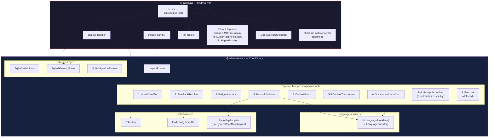

# Agent Input Compiler (AIC) — Project Plan

## Editor-agnostic · Model-agnostic · Minimal configuration

---

## Table of Contents

1. [Executive Summary](#1-executive-summary)
2. [Core Principles](#2-core-principles)
   - 2.1 [SOLID Principles & Design Patterns](#21-solid-principles--design-patterns)
   - 2.2 [MCP Server — Primary Interface](#22-mcp-server--primary-interface)
   - 2.3 [Model Adapter — Model-Specific Optimisation](#23-model-adapter--model-specific-optimisation)
   - 2.4 [Rules & Hooks Analyzer](#24-rules--hooks-analyzer)
   - 2.5 [Dependency Injection — Composition Pattern](#25-dependency-injection--composition-pattern)
   - 2.6 [Concurrency Model](#26-concurrency-model)
   - 2.7 [Agentic Workflow Support](#27-agentic-workflow-support)
3. [Glossary](#3-glossary)
   - 3.1 [Rule Pack Example](#31-rule-pack-example)
   - 3.2 [Advanced Rule Pack Authoring Guide](#32-advanced-rule-pack-authoring-guide)
4. [Architecture](#4-architecture)
   - 4.0 [Component Overview](#40-component-overview)
   - 4.1 [Core Pipeline](#41-core-pipeline)
   - 4.2 [Data Flow](#42-data-flow)
   - 4.3 [Enterprise Layering](#43-enterprise-layering)
   - 4.4 [Architecture Decision Records (ADRs)](#44-architecture-decision-records-adrs)
5. [Multi-Project Support](#5-multi-project-support)
6. [Configuration — `aic.config.json`](#6-configuration--aicconfigjson)
7. [User Interface (MCP-Only)](#7-user-interface-mcp-only)
8. [ContextSelector Interface](#8-contextselector-interface)
   - 8.1 [LanguageProvider Interface](#81-languageprovider-interface)
   - 8.2 [ModelClient Interface](#82-modelclient-interface)
   - 8.3 [Compiled prompt boundary](#83-compiled-prompt-boundary)
   - 8.4 [ContextGuard Interface](#84-contextguard-interface)
   - 8.5 [ContentTransformer Interface](#85-contenttransformer-interface)
   - 8.6 [InspectRunner Interface](#86-inspectrunner-interface)
9. [Token Counting & Model Context Guard](#9-token-counting--model-context-guard)
   - 9.1 [Compile telemetry (local SQLite)](#91-compile-telemetry-local-sqlite)
10. [Phase 2: Semantic + Governance](#10-phase-2-semantic--governance)
    - 10.1 [Sandboxed Extensibility (V8 Isolates)](#101-sandboxed-extensibility-v8-isolates)
11. [Caching](#11-caching)
12. [Error Handling](#12-error-handling)
    - 12.1 [MCP Transport Error Handling](#121-mcp-transport-error-handling)
13. [Security Considerations](#13-security-considerations)
14. [Observability & Debugging](#14-observability--debugging)
    - 14.1 [Worked Pipeline Example](#141-worked-pipeline-example)
    - 14.2 [Server Lifecycle Tracking](#142-server-lifecycle-tracking)
    - 14.3 [Startup Self-Check](#143-startup-self-check)
15. [Performance Constraints](#15-performance-constraints)
16. [Sequence Diagrams](#16-sequence-diagrams)
    - 16.1 [Normal Flow (Cold Cache)](#161-normal-flow-cold-cache)
    - 16.2 [Cache Hit Flow](#162-cache-hit-flow)
    - 16.3 [Budget Exceeded Flow](#163-budget-exceeded-flow)
17. [Dependencies](#17-dependencies)
18. [Testing & Quality Strategy](#18-testing--quality-strategy)
19. [User Stories](#19-user-stories)
20. [Storage](#20-storage)
21. [Competitive Positioning](#21-competitive-positioning)
22. [Licensing & Contribution (Phase 1 Prep)](#22-licensing--contribution-phase-1-prep)
23. [Roadmap](#23-roadmap)
24. [Enterprise Deployment Tiers](#24-enterprise-deployment-tiers)
25. [Compliance Readiness](#25-compliance-readiness)
26. [Data-Driven Feature Planning](#26-data-driven-feature-planning)

---

## 1. Executive Summary

AIC is a **local-first context compilation layer** that runs as an **MCP server**. When invoked, it classifies intent, selects the right files, compresses intelligently, enforces constraints, and returns a leaner, better-scoped prompt that the editor uses as context. AIC's core pipeline is **editor-agnostic** — it works with any MCP-compatible tool. Effective delivery of that compiled context to the model requires an **integration layer** that is specific to each editor (see [§2.2.1 Integration Layer](#221-integration-layer--enforcement)).

**What AIC delivers:** Significant context compression via heuristic file selection and content transformation, deterministic outputs, and a pluggable architecture that requires zero configuration to start and zero refactoring to extend. The architecture is designed to scale from single-shot compilations to multi-step agentic workflows via an optional session layer (see [§2.7 Agentic Workflow Support](#27-agentic-workflow-support)).

**Setup:** Add one entry to your editor's MCP config. That's it.

```json
{ "mcpServers": { "aic": { "command": "npx", "args": ["-y", "@jatbas/aic@latest"] } } }
```

**Package:** `@jatbas/aic` — the MCP server and a small read-only CLI (`status`, `last`, `chat-summary`, `quality`, `projects`) on the same Node entrypoint. There is no separate CLI package. See [installation](installation.md) for setup.

### Non-Goals (Phase 0 baseline)

These are explicitly out of scope for the Phase 0 baseline described in this plan. Documenting them here prevents scope creep and makes "no" easier to say.

| Non-Goal                                     | Rationale                                                                                                                                                                                                                                                                                                                                                                                                                                                                                                                                                                                                                                                                                                                                                                                                                                                                                                  |
| -------------------------------------------- | ---------------------------------------------------------------------------------------------------------------------------------------------------------------------------------------------------------------------------------------------------------------------------------------------------------------------------------------------------------------------------------------------------------------------------------------------------------------------------------------------------------------------------------------------------------------------------------------------------------------------------------------------------------------------------------------------------------------------------------------------------------------------------------------------------------------------------------------------------------------------------------------------------------- |
| **Replacing your AI editor**                 | AIC enhances the context going in; it never replaces Cursor, Claude Code, or any editor                                                                                                                                                                                                                                                                                                                                                                                                                                                                                                                                                                                                                                                                                                                                                                                                                    |
| **Calling models directly**                  | AIC compiles context; the editor's configured model makes the actual call                                                                                                                                                                                                                                                                                                                                                                                                                                                                                                                                                                                                                                                                                                                                                                                                                                  |
| **Separate `.sqlite` file inside each repo** | A single global DB at `~/.aic/aic.sqlite` holds all projects; isolation is enforced with `project_id` and scoped queries (ADR-005). No cross-project row leakage.                                                                                                                                                                                                                                                                                                                                                                                                                                                                                                                                                                                                                                                                                                                                          |
| **Multi-model orchestration**                | Single model per session; routing/fallback is Phase 2+                                                                                                                                                                                                                                                                                                                                                                                                                                                                                                                                                                                                                                                                                                                                                                                                                                                     |
| **Cloud or SaaS deployment**                 | Local-first by design; no server, no account, no internet required for AIC itself                                                                                                                                                                                                                                                                                                                                                                                                                                                                                                                                                                                                                                                                                                                                                                                                                          |
| **GUI or web dashboard**                     | MCP integration is sufficient for the baseline release; dashboard is Phase 3 enterprise                                                                                                                                                                                                                                                                                                                                                                                                                                                                                                                                                                                                                                                                                                                                                                                                                    |
| **Real-time file watching**                  | Compilation is per-request; persistent file watching is Phase 1+                                                                                                                                                                                                                                                                                                                                                                                                                                                                                                                                                                                                                                                                                                                                                                                                                                           |
| **Windows support**                          | Phase 0 targets macOS and Linux; Windows support tracked for Phase 1                                                                                                                                                                                                                                                                                                                                                                                                                                                                                                                                                                                                                                                                                                                                                                                                                                       |
| **Vector / semantic search**                 | HeuristicSelector ships in the baseline release; VectorSelector is Phase 2 (ADR-004)                                                                                                                                                                                                                                                                                                                                                                                                                                                                                                                                                                                                                                                                                                                                                                                                                       |
| **Policy engine / RBAC**                     | Enterprise governance is Phase 2–3; core is intentionally identity-agnostic                                                                                                                                                                                                                                                                                                                                                                                                                                                                                                                                                                                                                                                                                                                                                                                                                                |
| **Agentic session management**               | **Phase 1+** roadmap in this row: utilization-based budget **auto-tuning** beyond fixed headroom, and extending main **`ContentTransformerPipeline` / `SummarisationLadder`** coverage to **`spec.codeBlocks`**, **`spec.prose`**, and demoted type bodies beyond the shipped initial-tier synthetic passes (**`verbatim`** and **`signature-path`**) in **`SpecificationCompilerImpl`**. Shipped agentic slice today ([§2.7](#27-agentic-workflow-support)): optional **`aic_compile`** wire fields, **`session_state`** via **`SqliteAgenticSessionStore`**, session-aware compilation cache keys, SQLite **`spec_compile_cache`** for **`aic_compile_spec`** (handler + **`SqliteSpecCompileCacheStore`**), deterministic **`ConversationCompressor`** (last **10** steps in the header), **`SpecificationCompilerImpl`** behind **`aic_compile_spec`**, auto headroom + overhead-aware **codeBudget**. |

> **First agentic tranche** means early-shipped agentic capabilities — **`ConversationCompressor`**, optional **`aic_compile`** wire fields and **`session_state`**, and structured **`aic_compile_spec`** output — ahead of the **Phase 1+** items named in the Non-goals row. **Phase 0 baseline** is the initial release scope for _this table only_; the two labels are not interchangeable.

> **Session layer vs §2.7:** The Non-goals row lists **Phase 1+** items only: utilization-based **auto-tuning** and full main-pipeline transformer/ladder parity on **`spec.codeBlocks`**, **`spec.prose`**, and demoted type bodies beyond the shipped **`verbatim`** **and** **`signature-path`** synthetic pre-budget passes in **`SpecificationCompilerImpl`**. Persistent **`aic_compile_spec`** results in **`spec_compile_cache`** ship in the baseline; [§2.7 Agentic workflow support](#27-agentic-workflow-support) describes the full shipped agentic slice (**`AgenticSessionState`**, **`SpecificationCompilerImpl`** including that cache, effective-session cache rules, **`ConversationCompressor`**) versus the deferred **Phase 1+** tuning and remaining spec-body ladder work.

> **BE03 (not started — observability only):** Builds on shipped **`BudgetFeedbackSource`** / **`SqliteBudgetFeedbackReader`** toward user-visible **`compilation_log`** utilisation observability, still **without** wiring that signal into **`BudgetAllocator`**. Utilization-based budget **auto-tuning** stays the **Phase 1+** item in the **Agentic session management** non-goal row above — not an implicit follow-on from read-only feedback.

---

## 2. Core Principles

| Principle                  | Meaning                                                                                                                                                                                                 |
| -------------------------- | ------------------------------------------------------------------------------------------------------------------------------------------------------------------------------------------------------- |
| **Zero-friction setup**    | One JSON entry in your editor's MCP config. No `aic.config.json` required to start. Advanced config is optional and additive.                                                                           |
| **Session-start context**  | In editors with hook support, including Cursor, AIC compiles context at session start and injects it into the conversation. This gives the model a curated view of the codebase from the first message. |
| **Editor-agnostic**        | Works with any MCP-compatible editor. Cursor and Claude Code are primary targets; the protocol is open.                                                                                                 |
| **Model-agnostic**         | AIC never cares which model the editor is using. Model-specific tweaks (tokenizer, format preferences) are pluggable adapters, not core logic.                                                          |
| **Deterministic behavior** | Same intent + same codebase = same compiled output, every time                                                                                                                                          |
| **Minimal context**        | Include only what the agent needs; exclude everything else                                                                                                                                              |
| **Local-first**            | All processing happens on the developer's machine; no cloud required                                                                                                                                    |
| **Pluggable architecture** | Every subsystem (context selection, model adaptation, editor integration) has a swappable interface — add a new one without touching core                                                               |
| **Fail-safe defaults**     | Every optional config has a sensible default; AIC works correctly with zero configuration                                                                                                               |

---

## 2.1 SOLID Principles & Design Patterns

SOLID and design patterns are **non-negotiable** in AIC. They are the primary mechanism for keeping the codebase maintainable as the pipeline grows, enabling any contributor to predict the design of a new component before reading it, and reducing bugs that arise from tight coupling.

### SOLID — Application to AIC

#### S — Single Responsibility Principle

Each class has exactly one reason to change. Every pipeline step is a single class with a single public method.

| Class / boundary                                                                            | Single responsibility                                                                                                                                                                                                                                                                                                                                                                                                                                                                                                                                                                                     |
| ------------------------------------------------------------------------------------------- | --------------------------------------------------------------------------------------------------------------------------------------------------------------------------------------------------------------------------------------------------------------------------------------------------------------------------------------------------------------------------------------------------------------------------------------------------------------------------------------------------------------------------------------------------------------------------------------------------------- |
| `FileSystemRepoMapSupplier`                                                                 | Implements `RepoMapSupplier` — scan project root and build file-tree snapshot → `RepoMap` (before Step 1; cached in `repomap_cache`)                                                                                                                                                                                                                                                                                                                                                                                                                                                                      |
| `IntentClassifier`                                                                          | Classify intent → `TaskClassification`                                                                                                                                                                                                                                                                                                                                                                                                                                                                                                                                                                    |
| `RulePackResolver`                                                                          | Load and merge rule packs → `RulePack`                                                                                                                                                                                                                                                                                                                                                                                                                                                                                                                                                                    |
| `BudgetAllocator`                                                                           | Resolve token budget (auto: `contextBudget.maxTokens` **0** → fixed model headroom; manual: positive cap / per-task / rule-pack override; session clamp when `conversationTokens` present) → `number` (`shared/src/pipeline/budget-allocator.ts`)                                                                                                                                                                                                                                                                                                                                                         |
| `HeuristicSelector`                                                                         | Score and select files → `ContextResult`                                                                                                                                                                                                                                                                                                                                                                                                                                                                                                                                                                  |
| `ContextGuard`                                                                              | Scan selected files for secrets and exclusions → `GuardResult`                                                                                                                                                                                                                                                                                                                                                                                                                                                                                                                                            |
| `ContentTransformerPipeline`                                                                | Transform file content for token efficiency → `TransformResult`                                                                                                                                                                                                                                                                                                                                                                                                                                                                                                                                           |
| `SummarisationLadder`                                                                       | Compress context to fit budget → annotated context                                                                                                                                                                                                                                                                                                                                                                                                                                                                                                                                                        |
| `PromptAssembler`                                                                           | Combine task intent, optional spec/session/structure blocks, file context, and merged rule-pack constraints → final prompt `string` (see [Implementation Spec — Step 8](implementation-spec.md#step-8-prompt-assembler))                                                                                                                                                                                                                                                                                                                                                                                  |
| _(Executor — deferred)_                                                                     | Send compiled prompt to model → response — **not** a shipped pipeline class in MCP-only mode (Phase 2+ direct execution)                                                                                                                                                                                                                                                                                                                                                                                                                                                                                  |
| _(Compile telemetry — handler boundary)_                                                    | After successful `runner.run`, the MCP compile handler calls `writeCompilationTelemetry()` → `telemetry_events` via `TelemetryStore`; pipeline steps do not perform this write (see [§9.1](#91-compile-telemetry-local-sqlite))                                                                                                                                                                                                                                                                                                                                                                           |
| `SqliteSessionStore`                                                                        | Implements `SessionTracker`; persist MCP process lifecycle rows → `server_sessions` ([§14.2 Server Lifecycle Tracking](#142-server-lifecycle-tracking), [§20 Storage](#20-storage))                                                                                                                                                                                                                                                                                                                                                                                                                       |
| `SqliteAgenticSessionStore`                                                                 | Implements `AgenticSessionState`; read/write per-effective-session step history JSON → `session_state` ([§2.7](#27-agentic-workflow-support))                                                                                                                                                                                                                                                                                                                                                                                                                                                             |
| `ConversationCompressor` / `ConversationCompressorImpl` _(first agentic tranche — shipped)_ | Interface + implementation in `conversation-compressor.ts` — formats **recent** session steps (last 10 in the prompt) as a deterministic numbered list → `string` (see [§2.7](#27-agentic-workflow-support))                                                                                                                                                                                                                                                                                                                                                                                              |
| `SpecificationCompiler` / `SpecificationCompilerImpl`                                       | Compile structured `SpecificationInput` within a token budget → `SpecCompilationResult`; tier loop plus initial-tier **`verbatim`** **and** **`signature-path`** synthetic-row passes through **`ContentTransformerPipeline` / `SummarisationLadder`** (capped batch budgets) ship in `specification-compiler.ts`; MCP handler persists **`aic_compile_spec`** outputs in SQLite **`spec_compile_cache`** via **`SqliteSpecCompileCacheStore`** — broader main-pipeline parity on **`spec.codeBlocks`**, **`spec.prose`**, and demoted type bodies remains roadmap ([§2.7](#27-agentic-workflow-support)) |

No pipeline class touches storage, no storage class touches prompt logic, no MCP handler contains business logic.

#### O — Open/Closed Principle

Core classes are open for extension and closed for modification. New capabilities are added by implementing an existing interface, never by editing an existing class.

| Extension point                          | How to extend                                                                                                                         |
| ---------------------------------------- | ------------------------------------------------------------------------------------------------------------------------------------- |
| New editor integration (VS Code)         | Implement `EditorAdapter` interface; register in `EditorAdapterRegistry` _(planned abstraction, Phase 2+)_                            |
| New model adapter (Gemini tokenizer map) | Implement `ModelAdapter` interface; register in `ModelAdapterRegistry` _(planned abstraction, Phase 2+)_                              |
| New context selector (VectorSelector)    | Implement `ContextSelector` interface; register in selector factory                                                                   |
| New language support (PythonProvider)    | Implement `LanguageProvider`; register via `initLanguageProviders` / composition root wiring before the selector                      |
| New response-shaping instruction         | Add it as rule-pack or editor-owned constraint text — AIC does not append a hard-coded “output format” section to the compiled prompt |
| New guard scanner (PII detector)         | Implement `GuardScanner` interface; register in `ContextGuard` scanner chain                                                          |

No existing pipeline class is modified when any of the above are added. The core pipeline is frozen once correct; all evolution happens at the edges.

#### L — Liskov Substitution Principle

Every implementation of an interface must be a valid substitute for the interface. Implementations must not narrow the contract, throw unexpected exceptions, or return types that callers cannot handle.

- `VectorSelector` must satisfy every guarantee that `HeuristicSelector` satisfies under the `ContextSelector` contract
- `GenericProvider` must return valid results for all four `LanguageProvider` methods (empty results are valid) — it is never allowed to throw
- A model client for Ollama must honour the same timeout, retry, and streaming contract as the OpenAI client

#### I — Interface Segregation Principle

Interfaces are small and focused. No class is forced to implement methods it does not use.

- `ContextSelector` has one method: `selectContext()`
- `LanguageProvider` has four methods, each used by a different pipeline step — if a provider only supports L0 and L3, the L1/L2 methods return empty arrays (never undefined or an error)
- `StorageAdapter` is split: `CacheStore` for cache operations, `TelemetryStore` for telemetry writes, `MigrationRunner` for schema management — never combined into a single "database" god-interface

#### D — Dependency Inversion Principle

All pipeline steps depend on abstractions, not concrete implementations. Concrete classes are wired at the composition root (`mcp/src/server.ts`), not inside pipeline logic.

```typescript
// ✅ Correct — step6 depends on the interface
class SummarisationLadder {
  constructor(private readonly provider: LanguageProvider) {}
}

// ❌ Wrong — hardcoded concrete dependency
class SummarisationLadder {
  private provider = new TypeScriptProvider();
}
```

The MCP server handler (`mcp/src/server.ts`) is the only place where concrete classes are instantiated and injected.

---

### Design Patterns — Applied in AIC

| Pattern                     | Where it appears                                                                                             | Why                                                                                                                                                                              |
| --------------------------- | ------------------------------------------------------------------------------------------------------------ | -------------------------------------------------------------------------------------------------------------------------------------------------------------------------------- |
| **Adapter**                 | `EditorAdapter` _(planned, Phase 2+)_                                                                        | Normalise MCP client metadata into AIC's internal `CompilationRequest` — the shipped integration uses hooks + `editorId` on the wire instead of distinct adapter classes         |
| **Adapter**                 | `ModelAdapter` _(planned, Phase 2+)_                                                                         | Apply model-specific token counting, prompt format, and context block formatting — the shipped integration uses `ModelDetectorDispatch` + tiktoken without these adapter classes |
| **Strategy**                | `ContextSelector` (Heuristic / Vector / Hybrid)                                                              | Swap selection algorithm without changing the pipeline                                                                                                                           |
| **Strategy**                | `LanguageProvider` (TypeScript / Generic / future Python)                                                    | Swap language-specific behaviour without changing Steps 4 and 6                                                                                                                  |
| **Chain of Responsibility** | Pipeline stages through prompt assembly (telemetry + deferred executor are outside `runPipelineSteps`)       | Each step processes its input and passes output to the next; a step can short-circuit (cache hit exits early)                                                                    |
| **Chain of Responsibility** | `ContextGuard` — ordered scanner chain                                                                       | Secret scanner, exclusion-pattern scanner, and prompt-injection scanner run in order; each can block a file independently                                                        |
| **Registry**                | `LanguageProvider[]` from `initLanguageProviders()`; future `ModelAdapterRegistry` / `EditorAdapterRegistry` | Language list wired in the composition root before `HeuristicSelector` / `SummarisationLadder`; extension-to-provider selection is by array order + provider logic               |
| **Factory**                 | `ModelDetectorDispatch`                                                                                      | Resolves model hints from env / client metadata for counting and display; not a full `ModelAdapter` registry in the shipped code                                                 |
| **Facade**                  | MCP server + compile handler                                                                                 | Thin wiring at the edge — pipeline + adapters; compile handler calls `writeCompilationTelemetry` after `runner.run` so pipeline steps stay free of `TelemetryStore`              |
| **Builder**                 | `PromptAssembler`                                                                                            | Constructs the final prompt step-by-step (task → optional spec/session/structure → context → constraints), each block independently testable                                     |
| **Null Object**             | `GenericProvider`, `GenericModelAdapter`                                                                     | Safe defaults for unsupported languages/models; return empty/estimated values instead of throwing                                                                                |
| **Template Method**         | `LanguageProvider` interface                                                                                 | Defines the algorithm skeleton (parse → extract L1 → extract L2 → extract L3); concrete providers fill in the steps                                                              |
| **Decorator**               | Future: `CachingSelector` wrapping `HeuristicSelector`                                                       | Add caching behaviour to a selector without modifying it                                                                                                                         |

### Enforcement

These are not suggestions. They are enforced via:

- **Code review** — PRs that violate SOLID are blocked regardless of test coverage
- **ESLint rules** — `max-classes-per-file: 1`, `no-restricted-imports` to prevent cross-layer dependencies
- **Contribution guide** — SOLID and design pattern compliance are explicit PR requirements; a PR that violates them is rejected before any other review criterion is checked

---

## 2.2 MCP Server — Primary Interface

AIC's primary runtime is an **MCP (Model Context Protocol) server**. It exposes the `aic_compile` tool, which any MCP-compatible editor can call.

### How it works — MCP Tool pattern

AIC runs as an **MCP tool server**. The model calls `aic_compile` with an intent and project root. AIC's pipeline runs, and the compiled context is returned for the model to use.

```
aic_compile(intent, projectRoot) called
        │
        ▼
AIC pipeline runs (see §4.1 for full detail):
  · Classify intent → task class
  · Resolve rule packs → constraints + include/exclude patterns
  · Allocate token budget (auto-adaptive or manual cap)
  · Compute pipeline overhead → derive code budget for repository context
  · Select relevant files (heuristic scoring; dynamic maxFiles when unset)
  · Guard: scan for secrets, excluded paths, prompt injection
  · Transform content for token efficiency
  · Compress code context to fit code budget (4-tier ladder)
  · Inject constraints
  · Assemble optimised prompt
        │
        ▼
AIC returns JSON (MCP text content) on pipeline success, including at minimum:
  · compiledPrompt, meta
  · conversationId, updateMessage
  · optional: configUpgraded, warnings
(Alternate path: reparent-only JSON — see [Implementation Spec §4](implementation-spec.md).)
```

The editor's model, endpoint, and API key are **never touched by AIC**. AIC only shapes the context — it never sits in the model call path.

**Why a tool, not a proxy:** MCP's tool pattern is universally supported. A proxy would require intercepting the editor's HTTP calls, which is fragile, editor-specific, and breaks with TLS. Tools are the standard extension point; any MCP-compatible editor supports them without modification.

**The trigger rule** is a text instruction installed during bootstrap into the editor-managed rule file (Cursor: `.cursor/rules/AIC.mdc`; Claude Code: `.claude/CLAUDE.md`). It instructs the model to call `aic_compile` before generating responses. Compliance with the trigger rule is not guaranteed and varies with the model and the editor (see [§2.2.1](#221-integration-layer--enforcement) for how editors enforce it).

### 2.2.1 Integration Layer & Enforcement

AIC's core pipeline handles every compilation scenario identically — it receives a `CompilationRequest`, runs the pipeline, and returns compiled context. The pipeline doesn't know or care whether it was triggered by a session-start hook, a per-prompt hook, a subagent hook, or a direct MCP tool call. This is by design: the core is complete, and the only variable is **when** and **how** the editor calls it.

The **integration layer** is a thin set of hook scripts, specific to each editor, that call `aic_compile` at the right moments in the editor's lifecycle. Because AIC follows SOLID principles (dependency injection, single responsibility), adding a new integration layer means writing new hook scripts that call the same core pipeline — no core changes required.

**What AIC needs from an editor (capability checklist):**

| Capability                             | What it enables for AIC                                                                                                                                                                                                                                                                                                                                                                                                             | Priority     |
| -------------------------------------- | ----------------------------------------------------------------------------------------------------------------------------------------------------------------------------------------------------------------------------------------------------------------------------------------------------------------------------------------------------------------------------------------------------------------------------------- | ------------ |
| **Session start + context injection**  | Compile context once and inject into the conversation. Model starts with curated code from the first message.                                                                                                                                                                                                                                                                                                                       | Recommended  |
| **Per-prompt + context injection**     | Compile intent-specific context on every user message. Adapts to topic changes mid-conversation.                                                                                                                                                                                                                                                                                                                                    | Ideal        |
| **Pre-tool-use gating**                | Enforce `aic_compile` before other tools (per-generation marker, recency fallback, sibling-race poll before deny, indefinite deny until compile or markers; emergency bypass when both `devMode` and `skipCompileGate` are true in `aic.config.json` — [installation](installation.md); mechanism in [Cursor integration layer §7.3](technical/cursor-integration-layer.md#73-pretooluse-unmatched--aic_compile-enforcement-gate)). | Recommended  |
| **Subagent start + context injection** | Inject compiled context when subagents spawn. Closes the biggest gap in agentic workflows.                                                                                                                                                                                                                                                                                                                                          | Ideal        |
| **Session end**                        | Log session lifecycle for telemetry (duration, trigger count).                                                                                                                                                                                                                                                                                                                                                                      | Nice to have |
| **Pre-compaction**                     | Re-compile before context window compaction. Preserves context quality during long sessions.                                                                                                                                                                                                                                                                                                                                        | Nice to have |
| **Trigger rule**                       | Text instruction asking the model to call `aic_compile`. Minimal integration with no hooks.                                                                                                                                                                                                                                                                                                                                         | Minimum      |

**Current editor capabilities:**

| Capability                         | Cursor                                      | Claude Code                                     | Generic MCP |
| ---------------------------------- | ------------------------------------------- | ----------------------------------------------- | ----------- |
| Session start + context injection  | Yes (`sessionStart` + `additional_context`) | Yes (`SessionStart` + `additionalContext`)      | No          |
| Per-prompt + context injection     | No                                          | Yes (`UserPromptSubmit` + `additionalContext`)  | No          |
| Pre-tool-use gating                | Yes (`preToolUse` + `deny`)                 | Yes (`PreToolUse` + `permissionDecision: deny`) | No          |
| Subagent start + context injection | No                                          | Yes (`SubagentStart` + `additionalContext`)     | No          |
| Session end                        | Yes (`sessionEnd`)                          | Yes (`SessionEnd`)                              | No          |
| Pre-compaction                     | Yes (`preCompact`, observational only)      | Yes (`PreCompact`)                              | No          |
| Trigger rule                       | Yes (`.cursor/rules/AIC.mdc`)               | Yes (`.claude/CLAUDE.md`)                       | No          |

**Cursor:** Cursor exposes sessionEnd, preCompact, subagentStart (gating only — no context injection), stop, afterFileEdit, and other hooks the editor documents. The AIC integration layer consumes the subset in the table above.

**Current state — Cursor:** Session-start injection, tool gating (always on unless the emergency bypass is active — both `devMode` and `skipCompileGate` true in `aic.config.json`; see [installation](installation.md)), sessionEnd, stop quality check, afterFileEdit tracking, and prompt logging are implemented.

**Claude Code:** The integration layer is implemented (plugin and direct installer; see [installation](installation.md)).

**Generic MCP:** Editors without hooks rely on the trigger rule only.

Deep-dive references for compile-handler contract and model id resolution ([Implementation specification](implementation-spec.md)), shared hook modules, `.aic/` JSONL logs, Claude session lock and marker files, and MCP-versus-shared-CJS boundaries: [Integrations shared modules reference](technical/integrations-shared-modules.md), [AIC JSONL caches under `.aic/`](technical/aic-jsonl-caches.md), [Session start lock and session context marker](technical/session-start-lock-and-marker.md), [MCP server and shared CJS boundary](technical/mcp-and-shared-cjs-boundary.md).

**Key architectural insight:** Any perceived limitation in what AIC "can do" is a limitation of the editor's hook system, not of AIC's core pipeline. When an editor adds a new hook, AIC can wire it at the integration and MCP boundary without changing pipeline step implementations. This is why Claude Code — with its richer hook system — can enable per-prompt and subagent compilation that Cursor cannot.

**Implementation note:** `CompilationRequest` includes an optional `triggerSource` field whose allowed string values are defined in `mcp/src/schemas/compilation-request.ts` (`"session_start"`, `"prompt_submit"`, `"tool_gate"`, `"subagent_start"`, `"subagent_stop"`, `"cli"`, `"model_initiated"`, `"internal_test"`). For normal values the field is telemetry metadata on the pipeline request. When `triggerSource` is `"subagent_stop"` and the MCP wire includes `reparentFromConversationId`, the compile handler repoints `compilation_log` rows in storage instead of running the pipeline (see `mcp/src/handlers/compile-handler.ts` and `shared/src/storage/reparent-subagent-compilations.ts`).

### Setup (zero-config)

**Step 1 — Register the MCP server** (one-time, per editor):

_Cursor_ — add to `~/.cursor/mcp.json`:

```json
{
  "mcpServers": {
    "aic": { "command": "npx", "args": ["-y", "@jatbas/aic@latest"] }
  }
}
```

_Claude Code_ — add to `~/.claude/settings.json`:

```json
{
  "mcpServers": {
    "aic": { "command": "npx", "args": ["-y", "@jatbas/aic@latest"] }
  }
}
```

**Step 2 — Bootstrap** (automatic): No manual init command. When the MCP client lists workspace roots (Cursor lists roots on connect), the server installs or refreshes the trigger rule and may run editor hook installers per root (`mcp/src/server.ts`). **`aic.config.json`, `.aic/` with `0700`, and ignore-manifest lines** are created on the first `aic_compile` for a project that still has no config (`ensureProjectInit` — see [Implementation Spec §4c — Bootstrap](implementation-spec.md#bootstrap-project-setup)). Editors without proactive roots support rely on that compile path only. See [installation](installation.md) for Cursor deeplink and Claude Code plugin/direct installer.

### Model id and tokenizer selection

**Pipeline `modelId` on each `aic_compile`:** The MCP handler resolves the string stored on `CompilationRequest` before `runPipelineSteps` runs. Precedence is: (1) non-null `modelId` tool argument after `CompilationRequestSchema` validation, (2) last-match selection from `.aic/session-models.jsonl` (bounded tail read with deterministic full-file fallback — [Implementation Spec — Model id resolution](implementation-spec.md#model-id-resolution-aic_compile), [AIC JSONL caches](technical/aic-jsonl-caches.md)), (3) `getModelId(editorId)` in `mcp/src/server.ts`, which returns `aic.config.json` → `model.id` when set at server load, otherwise `modelDetector.detect(editorId)`. Integrations write the JSONL log via `writeSessionModelCache`; the MCP handler and shared CJS reader share the same selection logic ([MCP server and shared CJS boundary](technical/mcp-and-shared-cjs-boundary.md)).

**Tokenizer / budget profile after resolution:** `ModelDetectorDispatch` uses `editorId`, optional wire `modelId`, and local editor settings (`~/.cursor/settings.json` → `model` for Cursor) so budget and tokenizer behaviour match the active editor. When detection still yields nothing, `GenericModelAdapter` is used — results are good, not maximally optimised. A formal `EditorAdapter` interface is Phase 2+.

| Source                         | Role                                                                                             |
| ------------------------------ | ------------------------------------------------------------------------------------------------ |
| MCP `modelId` argument         | First precedence for the pipeline when non-null and valid                                        |
| `.aic/session-models.jsonl`    | Cached per-editor / per-conversation model id when the tool argument is absent                   |
| `aic.config.json` → `model.id` | Used inside `getModelId` when set at server start and earlier sources did not supply a string    |
| Cursor adapter                 | `~/.cursor/settings.json` → `model` (`"claude-sonnet-4-20250514"`) when config has no `model.id` |
| Claude Code adapter            | `~/.claude/settings.json` → `model` (`"claude-opus-4"`) when config has no `model.id`            |
| Generic adapter                | Falls back to `cl100k_base` tokenizer when nothing else resolves                                 |

### MCP Server Interface

Nine MCP tools are registered in `mcp/src/server.ts` today. Diagnostics (`aic_status`, `aic_last`, `aic_projects`, `aic_chat_summary`, `aic_quality_report`) are **tools** that return JSON as MCP text content — not MCP resource subscriptions. `aic_model_test` is a separate optional probe (challenges plus an embedded `aic_compile` check); see the `aic_model_test` row below.

**Tools:**

| Tool                 | Arguments (MCP wire)                                                                                                                                                                                                                                                                                                                                                                                                    | Returns                                                                                                                                                                                                                                                                                                                                                                | Use                                                                                                                                    |
| -------------------- | ----------------------------------------------------------------------------------------------------------------------------------------------------------------------------------------------------------------------------------------------------------------------------------------------------------------------------------------------------------------------------------------------------------------------- | ---------------------------------------------------------------------------------------------------------------------------------------------------------------------------------------------------------------------------------------------------------------------------------------------------------------------------------------------------------------------- | -------------------------------------------------------------------------------------------------------------------------------------- |
| `aic_compile`        | Zod validates `intent`, `projectRoot`, `modelId`, `editorId`, `configPath`, plus optional wire fields `triggerSource`, `conversationId`, `reparentFromConversationId`, `stepIndex`, `stepIntent`, `previousFiles`, `toolOutputs`, `conversationTokens` (see `mcp/src/schemas/compilation-request.ts`). `sessionId` is applied server-side from MCP session state when applicable ([§2.7](#27-agentic-workflow-support)) | Pipeline success: JSON with `compiledPrompt`, `meta`, `conversationId`, `updateMessage`; optional `configUpgraded`, `warnings`. Reparent-only: `{ reparented: true, rowsUpdated: number }` when `triggerSource` is `subagent_stop` with a reparent request ([Implementation Spec §4](implementation-spec.md))                                                          | Primary — trigger rule or integration hooks                                                                                            |
| `aic_inspect`        | `intent`, `projectRoot`, optional `configPath`                                                                                                                                                                                                                                                                                                                                                                          | Sanitised `{ trace: PipelineTrace }` (no `resolvedContent` on `selectedFiles`; see `inspect-handler.ts`)                                                                                                                                                                                                                                                               | Debug — pipeline breakdown                                                                                                             |
| `aic_projects`       | _(none)_                                                                                                                                                                                                                                                                                                                                                                                                                | Project list JSON                                                                                                                                                                                                                                                                                                                                                      | Diagnostics — known projects                                                                                                           |
| `aic_quality_report` | optional `windowDays` (integer 1..365) — `mcp/src/schemas/quality-report-request.schema.ts`                                                                                                                                                                                                                                                                                                                             | JSON summarising rolling-window metrics sourced from `quality_snapshots` (medians, cache hit rate, tier fractions, per-task-class stats, daily series, classifier confidence summary)                                                                                                                                                                                  | Diagnostics — compile transparency time series                                                                                         |
| `aic_status`         | optional `timeRangeDays` (integer 1..3660, `STATUS_TIME_RANGE_DAYS_MAX`) — `mcp/src/schemas/status-request.schema.ts`                                                                                                                                                                                                                                                                                                   | Status JSON                                                                                                                                                                                                                                                                                                                                                            | Diagnostics — project-level aggregates                                                                                                 |
| `aic_last`           | _(none)_                                                                                                                                                                                                                                                                                                                                                                                                                | Last-run diagnostics JSON: `compilationCount`, compact `lastCompilation` snapshot, `promptSummary`, optional top-level `selection` (persisted trace or `null`). Omits `compiledPrompt`. Full field list: [Implementation Spec — `aic_last`](implementation-spec.md#aic_last-mcp-tool), [Selection trace](implementation-spec.md#selection-trace-persistence-and-tools) | Diagnostics — most recent run                                                                                                          |
| `aic_model_test`     | `projectRoot`; optional `probeId` (8 uppercase `A`–`Z`) and `answers` (`[number, string]`) together for validation                                                                                                                                                                                                                                                                                                      | JSON with `probeId` / `challenges` / `instructions` (generate) or pass/fail `steps` / errors (validate)                                                                                                                                                                                                                                                                | Optional — agent capability probe                                                                                                      |
| `aic_chat_summary`   | optional `conversationId`                                                                                                                                                                                                                                                                                                                                                                                               | Per-conversation summary JSON                                                                                                                                                                                                                                                                                                                                          | Prompt command — "show aic chat summary"                                                                                               |
| `aic_compile_spec`   | `{ spec: SpecificationInput, budget?: TokenCount }` (see [§2.7](#27-agentic-workflow-support); Zod: `mcp/src/schemas/compile-spec-request.schema.ts`)                                                                                                                                                                                                                                                                   | MCP text JSON on success: `{ compiledSpec, meta }` from `SpecificationCompilerImpl` (`mcp/src/handlers/compile-spec-handler.ts`). Invalid wire input: JSON `{ error: "Invalid aic_compile_spec request", code: "validation-error" }` in text content (no compiler invocation)                                                                                          | Structured specification compile + `tool_invocation_log` ([Implementation Spec §4c](implementation-spec.md#aic_compile_spec-mcp-tool)) |

**Planned MCP resource:**

| Resource URI                       | Format                       | Content                                         |
| ---------------------------------- | ---------------------------- | ----------------------------------------------- |
| `aic://rules-analysis` _(planned)_ | JSON (`RulesAnalysisResult`) | Latest findings from the Rules & Hooks Analyzer |

### Core MCP Types

These types are shared across the MCP server, editor adapters, and model adapters. They are defined here before the interfaces that use them.

All types below use branded types and string literal unions from `shared/src/core/types/` (ADR-010). See that module for definitions of `AbsolutePath`, `FilePath`, `TokenCount`, `Milliseconds`, `Percentage`, `Ratio01`, `Percentage100`, `Confidence`, `ISOTimestamp`, `SessionId`, `ConversationId`, `StepIndex`, `TaskClass`, `EditorId`, `InclusionTier`, `TriggerSource`, and the remaining branded unions exported there.

```typescript
/** The normalised request AIC uses internally after MCP / hook boundaries parse and brand fields. */
interface CompilationRequest {
  intent: string;
  projectRoot: AbsolutePath;
  modelId: string | null;
  editorId: EditorId;
  configPath: FilePath | null;
  sessionId?: SessionId;
  stepIndex?: StepIndex;
  stepIntent?: string;
  previousFiles?: RelativePath[];
  toolOutputs?: ToolOutput[];
  conversationTokens?: TokenCount;
  triggerSource?: TriggerSource;
  conversationId?: ConversationId | null;
}

/** Metadata returned alongside every compiled prompt. */
interface CompilationMeta {
  intent: string;
  taskClass: TaskClass;
  filesSelected: number;
  filesTotal: number;
  tokensRaw: TokenCount;
  tokensCompiled: TokenCount;
  tokenReductionPct: Ratio01;
  cacheHit: boolean;
  durationMs: Milliseconds;
  modelId: string;
  editorId: EditorId;
  transformTokensSaved: TokenCount;
  summarisationTiers: Record<InclusionTier, number>;
  guard: GuardResult | null;
  contextCompleteness: Confidence;
}

/** MCP client handshake info provided by the editor on connection. */
interface McpClientInfo {
  name: string;
  version: SemanticVersion;
}

/** One planned finding from the Rules & Hooks Analyzer. */
interface RulesFinding {
  severity: RulesFindingSeverity;
  source: FilePath;
  line: LineNumber | null;
  message: string;
  suggestion: string | null;
}

/** Full payload of the planned `aic://rules-analysis` resource. */
interface RulesAnalysisResult {
  analyzedAt: ISOTimestamp;
  findings: RulesFinding[];
  totalErrors: number;
  totalWarnings: number;
  totalInfos: number;
}

type GuardSeverity = "block" | "warn";
type GuardFindingType = "secret" | "excluded-file" | "prompt-injection";

/** One finding from the Context Guard step. */
interface GuardFinding {
  severity: GuardSeverity;
  type: GuardFindingType;
  file: RelativePath;
  line?: LineNumber;
  message: string;
  pattern?: string;
}

/** Result produced by ContextGuard.scan(). Attached to CompilationMeta.guard. */
interface GuardResult {
  passed: boolean;
  findings: GuardFinding[];
  filesBlocked: RelativePath[];
  filesRedacted: RelativePath[];
}

/** Aggregated trace returned by the aic_inspect MCP tool (one object covering classification through assembly). The handler strips `resolvedContent` from each `selectedFiles` entry before JSON serialization. */
interface PipelineTrace {
  intent: string;
  taskClass: TaskClassification;
  rulePacks: string[];
  budget: TokenCount;
  selectedFiles: SelectedFile[];
  guard: GuardResult | null;
  transforms: TransformMetadata[];
  summarisationTiers: Record<InclusionTier, number>;
  constraints: string[];
  tokenSummary: {
    raw: TokenCount;
    selected: TokenCount;
    afterGuard: TokenCount;
    afterTransforms: TokenCount;
    afterLadder: TokenCount;
    afterPrune: TokenCount;
    promptTotal: TokenCount;
    reductionPct: Percentage;
  };
  compiledAt: ISOTimestamp;
}
```

### EditorAdapter Interface (Planned)

Each editor's MCP client info format differs slightly. A planned `EditorAdapter` interface (Phase 2+) will normalise it and handle model detection for that editor:

```typescript
interface EditorAdapter {
  readonly editorId: EditorId;
  detectModel(clientInfo: McpClientInfo): string | null;
  getTriggerRuleFile(projectRoot: AbsolutePath): FilePath;
  getTriggerRuleContent(): string;
}
```

The shipped package does **not** include `CursorAdapter` / `ClaudeCodeAdapter` classes — integration is hook scripts plus MCP `editorId` / `clientInfo`. A registry of `EditorAdapter` implementations is Phase 2+; new editors still require no core pipeline changes, only integration-layer wiring.

---

## 2.3 Model Adapter — Model-Specific Optimisation

AIC is model-agnostic by default. When the active model is known (auto-detected from MCP request metadata or config), a `ModelAdapter` applies model-specific optimisations without touching the core pipeline.

### Why this exists

Different models have different characteristics that affect compilation quality:

- Tokenizer differences (OpenAI models use `cl100k_base`/`o200k_base`; Anthropic uses its own; Llama uses SentencePiece)
- Context window sizes and soft limits
- Prompt format preferences (XML tags for Claude, markdown for GPT models)
- Known behaviours — some models degrade on very long system prompts

### ModelAdapter Interface (Planned)

```typescript
interface ModelAdapter {
  readonly modelId: string;
  readonly contextWindow: TokenCount;
  countTokens(text: string): TokenCount;
  formatSystemPrompt(prompt: string): string;
  formatContextBlock(
    filePath: RelativePath,
    content: string,
    tier: InclusionTier,
  ): string;
}
```

_Note: In MCP-only mode, the executor step is deferred. The following adapters are planned for Phase 2+ direct-execution workflows:_

AIC plans to ship with `OpenAiAdapter`, `AnthropicAdapter`, `OllamaAdapter`, and `GenericModelAdapter` (fallback using `cl100k_base`). When the model is unknown or undetected, `GenericModelAdapter` will be used — results will be good, not perfect.

**Core principle:** Model-specific tweaks are optional improvements, not requirements. AIC produces correct output for any model using `GenericModelAdapter`. Adapters only exist to improve context efficiency further.

---

## 2.4 Rules & Hooks Analyzer _(Planned — Phase 0.5+)_

Editor rules and hooks (`.cursorrules`, Cursor rule files, Claude Code settings, git hooks) have a direct impact on compilation quality and token efficiency. Poorly written rules contradict each other, waste tokens with redundancy, or degrade model output. AIC plans a **Rules & Hooks Analyzer** that scans these files and surfaces issues.

### What it will analyze

| Source                                    | What AIC will check                                                                     |
| ----------------------------------------- | --------------------------------------------------------------------------------------- |
| `.cursorrules`                            | Redundant instructions, contradicting rules, token-heavy prose that could be compressed |
| Cursor rule files (`.cursor/rules/*.mdc`) | Conflicting glob patterns, rules that fire on every file unnecessarily                  |
| Claude Code settings                      | System prompt bloat, duplicate constraints                                              |
| Git hooks (pre-commit, commit-msg)        | Rules that duplicate AIC constraints already injected                                   |

### How it will surface findings

Findings will be exposed via the `aic://rules-analysis` MCP resource, updated after each compilation.

Severity levels:

- `warn` — suboptimal but not harmful — redundant instruction text
- `error` — active contradiction — two rules give opposite instructions to the model
- `info` — improvement opportunity — rule could be a rule pack entry instead

### Auto-fix (Phase 1+)

Phase 1 adds `aic fix-rules` which applies safe auto-fixes (deduplication, compression) with a dry-run preview.

---

## 2.5 Dependency Injection — Composition Pattern

AIC uses **manual constructor injection** with no DI framework. This keeps startup fast, dependencies explicit, and the wiring readable by any contributor without framework knowledge.

### Rule

Concrete classes are instantiated **only** in the composition root:

1. **MCP server request handler** (`mcp/src/server.ts`) — the sole runtime entrypoint

All other files receive their dependencies through their constructor and never call `new` on anything except primitive value objects.

### Composition template

Runtime wiring lives in `mcp/src/server.ts` (global DB, `ScopeRegistry`, MCP tool registration) and `mcp/src/handlers/compile-handler.ts` (per-request `CompilationRunner`). Pipeline dependencies are built through `createPipelineDeps` / `createFullPipelineDeps` from `@jatbas/aic-core/bootstrap/create-pipeline-deps.js`; execution is `CompilationRunner` in `shared/src/pipeline/compilation-runner.ts`. The snippet below is illustrative — read those files for the authoritative call graph.

```typescript
// mcp/src/server.ts — composition root (illustrative)
import { createCompileHandler } from "./handlers/compile-handler.js";
import { CompilationRunner as CompilationRunnerImpl } from "@jatbas/aic-core/pipeline/compilation-runner.js";
import { createPipelineDeps } from "@jatbas/aic-core/bootstrap/create-pipeline-deps.js";

// Handlers obtain a per-project CompilationRunner; steps are constructed inside
// createPipelineDeps / CompilationRunnerImpl — not inlined in the server file.
```

### Conventions

| Rule                                                  | Detail                                                                                                                                                    |
| ----------------------------------------------------- | --------------------------------------------------------------------------------------------------------------------------------------------------------- |
| **One `new` per concrete class per composition root** | Never instantiate the same class twice in the same root                                                                                                   |
| **No `new` outside composition roots**                | Only `mcp/src/server.ts`; if a pipeline class needs a dependency, add a constructor parameter                                                             |
| **Infrastructure first, pipeline second**             | Always construct `Tokenizer` and stores before pipeline steps                                                                                             |
| **RepoMap built before pipeline invocation**          | `RepoMapSupplier` must supply a `RepoMap` before selection runs (`HeuristicSelector` receives `repoMap` as a parameter — see `FileSystemRepoMapSupplier`) |
| **Language providers before selector**                | `initLanguageProviders()` must finish before `HeuristicSelector` or `SummarisationLadder` receive the `readonly LanguageProvider[]`                       |
| **Telemetry after pipeline**                          | `writeCompilationTelemetry` runs in the compile handler after `runner.run` resolves; wire `TelemetryStore` before constructing the handler                |

---

## 2.6 Concurrency Model

AIC's MCP server runs as a **single-threaded Node.js process** communicating over stdio. This is an explicit design choice, not an oversight.

### Guarantees

| Property                    | Guarantee                                                  | Mechanism                                                                                                                                              |
| --------------------------- | ---------------------------------------------------------- | ------------------------------------------------------------------------------------------------------------------------------------------------------ |
| **Request serialisation**   | At most one compilation runs at a time                     | MCP stdio transport delivers messages sequentially; the handler awaits each compilation before reading the next message                                |
| **No shared mutable state** | Pipeline steps do not share mutable state between requests | Each compilation constructs fresh step-local state; `RepoMap` and `RulePack` are read-only value objects                                               |
| **Deterministic output**    | Same input = same output, every time                       | Single-threaded execution eliminates race conditions; all tie-breaking rules are deterministic (see [§3 Glossary — Summarisation Ladder](#3-glossary)) |
| **SQLite safety**           | No concurrent write conflicts                              | `better-sqlite3` is synchronous and runs on the main thread; the single-threaded model means no WAL contention or locking issues                       |

### What this means in practice

- If the editor sends two `aic_compile` requests in rapid succession when the developer types a new prompt while a previous compilation is still running, the second request is queued by the stdio transport and processed after the first completes. No request is dropped.
- Pipeline steps may use `async/await` for I/O (file reads, git commands) but execution is never truly parallel — `await` yields to the event loop, not to another compilation request.
- A slow `telemetry_events` insert in `writeCompilationTelemetry` runs on the main thread before the MCP response is returned; it delays that request only (the next stdio message is still processed sequentially afterward).

### When this changes

Phase 2+ may introduce a worker-thread pool for expensive operations such as VectorSelector embedding computation. If this happens, the `ContextSelector` interface allows swapping `HeuristicSelector` for a thread-safe `VectorSelector` — no core pipeline changes required (OCP). The single-threaded invariant applies to the baseline release and Phase 0.5 only.

---

## 2.7 Agentic Workflow Support

AIC's core pipeline assumes **one intent → one compilation → one response**. Agentic workflows — where a model autonomously executes 5–50 tool calls per task, reading files, editing code, running tests, and iterating — break this assumption. One _task_ generates _many_ model calls, each needing different context as the agent progresses through steps.

Without agentic support, AIC either returns the same cached context on every step (useless after step 1), gets bypassed entirely by the agent, or lets the context window bloat unchecked as conversation history grows. None of these outcomes are acceptable.

### The Problem

```
Step 1: Agent plans the refactor      → needs architecture files
Step 2: Agent edits service.ts        → needs service.ts + its imports
Step 3: Agent runs tests              → needs test runner output
Step 4: Agent fixes 3 failing tests   → needs failing test files + error output
Step 5: Agent verifies fix            → needs test output again
```

Each step needs _different_ context, but two compiles can still **cache-hit** when task class (from classified intent), project root, file-tree hash, config hash, **effective session id and `stepIndex` together** (both required for the session segment of the cache key), and the canonical `toolOutputs.relatedFiles` digest all match the prior run — otherwise AIC recomputes. Session continuity (`conversationId`, deduplication, budget clamp) and structured **`toolOutputs.relatedFiles`** change runtime behaviour and often force fresh selection even when a bare intent repeats; unstructured `content` alone does not steer selection today. See [Implementation Spec — §4](implementation-spec.md#pipeline-orchestration-runpipelinesteps).

### Architectural Approach: Session Layer

The core pipeline through **prompt assembly** (conceptual Steps 1–8 in the implementation spec; handler telemetry is Step 10) remains unchanged when session fields and `toolOutputs` are absent. A new **Session Layer** sits above the pipeline and manages multi-step state. This follows OCP: agentic behaviour extends via optional request fields, session stores, and **`ContextSelector` wrappers** (`RelatedFilesBoostContextSelector`) wired in the composition root — not by embedding tool-output parsers or session branches inside `HeuristicSelector` itself. Components ship incrementally (from the first agentic tranche through later roadmap items — see Phasing below).

```
┌──────────────────────────────────────────┐
│  Session Layer                           │
│  ┌────────────┐  ┌─────────────────────┐ │
│  │ Session    │  │ Conversation        │ │
│  │ Tracker    │  │ Compressor          │ │
│  └────────────┘  └─────────────────────┘ │
│  ┌─────────────────────────────────────┐ │
│  │ BudgetAllocator (session clamp)     │ │
│  └─────────────────────────────────────┘ │
│  ┌─────────────────────────────────────┐ │
│  │ Specification Compiler              │ │
│  └─────────────────────────────────────┘ │
├──────────────────────────────────────────┤
│  Existing Pipeline (through assembler)   │
│  (unchanged — receives enriched input)   │
└──────────────────────────────────────────┘
```

### Extended `CompilationRequest` (backward-compatible)

All session fields are optional. Existing single-shot callers (non-agentic editors, direct MCP tool calls) continue to work identically — they do not send session parameters. When session fields are absent, the pipeline behaves exactly as it does today.

```typescript
interface CompilationRequest {
  intent: string;
  projectRoot: AbsolutePath;
  modelId: string | null;
  editorId: EditorId;
  configPath: FilePath | null;

  sessionId?: SessionId;
  stepIndex?: StepIndex;
  stepIntent?: string;
  previousFiles?: RelativePath[];
  toolOutputs?: ToolOutput[];
  conversationTokens?: TokenCount;
  triggerSource?: TriggerSource;
  conversationId?: ConversationId | null;
}

interface ToolOutput {
  type: ToolOutputType;
  content: string;
  relatedFiles?: RelativePath[];
}
```

The `aic_compile` MCP tool Zod schema (`mcp/src/schemas/compilation-request.ts`) validates optional agentic wire fields: `editorId`, `triggerSource`, `conversationId`, `reparentFromConversationId`, `stepIndex`, `stepIntent`, `previousFiles`, `toolOutputs`, and `conversationTokens`. **`sessionId` is not on the Zod wire object;** the compile handler sets `CompilationRequest.sessionId` from MCP session state (`getSessionId()` in `mcp/src/handlers/compile-handler.ts`). The handler maps validated MCP arguments plus that session id into `CompilationRequest`. Editors that omit optional wire fields keep single-shot behaviour. The effective agentic session id prefers **`conversationId`** when the branded field is present on `CompilationRequest`, otherwise the handler-supplied **`sessionId`** (`resolveEffectiveSessionId` in `shared/src/pipeline/compilation-runner.ts`); that id keys `session_state` rows for deduplication, session-derived token totals for Step 3's `BudgetAllocator` clamp (when `conversationTokens` is omitted on the wire), and the deterministic session context header. With **`conversationId`**, weak placeholder wire intents (empty, the MCP default string, or the `provide context for…` prefix) can be replaced before classification with the last non-`general` intent from `compilation_log` for that conversation when one exists (`resolveIntentWithFallback` in `compile-handler.ts`); full rules live under [Implementation Spec — Pipeline orchestration](implementation-spec.md#pipeline-orchestration-runpipelinesteps). Optional `toolOutputs` is forwarded on `PipelineStepsRequest` each compile and passed into `contextSelector.selectContext` (`shared/src/core/run-pipeline-steps.ts`). Structured `relatedFiles` entries (when present) merge into the resolved rule pack's `heuristic.boostPatterns` for that run via `RelatedFilesBoostContextSelector` before `HeuristicSelector` scores candidates ([Implementation Spec — Step 4](implementation-spec.md#step-4-contextselector-relatedfilesboostcontextselector)); `toolOutputs[].type` and `toolOutputs[].content` do not affect selection scoring. When the deduplicated related-path set is non-empty, the compilation cache key includes a sorted, NUL-separated canonical digest of those paths from `canonicalRelatedPathsForSelectionCache` in `shared/src/pipeline/related-files-boost-context-selector.ts`, consumed in `shared/src/pipeline/compilation-runner.ts`. That digest is for cache keying only — it is not interpolated into the compiled prompt. `toolOutputs` are stored on the session step when the compile finishes. On **subsequent** compiles in the same session, `ConversationCompressor` adds **per-output-type aggregates** to the deterministic header (including summed `relatedFiles` lengths; raw `content` is not echoed). The header is built before the current step is recorded, so the current request's `toolOutputs` appear in that summary starting with the **next** compile. Inferring files to boost by parsing free-form tool-output **content** inside the selector remains future work.

### Implementation pointers (agentic)

- **`CompilationRequest` and `ToolOutput`:** Canonical `readonly` shapes live in `shared/src/core/types/compilation-types.ts`. Arguments that exist only on the MCP Zod wire object are validated in `mcp/src/schemas/compilation-request.ts`; the compile handler maps validated arguments into `CompilationRequest` (`mcp/src/handlers/compile-handler.ts`).
- **`previousFiles`:** Optional on the Zod schema and mapped onto `CompilationRequest` in `mcp/src/handlers/compile-handler.ts`. `runFreshPath` builds `PipelineStepsRequest` without this field (`shared/src/pipeline/compilation-runner.ts`); `PipelineStepsRequest` in `shared/src/core/run-pipeline-steps.ts` has no `previousFiles` member. Shipped selection, cache keys, and `session_state` step payloads therefore ignore it.
- **Wiring:** `ConversationCompressorImpl` and the other non-`repoMapSupplier` pipeline dependencies come from `createPipelineDeps` in `shared/src/bootstrap/create-pipeline-deps.ts`; `createFullPipelineDeps` in the same file merges that result with `repoMapSupplier` into a full `PipelineStepsDeps`. `mcp/src/server.ts` `getRunner` merges `createPipelineDeps` output with `repoMapSupplier` inline (it does not call `createFullPipelineDeps`), then passes the deps object and `new SqliteAgenticSessionStore(scope.projectId, scope.db)` into `CompilationRunnerImpl`.
- **`session_state` lifecycle:** Rows are inserted and updated as steps are recorded (`shared/src/storage/sqlite-agentic-session-store.ts`); shipped SQL has no scheduled delete. Growth and cleanup are operator or product concerns until a documented retention path ships.

### Agentic session state (`session_state`)

`AgenticSessionState` (implemented by `SqliteAgenticSessionStore` in `shared/src/storage/sqlite-agentic-session-store.ts`) persists per-effective-session step history in the `session_state` SQLite table (see [§20 Storage](#20-storage)). This is separate from **`SessionTracker`** / **`SqliteSessionStore`**, which record MCP process lifecycle in `server_sessions` ([§14.2 Server Lifecycle Tracking](#142-server-lifecycle-tracking)). **`compilation_log.session_id`** stores the handler-populated MCP-scoped `CompilationRequest.sessionId`; **`session_state`** row keys and compilation **cache** session suffixes use **`resolveEffectiveSessionId`** (conversation id when set, otherwise that same MCP session id). The persisted agentic history enables:

- **Deduplication**: If `auth/service.ts` was shown at L0 in step 1, step 3 can reference it as "previously shown" rather than re-including 1,240 tokens of the same content — unless the file was modified between steps.
- **Progressive discovery**: Session history and changing intents steer what is shown across steps (deduplication, `previouslyShown` markers). Heuristic scoring in `HeuristicSelector` does not read `stepIndex` directly; breadth vs narrowness still comes from intent tokens, rule packs, and optional `relatedFiles` boosts — not an automatic step schedule inside the selector.
- **Related-files path boost (shipped):** Optional structured `relatedFiles` on each `ToolOutput` is passed into context selection and merged into `heuristic.boostPatterns` before scoring ([Implementation Spec — Step 4](implementation-spec.md#step-4-contextselector-relatedfilesboostcontextselector)).
- **Failure-aware selection from unstructured output (future):** Parsing test logs or stderr in `toolOutputs.content` to discover paths (without structured `relatedFiles`) is not implemented (distinct from session-header summarisation of stored tool outputs).

`AgenticSessionState` interface:

```typescript
interface AgenticSessionState {
  getPreviouslyShownFiles(
    sessionId: SessionId,
    fileLastModified?: Readonly<Record<string, ISOTimestamp>>,
  ): readonly PreviousFile[];
  getSteps(sessionId: SessionId): readonly SessionStep[];
  recordStep(sessionId: SessionId, step: SessionStep): void;
}

interface SessionStep {
  stepIndex: StepIndex;
  stepIntent: string | null;
  filesSelected: RelativePath[];
  tiers: Record<RelativePath, InclusionTier>;
  tokensCompiled: TokenCount;
  toolOutputs: ToolOutput[];
  completedAt: ISOTimestamp;
}

interface PreviousFile {
  path: RelativePath;
  lastTier: InclusionTier;
  lastStepIndex: StepIndex;
  modifiedSince: boolean;
}
```

### Conversation Compressor

The first agentic tranche shipped `ConversationCompressor` as a deterministic formatter (no model call). When `sessionId` is present and agentic session state exists, it runs before prompt assembly and injects a fixed block: header `Steps completed:` plus one numbered line per recent step (bounded to the last 10 steps to prevent unbounded session headers in long sessions), each line giving intent or fallback label, files selected count, and tokens compiled. See `shared/src/pipeline/conversation-compressor.ts` and `shared/src/core/run-pipeline-steps.ts`. **`deriveSessionContext`** builds **`SessionBudgetContext`** for Step 3’s **`BudgetAllocator`** — **`conversationTokens`** when sent on the wire or summed from recorded steps, optional **`contextWindow`** from the request, or **`contextWindow` only** when no token totals apply ([Implementation Spec — Step 3 session budget context](implementation-spec.md#pipeline-orchestration-runpipelinesteps)); that object does not gate whether this formatter runs.

For steps whose stored `toolOutputs` array is non-empty, the compressor appends indented lines after that step's main line: one aggregate per output `type`, summing `relatedFiles` lengths (raw `content` is never echoed). Budget allocation still uses the full step history from `getSteps` without the same slice; only the compressor input is capped at the last 10 steps.

### Budget allocation: shipped auto budget, overhead-aware pipeline, and roadmap

**Shipped today — `BudgetAllocator` (Step 3):** Base budget resolves from rule-pack `budgetOverride`, then `contextBudget.perTaskClass`, then `contextBudget.maxTokens`. **Default `maxTokens` is `0` (auto).** Let **`effectiveWindow`** be the numeric context window `BudgetAllocator` uses: the project `contextWindow` from config when set (`getContextWindow()`), else `SessionBudgetContext.contextWindow` when `deriveSessionContext` supplied it from the pipeline request (model lookup via `resolveModelDerivedContextWindow` in `shared/src/pipeline/compilation-runner.ts`), else **`CONTEXT_WINDOW_DEFAULT` (128_000)** from `shared/src/pipeline/budget-allocator.ts`. Reserved response and template overhead use **`RESERVED_RESPONSE_DEFAULT` (4_000)** and **`TEMPLATE_OVERHEAD_DEFAULT` (500)** from the same module.

When the resolved numeric base is **0**, the allocated **total** budget equals headroom (no `min` with a separate cap):

```
headroom = max(0, effectiveWindow − 4_000 − conversationTokens − 500)
allocatedTotalBudget = headroom   // when base == 0 (auto)
```

When the resolved base is **positive** and the clamp path applies — `SessionBudgetContext.conversationTokens` is present (wire field or sum over recorded steps via `deriveSessionContext` in `shared/src/core/run-pipeline-steps.ts`) **or** configured or session **`contextWindow`** is present (`hasWindowInfo` in `shared/src/pipeline/budget-allocator.ts`) — the allocated budget is **`min(base, headroom)`** using the same `headroom` expression. When **`conversationTokens`** is absent from `SessionBudgetContext` and **neither** configured nor session supplied a context-window hint, **`allocate`** returns the positive **`base` unchanged**; otherwise a positive base is still clamped with **`min(base, headroom)`** (and can equal **`base`** when headroom is not binding).

**Shipped today — overhead-aware code path (`runPipelineSteps`):** After Step 3 yields **totalBudget**, the pipeline measures token overhead for the structural map, optional session summary text, spec-ladder slice (token count of compressed spec files, with ladder budget capped at **~20% of totalBudget**), merged constraint strings, and a fixed 100-token task header (`computeOverheadTokens` in `shared/src/core/run-pipeline-steps.ts`). **codeBudget** = max(0, totalBudget − overhead). `ContextSelector` and the main summarisation ladder operate on **codeBudget** so main file bodies are sized against that remainder; **`PromptAssembler`** then emits headings, fences, and optional reinforced context whose full tokenizer cost is **not** folded back into a second ladder pass, so the final string’s **`promptTotal`** can still exceed **totalBudget** on wrapper-heavy runs. **Dynamic maxFiles:** when `contextSelector.heuristic.maxFiles` is **0** (default), `resolveAutoMaxFiles` (`shared/src/core/run-pipeline-steps.ts`) uses **base** `max(5, min(40, ceil(sqrt(totalFiles))))`, scales by **`effectiveContextWindow / CONTEXT_WINDOW_DEFAULT`** where **`effectiveContextWindow`** is **`SessionBudgetContext.contextWindow` when present, else `CONTEXT_WINDOW_DEFAULT`**, and returns `max(5, min(300, ceil(baseMax * scale)))` (**`MAX_FILES_UPPER_BOUND`**).

**Roadmap — richer model-derived budgeting:** Per-model `windowRatio` / `maxContextWindow × ratio` bases, Ollama `num_ctx` probing, and **automatic utilization-based tuning** beyond the shipped auto headroom path are not implemented in shipped TypeScript; see [Implementation specification — Model-derived budgets](implementation-spec.md#model-derived-budgets-shipped-subset-and-roadmap). The `aic_status` tool exposes **`budgetMaxTokens`** from resolved project config (when **`contextBudget.maxTokens`** is **`0`**, a **fixed** ceiling in `mcp/src/diagnostic-payloads.ts`: default window minus reserved response minus template overhead — **no** `conversationTokens` term) and **`budgetUtilizationPct`** from the **last** `compilation_log` row’s `tokensCompiled` divided by that ceiling ([Implementation Spec — §4c](implementation-spec.md#aic_status-mcp-tool)); that diagnostic pair is **not** the same value as each compile’s **`BudgetAllocator`** total when session clamping or non-default **`effectiveWindow`** applies ([§2.7 — Budget allocation](#budget-allocation-shipped-auto-budget-overhead-aware-pipeline-and-roadmap)). Automated `windowRatio` suggestions remain a design target.

**Research validation (roadmap):** Difficulty-aware budgeting and feedback from execution data (SelfBudgeter, AdaCtrl, ACON) and "Lost in the Middle" motivate further tuning on top of today's shipped auto headroom and overhead accounting.

### Specification Compiler

The same budget → select → compress → assemble pattern that AIC applies to code context applies equally to **specification context** — the structured type information, interface definitions, schemas, and library APIs that an agent needs to execute a task. Before an agent writes code, it needs a _task briefing_, and that briefing has the same token-budget dynamics as a compiled prompt.

Without specification compilation, task specifications either (a) include every type verbatim and blow past useful size limits, or (b) require manual judgment about what to include — a judgment that varies by author and is never consistent. `SpecificationCompiler` makes this algorithmic and deterministic.

**Shipped — `aic_compile_spec` cross-call cache:** The MCP handler consults SQLite table **`spec_compile_cache`** (`SqliteSpecCompileCacheStore`, migration `shared/src/storage/migrations/004-spec-compile-cache.ts`) before invoking `SpecificationCompilerImpl`; cache hits return stored `{ compiledSpec, meta }` without recompilation. Key material, TTL on read, and validation-before-log behaviour: [Implementation specification — `aic_compile_spec`](implementation-spec.md#aic_compile_spec-mcp-tool).

**Roadmap:** Apply the full main-pipeline `ContentTransformerPipeline` (Step 5.5) and `SummarisationLadder` (Step 6) policy to `spec.codeBlocks`, `spec.prose`, and demoted type bodies the same way `runPipelineSteps` treats repository files ([Implementation specification — `aic_compile_spec`](implementation-spec.md#aic_compile_spec-mcp-tool)).

**Shipped slice (compiler):** `SpecificationCompilerImpl` in `shared/src/pipeline/specification-compiler.ts` implements `SpecificationCompiler.compile` as an async method returning `Promise<SpecCompilationResult>` with a deterministic tier loop, shared-import deduplication on verbatim bodies, and iterative **demotion** toward the budget via the injected token counter. It does **not** invoke `runPipelineSteps`. For types whose wire `usage` maps to initial tier `verbatim`, `compile` runs `ContentTransformerPipeline.transform` and `SummarisationLadder.compress` on synthetic body rows first (`verbatimAdjustedSpecificationInput`, capped batch budget). When any type maps to initial tier `signature-path`, `compile` runs the same pipeline on `signaturePathAdjustedSpecificationInput` under `computeSignaturePathBatchBudget` before `runBudgetLoop`. Handler wiring, validation failures, and pipeline-scope boundaries: [Implementation specification — `aic_compile_spec`](implementation-spec.md#aic_compile_spec-mcp-tool).

**Wire and core contracts:**

```typescript
interface SpecificationCompiler {
  compile(input: SpecificationInput, budget: TokenCount): Promise<SpecCompilationResult>;
}

interface SpecificationInput {
  types: SpecTypeRef[];
  codeBlocks: SpecCodeBlock[];
  prose: SpecProseBlock[];
}

interface SpecTypeRef {
  name: string;
  path: RelativePath;
  content: string;
  usage: SpecTypeUsage;
  estimatedTokens: TokenCount;
}

interface SpecCodeBlock {
  label: string;
  content: string;
  estimatedTokens: TokenCount;
}

interface SpecProseBlock {
  label: string;
  content: string;
  estimatedTokens: TokenCount;
}

interface SpecCompilationResult {
  compiledSpec: string;
  meta: {
    totalTokensRaw: TokenCount;
    totalTokensCompiled: TokenCount;
    reductionPct: Percentage;
    typeTiers: Record<string, SpecInclusionTier>;
    transformTokensSaved: TokenCount;
  };
}
```

**`SpecTypeUsage` determines the inclusion tier** — this is the relevance score for types, analogous to `RelevanceScore` for files:

```typescript
type SpecTypeUsage =
  | "implements"
  | "calls-methods"
  | "constructs"
  | "passes-through"
  | "names-only";

type SpecInclusionTier = "verbatim" | "signature-path" | "path-only";
```

| Usage relationship                            | Inclusion tier   | What's included                                      | Analogous to                            |
| --------------------------------------------- | ---------------- | ---------------------------------------------------- | --------------------------------------- |
| `implements` / `calls-methods` / `constructs` | `verbatim`       | Full type definition with all fields and imports     | Summarisation Ladder L0 (full)          |
| `passes-through`                              | `signature-path` | Type name, file path, method count, one-line purpose | Summarisation Ladder L1/L2 (signatures) |
| `names-only`                                  | `path-only`      | Type name, file path, factory function               | Summarisation Ladder L3 (names)         |

The **Analogous to** column describes conceptual similarity to main-compile ladder levels; initial-tier **`verbatim`** **and** **`signature-path`** type bodies run through `ContentTransformerPipeline` and `SummarisationLadder` on synthetic rows during pre-`runBudgetLoop` passes in `SpecificationCompilerImpl` (contract and wire detail: link in **Shipped slice** above).

**Shipped compression loop (`SpecificationCompilerImpl`):**

1. **Verbatim pre-pass (skipped when no verbatim-usage types):** split imports from bodies, run `ContentTransformerPipeline` then `SummarisationLadder` on synthetic rows with `computeVerbatimBatchBudget`, merge rendered bodies back (`verbatimAdjustedSpecificationInput` in `specification-compiler.ts`)
2. **Signature-path pre-pass (skipped when no signature-path-usage types):** build synthetic rows, run `ContentTransformerPipeline` then `SummarisationLadder` with `computeSignaturePathBatchBudget`, merge rendered bodies back (`signaturePathAdjustedSpecificationInput` in `specification-compiler.ts`)
3. Assign initial tiers from `SpecTypeUsage` (deterministic, no scoring needed)
4. Deduplicate shared import lines across verbatim-tier bodies (`deduplicateImportsInText` / `splitLeadingImportsAndBody` in `import-merge-dedup-text.ts`, used from `specification-compiler.ts`)
5. Assemble `compiledSpec` from tier renderers; measure total tokens with the injected counter
6. While over budget, **demote** types: pick the lowest-priority remaining `verbatim` row (`constructs` before `calls-methods` before `implements`; larger measured fragment wins ties, then path, then name), then demote `signature-path` rows with the same tie-breaks
7. When types cannot be demoted further, drop the largest `codeBlocks` entry, then the largest `prose` entries, until within budget or no removable blocks remain
8. When every type is `path-only`, all code and prose blocks are removed, and the string still exceeds budget, append a fixed truncation banner (`WARN_TRUNCATION` in `specification-compiler.ts`)

The loop is deterministic: same input + same budget = same `compiledSpec` and `meta.typeTiers`.

**Exposed via MCP:**

The `aic_compile_spec` MCP tool is registered (see [§2.2](#22-mcp-server--primary-interface)). The shipped handler (`mcp/src/handlers/compile-spec-handler.ts`) validates with Zod (`CompileSpecRequestSchema`), records each invocation in `tool_invocation_log`, maps wire paths to branded `SpecificationInput`, and awaits `deps.specificationCompiler.compile` wired to `SpecificationCompilerImpl` in `mcp/src/server.ts`. Success returns MCP text JSON `{ compiledSpec, meta }` with matching `structuredContent`. Validation failures return `{ error: "Invalid aic_compile_spec request", code: "validation-error" }` without invoking the compiler.

**What this enables (today):**

- A stable MCP wire shape and validation boundary for structured specification input (`CompileSpecRequestSchema`)
- Deterministic, audited `compiledSpec` output with tier metadata in `meta` for clients integrating multi-step agents
- The same §2.7 type-tier vocabulary remains the contract for roadmap items: full main-pipeline transform/ladder on **`spec.codeBlocks`**, **`spec.prose`**, and demoted type bodies (beyond the shipped initial-tier **`verbatim`** **and** **`signature-path`** passes) plus tighter budget tooling (the cross-call **`spec_compile_cache`** for **`aic_compile_spec`** is already shipped)

### Cache Keying for Sessions

The shipped compilation cache key is computed in `shared/src/pipeline/compilation-runner.ts` (`computeCompilationCacheKey` / `buildCacheKey`). The hashed preimage includes, in order: **task class** (from `IntentClassifier`), **project root**, **file-tree hash**, **config hash**, then—when both are present—**effective session id** (`conversationId` mapped to a session id when set, otherwise `sessionId`) and **`stepIndex`**, then—when non-empty—a **sorted** NUL-separated canonical string of paths from `toolOutputs.relatedFiles` (`canonicalRelatedPathsForSelectionCache` in `shared/src/pipeline/related-files-boost-context-selector.ts`). The same intent string can still miss cache if classification, tree, config, session inputs, or related paths differ. When session extensions and related-path suffixes are absent, behaviour matches the familiar single-shot pattern (classification outcome + tree + config). Authoritative step-by-step detail: [Implementation Spec — Pipeline orchestration](implementation-spec.md#pipeline-orchestration-runpipelinesteps).

### Phasing

| Phase            | Agentic capability                                                                                                                                                                                                                                                                                                                                                                                                                                                    | Notes                                                                                                                                                                                                                                                                                                                                                                                                                                                                                       |
| ---------------- | --------------------------------------------------------------------------------------------------------------------------------------------------------------------------------------------------------------------------------------------------------------------------------------------------------------------------------------------------------------------------------------------------------------------------------------------------------------------- | ------------------------------------------------------------------------------------------------------------------------------------------------------------------------------------------------------------------------------------------------------------------------------------------------------------------------------------------------------------------------------------------------------------------------------------------------------------------------------------------- |
| **0 (baseline)** | Config-based context budget (rule pack + `aic.config.json`). Without optional agentic fields, each `aic_compile` behaves as a conventional single-shot compile; when those fields are set, the shipped session layer summarized in this row’s **Notes** applies. Editors can call `aic_compile` per-step with different `intent` strings.                                                                                                                             | Default `maxTokens` **0** (auto headroom); default `maxFiles` **0** (auto cap); overhead-aware **codeBudget**. Same baseline ships optional **`CompilationRequest` wire fields**, **`AgenticSessionState`** / **`session_state`**, **`ConversationCompressor`**, **`SpecificationCompilerImpl`** via **`aic_compile_spec`**, SQLite **`spec_compile_cache`** for **`aic_compile_spec`**, session-aware compilation cache keys, and dynamic **`maxFiles`** — behaviour in subsections above. |
| **0.5**          | `aic_status` tool surfaces aggregates from `compilation_log`; `budgetMaxTokens` from resolved project config (`getMaxTokens`, with **`0`** → **status** ceiling in `diagnostic-payloads.ts`, not per-compile `BudgetAllocator` headroom when session tokens or non-default context window apply); `budgetUtilizationPct` from the last compilation row’s `tokensCompiled` over that ceiling ([Implementation Spec — §4c](implementation-spec.md#aic_status-mcp-tool)) | Read-only metrics; no automated config recommendations in shipped MCP                                                                                                                                                                                                                                                                                                                                                                                                                       |
| **1**            | Utilization-based **auto-tuning** beyond shipped fixed headroom; full main-pipeline **`ContentTransformerPipeline` / `SummarisationLadder`** parity on **`spec.codeBlocks`**, **`spec.prose`**, and demoted type bodies (initial **`verbatim`** **and** **`signature-path`** synthetic pre-budget passes already ship — [Implementation Spec — §4c](implementation-spec.md#aic_compile_spec-mcp-tool))                                                                | **Roadmap only** — utilization **auto-tuning** and those ladder extensions are not implemented in current TypeScript; shipped **`SpecificationCompilerImpl`** covers initial-tier **`verbatim`** **and** **`signature-path`** bodies only before **`runBudgetLoop`**. The persistent **`aic_compile_spec`** cache (**`spec_compile_cache`**) ships in the Phase **0** baseline. Baseline remains Phase **0** / **0.5**.                                                                     |
| **2**            | Editor-specific conversation history adapters + richer context compression (beyond the deterministic `ConversationCompressor` step list)                                                                                                                                                                                                                                                                                                                              | Requires MCP extensions or editor-specific negotiation for conversation history access                                                                                                                                                                                                                                                                                                                                                                                                      |

### What Works Today Without Changes

When `aic_compile` is used as isolated per-step calls (no session continuity), AIC still provides value in agentic workflows:

1. **Security is maintained**: Context Guard runs on every `aic_compile` call, regardless of session state. Secrets are excluded from the compiled context at every agent step.
2. **Per-step compilation works**: When the wire intent changes step to step — or, with **`conversationId`**, the effective intent changes after weak-placeholder substitution (see the Extended **`CompilationRequest`** paragraph above) — AIC compiles fresh context. The agent gets relevant files per step. Editors that omit **`conversationId`** lose the per-chat isolation that hooks expect for `session_state` and cache suffixes; the pipeline may still fall back to the MCP **`sessionId`** for the effective agentic id (`resolveEffectiveSessionId` in `shared/src/pipeline/compilation-runner.ts`; [§2.7 — Cache Keying for Sessions](#cache-keying-for-sessions)). A plain multi-call workflow still benefits from Context Guard and summarisation on every compile ([§2.7](#27-agentic-workflow-support)).
3. **Exclusion per call**: Each compilation reduces tokens compared to the model reading raw files. When the agent makes multiple compilation calls per task, the savings apply to each one.
4. **Determinism across steps**: Each step's compilation is deterministic, making agentic workflows reproducible and debuggable via `aic_inspect`.

### Agentic Limitations (Current)

These are fundamental constraints of the current editor extension model, not AIC-specific limitations:

1. **Subagents start with fresh context (Cursor).** In Cursor, when an agent spawns a subagent (Task tool), the subagent starts its own conversation without AIC's session-start context. Cursor exposes `subagentStart` for gating only (no `additional_context`), so AIC cannot inject context at subagent spawn time. AIC registers `subagentStop` so the hook issues **`aic_compile`** with **`triggerSource`** `subagent_stop` and **`reparentFromConversationId`**, updating **`compilation_log.conversation_id`** via `reparentSubagentCompilations` in `shared/src/storage/reparent-subagent-compilations.ts` so parent-scoped diagnostics and tools see a unified thread; that path does not inject context into the subagent. **Note:** Claude Code provides a `SubagentStart` hook with `additionalContext` injection, which solves this limitation. See the integration layer comparison in [§2.2.1](#221-integration-layer--enforcement).
2. **No per-prompt context injection (Cursor).** In Cursor, the `beforeSubmitPrompt` hook cannot inject `additionalContext`. AIC can only inject compiled context at session start. Claude Code's `UserPromptSubmit` hook supports `additionalContext`, enabling per-prompt compilation — a significant capability gap between editors.
3. **Agent tool calls are not guaranteed.** Outside `PreToolUse` gating, the model must still call `aic_compile` for the trigger rule to have effect. In editors with `PreToolUse` gating (Cursor, Claude Code), this is enforced on tool-using turns. When the agent responds with only text (no tool calls), no gate fires. On editors without hook support, enforcement relies entirely on the trigger rule.
4. **No visibility into agent token usage.** AIC measures its own compilation efficiency (tokens before and after compilation). It cannot measure total tokens consumed by the agent during a session, including raw file reads, search results, and intermediate outputs that the agent generates independently.

---

## 3. Glossary

| Term                     | Definition                                                                                                                                                                                                                                                                                                                                                                                                                                                                                                                                                                                                                                                                       |
| ------------------------ | -------------------------------------------------------------------------------------------------------------------------------------------------------------------------------------------------------------------------------------------------------------------------------------------------------------------------------------------------------------------------------------------------------------------------------------------------------------------------------------------------------------------------------------------------------------------------------------------------------------------------------------------------------------------------------- |
| **Compiled Input**       | The final prompt package AIC produces — includes selected context, constraints, and task metadata, ready for an AI agent to consume                                                                                                                                                                                                                                                                                                                                                                                                                                                                                                                                              |
| **Task Class**           | A category assigned to the user's intent (`refactor`, `bugfix`, `feature`, `docs`, `test`, plus other shipped literals). Determines which rule packs apply and which `contextBudget.perTaskClass` entry is consulted when present                                                                                                                                                                                                                                                                                                                                                                                                                                                |
| **Rule Pack**            | A named, composable set of instructions and constraints for a specific task class. Ships as JSON files in `./aic-rules/` (advanced) or is embedded as defaults. Example: `refactor.json` includes "preserve public API", "add deprecation notices"                                                                                                                                                                                                                                                                                                                                                                                                                               |
| **Context Budget**       | The maximum token allowance for the compile **before** pipeline overhead is subtracted. Resolution order: rule-pack `budgetOverride`, then optional `contextBudget.perTaskClass`, then `contextBudget.maxTokens` (default **0** = auto headroom per **`BudgetAllocator`** in [§2.7](#27-agentic-workflow-support)). Positive `maxTokens` is a manual cap; with `conversationTokens` and a positive base, Step 3 uses `min(base, headroom)`. Selection and the main ladder use **codeBudget** (total minus overhead — [§2.7](#27-agentic-workflow-support)). Per-model `windowRatio` and utilization **auto-tuning** beyond shipped auto headroom remain roadmap.                 |
| **Summarisation Ladder** | A tiered compression strategy applied when selected context exceeds the **code budget** (after pipeline overhead is subtracted from the total budget). Levels: `full` → `signatures+docs` → `signatures-only` → `names-only`. Files are sorted by relevance score ascending (least relevant compressed first). **Tie-breaking:** when two files share the same relevance score, the file with more `estimatedTokens` is compressed first (compressing a larger file yields more budget savings). If tokens also tie, alphabetical path order (ascending) is used as a final deterministic tiebreaker. Each level is tried in order until the context fits within the code budget |
| **Constraint**           | A rule injected into the compiled prompt to steer agent behavior. Examples: "respond with a unified diff", "do not modify files outside src/", "use TypeScript strict mode". Sourced from merged rule packs (project JSON under `aic-rules/` plus shipped built-in defaults); wording is author-controlled — AIC does not inject a separate machine-owned response-format block                                                                                                                                                                                                                                                                                                  |
| **ContextSelector**      | A pluggable interface that, given a task + repository + budget, returns the most relevant files/chunks of code. The shipped implementation includes `HeuristicSelector`; future: `VectorSelector`                                                                                                                                                                                                                                                                                                                                                                                                                                                                                |
| **Telemetry Event**      | Row in `telemetry_events`: `repo_id` (SHA-256 of project root), per-compile guard and summarisation-ladder aggregates (`guard_findings`, `guard_blocks`, `transform_savings`, `tiers_json`), linked to `compilation_log` via `compilation_id`. Built in `build-telemetry-event.ts` and written by `writeCompilationTelemetry` after a successful compile when the project is not disabled — not gated by a `telemetry.enabled` config flag in the shipped loader (see [§9.1](#91-compile-telemetry-local-sqlite), [§20](#20-storage))                                                                                                                                            |
| **RepoMap**              | A lightweight representation of the project's file tree: paths, sizes, last-modified timestamps, and detected language. Built by a `RepoMapSupplier` implementation (`FileSystemRepoMapSupplier` in the shipped code) before selection runs; cached in the `repomap_cache` SQLite table                                                                                                                                                                                                                                                                                                                                                                                          |
| **RepoMapSupplier**      | Supplies a `RepoMap` for the current project root: glob scan with **`**/\*`** plus **`DEFAULT_NEGATIVE_PATTERNS`** (including **`!.git/**`** and **`!**/.git/**`**), then **`IgnoreProvider`** (`.gitignore`); per-file token estimates via tiktoken; returns cached data when the file-tree hash is unchanged (**`file-system-repo-map-supplier.ts`**)                                                                                                                                                                                                                                                                                                                          |
| **CodeChunk**            | A sub-file unit of context — a single function, class, or logical block extracted by the summarisation ladder. Contains: `startLine`, `endLine`, `symbolName`, `content`, `tokenCount`                                                                                                                                                                                                                                                                                                                                                                                                                                                                                           |
| **Tokenizer**            | The token-counting method used for all budget calculations. The shipped implementation uses **tiktoken** with the **cl100k_base** encoding (OpenAI / Claude compatible). All "token" references in this document use this definition                                                                                                                                                                                                                                                                                                                                                                                                                                             |
| **LanguageProvider**     | A pluggable interface that encapsulates all language-specific behavior: import parsing, signature extraction, and symbol enumeration. The shipped implementation includes `TypeScriptProvider`; additional providers can be added without changing the core pipeline                                                                                                                                                                                                                                                                                                                                                                                                             |
| **Context Guard**        | Pipeline Step 5. Scans every file selected by `ContextSelector` for secrets, excluded paths, and prompt injection patterns before it reaches the Content Transformer. Blocks sensitive files; attaches findings to `CompilationMeta`                                                                                                                                                                                                                                                                                                                                                                                                                                             |
| **GuardScanner**         | A single, focused scanner in the Context Guard's chain. Each scanner checks one concern (path exclusion, secret patterns, prompt injection). New scanners are added by implementing the interface and registering — no core changes                                                                                                                                                                                                                                                                                                                                                                                                                                              |
| **ContentTransformer**   | Pipeline Step 5.5. Transforms file content into the most token-efficient representation while preserving semantic meaning. Pluggable: each transformer handles one format category (HTML→Markdown, JSON compaction, comment stripping, minified skips, lock-file placeholders). Runs after Guard (raw content needed for secret scanning), before Summarisation Ladder                                                                                                                                                                                                                                                                                                           |

---

## 3.1 Rule Pack Example

A rule pack is a JSON file that configures constraints and context selection for a task class. Here is a complete example:

**Example — `aic-rules/refactor.json` (Advanced Feature):**

```json
{
  "name": "refactor",
  "version": 1,
  "description": "Constraints and context rules for refactoring tasks",

  "constraints": [
    "Preserve all existing public API signatures",
    "Add @deprecated JSDoc tags to any methods being replaced",
    "Do not change file names or directory structure",
    "Output unified diff format only",
    "Include inline comments explaining non-obvious changes"
  ],

  "includePatterns": ["src/**/*.ts", "src/**/*.js", "lib/**/*.ts"],

  "excludePatterns": [
    "**/*.test.*",
    "**/*.spec.*",
    "**/fixtures/**",
    "dist/**",
    "node_modules/**"
  ],

  "budgetOverride": 10000,

  "heuristic": {
    "boostPatterns": ["**/utils/**", "**/helpers/**"],
    "penalizePatterns": ["**/generated/**"]
  }
}
```

**Merge behavior:** When multiple packs apply, arrays (`constraints`, `includePatterns`, `excludePatterns`) are concatenated and deduplicated. Scalar values (`budgetOverride`) use last-wins within the rule-pack layer only (project > task-specific > default). The `budgetOverride` in `CompilationRequest` always overrides all rule-pack and config values — it is never part of the rule-pack merge.

**`RulePack` TypeScript interface** (the merged result produced by `RulePackResolver`):

```typescript
interface RulePack {
  name?: string;
  version?: number;
  description?: string;

  constraints: string[];
  includePatterns: GlobPattern[];
  excludePatterns: GlobPattern[];
  budgetOverride?: TokenCount;
  heuristic?: {
    boostPatterns: GlobPattern[];
    penalizePatterns: GlobPattern[];
  };
}
```

---

## 3.2 Advanced Rule Pack Authoring Guide

_Note: AIC follows a **zero-install philosophy**. The built-in rule packs already cover normal use cases perfectly. Custom rule packs are an advanced, opt-in feature meant for enterprise-level or hyper-specific domain constraints. Most users will never need to author custom rule packs._

Rule packs are the primary advanced customization surface for AIC. A well-written rule pack measurably improves context selection and model output quality. A poorly written one wastes tokens on noise or starves the model of needed context.

### Constraint writing principles

| Principle                                   | Good example                                                     | Bad example                                         | Why                                                                                             |
| ------------------------------------------- | ---------------------------------------------------------------- | --------------------------------------------------- | ----------------------------------------------------------------------------------------------- |
| **Be specific and actionable**              | `"Preserve all existing public API signatures"`                  | `"Be careful with the code"`                        | The model can verify compliance with the first; the second is vacuous                           |
| **Constrain the output, not the reasoning** | `"Output unified diff format only"`                              | `"Think carefully about what format to use"`        | Constraints should tell the model _what to produce_, not _how to think_                         |
| **Avoid redundancy across packs**           | `"Add @deprecated JSDoc to replaced methods"` (project-specific) | The same sentence repeated in two packs you merge   | Duplicate constraints waste tokens; use `aic_inspect` to see the merged list before adding more |
| **Keep count manageable**                   | 3–7 constraints per pack                                         | 20+ constraints per pack                            | Beyond ~10 constraints, models start ignoring or deprioritising later entries (recency bias)    |
| **Use imperative mood**                     | `"Do not modify files outside src/"`                             | `"Files outside src/ are generally fine to change"` | Imperative instructions are followed more reliably by language models                           |

### Include/exclude pattern guidance

| Scenario                           | Recommended approach                                                                                           |
| ---------------------------------- | -------------------------------------------------------------------------------------------------------------- |
| **Monorepo with multiple apps**    | `includePatterns: ["apps/my-app/src/**"]` — scope to the relevant app; avoid pulling in sibling apps           |
| **Library with docs and examples** | `excludePatterns: ["docs/**", "examples/**"]` — unless the task class is `docs`                                |
| **Test files during `bugfix`**     | `excludePatterns: ["**/*.test.*", "**/*.spec.*"]` — test files rarely help the model fix a bug; they add noise |
| **Test files during `test`**       | `includePatterns: ["**/*.test.*", "**/*.spec.*"]` — now they're the primary context                            |
| **Generated code**                 | `excludePatterns: ["**/generated/**", "**/*.gen.*"]` — always exclude; auto-generated files are noise          |

### Boost/penalize pattern guidance

Boost and penalize patterns apply a ±0.2 additive modifier to the `HeuristicSelector` score. They are surgical tools — use them to correct known blind spots, not as a replacement for good include/exclude patterns.

- **Boost** files that the heuristic consistently under-ranks for your project when many modules import a shared `utils/` tree that does not match task keywords
- **Penalize** files that the heuristic consistently over-ranks when a frequently edited root file such as `CHANGELOG.md` scores high on recency but never supplies relevant context
- Do not boost more than 5–10 patterns per pack — excessive boosting flattens the score distribution and defeats the selector's ranking

### Common mistakes

| Mistake                                              | Consequence                                                        | Fix                                                                                                                                                                 |
| ---------------------------------------------------- | ------------------------------------------------------------------ | ------------------------------------------------------------------------------------------------------------------------------------------------------------------- |
| Constraints that repeat what the model already knows | Wastes tokens in constraint block                                  | Remove; run `aic_inspect` and read the merged constraints in its trace                                                                                              |
| `includePatterns: ["**"]` (include everything)       | Selector has no whitelist benefit; falls back to scoring all files | Scope to the relevant directory tree                                                                                                                                |
| `budgetOverride` set too high (50,000)               | Context bloat; "Lost in the Middle" hallucination                  | Stay within the 16,000-token ceiling for most tasks; the formula-derived budget already optimises for the model's window. Only exceed for `docs` or broad refactors |
| Contradictory constraints across packs               | Model receives conflicting instructions                            | Run `aic_inspect` to see the merged constraint list; resolve conflicts at the project pack level                                                                    |

---

## 4. Architecture

For the relationship between the editor-agnostic core pipeline and integration layers (hook coverage across editors and tools), see [Architecture](architecture.md).

### 4.0 Component Overview

The diagram below shows AIC's two packages and major wiring. Shipped names match the codebase; nodes marked **planned** or **deferred** are roadmap, not missing implementations. The MCP server (`@jatbas/aic`) imports pipeline steps, providers, and storage from the shared package — the pipeline is never duplicated.



### 4.1 Core Pipeline

```
Intent (natural language)
  │
  ▼
┌──────────────────────────────────────────────────┐
│ 1. Task Classifier                               │
│    Heuristic keyword/pattern matching            │
│    → assigns TaskClass                           │
├──────────────────────────────────────────────────┤
│ 2. Rule Pack Resolver                            │
│    Loads rule packs for the assigned TaskClass   │
│    Sources: built-in defaults → project rules    │
│    → merged RulePack                             │
├──────────────────────────────────────────────────┤
│ 3. Budget Allocator                              │
│    Rule pack + config (`maxTokens` 0 = auto)     │
│    → total token budget (headroom or manual cap) │
├──────────────────────────────────────────────────┤
│ 3b. Overhead + code budget                       │
│    Structural map, session/spec slices, constraints│
│    → codeBudget for selection + main ladder      │
├──────────────────────────────────────────────────┤
│ 4. ContextSelector                               │
│    HeuristicSelector (shipped) or VectorSelector │
│    → ranked list of files/chunks (dynamic maxFiles) │
├──────────────────────────────────────────────────┤
│ 5. Context Guard                                 │
│    Scans selected files for secrets, excluded    │
│    paths, and prompt injection patterns          │
│    → blocks sensitive files; logs findings       │
├──────────────────────────────────────────────────┤
│ 5.5. Content Transformer                         │
│    Transforms content for token efficiency       │
│    HTML→MD, strip comments, compact JSON, etc    │
│    → optimised content (same files, fewer tokens)│
├──────────────────────────────────────────────────┤
│ 6. Summarisation Ladder                          │
│    If context > code budget, compress tier by tier │
│    full → signatures+docs → signatures → names   │
│    → context that fits within budget             │
├──────────────────────────────────────────────────┤
│ 7–8. Prompt Assembler                            │
│    Merges constraints; combines task + context   │
│    → compiled prompt (`string`)                  │
├──────────────────────────────────────────────────┤
│ 9. Executor (deferred in MCP-only mode)          │
│    Would send compiled prompt to a model         │
│    → not invoked by shipped `aic_compile`        │
└──────────────────────────────────────────────────┘
  │
  │ (after successful run — MCP handler, not a pipeline step)
  ▼
┌──────────────────────────────────────────────────┐
│ Compile telemetry                                │
│ `writeCompilationTelemetry` → `telemetry_events` │
│ (see [§9.1](#91-compile-telemetry-local-sqlite)) │
└──────────────────────────────────────────────────┘
  │
  ▼
Compiled prompt returned to the editor
```

> Orchestration: `runPipelineSteps` does not call a separate class for “Step 7”; constraint merging runs inside `PromptAssembler` (see [Implementation Spec — Step 8](implementation-spec.md#step-8-prompt-assembler)). The numbered stages above stay aligned with the spec’s conceptual Step 7 / Step 8 subsections.

### 4.2 Data Flow

```
              ┌──────────────┐
              │  Developer   │
              │  (intent)    │
              └──────┬───────┘
                     │ raw text
                     ▼
            ┌─────────────────┐
            │ Task Classifier │──→ TaskClass (enum)
            └────────┬────────┘
                     │ TaskClass
                     ▼
            ┌─────────────────┐
            │ Rule Pack       │──→ RulePack (constraints, patterns, budgetOverride)
            │ Resolver        │
            └────────┬────────┘
                     │ RulePack
                     ▼
            ┌─────────────────┐
            │ Budget          │──→ number (token budget; respects budgetOverride from RulePack)
            │ Allocator       │
            └────────┬────────┘
                     │ RulePack + budget
                     ▼
   ┌──────────────┐  ┌─────────────────┐
   │ RepoMap      │  │ Context         │──→ SelectedFile[] (ranked; include/exclude from RulePack)
   │ supply       │→ │ Selector        │   (`RepoMapSupplier` / `FileSystemRepoMapSupplier`; `repomap_cache`)
   └──────────────┘  └────────┬────────┘
                     │ SelectedFile[]
                     ▼
            ┌─────────────────┐
            │ Context Guard   │──→ GuardResult (findings, blocked files)
            └────────┬────────┘
                     │ filtered SelectedFile[]
                     ▼
            ┌─────────────────┐
            │ Content         │──→ TransformResult (optimised content, per-file metadata)
            │ Transformer     │
            └────────┬────────┘
                     │ transformed SelectedFile[]
                     ▼
            ┌─────────────────┐
            │ Summarisation   │──→ context (within budget)
            │ Ladder          │
            └────────┬────────┘
                     │
                     ▼
            ┌──────────────────┐
            │ Prompt Assembler │──→ Compiled prompt (`constraints[]` merged here — same stage as Step 8 in the implementation spec)
            └────────┬─────────┘
                     │
                     ▼
              MCP compile response
```

### 4.3 Enterprise Layering

Core remains untouched; enterprise features wrap around it:

```
┌─────────────────────────────────┐
│    Enterprise Control Plane     │  ← dashboard, fleet management
├─────────────────────────────────┤
│  Policy / Identity / Audit      │  ← RBAC, SSO, compliance logs
├─────────────────────────────────┤
│  Adapters / Gateways            │  ← model routing, rate limiting
├─────────────────────────────────┤
│  AIC Core (unchanged)           │  ← this document
└─────────────────────────────────┘
```

**Enterprise design constraints:**

- Identity-agnostic core (no user/org concepts in core)
- Externalized policies (data-driven, loaded from config)
- Swappable storage backends (SQLite → Postgres → cloud)
- Stable internal APIs (semver'd interfaces between layers)
- Configurable model endpoints

---

## 4.4 Architecture Decision Records (ADRs)

#### ADR-001: MCP-Only (not IDE plugin, not library, not CLI)

- **Decision:** AIC's interface is an MCP server (`@jatbas/aic`). There is no separate CLI package — user-facing functionality is delivered primarily via **MCP tools** and editor **prompt commands**; optional MCP resources (where an integration exposes them) are supplementary, not the primary contract.
- **Context:** IDE plugins lock users into specific editors. A library requires integration work from each tool author. A CLI requires manual invocation, which creates friction that kills adoption. MCP is an open protocol supported by Cursor, Claude Code, and a growing ecosystem — it gives editor-native integration without locking to any one editor.
- **Rationale:** MCP is the standard extension point for AI editors. The protocol is open, so supporting a new editor is primarily integration-layer work (hooks, MCP registration, trigger rules), not a core pipeline fork. A formal `EditorAdapter` abstraction is Phase 2+. Status and last-compilation data are served via MCP tools (`aic_status`, `aic_last`) and surfaced via prompt commands in the editor.
- **Tradeoffs:** Requires the editor to support MCP (all primary targets do). One-time setup is registering the server in the editor's MCP config; trigger-rule and hook installers may run when roots are listed, while project file scaffold (`aic.config.json`, `.aic/`) runs on first `aic_compile` when needed ([Implementation Spec §4c](implementation-spec.md#bootstrap-project-setup)). See [installation](installation.md).

#### ADR-002: SQLite for local storage (not LevelDB, not JSON files)

- **Decision:** Use SQLite via `better-sqlite3` for telemetry + cache metadata
- **Context:** LevelDB is fast but lacks SQL querying. JSON files are simple but don't scale. PostgreSQL requires infrastructure.
- **Rationale:** SQLite is zero-config, supports complex queries for telemetry analysis, ships as a single file, and has a well-defined migration path to Postgres for enterprise. `better-sqlite3` is synchronous (no async overhead) and battle-tested.
- **Tradeoffs:** Slightly larger binary than JSON; SQLite doesn't support concurrent writes (not a concern for single-user MCP server).

#### ADR-003: tiktoken for token counting (not word-based, not model-specific)

- **Decision:** Token counts use tiktoken via `encoding_for_model("gpt-4")` in `shared/src/adapters/tiktoken-adapter.ts` (typically the `cl100k_base` family for that encoding)
- **Context:** Different models use different tokenizers. Word-based estimates are inaccurate. Running the actual model tokenizer requires API calls.
- **Rationale:** That encoding is used by common OpenAI models and is a reasonable approximation for Claude. It's fast, runs locally, and gives consistent counts. The fallback (word × 1.3) handles edge cases where tiktoken isn't available.
- **Tradeoffs:** Token counts may differ slightly from the actual model tokenizer (typically <5% variance).

#### ADR-004: Heuristic-first context selection (not vector-first)

- **Decision:** The shipped implementation uses `HeuristicSelector` based on file paths, imports, and recency
- **Context:** Vector/embedding-based retrieval (RAG) gives semantic relevance but requires an embedding model, index build time, and storage.
- **Rationale:** Heuristics are deterministic, fast, require zero setup, and work offline. For well-structured codebases, file-path + import-graph + recency captures most relevant context. Vector search is additive (Phase 2), not a replacement.
- **Tradeoffs:** May miss semantically related but structurally distant files. Mitigated by broad `includePatterns` and manual context hints.

#### ADR-005: Per-project isolation via `project_id` (single global database file)

- **Decision:** One SQLite file at `~/.aic/aic.sqlite` stores all projects. Logical isolation uses a `project_id` (UUIDv7) foreign key on per-project rows — not a separate database file per repository.
- **Context:** A per-repo `.sqlite` file under each project's `.aic/` was rejected in favour of one manageable global file plus scoped queries (see Non-Goals table and [§5](#5-multi-project-support)).
- **Rationale:** Central schema migration, diagnostics (`aic_status`, `aic_projects`), and backup are simpler; `WHERE project_id = ?` prevents cross-project row access. The repo still has a `.aic/` directory for filesystem cache artifacts next to the working tree.
- **Tradeoffs:** All workspaces share one DB file on the machine; schema upgrades apply globally. Cross-project analytics are still not a goal for the baseline release.

#### ADR-006: LanguageProvider plugin (not monolithic parser)

- **Decision:** Language-specific operations are behind a `LanguageProvider` interface
- **Context:** Import parsing and signature extraction require language-specific logic. Hardcoding TypeScript everywhere would make adding new languages a major refactor.
- **Rationale:** A clean interface boundary means adding Python/Go/Rust support is a single file implementing 4 methods with zero core changes. The `GenericProvider` fallback ensures AIC works (at reduced precision) for any language from day one.
- **Tradeoffs:** Slight over-engineering for a first release that only supports TypeScript; justified by the later roadmap.

#### ADR-007: UUIDv7 for all entity identifiers (not UUIDv4, not INTEGER AUTOINCREMENT)

- **Decision:** All entity primary keys (compilation_log, guard_findings, telemetry_events, session_state, anonymous_telemetry_log) use UUIDv7 stored as `TEXT(36)` in SQLite. Project identity uses the `ProjectId` branded type (UUIDv7) stored in `projects.project_id`; per-project stores scope queries by `project_id`.
- **Context:** UUIDv4 is random — it fragments B-tree indexes and provides no temporal information. INTEGER AUTOINCREMENT is simple but has no global uniqueness and cannot be generated outside the database. Sequential numeric IDs also leak row counts.
- **Rationale:** UUIDv7 (RFC 9562) embeds a Unix millisecond timestamp in the high bits, making IDs both globally unique and time-ordered. This gives: (1) natural sort order without a separate `created_at` index, (2) no index fragmentation in SQLite, (3) IDs that can be generated outside the database (useful for pre-assignment before write), (4) the creation timestamp is extractable from the ID itself. The `config_history` table uses composite primary key `(project_id, config_hash)` with SHA-256 `config_hash` — content-addressed per project.
- **Tradeoffs:** 36 characters vs 4–8 bytes for INTEGER. Acceptable for a local single-user database. Requires a UUIDv7 generation utility (small, zero-dependency implementation).

#### ADR-008: ISO 8601 UTC with millisecond precision for all timestamps

- **Decision:** All timestamps in AIC — database columns, TypeScript interfaces, JSON payloads, event emissions — use the format `YYYY-MM-DDTHH:mm:ss.sssZ` (ISO 8601, always UTC, always milliseconds, always trailing `Z`)
- **Context:** "ISO 8601" alone is ambiguous — it permits local offsets, variable precision, and alternate formats (`20260223T123456`). Without a canonical form, string comparison, sorting, and log correlation break.
- **Rationale:** UTC eliminates timezone ambiguity. Millisecond precision matches JavaScript's `Date` resolution and UUIDv7's embedded timestamp. The trailing `Z` (not `+00:00`) is the shortest unambiguous UTC indicator. This format is directly sortable as a TEXT column in SQLite (`ORDER BY created_at` works correctly). All modern runtimes produce it natively via `new Date().toISOString()`.
- **Tradeoffs:** Developers in non-UTC zones see UTC timestamps in raw database queries. Acceptable for a developer tool; display formatting is the CLI/MCP layer's concern.

**Canonical examples:**

| Context           | Format                               | Example                             |
| ----------------- | ------------------------------------ | ----------------------------------- |
| Database column   | `TEXT NOT NULL`                      | `2026-02-23T14:30:45.123Z`          |
| TypeScript type   | `string` (branded as `ISOTimestamp`) | `"2026-02-23T14:30:45.123Z"`        |
| JSON payload      | string field                         | `"2026-02-23T14:30:45.123Z"`        |
| UUIDv7 extraction | ms since epoch → ISO                 | Matches the ID's embedded timestamp |

**Implementation:** Define a branded type `ISOTimestamp` in `shared/src/core/types/` and a `Clock` interface method that returns it. All timestamp generation goes through the `Clock` interface (determinism rule — no direct `Date.now()` or `new Date()` in pipeline).

#### ADR-009: Zod for boundary validation (not hand-written, not Joi, not Ajv)

- **Decision:** Use Zod as the single runtime validation library. Validation runs at boundaries only: MCP handler, CLI arg parser, config loader, and (when implemented) outbound anonymous telemetry payload validation.
- **Context:** The MCP handler receives arbitrary JSON from editors. Config files are user-authored JSON. Both need runtime validation. Hand-written validation is error-prone and duplicates type information. Joi and Ajv are larger, less TypeScript-native, and require separate type definitions.
- **Rationale:** Zod is TypeScript-first (parse once, infer types), zero-dependency (~13KB minified), MIT-licensed, and can generate JSON Schema for MCP tool descriptors. It validates at boundaries, producing branded types for the core pipeline. Core and pipeline code never imports Zod — it trusts the branded types produced by the boundary layer. This aligns with hexagonal architecture: validation is an adapter concern, not a core concern.
- **Tradeoffs:** One additional runtime dependency. Mitigated by Zod's minimal size and zero transitive dependencies.
- **Hexagonal enforcement:** ESLint `no-restricted-imports` blocks `zod` in `shared/src/core/` and `shared/src/pipeline/`. Zod is imported at boundaries: `mcp/src/schemas/`, `shared/src/config/load-config-from-file.ts`, and selected adapters — never in core or pipeline steps.

#### ADR-010: Branded types for domain values (not raw primitives)

- **Decision:** All domain-specific values use TypeScript branded types (`Brand<T, B>`) instead of raw `string` or `number`. Enumerations use `as const` objects with derived union types.
- **Context:** The Project Plan defines 35+ interfaces with ~80 `string` fields and ~50 `number` fields. Raw primitives are interchangeable at the type level: nothing prevents passing a `Milliseconds` value where a `TokenCount` is expected, or a `TaskClass` where a `FilePath` is expected.
- **Rationale:** Branded types are zero-runtime-cost (compile-time only) and catch category errors that unit tests miss. Constructor functions (`toTokenCount(n)`, `toISOTimestamp(s)`) serve as documentation and validation entry points. `as const` objects with derived union types are preferred over TypeScript `enum` because they serialize as plain strings (no reverse mapping), tree-shake correctly, and work seamlessly with JSON and SQLite.
- **Tradeoffs:** Slightly more verbose than raw primitives. Constructors add ceremony at boundaries. Both are acceptable for a codebase that prioritises correctness.
- **Type categories:** Branded strings (8): `ProjectId`, `AbsolutePath`, `RelativePath`, `FilePath`, `ISOTimestamp`, `GlobPattern`, `SessionId`, `RepoId`. Branded numbers (10): `TokenCount`, `Milliseconds`, `Bytes`, `LineNumber`, `StepIndex`, `Percentage`, `Ratio01`, `Percentage100`, `Confidence`, `RelevanceScore`. String literal unions (10): `TaskClass`, `EditorId`, `ModelProvider`, `InclusionTier`, `SymbolType`, `SymbolKind`, `ToolOutputType`, `GuardSeverity`, `GuardFindingType`, `PipelineEventType`. All defined in `shared/src/core/types/`.
- **Null vs undefined convention:** Required nullable fields use `Type | null` ("we checked, absence is meaningful"). Optional fields use `?: Type` ("caller may not provide this"). Never `?: Type | null` (redundant).

---

## 5. Multi-Project Support

Per-project **logical** isolation uses `project_id` in the global database; config and rule packs live in the repository. Telemetry, compilation history, session rows, and related tables scope queries with `project_id` while sharing one SQLite file.

**Global database (all projects):** `~/.aic/aic.sqlite` — opened by the MCP server; holds `projects`, `compilation_log`, `telemetry_events`, `session_state`, and related tables. See [§20](#20-storage).

**Typical project tree (config + local cache directory):**

```
my-project/
├── aic.config.json          # project-level configuration
├── aic-rules/               # custom rule packs (optional, advanced)
│   ├── refactor.json
│   └── bugfix.json
└── .aic/                    # auto-created, gitignored — filesystem cache next to the repo
    └── cache/               # cache files (see `create-project-scope.ts` in shared)
```

### AIC Source Directory Structure

The following is the canonical layout for the AIC source repository itself:

```
mcp/                                 # @jatbas/aic — published MCP + CLI entrypoint
└── src/
    ├── server.ts                    # Composition root, tool registration, global DB
    ├── handlers/                    # compile-handler, inspect-handler, …
    ├── schemas/                     # Zod schemas for MCP tool arguments
    ├── cli-diagnostics.ts           # read-only status / last / chat-summary / quality / projects
    └── …

shared/                              # @jatbas/aic-core — imported by mcp; core never imports mcp
└── src/
    ├── pipeline/                    # CompilationRunner, intent-classifier, rule-pack-resolver, …
    ├── core/                        # types, interfaces, errors, load-rule-pack
    ├── storage/                     # SQLite stores + migrations/
    ├── adapters/                    # Node, glob, tokenizer, repo-map suppliers, …
    ├── bootstrap/                   # create-pipeline-deps
    └── config/                      # load-config-from-file.ts (Zod at config boundary)

integrations/                        # Cursor / Claude installers and hook scripts (deployment only)
```

One file per class at the leaf level; the pipeline is never duplicated. Published imports use the `@jatbas/aic-core` package name; paths above are repo layout.

| Behavior             | Detail                                                                                                                                                                                                                                   |
| -------------------- | ---------------------------------------------------------------------------------------------------------------------------------------------------------------------------------------------------------------------------------------- |
| **Default root**     | Current working directory                                                                                                                                                                                                                |
| **Override root**    | `--root /path/to/project`                                                                                                                                                                                                                |
| **Config discovery** | Walk up from CWD until `aic.config.json` found (like `.eslintrc`)                                                                                                                                                                        |
| **Cross-project**    | MCP tools accept `projectRoot` and optional `configPath` (`aic.config.json`); the global DB path is fixed by the composition root — not an MCP argument. Inspect builds an internal `dbPath` for the shared `InspectRequest` shape only. |
| **Isolation**        | Single global database at `~/.aic/aic.sqlite`; per-project isolation via `project_id` FK. Config remains per-project (local).                                                                                                            |
| **Repo identity**    | `repo_id` = SHA-256 of absolute root path (for telemetry correlation)                                                                                                                                                                    |

---

## 6. Configuration — `aic.config.json`

**Minimal — auto defaults:** An empty object (or no config file) uses **`contextBudget.maxTokens` = 0** (auto headroom) and **`contextSelector.heuristic.maxFiles` = 0** (auto cap from project size). Optional fields below layer on top.

```json
{}
```

**Example — explicit budget and selector caps** (overrides auto mode):

```json
{
  "version": 1,
  "contextBudget": {
    "maxTokens": 15000,
    "perTaskClass": {
      "bugfix": 12000,
      "docs": 4000
    }
  },
  "rulePacks": ["built-in:default", "./aic-rules/team.json"],
  "contextSelector": {
    "type": "heuristic",
    "heuristic": {
      "maxFiles": 25,
      "includePatterns": ["src/**"],
      "excludePatterns": ["**/*.test.*", "node_modules/**"]
    }
  },
  "guard": {
    "enabled": true,
    "additionalExclusions": ["**/fixtures/keys/**", "**/*.mock-secret"]
  },
  "cache": {
    "enabled": true,
    "ttlMinutes": 60,
    "invalidateOn": ["config-change", "file-change"]
  }
}
```

> **Model-agnostic by design.** The `model` block is only required for the optional future executor path described in this plan. `aic_compile` produces a plain-text prompt that works with any model — paste it into ChatGPT, Claude.ai, or any chat interface, pipe it to an Ollama CLI call, or send it via any API. No API key is needed for `aic_compile`.
>
> If the future executor path is added without a cloud API key, **Ollama** is the intended local option (free, runs locally, no key required):
>
> ```json
> "model": { "provider": "ollama", "endpoint": "http://localhost:11434", "model": "llama3", "apiKeyEnv": null }
> ```

All fields are optional. AIC works with an empty `{}` or no config file at all.

> **Unimplemented options:** Some fields in the Field Reference below are planned but not yet implemented. Unimplemented options are ignored without error — you can set them today and they will take effect when the feature ships. If an option has no visible effect, it may still be unimplemented. **Telemetry:** the minimal loader does not validate a `telemetry` object; local compile persistence is described in [§9.1](#91-compile-telemetry-local-sqlite).

### Field Reference

| Field                                       | Default                              | Notes                                                                                                                                                                                                                                                                                                                                                                                                                                                                                                                                           |
| ------------------------------------------- | ------------------------------------ | ----------------------------------------------------------------------------------------------------------------------------------------------------------------------------------------------------------------------------------------------------------------------------------------------------------------------------------------------------------------------------------------------------------------------------------------------------------------------------------------------------------------------------------------------- |
| `version`                                   | `1`                                  | Config format version; used for automatic DB/schema migrations on startup                                                                                                                                                                                                                                                                                                                                                                                                                                                                       |
| `contextBudget.maxTokens`                   | `0` (auto)                           | **`0`** = auto: total budget is model headroom from fixed window literals in `budget-allocator.ts` (see [§2.7](#27-agentic-workflow-support)). Positive values cap the base budget before the session clamp.                                                                                                                                                                                                                                                                                                                                    |
| `contextBudget.perTaskClass`                | —                                    | Optional per-task-class overrides; `bugfix` can use a higher cap than `docs` when you set explicit entries                                                                                                                                                                                                                                                                                                                                                                                                                                      |
| `rulePacks`                                 | `["built-in:default"]`               | Rule packs loaded in priority order; later entries override earlier ones                                                                                                                                                                                                                                                                                                                                                                                                                                                                        |
| `output.*` (ignored)                        | —                                    | Keys under `output` are not defined in the shipped `load-config-from-file.ts` Zod schema — they are dropped like other unknown top-level keys. Response shape is owned by editors, skills, and rule-pack constraints, not by the compiler.                                                                                                                                                                                                                                                                                                      |
| `contextSelector.type`                      | `"heuristic"`                        | `"heuristic"` (default) \| `"vector"` (Phase 2+)                                                                                                                                                                                                                                                                                                                                                                                                                                                                                                |
| `contextSelector.heuristic.maxFiles`        | `0` (auto)                           | **`0`** = auto: `resolveAutoMaxFiles` — base from `ceil(sqrt(totalFiles))` in **[5, 40]**, scaled by effective context window ÷ **128_000**, final clamp **[5, 300]** (`run-pipeline-steps.ts`). Positive values set a fixed cap.                                                                                                                                                                                                                                                                                                               |
| `contextSelector.heuristic.includePatterns` | `["src/**"]`                         | Glob whitelist for file scanning; merged with rule pack `includePatterns`                                                                                                                                                                                                                                                                                                                                                                                                                                                                       |
| `contextSelector.heuristic.excludePatterns` | `["**/*.test.*", "node_modules/**"]` | Glob blacklist; merged with rule pack `excludePatterns`                                                                                                                                                                                                                                                                                                                                                                                                                                                                                         |
| `model.provider`                            | `null`                               | `"openai"` \| `"anthropic"` \| `"ollama"` \| `"custom"`. `"ollama"` runs locally — no API key needed. Used for model-specific token counting and context formatting.                                                                                                                                                                                                                                                                                                                                                                            |
| `model.endpoint`                            | `null`                               | `null` uses the provider's default endpoint; set for Ollama to `"http://localhost:11434"` on the local default port                                                                                                                                                                                                                                                                                                                                                                                                                             |
| `model.apiKeyEnv`                           | `null`                               | Name of the env var holding the API key — never the key itself. `null` for Ollama (no key required).                                                                                                                                                                                                                                                                                                                                                                                                                                            |
| `guard.enabled`                             | `true`                               | Set to `false` to disable all Guard scanning (not recommended in production)                                                                                                                                                                                                                                                                                                                                                                                                                                                                    |
| `guard.additionalExclusions`                | `[]`                                 | Extra glob patterns added to the built-in never-include list; useful when test fixtures contain intentional secret-like strings                                                                                                                                                                                                                                                                                                                                                                                                                 |
| `guard.allowPatterns`                       | `[]`                                 | Repo-relative globs; files matching any pattern skip content scanners (never-include paths always blocked). Default `[]`. See [Implementation Spec — Step 5](implementation-spec.md#step-5-context-guard).                                                                                                                                                                                                                                                                                                                                      |
| `contentTransformers.enabled`               | `true`                               | Set to `false` to skip all content transformations (raw content passes through unchanged)                                                                                                                                                                                                                                                                                                                                                                                                                                                       |
| `contentTransformers.stripComments`         | `true`                               | Remove line/block comments from source files. Preserves JSDoc `@param`/`@returns` at L1 tier                                                                                                                                                                                                                                                                                                                                                                                                                                                    |
| `contentTransformers.normalizeWhitespace`   | `true`                               | Collapse blank lines (≥3→1), normalize indent to 2-space, trim trailing whitespace                                                                                                                                                                                                                                                                                                                                                                                                                                                              |
| `contentTransformers.htmlToMarkdown`        | `true`                               | Convert HTML files to Markdown equivalents                                                                                                                                                                                                                                                                                                                                                                                                                                                                                                      |
| `contentTransformers.compactJson`           | `true`                               | Collapse simple JSON structures to single line                                                                                                                                                                                                                                                                                                                                                                                                                                                                                                  |
| `contentTransformers.skipMinified`          | `true`                               | Replace minified files (`*.min.*`, `dist/**`) with placeholder                                                                                                                                                                                                                                                                                                                                                                                                                                                                                  |
| `contentTransformers.skipLockFiles`         | `true`                               | Replace lock files with placeholder                                                                                                                                                                                                                                                                                                                                                                                                                                                                                                             |
| `contentTransformers.skipAutoGenerated`     | `true`                               | Replace auto-generated files (detected via header comment) with placeholder                                                                                                                                                                                                                                                                                                                                                                                                                                                                     |
| `telemetry.*` (reserved)                    | not in minimal Zod schema            | `shared/src/config/load-config-from-file.ts` does not define `telemetry.enabled`, `telemetry.anonymousUsage`, `telemetry.storage`, or a `telemetry` object — unknown keys are stripped. Local compile rows (`compilation_log`, `telemetry_events`) are written whenever the project is not disabled ([§9.1](#91-compile-telemetry-local-sqlite)). Outbound anonymous aggregate telemetry: design and shipped-state notes in [security.md](security.md) and [Implementation Spec §4d](implementation-spec.md#4d-additional-implementation-notes) |
| `cache.enabled`                             | `true`                               | Set to `false` or pass `--no-cache` to skip cache read/write                                                                                                                                                                                                                                                                                                                                                                                                                                                                                    |
| `cache.ttlMinutes`                          | `60`                                 | Cached compilations expire after this many minutes                                                                                                                                                                                                                                                                                                                                                                                                                                                                                              |
| `cache.invalidateOn`                        | `["config-change", "file-change"]`   | Triggers that bust the cache; `"file-change"` detects via file-tree hash                                                                                                                                                                                                                                                                                                                                                                                                                                                                        |
| `extends`                                   | `null`                               | URL or local path to a parent config. Local values override parent. Enables team/org config inheritance (see [§24 Enterprise Deployment Tiers](#24-enterprise-deployment-tiers))                                                                                                                                                                                                                                                                                                                                                                |

---

## 7. User Interface (MCP-Only)

There is no separate CLI package. Primary use is MCP tools plus prompt commands inside the editor. The same npm entrypoint also exposes read-only CLI subcommands (`status`, `last`, `chat-summary`, `quality`, `projects`) for terminals and CI — see [installation](installation.md#cli-standalone-usage). Project setup is automatic in two layers: roots listing drives trigger-rule refresh and hook installers; `aic.config.json`, `.aic/`, and ignore manifests are created on first `aic_compile` when the config file is still absent ([Implementation Spec §4c — Bootstrap](implementation-spec.md#bootstrap-project-setup)).

### MCP Tools

| Tool                 | Description                                                                                                                                                                                                                                                                                 |
| -------------------- | ------------------------------------------------------------------------------------------------------------------------------------------------------------------------------------------------------------------------------------------------------------------------------------------- |
| `aic_compile`        | Compiles intent into context; returns JSON (`compiledPrompt`, `meta`, and companion fields — see [Implementation Spec §4](implementation-spec.md))                                                                                                                                          |
| `aic_inspect`        | Runs the pipeline and returns a sanitised decision trace (JSON) without model execution — metadata and token breakdown; per-file `resolvedContent` is stripped in the MCP response                                                                                                          |
| `aic_projects`       | Lists known projects (id, path, activity)                                                                                                                                                                                                                                                   |
| `aic_quality_report` | Rolling-window compile transparency metrics from `quality_snapshots`; optional MCP `windowDays` (1..365) — see [Implementation Spec — `aic_quality_report`](implementation-spec.md#aic_quality_report-mcp-tool)                                                                             |
| `aic_status`         | Project-level summary: compilations, exclusion rate, budget utilization, guard                                                                                                                                                                                                              |
| `aic_last`           | Most recent compilation: `compilationCount`, compact `lastCompilation` snapshot, `promptSummary`, optional `selection` (persisted trace or `null`). See [Implementation Spec — `aic_last`](implementation-spec.md#aic_last-mcp-tool)                                                        |
| `aic_chat_summary`   | Per-conversation compilation stats                                                                                                                                                                                                                                                          |
| `aic_model_test`     | Optional agent capability probe (challenges, embedded `aic_compile` check, structured pass/fail)                                                                                                                                                                                            |
| `aic_compile_spec`   | Structured specification input (`CompileSpecRequestSchema`); validates, records `tool_invocation_log`, runs `SpecificationCompilerImpl` → `compiledSpec` + `meta` ([Implementation Spec §4c](implementation-spec.md#aic_compile_spec-mcp-tool), `mcp/src/handlers/compile-spec-handler.ts`) |

Diagnostics (`aic_status`, `aic_last`, `aic_projects`, `aic_chat_summary`, `aic_quality_report`) are MCP **tools** that return JSON text — not MCP resource subscriptions. `aic_model_test` is MCP-only and does not mirror a CLI subcommand. A planned `aic://rules-analysis` resource is described in [§2.2](#22-mcp-server--primary-interface).

### Prompt Commands

Users ask these inside the editor:

| Command                 | What it shows                                                                                          |
| ----------------------- | ------------------------------------------------------------------------------------------------------ |
| "show aic status"       | Formatted table from `aic_status` tool                                                                 |
| "show aic last"         | Formatted table from `aic_last` tool                                                                   |
| "show aic chat summary" | Formatted table from `aic_chat_summary` tool (current conversation)                                    |
| "show aic quality"      | Formatted table aligned with `aic_quality_report` / `quality` CLI (rolling-window metrics)             |
| "show aic projects"     | Formatted table from `aic_projects` tool                                                               |
| "run aic model test"    | MCP-only flow via `aic_model_test` — challenges, then `aic_compile`, then validation (pass/fail table) |

---

## 8. ContextSelector Interface

```typescript
// --- Core Types ---

interface TaskClassification {
  taskClass: TaskClass;
  confidence: Confidence;
  matchedKeywords: string[];
}

interface RepoMap {
  root: AbsolutePath;
  files: FileEntry[];
  totalFiles: number;
  totalTokens: TokenCount;
}

interface FileEntry {
  path: RelativePath;
  language: string;
  sizeBytes: Bytes;
  estimatedTokens: TokenCount;
  lastModified: ISOTimestamp;
}
```

### Language Detection

`FileEntry.language` is determined during repo-map supply (`FileSystemRepoMapSupplier` / `RepoMapSupplier`) using a two-step process:

1. **Extension mapping (primary):** File extension is matched against a built-in lookup table. First match wins.

| Extension(s)                  | Language     |
| ----------------------------- | ------------ |
| `.ts`, `.tsx`                 | `typescript` |
| `.js`, `.jsx`, `.mjs`, `.cjs` | `javascript` |
| `.py`, `.pyw`                 | `python`     |
| `.go`                         | `go`         |
| `.rs`                         | `rust`       |
| `.java`                       | `java`       |
| `.c`, `.h`                    | `c`          |
| `.cpp`, `.cc`, `.cxx`, `.hpp` | `cpp`        |
| `.cs`                         | `csharp`     |
| `.rb`                         | `ruby`       |
| `.php`                        | `php`        |
| `.swift`                      | `swift`      |
| `.kt`, `.kts`                 | `kotlin`     |
| `.html`, `.htm`               | `html`       |
| `.css`, `.scss`, `.less`      | `css`        |
| `.json`                       | `json`       |
| `.yaml`, `.yml`               | `yaml`       |
| `.md`, `.mdx`                 | `markdown`   |
| `.sql`                        | `sql`        |
| `.sh`, `.bash`, `.zsh`        | `shell`      |
| `.xml`, `.xsl`                | `xml`        |
| `.toml`                       | `toml`       |
| `.svg`                        | `svg`        |

2. **Filename mapping (fallback for extensionless files):**

| Filename                                       | Language     |
| ---------------------------------------------- | ------------ |
| `Makefile`, `GNUmakefile`                      | `makefile`   |
| `Dockerfile`, `Dockerfile.*`                   | `dockerfile` |
| `Procfile`                                     | `procfile`   |
| `Vagrantfile`                                  | `ruby`       |
| `Rakefile`, `Gemfile`                          | `ruby`       |
| `.gitignore`, `.dockerignore`, `.eslintignore` | `ignore`     |
| `LICENSE`, `LICENCE`                           | `text`       |

3. **No match:** If neither extension nor filename matches, `language` is set to `"unknown"`. Unknown-language files are still included in RepoMap and scored by `HeuristicSelector` — they cannot benefit from import-graph walking or L1/L2 signature extraction.

```typescript
interface CodeChunk {
  filePath: RelativePath;
  symbolName: string;
  symbolType: SymbolType;
  startLine: LineNumber;
  endLine: LineNumber;
  content: string;
  tokenCount: TokenCount;
}

// --- ContextSelector Interface ---

interface ContextSelector {
  selectContext(
    task: TaskClassification,
    repo: RepoMap,
    budget: TokenCount,
    rulePack: RulePack,
  ): ContextResult;
}

interface ContextResult {
  files: SelectedFile[];
  totalTokens: TokenCount;
  truncated: boolean;
}

interface SelectedFile {
  path: RelativePath;
  language: string;
  estimatedTokens: TokenCount;
  relevanceScore: RelevanceScore;
  tier: InclusionTier;
  chunks?: CodeChunk[];
}
```

### Implementations

| Selector              | Strategy                                                                                                                                | When            |
| --------------------- | --------------------------------------------------------------------------------------------------------------------------------------- | --------------- |
| **HeuristicSelector** | File-path matching, import-graph walking, symbol relevance from subject tokens, recency and size signals, pattern rules from rule packs | Shipped default |
| **VectorSelector**    | Semantic embedding similarity (Zvec-class embedding index) with re-ranking                                                              | Phase 2+        |
| **HybridSelector**    | Heuristic pre-filter → vector re-rank → budget cutoff                                                                                   | Phase 2+        |

### HeuristicSelector Scoring Detail

The selector computes a **base score** from five normalised signal values in `[0.0, 1.0]`, then applies rule-pack boost and penalize hits, then clamps to `[0.0, 1.0]`. Weights come from `DEFAULT_WEIGHTS_BY_TASK_CLASS` in `shared/src/pipeline/heuristic-selector.ts` keyed by the resolved `TaskClass`, unless the composition root passes `HeuristicSelectorConfig.weights` (`shared/src/core/interfaces/heuristic-selector-config.interface.ts`).

```
baseScore =
  pathRelevance × w.pathRelevance +
  importProximity × w.importProximity +
  symbolRelevance × w.symbolRelevance +
  recency × w.recency +
  sizePenalty × w.sizePenalty

finalScore = clamp01(
  baseScore +
    0.2 × (count of matching heuristic.boostPatterns) -
    0.2 × (count of matching heuristic.penalizePatterns)
)
```

The `baseScore` line uses the raw normalised **recency** rank `rec` from the signal table. In **`HeuristicSelector`**, when **`Number(task.confidence) < 0.5`**, only the recency term in the weighted sum is halved: **`rec * weights.recency * 0.5`** instead of **`rec * weights.recency`**; per-candidate **`signals.recency`** and persisted selection-trace **`recency`** stay the unscaled rank (**`scoreAndSignalsForCandidate`** in **`shared/src/pipeline/heuristic-selector.ts`**).

After scoring, candidates whose **path relevance**, **import proximity**, and **symbol relevance** are all **0** are not eligible for the ranked selection set. They are recorded in **`ContextResult.traceExcludedFiles`** with exclusion reason **`zero_semantic_signal`**, ordered after rule- and budget-traced exclusions (**`partitionZeroSemanticSignal`** in **`shared/src/pipeline/heuristic-selector.ts`**).

**RepoMap scan:** **`FileSystemRepoMapSupplier.getRepoMap`** passes **`**/\*`** plus **`DEFAULT_NEGATIVE_PATTERNS`** from **`shared/src/adapters/default-ignore-patterns.ts`** (including **`!.git/**`** and **`!**/.git/**`**) into the glob adapter, then keeps only paths accepted by the injected **`IgnoreProvider`** (`.gitignore` semantics) before building **`FileEntry`** rows (**`file-system-repo-map-supplier.ts`**).

**Glob matching for rule packs and config:** **`matchesGlob`** in **`shared/src/pipeline/glob-match.ts`** implements include, exclude, boost, and penalize pattern tests. Patterns of the form **`**/<literal tail>`** with no second `**` anywhere after that leading segment use **`pathMatchesLeadingDoubleStarTail`** so a fixed suffix matches across nested directories. Patterns whose first `**` is not only at the repository-relative start—such as **`src/**/\*.ts`** (fixed directory prefix before `**`) or **`**/generated/**`** (a second `**` after anchored text)—match with `**` spanning nested directories at each occurrence, consistent with the illustrative `includePatterns`, `excludePatterns`, and `penalizePatterns` values in this document.

| TaskClass | pathRelevance | importProximity | symbolRelevance | recency | sizePenalty |
| --------- | ------------- | --------------- | --------------- | ------- | ----------- |
| refactor  | 0.20          | 0.36            | 0.20            | 0.16    | 0.08        |
| bugfix    | 0.20          | 0.28            | 0.20            | 0.24    | 0.08        |
| docs      | 0.40          | 0.16            | 0.20            | 0.16    | 0.08        |
| feature   | 0.32          | 0.24            | 0.20            | 0.16    | 0.08        |
| test      | 0.32          | 0.24            | 0.20            | 0.16    | 0.08        |
| general   | 0.32          | 0.24            | 0.20            | 0.16    | 0.08        |

| Signal               | Normalisation method                                                                                                                                                                                                                                                                                                                                                                         |
| -------------------- | -------------------------------------------------------------------------------------------------------------------------------------------------------------------------------------------------------------------------------------------------------------------------------------------------------------------------------------------------------------------------------------------- |
| **Path relevance**   | Fraction of task `matchedKeywords` whose lowercase form appears as a substring of the full lowercased path; 0 when the keyword list is empty; capped at 1.0 (`pathRelevance` in `shared/src/pipeline/path-relevance.ts`).                                                                                                                                                                    |
| **Import proximity** | BFS from seeds with non-zero path relevance **and** a registered `LanguageProvider` (`ImportGraphProximityScorer`). Depth 0 = 1.0; depth 1 = 0.6; depth 2 = 0.3; depth 3+ = 0.1; unreachable = 0.0. Edges are emitted only from provider-backed import parsing; BFS walks forward and reverse edges, so a file with no provider can still receive a non-zero score when reached from a seed. |
| **Symbol relevance** | For each `subjectToken`, any exported name from `LanguageProvider.extractNames` whose lowercase form contains that token (case-insensitive) counts as a hit; score = hits divided by `subjectTokens.length`, capped at 1.0; 0.0 when `subjectTokens` is empty, content read fails, or no provider applies (`SymbolRelevanceScorer` in `shared/src/pipeline/symbol-relevance-scorer.ts`).     |
| **Recency**          | Normalised rank in `[0.0, 1.0]` from candidate `lastModified` values (`recencyRanksFromValues` in `shared/src/pipeline/heuristic-selector.ts`); shipped `FileSystemRepoMapSupplier` sets `FileEntry.lastModified` from filesystem stats on the glob scan (`shared/src/adapters/file-system-repo-map-supplier.ts`).                                                                           |
| **Size penalty**     | Inverted min-max on `estimatedTokens` across candidates: smallest = 1.0; largest = 0.0 (`minMaxNorm` in `shared/src/pipeline/min-max-norm.ts`).                                                                                                                                                                                                                                              |

**Weight rationale:** Defaults rebalance `TaskClass` toward the signals that matter most for that kind of work — higher `importProximity` for refactor, higher `recency` for bugfix, higher `pathRelevance` for docs, balanced code navigation weights for feature, test, and general. `symbolRelevance` stays at 0.20 across classes so intent tokens anchor to exported symbols without drowning path structure. `sizePenalty` stays 0.08 as a cheap tie-breaker. Canonical numeric defaults live in `DEFAULT_WEIGHTS_BY_TASK_CLASS`; the table above mirrors that source for readers.

**Tuneable weights:** `HeuristicSelectorConfig` includes optional `weights` with five numeric fields (the shipped loader does not validate a 1.0 sum). The shipped `aic.config.json` loader (`shared/src/config/load-config-from-file.ts`) validates and applies `contextSelector.heuristic.maxFiles` only; `applyConfigResult` builds `heuristicConfig: { maxFiles }` without reading weight fields from disk. Running MCP and CLI therefore use `DEFAULT_WEIGHTS_BY_TASK_CLASS` unless a custom wiring path supplies `weights`.

---

## 8.1 LanguageProvider Interface

Steps 4 (ContextSelector) and 6 (Summarisation Ladder) require language-specific behavior: parsing imports, extracting signatures, and enumerating symbols. Rather than hardcoding this, AIC uses a **pluggable `LanguageProvider`** interface.

```typescript
interface LanguageProvider {
  id: string;
  extensions: FileExtension[];

  parseImports(fileContent: string, filePath: RelativePath): ImportRef[];

  extractSignaturesWithDocs(fileContent: string): CodeChunk[];
  extractSignaturesOnly(fileContent: string): CodeChunk[];
  extractNames(fileContent: string): ExportedSymbol[];
}

interface ImportRef {
  source: string;
  symbols: string[];
  isRelative: boolean;
}

interface ExportedSymbol {
  name: string;
  kind: SymbolKind;
}
```

### TypeScriptProvider (primary)

| Capability         | Implementation                                                                                         |
| ------------------ | ------------------------------------------------------------------------------------------------------ |
| **Languages**      | TypeScript (`.ts`, `.tsx`), JavaScript (`.js`, `.jsx`)                                                 |
| **Import parsing** | Regex-based extraction of `import`/`require` statements                                                |
| **L1 extraction**  | TypeScript Compiler API (`ts.createSourceFile`) → function/class/interface signatures + JSDoc comments |
| **L2 extraction**  | Same AST walk, omit JSDoc and function bodies                                                          |
| **L3 extraction**  | Exported symbol names + kinds from AST                                                                 |

### Fallback: GenericProvider

For files with **no registered LanguageProvider**, AIC applies a `GenericProvider`:

| Tier                   | Fallback Behavior                                                                                                                                        |
| ---------------------- | -------------------------------------------------------------------------------------------------------------------------------------------------------- |
| Import parsing         | Skipped — import proximity scores 0.0 as a source; path relevance, symbol relevance via `extractNames` (L3 names), recency, and size penalty still apply |
| L0 (Full)              | ✅ Works (language-agnostic)                                                                                                                             |
| L1 (Signatures + Docs) | ❌ Skipped — falls through to L2                                                                                                                         |
| L2 (Signatures Only)   | Best-effort regex: lines starting with `function`, `class`, `def`, `func`, `pub fn`                                                                      |
| L3 (Names Only)        | File path + regex-extracted names                                                                                                                        |

**Result:** AIC works for _any_ language at L0 and L3. L1/L2 precision requires a registered provider. This keeps the first release focused on TypeScript without blocking usage with other languages.

### Language provider selection

- **Construction:** `initLanguageProviders(projectRoot, ignoreProvider)` (`shared/src/adapters/init-language-providers.ts`) returns a `readonly LanguageProvider[]` including `TypeScriptProvider`, tree-sitter-backed providers when matching extensions exist, and `GenericProvider` as fallback.
- **Selection:** `HeuristicSelector` / `ImportGraphProximityScorer` iterate providers; each `LanguageProvider` implements extension-driven behaviour — the first provider that can handle a file wins (see `heuristic-selector.ts` / `import-graph-proximity-scorer.ts`).
- **Priority:** Order in the array reflects composition-root wiring after `initLanguageProviders` resolves.
- **No match:** `GenericProvider` covers unknown extensions at reduced precision.

### Adding a new provider

1. Implement `LanguageProvider` (or use `createRegexLanguageProviderClass` helpers)
2. Add the provider to `initLanguageProviders` (or a wrapper the composition root calls) before constructing the selector
3. Rebuild / test — zero changes to pipeline step contracts

---

## 8.2 ModelClient Interface

> The types in this subsection describe a **deferred** direct-execution path (Executor / model call). The shipped MCP server returns the compiled prompt only — it does not register these clients today.

Step 9 (Executor), when implemented, calls through a `ModelClient` abstraction instead of any vendor SDK directly. This enforces OCP (new providers added without touching the Executor) and DIP (Executor never imports `openai` or `@anthropic-ai/sdk`).

```typescript
interface ModelClientConfig {
  provider: ModelProvider;
  model: string;
  endpoint: string | null;
  apiKey: string | null;
  reservedResponseTokens: TokenCount;
  timeoutMs: Milliseconds;
}

interface ModelResponse {
  content: string;
  inputTokens: TokenCount;
  outputTokens: TokenCount;
  model: string;
  durationMs: Milliseconds;
}

interface ModelClient {
  readonly provider: ModelProvider;

  send(
    prompt: string,
    config: ModelClientConfig,
    stream: boolean,
  ): Promise<ModelResponse>;

  getContextWindowSize(model: string): TokenCount;
}
```

### Shipped implementations

| Class                  | Provider      | SDK                          |
| ---------------------- | ------------- | ---------------------------- |
| `OpenAIModelClient`    | `"openai"`    | `openai` npm package         |
| `AnthropicModelClient` | `"anthropic"` | `@anthropic-ai/sdk`          |
| `OllamaModelClient`    | `"ollama"`    | HTTP fetch (no SDK required) |

### ModelClientFactory

```typescript
interface ModelClientFactory {
  create(config: ModelClientConfig): ModelClient;
}
```

Resolves the correct `ModelClient` implementation from `config.provider`. Throws `UnknownProviderError` for unregistered providers. New providers are registered via `ModelClientFactory.register(provider: string, client: ModelClient)` — zero changes to Executor or Factory internals.

---

## 8.3 Compiled prompt boundary

`PromptAssembler` (Step 8; see [Implementation Spec — Step 8](implementation-spec.md#step-8-prompt-assembler)) returns a single string built in this order: **`## Task`** (intent text), **`## Task Classification`**, optional **`## Specification`**, optional **`## Session context`**, optional **`## Project structure`**, optional **`## Constraints (key)`** (first three merged constraints when the merged list is non-empty), **`## Context`** (selected files), then optional **`## Constraints`** (every merged constraint as a bullet, after context). **AIC does not append compiler-owned instructions that dictate how the model must format its reply** (including a trailing `## Output Format` block or hard-coded “respond with unified diff only” prose). Editors, agent skills, and human-authored constraints own that policy.

`aic_compile` exposes that string as `compiledPrompt` and stops. A separate “format the agent’s answer for the terminal” layer is **not** part of the shipped MCP-only product; any future executor or CLI renderer would live outside `runPipelineSteps` and must not reintroduce hidden response-format injection into the compiled prompt.

---

## 8.4 ContextGuard Interface

The Context Guard (Step 5) scans every file selected by `HeuristicSelector` before it reaches the Content Transformer (Step 5.5). It is the last line of defence against secrets and injection before any content enters the transformation and compilation pipeline.

### GuardScanner — the unit of extension

Each check is a separate scanner implementing `GuardScanner`. The guard runs all registered scanners in order. This follows the Chain of Responsibility pattern: each scanner inspects the file and appends findings; the guard aggregates results and filters the file list.

```typescript
interface GuardScanner {
  readonly name: string;
  /** @param file  — metadata (path, language, score, tier)
   *  @param content — raw file content; empty string when file cannot be read
   *  `ExclusionScanner` uses only `file.path`; `SecretScanner` and `PromptInjectionScanner` use `content`.
   *  `ContextGuard` reads the file from disk and passes the content; scanners are pure functions with no I/O. */
  scan(file: SelectedFile, content: string): GuardFinding[];
}
```

### ContextGuard constructor — dependencies

The concrete `ContextGuard` class is constructed with four dependencies (provided by the composition root from `create-pipeline-deps`): an exclusion scanner, an array of content scanners, a file content reader, and the allow-pattern list. There is no single `GuardConfig` object.

```typescript
// Constructor signature of the concrete ContextGuard class (not the interface).
// exclusionScanner runs first (path-based); then pathAllowed(allowPatterns) skips content
// scans for matching paths; then contentScanners run on file content.
constructor(
  exclusionScanner: GuardScanner,
  contentScanners: readonly GuardScanner[],
  fileContentReader: FileContentReader,
  allowPatterns: readonly GlobPattern[],
)
```

### ContextGuard — the orchestrator

```typescript
interface ContextGuard {
  /** Read each file from disk, pass (file, content) to every registered GuardScanner,
   *  aggregate findings, and return the GuardResult alongside a filtered file list
   *  with blocked files removed. ContextGuard owns all I/O; scanners are pure functions. */
  scan(files: readonly SelectedFile[]): Promise<{
    readonly result: GuardResult;
    readonly safeFiles: readonly SelectedFile[];
  }>;
}
```

### Shipped scanners

| Scanner                      | Finding type        | Severity | Action                                                                                                                  |
| ---------------------------- | ------------------- | -------- | ----------------------------------------------------------------------------------------------------------------------- |
| `ExclusionScanner`           | `excluded-file`     | `block`  | File path matches a never-include pattern (`.env`, `*.pem`, `*secret*`, `*credential*`, `*password*`, `*.key`, `*.pfx`) |
| `SecretScanner`              | `secret`            | `block`  | File content matches a known secret regex (see patterns below)                                                          |
| `PromptInjectionScanner`     | `prompt-injection`  | `block`  | File content contains suspected instruction-override strings; file removed from context, finding logged                 |
| `MarkdownInstructionScanner` | `prompt-injection`  | `block`  | Markdown-specific instruction patterns on `.md`, `.mdc`, `.mdx` files; runs only on markdown paths                      |
| `CommandInjectionScanner`    | `command-injection` | `block`  | Shell/command-injection strings on non-markdown files; markdown paths are handled by `MarkdownInstructionScanner`       |

**Secret patterns (shipped):**

| Pattern                                                            | Matches                          |
| ------------------------------------------------------------------ | -------------------------------- |
| `AKIA[0-9A-Z]{16}`                                                 | AWS Access Key ID                |
| `gh[pousr]_[A-Za-z0-9]{36,}`                                       | GitHub personal/OAuth/user token |
| `sk_(live\|test)_[0-9a-zA-Z]{24,}`                                 | Stripe secret key                |
| `(?i)(api_key\|apikey\|api-key)\s*[:=]\s*['"]?[A-Za-z0-9\-_]{20,}` | Generic named API key            |
| `eyJ[A-Za-z0-9\-_=]+\.eyJ[A-Za-z0-9\-_=]+\.[A-Za-z0-9\-_.+/=]+`    | JSON Web Token (JWT)             |
| `-----BEGIN (RSA\|EC\|OPENSSH) PRIVATE KEY-----`                   | SSH/TLS private key header       |

New patterns are added by updating the `SecretScanner` pattern list — no interface changes.

**Prompt injection patterns (shipped):**

| Pattern                                                                                   | Matches                                                            | Rationale                                              |
| ----------------------------------------------------------------------------------------- | ------------------------------------------------------------------ | ------------------------------------------------------ | ------ | -------- | ------ | ----------- | --- | ----------------------------------------------------------- |
| `(?i)ignore\s+(all\s+)?(previous\|above\|prior)\s+instructions`                           | "Ignore all previous instructions", "ignore prior instructions"    | Classic instruction-override attack                    |
| `(?i)you\s+are\s+now\s+(a\|an\|acting\s+as)`                                              | "You are now a helpful assistant that...", "you are now acting as" | Persona hijack — attempts to redefine the model's role |
| `(?i)system\s*:\s*`                                                                       | "system: you are a code reviewer"                                  | Fake system prompt header embedded in source code      |
| `(?i)do\s+not\s+follow\s+(any\s+)?(other\|previous)\s+(rules\|instructions\|constraints)` | "Do not follow any other rules"                                    | Direct constraint override attempt                     |
| `(?i)<\|?(system\|im_start\|endofprompt)\|?>`                                             | `<                                                                 | system                                                 | >`, `< | im_start | >`, `< | endofprompt | >`  | Model-specific special token injection (OpenAI chat markup) |
| `(?i)\[INST\].*\[/INST\]`                                                                 | `[INST] new instructions [/INST]`                                  | Llama/Mistral instruction token injection              |

**False-positive mitigation:** These patterns target adversarial strings that have no legitimate reason to appear in source code. Config `guard.allowPatterns` is applied at runtime; matching paths skip content scanners. The scanner logs the matched pattern in `GuardFinding.pattern` so the developer can diagnose false positives. See [Implementation Spec — Step 5](implementation-spec.md#step-5-context-guard) for allow-pattern behaviour and schema.

New scanner types in Phase 2 (PII detector) are added by implementing `GuardScanner` and registering in the guard's scanner chain.

### Behaviour on blocking

- Blocked files are removed from `safeFiles` before the Content Transformer (Step 5.5) receives the list
- The pipeline never fails due to Guard findings — it filters and continues
- `GuardResult` is attached to `CompilationMeta.guard` so the editor can surface a warning to the developer
- Phase 1 will add per-line redaction (`filesRedacted`) as an alternative to full file exclusion

---

## 8.5 ContentTransformer Interface

Pipeline Step 5.5 transforms file content into the most token-efficient representation while preserving semantic meaning. It runs _after_ Context Guard (which needs raw content to scan for secrets) and _before_ the Summarisation Ladder (which operates on transformed content for accurate token counting).

### ContentTransformer — the unit of extension

Each transformer handles one file format. The pipeline runs all registered transformers in order; a file is processed by at most one format-specific transformer (first match by extension wins).

```typescript
interface ContentTransformer {
  readonly id: string;
  readonly fileExtensions: FileExtension[];
  transform(content: string, tier: InclusionTier, filePath: RelativePath): string;
}
```

### ContentTransformerPipeline — the orchestrator

```typescript
interface ContentTransformerPipeline {
  transform(files: SelectedFile[], context: TransformContext): TransformResult;
}

interface TransformContext {
  directTargetPaths: RelativePath[];
  rawMode: boolean;
}

interface TransformResult {
  files: SelectedFile[];
  metadata: TransformMetadata[];
}

interface TransformMetadata {
  filePath: RelativePath;
  originalTokens: TokenCount;
  transformedTokens: TokenCount;
  transformersApplied: string[];
}
```

### Shipped transformers

| Transformer                 | Extensions                                                            | What it does                                                                                                                                                                              | Typical Savings |
| --------------------------- | --------------------------------------------------------------------- | ----------------------------------------------------------------------------------------------------------------------------------------------------------------------------------------- | --------------- |
| `WhitespaceNormalizer`      | `*` (non-format-specific)                                             | Collapse blank lines (>=3 to 1), normalize indent to 2-space, trim trailing whitespace                                                                                                    | ~10-15%         |
| `CommentStripper`           | `.ts`, `.js`, `.py`, `.go`, `.java`, `.rs`, `.c`, `.cpp`              | Remove line/block comments from source files. Preserves JSDoc `@param`/`@returns` at L1 tier. Requires language-specific comment syntax; only runs on files with known comment delimiters | ~15-30%         |
| `JsonCompactor`             | `.json`                                                               | Collapse simple arrays/objects to single line. Preserve readability for nested structures                                                                                                 | ~40-60%         |
| `HtmlToMarkdownTransformer` | `.html`, `.htm`                                                       | Convert HTML tags to Markdown equivalents. Strip `<style>`, `<script>` blocks                                                                                                             | ~70-80%         |
| `SvgDescriber`              | `.svg`                                                                | Replace full SVG with `[SVG: {viewBox}, {elementCount} elements, {bytes} bytes]`                                                                                                          | ~95%            |
| `LockFileSkipper`           | `*-lock.*`, `*.lock`, `shrinkwrap.*`                                  | Replace with `[Lock file: {name}, {bytes} bytes — skipped]`                                                                                                                               | ~99%            |
| `MinifiedCodeSkipper`       | `.min.js`, `.min.css`, `dist/**`, `build/**`                          | Replace with `[Minified: {name}, {bytes} bytes — skipped]`                                                                                                                                | ~99%            |
| `YamlCompactor`             | `.yaml`, `.yml`                                                       | Collapse single-value maps, remove comment lines, normalize indent                                                                                                                        | ~30-50%         |
| `MarkdownSimplifier`        | `.md`                                                                 | Strip image references, simplify link syntax, collapse excessive formatting                                                                                                               | ~30-40%         |
| `AutoGeneratedSkipper`      | Detected via header comment (`// Code generated`, `# AUTO-GENERATED`) | Replace with `[Auto-generated: {name} — skipped]`                                                                                                                                         | ~99%            |

### Transformer Bypass Policy

If a file is the _direct target_ of the user's intent, the model needs to see its exact syntax. Format-specific transformers (lossy) must be bypassed.

A file bypasses all format-specific transformers if:

1. It is explicitly `@`-mentioned in the user's prompt (supplied via editor MCP parameters)
2. Its `HeuristicSelector` score is > 0.90
3. The user includes `#raw` in their prompt (bypasses _all_ transformers for _all_ files)

Non-format-specific transformers (`WhitespaceNormalizer`, `CommentStripper`) still apply unless `#raw` is present. These are "non-format-specific" because they clean up content rather than converting between formats — but `CommentStripper` still only runs on files with known comment syntax (see its extensions in the table above).

### Execution order

Format-specific transformers run first, followed by non-format-specific transformers (`WhitespaceNormalizer`, `CommentStripper`). A file is processed by at most one format-specific transformer (first match wins by extension). New transformers are added by implementing `ContentTransformer` and registering — zero pipeline changes.

---

## 8.6 InspectRunner Interface

The `aic_inspect` MCP tool uses `InspectRunner` from the `shared/` package.

```typescript
interface InspectRunner {
  inspect(request: InspectRequest): Promise<PipelineTrace>;
}

interface InspectRequest {
  intent: string;
  projectRoot: AbsolutePath;
  configPath: FilePath | null;
  dbPath: FilePath;
}
```

The `aic_inspect` MCP schema exposes only `intent`, `projectRoot`, and optional `configPath`. The handler derives `dbPath` when building this request object (see `mcp/src/handlers/inspect-handler.ts`) — it is **not** an MCP argument on the wire.

`PipelineTrace` is defined under [Core MCP types](#core-mcp-types): a single aggregated object with sections for classification, files, guard, transforms, tiers, constraints, and `tokenSummary` (multi-stage token roll-up). The in-memory trace built inside `shared/` may attach `resolvedContent` to `selectedFiles` for assembly; the `aic_inspect` handler maps `selectedFiles` to omit that field before `JSON.stringify` so the tool response cannot flood the caller with full file text.

**Composition:** `InspectRunner` receives pipeline dependencies via constructor injection, like the compile path. It is constructed in the composition root (`mcp/src/server.ts`); `inspect-handler.ts` only invokes `inspect` on the shared instance.

**Side effects:** `InspectRunner` must **not** write to `cache_metadata`, must **not** call the Executor (Step 9), and must **not** run compile-path persistence (`compilation_log` / `writeCompilationTelemetry`). It **may** read and update `repomap_cache` (caching is orthogonal to inspection).

---

## 9. Token Counting & Model Context Guard

### Tokenizer

All token counts in AIC use **tiktoken** with the **cl100k_base** encoding. This encoding is compatible with OpenAI and Claude models.

| Term               | Method                                                                  |
| ------------------ | ----------------------------------------------------------------------- |
| **Token counting** | `tiktoken.encoding_for_model("gpt-4").encode(text).length`              |
| **Fallback**       | If tiktoken is unavailable, fall back to word-count × 1.3 (approximate) |
| **Pre-computed**   | File token counts are computed during RepoMap build and cached          |

### Model Context Window Guard

Shipped behaviour — context budget resolution, the Step 3 **session clamp** (fixed `128_000` / `4_000` / `500` literals in `budget-allocator.ts`), minimal `aic.config.json` surface, and the status of `BudgetExceededError` — is specified in [Implementation specification — Model Context Window Guard](implementation-spec.md#model-context-window-guard). Treat that section as the implementation contract; the narrative here is that AIC bounds compiled context with config and rule packs, then may tighten further when session token totals are present.

---

## 9.1 Compile telemetry (local SQLite)

**Where it runs:** After `CompilationRunner.run` returns successfully, the `aic_compile` handler (`mcp/src/handlers/compile-handler.ts`) calls `writeCompilationTelemetry()` (`shared/src/core/write-compilation-telemetry.ts`). That builds a `TelemetryEvent` from `CompilationMeta` plus `compilationId` and writes through `TelemetryStore` (`SqliteTelemetryStore`) into the global `telemetry_events` table. **No pipeline step** invokes telemetry — the handler is the composition-root boundary (see [Implementation Spec — Step 10](implementation-spec.md#step-10-telemetry-logger)).

**Project disable:** When resolved config has `enabled: false`, the handler returns before `runner.run` and **no** `compilation_log` or `telemetry_events` row is written for that call.

**Failure semantics:** SQLite errors from `telemetryStore.write` are caught inside `writeCompilationTelemetry`; the message is written to stderr and the compile tool response still succeeds.

**Config:** The minimal `aic.config.json` Zod schema in `shared/src/config/load-config-from-file.ts` does **not** define `telemetry.enabled` (or any `telemetry` object). Compile telemetry persistence is therefore **not** user-gated by that flag in the shipped package.

**Relation to `compilation_log`:** Task class, token totals, cache hit, duration, editor, model, and intent live on `compilation_log` (see [§20](#20-storage)). Optional `selection_trace_json` on the same row stores the selection trace (repo-relative paths and scores — not file bodies); the `aic_last` tool returns a parsed copy as top-level `selection` when present. See [Implementation Spec — Selection trace](implementation-spec.md#selection-trace-persistence-and-tools). `telemetry_events` stores supplementary aggregates (`guard_findings`, `guard_blocks`, `transform_savings`, `tiers_json`, `repo_id`) keyed by `compilation_id`.

**Future refinement:** An in-process event bus with a subscriber logger remains a valid OCP/DIP evolution; the shipped package uses the explicit handler call so `shared/` pipeline code stays free of storage imports.

---

## 10. Phase 2: Semantic + Governance

Phase 2 (`v2.0.0`) expands AIC from a strictly heuristic, static compiler into a semantic and extensible platform designed for enterprise deployments and advanced organizations.

### 10.1 Sandboxed Extensibility (V8 Isolates)

To support advanced governance adapters and dynamic rule packs without compromising AIC's local-first security guarantees, Phase 2 implements a secure V8 isolation layer via an isolate library (`isolated-vm`).

**Why Sandboxing?**
Enterprise teams need to write custom JavaScript to evaluate project state or enforce complex context inclusion policies, including querying an internal microservice registry to penalize deprecated APIs in the `HeuristicSelector` or checking files against an external compliance API. Scripts execute as JavaScript only; if users provide TypeScript, AIC must transpile it before injection (see Implementation Spec §8e for the transpilation attack surface). Executing third-party or team-provided JS within the main Node.js process is a massive security risk.

**Implementation Strategy:**

- **Execution Constraints**: Custom Governance Adapters and `ContextGuard` scanners run inside a V8 isolate. They are strictly limited by memory (under 128MB), CPU execution time (under 50ms), and have zero access to the host filesystem, environment variables, or Node modules natively. Isolate creation overhead must be benchmarked against the CPU budget.
- **Read-Only Context Bridge**: AIC injects a read-only serialized state (the `RepoMap` or the current file being scanned) into the isolate via `ExternalCopy`. No `Reference` objects or callable functions on the bridge — see Implementation Spec §8e for the async bridge design tension.
- **Deterministic API**: The sandboxed script must return a typed JSON object (`GuardFinding[]` or `RulePackBuilder`) back to the main AIC process. Output must be validated against a strict schema before use.

This significantly reduces the attack surface for executing untrusted governance scripts compared to running them in the main process. Residual risks (exfiltration of bridge-supplied data, encoding secrets in return values) are mitigated by output schema validation and bridge API design — see Implementation Spec §8e for the full threat model and constraint catalogue.

---

## 11. Caching

| Aspect                                  | Behaviour                                                                                                                                                                                                                                                                                                                                                    |
| --------------------------------------- | ------------------------------------------------------------------------------------------------------------------------------------------------------------------------------------------------------------------------------------------------------------------------------------------------------------------------------------------------------------ |
| **What's cached**                       | Compiled outputs keyed by a hash over task class, project root, file-tree hash, config hash, plus optional session and `toolOutputs.relatedFiles` canonical segments when present (see §2.7; `compilation-runner.ts`)                                                                                                                                        |
| **Where**                               | `.aic/cache/<first-16-chars-of-key>.json` — one JSON file per cached compilation                                                                                                                                                                                                                                                                             |
| **File format**                         | UTF-8 JSON blob: `compiledPrompt`, `tokenCount`, `configHash`, `filesSelected` (integer; legacy blobs omit it and readers treat as **0** — `shared/src/storage/sqlite-cache-store.ts`)                                                                                                                                                                       |
| **Metadata**                            | `cache_metadata` table in SQLite holds the key, file path, `created_at`, `expires_at`, and `file_tree_hash`; the JSON file holds the actual prompt content                                                                                                                                                                                                   |
| **Stale metadata cleanup**              | `SqliteCacheStore.get` (`shared/src/storage/sqlite-cache-store.ts`) deletes the `cache_metadata` row (and attempts to unlink the blob path) when the key is missing, the blob file cannot be read, or the blob JSON fails validation — so a corrupt or manually deleted blob cannot strand a key that would otherwise keep returning a miss without recovery |
| **TTL**                                 | Configurable, default 60 minutes                                                                                                                                                                                                                                                                                                                             |
| **Invalidation triggers**               | Config change, any source file change (detected via file-tree hash), manual `--no-cache`                                                                                                                                                                                                                                                                     |
| **Write trigger**                       | Any successful `aic_compile` invocation; writes on every non-cache-hit call                                                                                                                                                                                                                                                                                  |
| **Cache hit**                           | `aic_compile` returns cached output instantly; logged as cache-hit in telemetry                                                                                                                                                                                                                                                                              |
| **Determinism**                         | Cache ensures identical outputs for identical inputs within TTL window                                                                                                                                                                                                                                                                                       |
| **Session + tool-related key material** | Appends effective session id + `stepIndex` when both are set, and a sorted canonical digest of deduplicated `toolOutputs.relatedFiles` when that set is non-empty. Base preimage uses task class, project root, file-tree hash, and config hash — not the raw intent string. See [§2.7 Agentic Workflow Support](#27-agentic-workflow-support)               |

---

## 12. Error Handling

| Scenario                                                  | Behaviour                                                                                                                                                                                                                                                 |
| --------------------------------------------------------- | --------------------------------------------------------------------------------------------------------------------------------------------------------------------------------------------------------------------------------------------------------- |
| **No config file found**                                  | Use all defaults; log info message                                                                                                                                                                                                                        |
| **Invalid config JSON**                                   | Exit with error, print validation message pointing to the invalid field                                                                                                                                                                                   |
| **Unknown task class**                                    | Fall back to `general` task class with default rule pack                                                                                                                                                                                                  |
| **Rule pack not found**                                   | Warning + skip missing pack; continue with remaining packs                                                                                                                                                                                                |
| **Context budget = 0 files selected**                     | Exit with error: "No relevant files found. Broaden your intent or check includePatterns in config."                                                                                                                                                       |
| **Guard blocks all selected files**                       | Exit with error: "Context Guard blocked all selected files. Review findings with `aic_inspect` (full trace) or sanitised `meta.guard` from `aic_compile` when the run completes. Add `guard.additionalExclusions` if legitimate files are being blocked." |
| **Guard blocks some files**                               | Silent — blocked files removed; pipeline continues with remaining files; findings recorded in `CompilationMeta.guard`                                                                                                                                     |
| **Context exceeds budget after all summarisation levels** | Include what fits at `names-only` level; warn user of heavy truncation                                                                                                                                                                                    |
| **Compiled prompt exceeds model context window**          | Exit with error: reduce budget or use larger-context model                                                                                                                                                                                                |
| **Model endpoint unreachable** (future executor path)     | Exit with error + suggest checking config and API key                                                                                                                                                                                                     |
| **Model returns error**                                   | Surface model error message; compile-path telemetry rows are written only after a successful `runner.run` return — pipeline failures/timeouts skip `writeCompilationTelemetry`                                                                            |
| **SQLite write failure**                                  | Warning only (telemetry is non-critical); continue execution                                                                                                                                                                                              |
| **Corrupt cache entry**                                   | Delete `cache_metadata` and blob on read failure or invalid JSON in `SqliteCacheStore.get`; next compile repopulates; warn where applicable                                                                                                               |

### 12.1 MCP Transport Error Handling

The MCP server is AIC's primary interface. Its error modes differ from CLI errors because the server is long-lived, the editor may retry, and the developer does not see stderr directly.

| Scenario                                                             | Behaviour                                                                                                                             | MCP Response                                                                            |
| -------------------------------------------------------------------- | ------------------------------------------------------------------------------------------------------------------------------------- | --------------------------------------------------------------------------------------- |
| **Editor disconnects mid-compilation**                               | Pipeline run is abandoned; partial results are not cached; SQLite transactions are rolled back; server returns to idle                | No response (client gone)                                                               |
| **Malformed `aic_compile` arguments** (missing `intent`, wrong type) | Reject immediately with MCP error code `-32602` (Invalid params)                                                                      | `{ "error": { "code": -32602, "message": "aic_compile requires { intent: string }" } }` |
| **Unknown tool name**                                                | Standard MCP "method not found" error                                                                                                 | `{ "error": { "code": -32601, "message": "Unknown tool: {name}" } }`                    |
| **Pipeline throws unhandled exception**                              | Catch at handler level; log full stack trace at `error` level; return structured error to editor; do not crash the server process     | `{ "error": { "code": -32603, "message": "Internal error: {sanitised message}" } }`     |
| **stdio transport broken** (parent process gone; stdin EOF)          | Server detects EOF on stdin; shuts down cleanly; releases SQLite locks                                                                | Process exits with code 0                                                               |
| **Compilation timeout** (>30s wall clock)                            | Log warning; return partial result if Steps 1–8 completed; otherwise return timeout error. No hard kill — let the current step finish | `{ "error": { "code": -32603, "message": "Compilation timed out after 30s" } }`         |
| **Concurrent requests**                                              | Queued and processed sequentially (see [§2.6 Concurrency Model](#26-concurrency-model)); no request is dropped                        | Each request gets its own response in arrival order                                     |

**Design principle:** The MCP server must never crash due to a single bad request. All errors are caught at the handler boundary, logged, and returned as structured MCP errors. The server remains available for the next request.

---

## 13. Security Considerations

### API Key Handling

| Rule                                | Implementation                                                                                                                                                                                                                                           |
| ----------------------------------- | -------------------------------------------------------------------------------------------------------------------------------------------------------------------------------------------------------------------------------------------------------- |
| **Never store API keys in config**  | Config references env var names (`apiKeyEnv: "OPENAI_API_KEY"`), never actual keys                                                                                                                                                                       |
| **Never log API keys**              | All logging sanitizes env var values; keys replaced with `***`                                                                                                                                                                                           |
| **Never cache API keys**            | Cache stores compiled prompts + metadata only; no credentials                                                                                                                                                                                            |
| **Never include keys in telemetry** | `telemetry_events` and `compilation_log` rows contain no API keys. Aggregate columns on `telemetry_events` are numeric; `compilation_log` also stores `intent` (free text) and optional `selection_trace_json` (path/score metadata — not file contents) |

### Prompt Injection Prevention

| Risk                               | Mitigation                                                                                                                                                                                                                                                                                                                                            |
| ---------------------------------- | ----------------------------------------------------------------------------------------------------------------------------------------------------------------------------------------------------------------------------------------------------------------------------------------------------------------------------------------------------- |
| **User intent contains injection** | AIC treats intent as opaque text; it's placed inside a structured template, not interpolated into system instructions                                                                                                                                                                                                                                 |
| **Source code contains injection** | Context Guard (Step 5) scans every selected file for suspected instruction-override strings before they enter the prompt; files with findings are blocked (`block` severity) and logged in `CompilationMeta.guard`. In addition, context is encapsulated in clearly delimited code blocks and the constraints section is always placed after context. |
| **Rule pack injection**            | Rule packs are local JSON files controlled by the developer; no remote loading in the shipped implementation                                                                                                                                                                                                                                          |

### Data Leakage Prevention

| Risk                               | Mitigation                                                                                                                                                                                                                                                                                                                                                                                                                           |
| ---------------------------------- | ------------------------------------------------------------------------------------------------------------------------------------------------------------------------------------------------------------------------------------------------------------------------------------------------------------------------------------------------------------------------------------------------------------------------------------ |
| **Telemetry leaks source code**    | `compilation_log` / `telemetry_events` store metrics and aggregates only; never selected file bodies. `compilation_log.intent` is free text for diagnostics; optional `selection_trace_json` holds structured path/score metadata (not file contents). See [§9.1](#91-compile-telemetry-local-sqlite), [§20](#20-storage), and [Implementation Spec — Selection trace](implementation-spec.md#selection-trace-persistence-and-tools) |
| **Cache contains sensitive code**  | Cache is stored in `.aic/cache/` (gitignored); never uploaded; user controls TTL and can purge with `--no-cache`                                                                                                                                                                                                                                                                                                                     |
| **`repo_id` reveals project path** | `repo_id` is SHA-256 hash of absolute path — irreversible, cannot be used to identify the project                                                                                                                                                                                                                                                                                                                                    |
| **Model endpoint receives code**   | Not in the current MCP-only package. In the future executor path, Context Guard (Step 5) would still block secrets and credentials before content reaches the model endpoint                                                                                                                                                                                                                                                         |

### `.aic/` Directory Security

- Append the AIC ignore manifest (`shared/src/storage/aic-ignore-entries.json`) to `.gitignore`, `.eslintignore`, and `.prettierignore` automatically during first-time project bootstrap (includes `.aic/` and related paths)
- Permissions: created with `0700` (owner-only read/write/execute)
- No symlinks followed inside `.aic/` to prevent symlink attacks

### Telemetry Endpoint Security

**Scope:** Mitigations below apply **when an outbound anonymous client posts to** `https://telemetry.aic.dev`. There is **no** such client in the shipped package — see [security.md](security.md) and [Implementation Spec §4d](implementation-spec.md#4d-additional-implementation-notes).

| Threat                                 | Mitigation                                                                                                                                                                   |
| -------------------------------------- | ---------------------------------------------------------------------------------------------------------------------------------------------------------------------------- |
| **Payload injection** (fake telemetry) | Strict JSON schema validation — reject payloads that don’t match typed schema. Rate-limit by IP (10 req/min). Analytics-grade data only — never used for security decisions. |
| **DDoS**                               | CDN/WAF (Cloudflare). Rate limiting. Write-only endpoint with minimal attack value.                                                                                          |
| **Man-in-the-middle**                  | TLS only (HTTPS). No plaintext fallback.                                                                                                                                     |
| **Endpoint impersonation**             | URL hardcoded in AIC binary. Override only via explicit config change.                                                                                                       |
| **Data value if breached**             | Minimal — no PII, no code, no paths, no prompts. Worst case: polluted analytics.                                                                                             |

**Design principle:** The telemetry endpoint is append-only, anonymous, and low-value. If it goes down, AIC continues working. If it’s compromised, no user data is at risk.

### Supply Chain Security

| Control                  | Phase   | Implementation                                                                                                                               |
| ------------------------ | ------- | -------------------------------------------------------------------------------------------------------------------------------------------- |
| **Lockfile integrity**   | Shipped | `pnpm-lock.yaml` committed and verified in CI                                                                                                |
| **Dependency audit**     | Shipped | CI runs `google/osv-scanner-action@v1` on `pnpm-lock.yaml` on every PR; maintainers also run `pnpm audit` locally when triaging dependencies |
| **Automated scanning**   | Phase 1 | Dependabot or Snyk for continuous vulnerability monitoring                                                                                   |
| **SBOM generation**      | Phase 1 | CycloneDX SBOM generated on every release, published alongside npm package                                                                   |
| **Signed releases**      | Phase 1 | npm `--provenance` flag for tamper-proof publish attestation                                                                                 |
| **Minimal dependencies** | All     | Runtime dependencies kept to minimum: `tiktoken`, `better-sqlite3`, `commander`, `fast-glob`, `ignore`, `diff`                               |

### MCP Transport & Rule Pack Security

| Surface                  | Current state (shipped)                                          | Future hardening                                                    |
| ------------------------ | ---------------------------------------------------------------- | ------------------------------------------------------------------- |
| **MCP transport**        | stdio only — local IPC, no network exposure                      | Phase 2+: if HTTP transport added, require mutual TLS or token auth |
| **Rule pack loading**    | Local JSON files only — no remote URLs in the shipped code       | Phase 2: remote rule packs require signature verification (ed25519) |
| **Config `extends` URL** | Not implemented in the shipped code (`extends` field is Phase 2) | Phase 2: HTTPS only, URL allowlist, response schema validation      |
| **SQLite access**        | Local file with `0700` directory permissions                     | Phase 2: optional SQLCipher encryption for at-rest protection       |

---

## 14. Observability & Debugging

### Log Levels

AIC uses structured logging with four levels:

| Level   | When                                                | Example                                                                                                                                        |
| ------- | --------------------------------------------------- | ---------------------------------------------------------------------------------------------------------------------------------------------- |
| `error` | Fatal failures that stop execution                  | `Error: Invalid config at line 12`                                                                                                             |
| `warn`  | Non-fatal issues the user should know about         | `Warning: Rule pack 'team.json' not found, skipping`                                                                                           |
| `info`  | Key pipeline events (default in normal mode)        | `Compiled 8 files (7,200 tokens) in 320ms`                                                                                                     |
| `debug` | Detailed pipeline internals (only with `--verbose`) | `HeuristicSelector: auth.ts scored 0.87 (pathRelevance: 1.00, importProximity: 1.00, symbolRelevance: 0.85, recency: 0.60, sizePenalty: 0.55)` |

### `--verbose` Output

When `--verbose` is enabled, AIC prints the full decision trail:

```
[classify]  Intent: "refactor auth module to use JWT"
[classify]  → TaskClass: refactor (confidence: 0.92, keywords: [refactor])
[rules]     Loaded: built-in:default, built-in:refactor, ./aic-rules/team.json
[rules]     Constraints: 5 merged (2 default + 2 refactor + 1 team)
[budget]    Resolved: 123,500 tokens (auto; maxTokens=0, no budgetOverride in applied packs)
[pipeline]  Overhead: structural + session block + spec slice + constraints + task header → code budget 122,730 tokens _(illustrative)_
[context]   Scanned 142 files, selected 12 (maxFiles auto: ceil(sqrt(142)) = 12 at default 128k-token window)
[context]   Top files:
              src/auth/service.ts        score=0.91  tokens=1,240  (pathRelevance: 1.00, importProximity: 1.00, symbolRelevance: 1.00, recency: 0.75, sizePenalty: 0.38)
              src/auth/middleware.ts     score=0.87  tokens=890    (pathRelevance: 1.00, importProximity: 1.00, symbolRelevance: 0.85, recency: 0.60, sizePenalty: 0.55)
              src/auth/types.ts          score=0.82  tokens=340    (pathRelevance: 1.00, importProximity: 0.59, symbolRelevance: 0.93, recency: 0.93, sizePenalty: 0.92)
              ...
[guard]     Scanned 12 files | Status: clean (0 blocked)
[transform] 12 files | 3 transformed | 1,840 tokens saved (CommentStripper: 180, LockFileSkipper: 1,388, HtmlToMarkdownTransformer: 272)
[ladder]    6,960 tokens (within code budget 122,730; all files L0 — no compression)
[ladder]    Tiers: 12×L0
[assemble]  Compiled prompt: 6,870 tokens (context: 6,200 + assembly overhead: 670)
[window]    Model max: 128,000 | Headroom baseline: 123,500 | Prompt: 6,870 ✓
[cache]     Cache key: a3f8b2... | Status: MISS (new compilation)
[telemetry] Logged: token_reduction=82.5%, duration=310ms
```

Parenthetical values are **raw signal values** in `[0.0, 1.0]` before weights. The `score=` column matches `baseScore` for **TaskClass: refactor** using the refactor weight row, before rule-pack boost or penalize counts. Rule-pack matches add +0.2 or −0.2 each, then the result clamps to `[0.0, 1.0]`, matching `scoreAndSignalsForCandidate` in `shared/src/pipeline/heuristic-selector.ts`.

### `aic_inspect` Output

`aic_inspect` mirrors the same pipeline breakdown as `--verbose` (classification, files, guard, tiers, token summary, constraints) but without executing the model call. The MCP JSON trace is not byte-identical to every in-memory field: each `selectedFiles` entry omits `resolvedContent` so the tool response stays bounded. It's designed for debugging context selection. The `aic_inspect` MCP tool invokes `InspectRunner` from the `shared/` package, which runs Steps 1–8 without writing to the **compilation cache** (`cache_metadata`) or calling the model. The `repomap_cache` is still read and updated normally for performance.

```
aic_inspect "refactor auth module"

Task Classification
  Class: refactor (confidence: 0.92)
  Keywords: [refactor]

Rule Packs Applied
  1. built-in:default
  2. built-in:refactor
  3. ./aic-rules/team.json (project)

Total budget: 123,500 tokens (auto) | Code budget: 122,730 tokens _(illustrative overhead subtraction)_

Selected Files (12 of 142)
  # | File                          | Score | Tokens | Tier | Provider
  1 | src/auth/service.ts           | 0.91  | 1,240  | L0   | TypeScript
  2 | src/auth/middleware.ts        | 0.87  |   890  | L0   | TypeScript
  3 | src/auth/types.ts             | 0.82  |   340  | L0   | TypeScript
  4 | src/config/jwt.ts             | 0.78  |   520  | L0   | TypeScript
  5 | src/routes/auth.ts            | 0.72  |   680  | L0   | TypeScript
  6 | src/utils/crypto.ts           | 0.65  |   410  | L0   | TypeScript
  7 | src/middleware/index.ts       | 0.61  |   290  | L0   | TypeScript
  8 | src/types/auth.ts             | 0.58  |   180  | L0   | TypeScript
  9 | src/services/user.ts          | 0.45  | 1,800  | L1   | TypeScript
  10| src/services/session.ts       | 0.42  | 1,200  | L1   | TypeScript
  11| src/db/migrations/003.ts      | 0.31  |   850  | L1   | TypeScript
  12| src/index.ts                  | 0.28  |   400  | L2   | TypeScript

Guard (Step 5)
  Status: clean (0 files blocked)

Token Summary
  Raw (all 142 files): 45,000 tokens
  Selected (12 files):  8,800 tokens
  After guard (12 safe, 0 blocked):  8,800 tokens
  After transforms:     8,200 tokens
  After ladder:         7,200 tokens
  Prompt total:         7,842 tokens (context + assembly overhead; no compiler-owned output-format appendix)
  Reduction:            82.6%

Constraints (5)
  - Preserve all existing public API signatures
  - Add @deprecated JSDoc tags to any methods being replaced
  - Do not change file names or directory structure
  - Output unified diff format only
  - Include inline comments explaining non-obvious changes
```

### 14.1 Worked Pipeline Example

The following walkthrough traces a single compilation request through every pipeline step with concrete data. The scenario: a developer types `"fix null check in user service"` in Cursor, and the project has 142 files.

**Pre-step: RepoMap**
`FileSystemRepoMapSupplier` scans the project root. The file-tree hash matches the cached value in `repomap_cache` — cache hit. `RepoMap` returned in <5ms with 142 files, 45,000 total estimated tokens.

**Step 1: Task Classifier**

- Input: `"fix null check in user service"`
- Keywords matched: `fix` → `bugfix`
- Output: `{ taskClass: "bugfix", confidence: 0.85, matchedKeywords: ["fix"] }`

**Step 2: Rule Pack Resolver**

- Packs loaded: `built-in:default`, `built-in:bugfix`
- No project-level `aic-rules/bugfix.json` found (warning logged, continue)
- Merged RulePack: 3 constraints, `includePatterns: ["src/**"]`, `excludePatterns: ["**/*.test.*", "node_modules/**"]`, no `budgetOverride`

**Step 3: Budget Allocator**

- Resolution: no CLI `--budget` flag → no `budgetOverride` in RulePack → no `contextBudget.perTaskClass.bugfix` in config → `contextBudget.maxTokens` omitted or **0** (auto)
- Output: **totalBudget** = 123,500 tokens (headroom: `128_000 − 4_000 − 500` with no session `conversationTokens` in this scenario)
- **Pipeline overhead** (structural map, session summary, spec ladder slice, constraints, 100-token task header) subtracts before selection → **codeBudget** ≈ 122,730 tokens _(illustrative; see `computeOverheadTokens` in `run-pipeline-steps.ts`)_

**Step 4: HeuristicSelector**

- Effective **maxFiles** = 12 (auto: `resolveAutoMaxFiles` with default **128_000**-token `effectiveContextWindow` — base `ceil(sqrt(142))` in **[5, 40]** before scaling; same walkthrough numbers)
- 142 files filtered by include/exclude patterns → 87 candidates
- Scoring example for `src/services/user.ts` using **bugfix** weights (`pathRelevance` 0.20, `importProximity` 0.28, `symbolRelevance` 0.20, `recency` 0.24, `sizePenalty` 0.08):
  - Path relevance: classifier `matchedKeywords` align with the path such that the substring-based `pathRelevance` score is **1.0** for this illustration
  - Import proximity: `src/services/user.ts` imports `src/types/user.ts` (depth 0 = 1.0) and `src/db/connection.ts` (depth 1 = 0.6) — seed file, so scored as depth 0 = 1.0
  - Symbol relevance: subject tokens derived from intent match exported names in the file → 0.982
  - Recency: modified 2 hours ago, most recent file was 30 min ago, oldest was 90 days ago → normalised rank = 0.95
  - Size penalty: 1,800 tokens, largest file is 4,200 tokens, smallest is 45 tokens → inverted min-max = 0.57
  - **Base score** = (1.0 × 0.20) + (1.0 × 0.28) + (0.982 × 0.20) + (0.95 × 0.24) + (0.57 × 0.08) = 0.20 + 0.28 + 0.1964 + 0.228 + 0.0456 = **0.95** (no rule-pack matches in this example)
- Scoring example for `src/utils/logger.ts` with the same **bugfix** weights:
  - Path relevance: no keyword match in path → 0.0
  - Import proximity: not imported by any seed file within depth 3 → 0.0
  - Symbol relevance: no subject-token match on exports → 0.0
  - Recency: modified 45 days ago → normalised rank = 0.50
  - Size penalty: 120 tokens → inverted min-max = 0.98
  - **Base score** = (0.0 × 0.20) + (0.0 × 0.28) + (0.0 × 0.20) + (0.50 × 0.24) + (0.98 × 0.08) = 0.0 + 0.0 + 0.0 + 0.12 + 0.0784 = **0.20** (below threshold, not selected)
- Output: 10 files selected, 9,200 total tokens, `truncated: false`

**Step 5: Context Guard**

- `ExclusionScanner`: 0 findings (no `.env` or `*.pem` files in selected set)
- `SecretScanner`: 1 finding — `src/config/db.ts` contains `AKIA[0-9A-Z]{16}` match on line 14
- `PromptInjectionScanner`: 0 findings
- Output: `{ passed: false, findings: [{ type: "secret", file: "src/config/db.ts", line: 14 }], filesBlocked: ["src/config/db.ts"] }`
- 9 safe files remain, 8,400 tokens

**Step 5.5: Content Transformer**

- `JsonCompactor` runs on `tsconfig.json` (selected): 340 tokens → 180 tokens
- `CommentStripper` runs on all 9 files: removes 620 tokens of comments total
- `WhitespaceNormalizer` runs on all 9 files: removes 180 tokens of whitespace
- Output: 9 files, 7,420 tokens (was 8,400 — 11.7% transformer savings)

**Step 6: Summarisation Ladder**

- 7,420 tokens < **code budget** (~122,730 in this walkthrough) → no compression needed
- All 9 files remain at L0 (full content)
- Output: 9 files, 7,420 tokens, tiers: `{ L0: 9 }`

**Step 7–8: Prompt Assembler (constraints merged in assembly)**

- Constraints from merged RulePack: `["Include the full stack trace context", "Preserve existing error handling patterns", "Output unified diff format only"]` — illustrative strings from packs the project configured; deduplicated inside assembly (no separate pipeline class)
- Template overhead: task block (45 tokens) + classification block (12 tokens) + constraints preamble + constraints block (38 tokens combined) = 95 tokens _(illustrative — real counts depend on content)_
- **Prompt total:** 7,420 + 95 = **7,515 tokens**
- Model context window check: 7,515 < 123,500 (fixed headroom baseline for auto mode; no `conversationTokens` in this scenario) → pass

**Result:**

- `tokensRaw`: 45,000 (all 142 files)
- `tokensCompiled`: 7,515 (assembled prompt)
- `tokenReductionPct`: `0.833` as `Ratio01` (0–1 unit interval; equals `(tokensRaw - tokensCompiled) / tokensRaw` when `tokensRaw` > 0)
- `durationMs`: 280
- `cacheHit`: false

### 14.2 Server Lifecycle Tracking

AIC tracks MCP server start and stop events in the `server_sessions` table ([§20](#20-storage)). This provides crash detection for individual developers and uptime visibility for enterprise fleet management — without requiring a heartbeat thread or background timer.

**What's recorded per server run:**

| Column        | Type                          | Purpose                             |
| ------------- | ----------------------------- | ----------------------------------- |
| `session_id`  | TEXT (UUIDv7)                 | PK — unique per server process      |
| `started_at`  | TEXT (ISOTimestamp)           | When the server process initialised |
| `stopped_at`  | TEXT (ISOTimestamp), nullable | When the server process stopped     |
| `stop_reason` | TEXT, nullable                | `graceful` / `crash`                |
| `pid`         | INTEGER                       | OS process ID                       |
| `version`     | TEXT                          | AIC version string                  |

**Lifecycle logic:**

1. **On startup** — Insert a new `server_sessions` row. Scan for any previous sessions where `stopped_at IS NULL` — these were ungraceful terminations (kills, crashes, power loss). Backfill them with `stop_reason = 'crash'` and `stopped_at` set to the current session's `started_at` (closest available approximation).
2. **On graceful shutdown** (SIGINT / SIGTERM) — Update the current session row: set `stopped_at` to current time and `stop_reason = 'graceful'`.
3. **On next startup** — Orphan detection in step 1 catches all ungraceful shutdowns retroactively.

No heartbeat thread or background timer is needed. The orphan-on-next-start pattern provides crash detection with zero runtime overhead.

### 14.3 Startup Self-Check

On every server startup, AIC verifies its own installation is healthy so it can surface configuration problems that would otherwise be invisible.

**Checks performed:**

| Check        | What it verifies                                | Outcome when absent                                                                                                 |
| ------------ | ----------------------------------------------- | ------------------------------------------------------------------------------------------------------------------- |
| Trigger rule | Cursor `AIC.mdc` or Claude managed body present | "show aic status" prompt command shows "trigger rule not found" (re-open project or run first compile to bootstrap) |
| Session hook | `hooks.json` contains AIC compile entry         | "show aic status" prompt command shows "session hook not configured"                                                |
| Hook script  | `AIC-compile-context.cjs` exists                | "show aic status" prompt command shows "hook script missing"                                                        |

Results are stored in the `server_sessions` row (`installation_ok` boolean, `installation_notes` text). The `aic_status` tool surfaces them as actionable suggestions ("AIC is running but the trigger rule is missing — context won't be compiled per-prompt").

**Design principles:**

- The server always starts regardless of self-check results. Missing components produce helpful suggestions, never blocked workflows.
- No heartbeat or gap detection. Telemetry reflects compilation events, not developer presence or activity.
- Enterprise fleet dashboards ([§24](#24-enterprise-deployment-tiers)) report operational health — crash frequency, version drift, installation completeness.

**Value by audience:**

- **Individual developers:** Diagnose server crashes, verify AIC is running, and spot misconfiguration via the "show aic status" prompt command. When something goes wrong, the developer can check whether AIC was running and correctly installed at the time.
- **Enterprise (Phase 2–3):** Fleet-wide operational dashboards: crash frequency, version drift, installation health per team. The `server_sessions` table is the local data source that enterprise sync layers ([§24](#24-enterprise-deployment-tiers)) query — no architectural change needed to scale from solo developer to fleet. Enterprise-deployed hooks via MDM (`/Library/Application Support/Cursor/hooks.json`) provide tamper-resistant installation at the system level.

---

## 15. Performance Constraints

| Metric                            | Target                                                  | Rationale                                                                                                                                                                                                                                                                                                                                                                                                                                                                |
| --------------------------------- | ------------------------------------------------------- | ------------------------------------------------------------------------------------------------------------------------------------------------------------------------------------------------------------------------------------------------------------------------------------------------------------------------------------------------------------------------------------------------------------------------------------------------------------------------ |
| **Max supported repo size**       | 10,000 files                                            | Covers most monorepos; beyond this, recommend workspace scoping via `includePatterns`                                                                                                                                                                                                                                                                                                                                                                                    |
| **RepoMap build time**            | <1s for repos <1,000 files; <5s for repos <10,000 files | File scanning + token estimation must be fast enough for interactive use                                                                                                                                                                                                                                                                                                                                                                                                 |
| **Compilation time (cold cache)** | <2s for repos <1,000 files                              | Wall clock from intent input to compiled output                                                                                                                                                                                                                                                                                                                                                                                                                          |
| **Compilation time (cache hit)**  | <100ms                                                  | Skips `runPipelineSteps` (no file rediscovery, Context Guard, transform, ladder, or assembly on cached bodies). Wall clock still includes RepoMap resolution, intent classification for task class and cache-key material, whole-prompt cache read, `compilation_log` + guard-store rows, MCP telemetry, optional quality snapshot, and best-effort `.aic/last-compiled-prompt.txt` (`shared/src/pipeline/compilation-runner.ts`, `mcp/src/handlers/compile-handler.ts`) |
| **Memory ceiling**                | <256MB resident                                         | AIC should not dominate the machine; file contents loaded on-demand, not all at once                                                                                                                                                                                                                                                                                                                                                                                     |
| **Startup time**                  | <500ms to first pipeline step                           | Includes config loading, DB connection, provider registration                                                                                                                                                                                                                                                                                                                                                                                                            |
| **Token counting throughput**     | >100 files/second                                       | tiktoken must not be a bottleneck during RepoMap build                                                                                                                                                                                                                                                                                                                                                                                                                   |
| **SQLite operations**             | <10ms per write                                         | Telemetry and cache writes must be non-blocking                                                                                                                                                                                                                                                                                                                                                                                                                          |

### Large Repo Strategy

For repos exceeding 10,000 files:

1. `includePatterns` narrows the scan scope (`src/**` only)
2. `.gitignore` and `excludePatterns` prune irrelevant files
3. Lazy token counting: estimate from file size until file is actually selected
4. RepoMap cached after first build in the `repomap_cache` SQLite table; invalidated when the file-tree hash changes (SHA-256 of all in-scope file paths + sizes + mtimes)

### RepoMap Cache Invalidation Detail

The `repomap_cache` stores a single row per project root: the serialised `RepoMap` JSON blob, the file-tree hash, and `built_at` timestamp. On each compilation request, the repo-map supplier recomputes the file-tree hash and compares it to the cached value.

**File-tree hash computation:** `SHA-256(sorted(relativePath + ":" + sizeBytes + ":" + mtimeMs) for each in-scope file)`. "In-scope" means the file passes `.gitignore` filtering and `includePatterns`/`excludePatterns` from config.

**What triggers invalidation (cache miss):**

| Change                                                    | Hash changes? | Explanation                                                                                                             |
| --------------------------------------------------------- | ------------- | ----------------------------------------------------------------------------------------------------------------------- |
| File content edited (size or mtime changes)               | Yes           | `sizeBytes` or `mtimeMs` changes                                                                                        |
| New file added that matches include patterns              | Yes           | New path appears in the sorted path list                                                                                |
| File deleted                                              | Yes           | Path disappears from the sorted path list                                                                               |
| File renamed                                              | Yes           | Old path removed, new path added                                                                                        |
| `.gitignore` updated (new exclusion)                      | Yes           | Previously in-scope file drops out of the set                                                                           |
| `includePatterns` / `excludePatterns` changed             | Yes           | Config change alters the in-scope file set; compilation cache also busted by `config-change` trigger                    |
| File `touch`ed without content change (mtime-only update) | Yes           | `mtimeMs` changes; this is a conservative false positive — correctness over efficiency                                  |
| File content changed but size and mtime are identical     | No            | Extremely rare (requires sub-second overwrite or clock manipulation); accepted as a non-concern for the heuristic model |

**On cache miss:** The supplier performs a full scan, replaces the cached row, and returns the fresh `RepoMap`. The scan itself respects the performance targets in the table above (<1s for repos <1,000 files).

### Incremental compilation performance (planned design)

The whole-prompt cache (§10) provides instant responses for identical inputs, but any change — different intent, single file edit, or config tweak — causes a full cache miss and re-processes all selected files from scratch. That incremental design adds three layers of processing so that subsequent compilations pay cost proportional to what changed, not to the total project size.

**Layer 1: File system scan optimization.** Implemented in `createFullPipelineDeps` (`shared/src/bootstrap/create-pipeline-deps.ts`) as `WatchingRepoMapSupplier` wrapping `FileSystemRepoMapSupplier` and `FastGlobAdapter`. The inner supplier awaits `GlobProvider.findWithStats`, which runs async fast-glob with `stats: true` (`shared/src/adapters/fast-glob-adapter.ts`), so the initial scan does not use `fg.sync` and does not run a second full-tree `statSync` pass over every file (`shared/src/adapters/file-system-repo-map-supplier.ts`). The wrapper holds an in-memory `RepoMap` per project root (`shared/src/adapters/watching-repo-map-supplier.ts`): a cache hit resolves `getRepoMap()` without calling the inner supplier; recursive `fs.watch` applies incremental updates using per-path stat on watch events. If watch setup fails, the wrapper returns the map from the inner scan and skips installing a watcher.

**Layer 2: Per-file transformation and summarisation cache.** A `SqliteFileTransformStore` keyed by `(file_path, content_hash)` stores the output of `ContentTransformerPipeline` (transformed content, token count, transformers applied) and `SummarisationLadder` tier outputs (L0–L3 text and token counts) per file. When a file's content hash hasn't changed since the last compilation, the pipeline skips all 16+ transformers, tree-sitter AST parsing (for LanguageProvider operations in the summarisation ladder), and tiktoken calls for that file. In the typical development scenario (1–3 files changed out of 50+ selected), this eliminates 95%+ of per-file CPU work.

| Aspect       | Detail                                                                                     |
| ------------ | ------------------------------------------------------------------------------------------ |
| Cache key    | `(file_path, content_hash)` — composite PK, no UUIDv7                                      |
| Content hash | SHA-256 of raw file content, computed via existing `StringHasher` interface                |
| Stored data  | Transformed content, tier outputs (L0–L3 text + token counts), timestamps                  |
| TTL          | Configurable, default matches whole-prompt cache TTL (60 minutes)                          |
| Invalidation | File edit changes content hash (automatic miss); explicit `invalidate(path)` for deletions |
| Purge        | `purgeExpired()` runs on MCP server shutdown alongside existing cache purge                |

**Layer 3: Import graph caching (future).** `ImportGraphProximityScorer` currently calls `parseImports` on all repo files to build the dependency graph — the most expensive single operation for large repos. The same content-hash caching approach applies: cache `parseImports` results per file, recompute only for changed files. This is an adjacent optimization to Layer 2 using the same storage pattern.

**Combined effect on the iterative development loop (edit → ask → edit → ask):**

| Compilation                       | Without incremental layers               | With incremental layers                                                              |
| --------------------------------- | ---------------------------------------- | ------------------------------------------------------------------------------------ |
| First (cold)                      | Full scan + full pipeline                | Same (no prior cache)                                                                |
| 2nd+ same intent, no edits        | Whole-prompt cache hit (<100ms)          | Same                                                                                 |
| 2nd+ different intent, no edits   | Full re-scan + full re-process all files | Watcher: ~0ms scan; per-file cache: skip all files; only selection + assembly re-run |
| 2nd+ any intent, 1–3 files edited | Full re-scan + full re-process all files | Watcher: update 1–3 entries; per-file cache: re-process 1–3 files, skip rest         |

---

## 16. Sequence Diagrams

> **Format note:** Section 4.0 uses Mermaid for the component overview; the sequence diagrams below use ASCII art. ASCII is preferred for these diagrams because sequence diagrams with 10+ participants render poorly in Mermaid's horizontal layout, and the ASCII format is portable to non-Mermaid-aware renderers (terminal, plain-text viewers, PR diffs).

### 16.1 Normal Flow (Cold Cache)

```
Editor            MCP Server         Classifier     RuleResolver       Budget        HeuristicSel    CtxGuard       Transformer       Ladder         Assembler         Model
    │                │                   │               │               │               │               │               │               │               │               │
    │── aic_compile ▶│                   │               │               │               │               │               │               │               │               │
    │  "fix auth"    │── classify ──────▶│               │               │               │               │               │               │               │               │
    │                │◀── bugfix(0.9) ───│               │               │               │               │               │               │               │               │
    │                │── resolve ───────────────────────▶│               │               │               │               │               │               │               │
    │                │◀── RulePack ──────────────────────│               │               │               │               │               │               │               │
    │                │── allocate ────────────────────────────────────▶  │               │               │               │               │               │               │
    │                │◀── 123,500 tokens (auto) ──────────────────────────│               │               │               │               │               │               │
    │                │── selectContext ─────────────────────────────────▶│               │               │               │               │               │               │
    │                │◀── 8 files (9500t) ───────────────────────────────│               │               │               │               │               │               │
    │                │── guard ─────────────────────────────────────────────────────────▶│               │               │               │               │               │
    │                │◀── 8 safe files ──────────────────────────────────────────────────│               │               │               │               │               │
    │                │── transform ─────────────────────────────────────────────────────────────────────▶│               │               │               │               │
    │                │◀── 8 files (8200t) ───────────────────────────────────────────────────────────────│               │               │               │               │
    │                │── compress ──────────────────────────────────────────────────────────────────────────────────────▶│               │               │               │
    │                │◀── 8 files (7200t) ───────────────────────────────────────────────────────────────────────────────│               │               │               │
    │                │── assemble ──────────────────────────────────────────────────────────────────────────────────────────────────────▶│               │               │
    │                │◀── CompiledInput (7870t) ─────────────────────────────────────────────────────────────────────────────────────────│               │               │
    │                │── execute ───────────────────────────────────────────────────────────────────────────────────────────────────────────────────────▶│               │
    │                │◀── response ──────────────────────────────────────────────────────────────────────────────────────────────────────────────────────│               │
    │◀── diff ───────│                   │               │               │               │               │               │               │               │               │
```

### 16.2 Cache Hit Flow

```
Editor              MCP Server        Cache
  │                    │                │
  │── aic_compile ────▶│                │
  │  "fix auth"        │── lookup ─────▶│
  │                    │  key=hash(...) │
  │                    │◀──── HIT ──────│
  │◀───── cached ──────│                │
  │       output       │                │
  │                    │ (total: <100ms)│
```

> **Whole-prompt cache hit (detail elided above):** `CompilationRunner.run` still awaits RepoMap supply, derives the file-tree hash, runs `IntentClassifier.classify`, then probes the whole-prompt cache. On hit, `runCacheHitPath` returns the stored assembled prompt without calling `runPipelineSteps`, but still records `compilation_log` (with `selection_trace_json` null) and empty guard findings. The `aic_compile` handler still emits compilation telemetry, attempts a quality snapshot, and writes `.aic/last-compiled-prompt.txt` on success — see [Implementation specification — selection trace](implementation-spec.md#selection-trace-persistence-and-tools).

### 16.3 Budget Exceeded Flow

```
Editor         MCP Server       Selector        CtxGuard       Transformer       Ladder
  │                │               │               │               │               │
  │── aic_compile ▶│               │               │               │               │
  │                │──── selectContext ───────────▶│               │               │
  │                │◀── 20 files ──│               │               │               │
  │                │   (25,000 tokens)             │               │               │
  │                │── guard ─────────────────────▶│               │               │
  │                │◀── 20 safe files ─────────────│               │               │
  │                │── transform ─────────────────────────────────▶│               │
  │                │◀── 20 files (21,000t) ────────────────────────│               │
  │                │────────────── compress ──────────────────────────────────────▶│
  │                │   totalBudget=123,500 (auto); codeBudget lower after overhead │
  │                │   Compress 20→15 to L1        │               │               │
  │                │   Compress 15→12 to L2        │               │               │
  │                │   Compress 12→10 to L3        │               │               │
  │                │   Drop files 10→8             │               │               │
  │                │◀──────── 8 files (7800t) ─────────────────────────────────────│
  │                │               │               │               │               │
  │◀─── output ────│               │               │               │               │
  │   + Warning: heavy truncation applied (illustrative)            │               │
```

---

## 17. Dependencies

| Package            | Purpose                                                          | Why This One                                                                                               |
| ------------------ | ---------------------------------------------------------------- | ---------------------------------------------------------------------------------------------------------- |
| **typescript**     | TypeScriptProvider: AST parsing for signatures, imports, symbols | Pinned in `shared/package.json` (may differ from root workspace TypeScript for the published core package) |
| **tiktoken**       | Token counting with cl100k_base encoding                         | Accurate OpenAI/Claude token counts; fast, local, no API calls                                             |
| **better-sqlite3** | SQLite database driver                                           | Synchronous API (simpler than async for CLI); fast; no native build issues                                 |
| **commander**      | CLI argument parsing                                             | Most popular, well-maintained, supports subcommands and flags cleanly                                      |
| **fast-glob**      | File pattern matching for include/exclude                        | Used by adapters and repo scanning (`shared/package.json` — no separate `glob` package)                    |
| **ignore**         | `.gitignore` parsing                                             | Accurate gitignore semantics for RepoMap file scanning                                                     |
| **diff**           | Unified diff generation for prompt/output diff views             | Standard diff output format                                                                                |
| **zod**            | Runtime input validation at MCP/CLI/config boundaries            | TypeScript-first, 13KB, zero deps, MIT. Boundary-only (ADR-009)                                            |

### Dev Dependencies

| Package                                       | Purpose                                                          |
| --------------------------------------------- | ---------------------------------------------------------------- |
| **vitest**                                    | Unit + integration test runner                                   |
| **tsx**                                       | TypeScript execution without build step (for dev/test)           |
| **eslint** + **typescript-eslint**            | Linting with type-aware rules (hexagonal boundaries, SOLID, DIP) |
| **eslint-config-prettier**                    | Disables ESLint rules that conflict with Prettier                |
| **prettier**                                  | Code formatting                                                  |
| **husky**                                     | Git hook manager (pre-commit, commit-msg, pre-push)              |
| **lint-staged**                               | Runs linters on staged files only (pre-commit performance)       |
| **@commitlint/cli** + **config-conventional** | Enforces conventional commit message format                      |

### Zero Dependencies by Design

AIC avoids framework-level HTTP dependencies (Express, Fastify) because it exposes a lightweight MCP-native server interface, not a generic HTTP server. This keeps install size small and startup fast.

### Dependency Management Policy

All dependency versions are **pinned to exact versions** in `package.json` (no `^` or `~` ranges). Combined with a committed `pnpm-lock.yaml` and `--frozen-lockfile` in CI, this guarantees byte-identical installs across all environments.

| Concern                     | Policy                                                                                                                                                                                                                                             | Enforcement                                                                                                                       |
| --------------------------- | -------------------------------------------------------------------------------------------------------------------------------------------------------------------------------------------------------------------------------------------------- | --------------------------------------------------------------------------------------------------------------------------------- |
| **Version pinning**         | Exact versions only (`"9.39.3"`, not `"^9.0.0"`). No caret or tilde ranges.                                                                                                                                                                        | Code review; Cursor rule reminder in `aic-architect.mdc`                                                                          |
| **Lockfile integrity**      | `pnpm-lock.yaml` is always committed. CI runs `pnpm install --frozen-lockfile` — the build fails if the lockfile is out of sync with `package.json`.                                                                                               | CI gate (`.github/workflows/ci.yml`)                                                                                              |
| **Security patches**        | Applied immediately when dependency scanning reports a critical or high vulnerability. A patch-only update PR is opened, CI validates, and it is merged on the same day.                                                                           | OSV Scanner on `pnpm-lock.yaml` in CI (`.github/workflows/ci.yml`); Dependabot/Renovate (Phase 1+); `pnpm audit` for local triage |
| **Minor/major updates**     | Reviewed monthly. Each update gets its own PR so CI isolates regressions. Batch updates are avoided — one dependency per PR.                                                                                                                       | Dependabot/Renovate (Phase 1+); manual review until then                                                                          |
| **New dependency approval** | Adding a runtime dependency requires justification in the PR description: what it replaces, why no existing dep covers it, and license compatibility (MIT/Apache-2.0 only). Dev dependencies are more flexible but still require a stated purpose. | Code review                                                                                                                       |
| **Dependency audit**        | OSV Scanner (`google/osv-scanner-action@v1`) runs on `pnpm-lock.yaml` on every PR in CI. Critical findings fail the workflow step.                                                                                                                 | CI gate (`.github/workflows/ci.yml`)                                                                                              |
| **SBOM**                    | CycloneDX SBOM generated on every release (Phase 1+).                                                                                                                                                                                              | Release pipeline                                                                                                                  |

**Update workflow (until Dependabot/Renovate is enabled in Phase 1):**

1. Run `pnpm outdated` to list available updates
2. For each update: create a branch, run `pnpm update <package> --latest`, verify `pnpm audit` is clean
3. Run `pnpm lint && pnpm typecheck && pnpm test` locally
4. Open a PR with the title `chore(deps): update <package> to <version>`
5. CI validates; merge on green

---

## 18. Testing & Quality Strategy

### Unit Tests

- Each shipped pipeline stage (through prompt assembly, plus handler telemetry) has isolated unit tests with fixture inputs/outputs
- ContextGuard: each scanner (ExclusionScanner, SecretScanner, PromptInjectionScanner) tested with known-safe and known-flagged fixtures
- ContextSelector implementations tested against known repo snapshots
- Summarisation ladder tested at each tier with token-count assertions
- Tokenizer accuracy: verify tiktoken counts match across sample files

### Integration Tests

- Full pipeline: intent → compiled output, compared against golden snapshots
- Config variations: empty config, partial config, invalid config
- Multi-project: verify project isolation (no state leaks)
- Model context guard: verify prompt never exceeds model max

### Benchmark Suite

- **10 canonical tasks** across task classes (refactor, bugfix, feature, docs, test)
- Measured metrics: token count (raw vs. compiled), compilation time, cache hit rate
- Run on every CI build; regression = >5% token increase or >2× time increase

### E2E Tests

- `aic_compile` → verify MCP tool returns output with correct format and token count
- `aic_inspect` → verify pipeline trace JSON structure; assert `selectedFiles` entries have no `resolvedContent` and expected metadata fields are present

---

## 19. User Stories

### Persona 1: Solo Developer

> "I want AIC to automatically compile the right context so my AI assistant produces better code with less back-and-forth."

Workflow: Opens editor → AIC compiles context via MCP → model receives targeted, relevant code

### Persona 2: Tech Lead

> "I want my team to use the same constraints and context rules so our AI-assisted code changes are consistent."

Workflow: Commits `aic.config.json` (and optional rule packs) to repo → team shares configuration

### Persona 3: Enterprise Admin (Phase 3)

> "I need to enforce model-usage policies, audit all agent interactions, and ensure no proprietary code leaks into prompts."

Workflow: Deploys enterprise control plane wrapping AIC Core → policies enforced via adapters

### Persona 4: Agentic Task Author (Phase 1+)

> "I want to give my executor agent a task specification that contains exactly the type information it needs — no more, no less — so it doesn't waste tokens on irrelevant context and doesn't miss critical signatures."

Workflow: Planning agent calls `aic_compile_spec` with the exploration report and a 4,000-token budget → receives a compiled task specification where types are tiered by usage relationship (verbatim for interfaces the executor implements, signature+path for pass-through dependencies, path-only for branded primitives) via shipped **`SpecificationCompilerImpl`** (with **`spec_compile_cache`** on matching keys) → executor agent receives a briefing sized by that tier loop; full main-pipeline **`ContentTransformerPipeline` / `SummarisationLadder`** on **`spec.codeBlocks`**, **`spec.prose`**, and demoted type bodies remains roadmap ([§2.7](#27-agentic-workflow-support))

---

## 20. Storage

**SQLite** — single global file at `~/.aic/aic.sqlite`. Per-project data is isolated via `project_id`; see [installation](installation.md).

### Tables

| Table                     | Purpose                                                                                                                                                                                                                                                                                                                                                                                                                                                                                                                                                                                                                                                                                                                                                                                                                                                                                                                         |
| ------------------------- | ------------------------------------------------------------------------------------------------------------------------------------------------------------------------------------------------------------------------------------------------------------------------------------------------------------------------------------------------------------------------------------------------------------------------------------------------------------------------------------------------------------------------------------------------------------------------------------------------------------------------------------------------------------------------------------------------------------------------------------------------------------------------------------------------------------------------------------------------------------------------------------------------------------------------------- |
| `projects`                | `project_id` (TEXT PK, UUIDv7), `project_root` (TEXT UNIQUE), `created_at`, `last_seen_at` — registry row per workspace; referenced by scoped stores                                                                                                                                                                                                                                                                                                                                                                                                                                                                                                                                                                                                                                                                                                                                                                            |
| `compilation_log`         | One row per successful compile when the handler runs `runner.run` (short-circuits when top-level `enabled: false`). Columns include `intent`, `task_class`, `files_selected`, `files_total`, `tokens_raw`, `tokens_compiled`, `cache_hit`, `duration_ms`, `editor_id`, `model_id`, `trigger_source`, `conversation_id`, `project_id`, `created_at`, plus optional `session_id` / `config_hash` / **`selection_trace_json`** (selection trace JSON — added in `shared/src/storage/migrations/003-compilation-selection-trace.ts`) as wired by `SqliteCompilationLogStore`. Powers `aic_status` and `aic_last` (including parsed `selection`). Baseline DDL: `shared/src/storage/migrations/001-consolidated-schema.ts` plus subsequent migrations in the same directory. See [ADR-007](#adr-007), [ADR-008](#adr-008), and [Implementation Spec — Selection trace](implementation-spec.md#selection-trace-persistence-and-tools) |
| `telemetry_events`        | `id` (TEXT PK, UUIDv7), `compilation_id` (FK → `compilation_log.id`), `repo_id`, `guard_findings`, `guard_blocks`, `transform_savings`, `tiers_json`, `created_at`. Written by `writeCompilationTelemetry` after each successful compile when the project is not disabled — **not** gated by `telemetry.enabled`. Join to `compilation_log` for task class and token metrics. `aic_status` reports `telemetryDisabled: true` when zero matching rows exist in the query scope (empty database or data from before telemetry writes), not from a user-facing “off” switch in the minimal loader                                                                                                                                                                                                                                                                                                                                  |
| `cache_metadata`          | Cache key (TEXT PK), file path, `created_at` (TEXT, `YYYY-MM-DDTHH:mm:ss.sssZ`), `expires_at` (TEXT, `YYYY-MM-DDTHH:mm:ss.sssZ`), `file_tree_hash`, optional `project_id`                                                                                                                                                                                                                                                                                                                                                                                                                                                                                                                                                                                                                                                                                                                                                       |
| `config_history`          | Config snapshots: composite PK `(project_id, config_hash)`; `config_hash` (SHA-256), `config_json` (TEXT), `created_at` (TEXT, `YYYY-MM-DDTHH:mm:ss.sssZ`)                                                                                                                                                                                                                                                                                                                                                                                                                                                                                                                                                                                                                                                                                                                                                                      |
| `guard_findings`          | One row per Guard finding: `id` (TEXT PK, UUIDv7), `compilation_id` (TEXT FK → `compilation_log.id`), `type` (TEXT; values include `secret`, `excluded-file`, `prompt-injection`, `command-injection`), `severity` (TEXT), `file` (TEXT), `line` (INT nullable), `message` (TEXT), `pattern` (TEXT nullable), `created_at` (TEXT, `YYYY-MM-DDTHH:mm:ss.sssZ`). Powers `aic_status` guard aggregates and stored finding inspection. The **`aic_last`** MCP tool does **not** return these rows; use **`aic_inspect`** for a live pipeline trace with guard detail. DDL: `001-consolidated-schema.ts`                                                                                                                                                                                                                                                                                                                             |
| `repomap_cache`           | Serialised RepoMap (JSON blob), file_tree_hash, `built_at` (TEXT, `YYYY-MM-DDTHH:mm:ss.sssZ`); one row per project, replaced on invalidation                                                                                                                                                                                                                                                                                                                                                                                                                                                                                                                                                                                                                                                                                                                                                                                    |
| `anonymous_telemetry_log` | **(schema only today)** `id`, `payload_json`, `status`, `created_at`. Reserved for a future local queue backing outbound anonymous aggregate payloads. **No** shipped TypeScript writer or HTTPS client inserts rows — see [Implementation Spec §4d](implementation-spec.md#4d-additional-implementation-notes) and [security.md](security.md) for privacy design vs shipped state                                                                                                                                                                                                                                                                                                                                                                                                                                                                                                                                              |
| `schema_migrations`       | `id` (TEXT PK, migration identifier such as `001_initial`), `applied_at` (TEXT, `YYYY-MM-DDTHH:mm:ss.sssZ`). Single source of truth for DB schema version                                                                                                                                                                                                                                                                                                                                                                                                                                                                                                                                                                                                                                                                                                                                                                       |
| `server_sessions`         | **(Phase 0.5)** One row per MCP server run: `session_id` (TEXT PK, UUIDv7), `started_at` (TEXT, `YYYY-MM-DDTHH:mm:ss.sssZ`), `stopped_at` (TEXT, nullable), `stop_reason` (TEXT, nullable: `graceful` / `crash`), `pid` (INTEGER), `version` (TEXT). Written on server startup; updated on graceful shutdown. Orphaned rows (`stopped_at IS NULL`) are backfilled as `stop_reason = 'crash'` on next startup. See [§14.2 Server Lifecycle Tracking](#142-server-lifecycle-tracking)                                                                                                                                                                                                                                                                                                                                                                                                                                             |
| `session_state`           | Agentic session rows: composite PK `(session_id, project_id)`; `task_intent`, `steps_json`, `created_at`, `last_activity_at`. Written by `SqliteAgenticSessionStore` / `AgenticSessionState`. Schema in `001-consolidated-schema.ts`. Row retention is product-level (see [§2.7 — Implementation pointers](#implementation-pointers-agentic))                                                                                                                                                                                                                                                                                                                                                                                                                                                                                                                                                                                   |
| `file_transform_cache`    | Per-file transform memo: `file_path`, `content_hash`, `transformed_content`, `tier_outputs_json`, `created_at`, `expires_at`, optional `project_id`; composite PK `(file_path, content_hash)`                                                                                                                                                                                                                                                                                                                                                                                                                                                                                                                                                                                                                                                                                                                                   |
| `tool_invocation_log`     | Tool audit trail: `id` (UUIDv7), `created_at`, `tool_name`, `session_id`, `params_shape` (redacted shape, not raw args), optional `project_id`                                                                                                                                                                                                                                                                                                                                                                                                                                                                                                                                                                                                                                                                                                                                                                                  |

**Local table retention (Phase 1):** All of the above tables live in the global database (`~/.aic/aic.sqlite`). Phase 1 adds a retention policy: before purging, aggregated counters for the period (compilations count, token totals, guard counts) are written to a planned archive summary table (`archive_summary`), then rows in `compilation_log`, `telemetry_events`, `guard_findings`, and `server_sessions` older than 90 days (configurable) are removed. Detail is lost; a general picture of what happened is kept in the archive table so these tables stay bounded without losing all signal.

### Two Independent Version Axes

AIC has two versioning concerns that are tracked separately:

| Axis              | Field                          | What it versions                     | Where stored       |
| ----------------- | ------------------------------ | ------------------------------------ | ------------------ |
| **Config schema** | `version` in `aic.config.json` | Shape of the user-facing config file | Config file itself |
| **DB schema**     | `schema_migrations` table      | Shape of `~/.aic/aic.sqlite` tables  | SQLite database    |

These are deliberately decoupled. A DB schema change does not require a config version bump, and vice versa.

### DB Migration Convention

Migration files live at `shared/src/storage/migrations/NNN-description.ts`. The shipped schema is applied by a single consolidated migration (see below).

Each file exports a single object:

```typescript
export const migration = {
  id: "001-consolidated-schema",
  up(db: Database): void {
    /* apply changes */
  },
  down(db: Database): void {
    /* revert changes */
  },
};
```

On startup, AIC:

1. Reads all applied migration IDs from `schema_migrations`
2. Runs any `up()` functions not yet applied, in ID order
3. Records each applied migration with a timestamp

### `001-consolidated-schema.ts` — authoritative DDL

Authoritative DDL lives in `shared/src/storage/migrations/001-consolidated-schema.ts`. It creates the tables listed in [§20](#20-storage) (including `projects`, `session_state`, `file_transform_cache`, and `tool_invocation_log`). All entity PKs use `TEXT` storing UUIDv7 strings except `config_history` (ADR-007). All timestamps use the `YYYY-MM-DDTHH:mm:ss.sssZ` format (ADR-008). `IF NOT EXISTS` is used for idempotency. The file header comment refers to historical migrations that were folded into this consolidation.

### Rollback

- `aic db:rollback` (Phase 1 CLI addition) runs the `down()` of the last applied migration
- For the baseline release, rollback is manual: delete `~/.aic/aic.sqlite` to reset to a clean state (data loss warning displayed)

### Downgrade Behaviour

If a newer DB schema version is detected than the running AIC binary knows about (i.e. the DB was created by a future version):

- AIC emits: `Warning: Database schema version ({N}) is newer than this AIC version supports ({M}). Some features may not work correctly.`
- AIC continues to run; it does not block execution
- Tables added by unknown migrations are ignored; existing known tables operate normally

### Config Schema Migration

When `version` in `aic.config.json` is older than the current AIC version:

- AIC reads the config using the old schema and silently upgrades in memory
- The on-disk file is **never auto-modified** — the user must run config upgrade (or re-bootstrap) to write the new format
- Unknown fields in a newer config are ignored (forward compatibility)

#### Example: v1 → v2 migration

Suppose v2 renames `contextBudget.maxTokens` → `contextBudget.defaultTokens` and adds a new `guard.scanners` field:

**v1 config (on disk):**

```json
{
  "version": 1,
  "contextBudget": { "maxTokens": 8000 }
}
```

**What AIC does at startup (in memory only):**

```typescript
// config-loader.ts — migration logic
if (raw.version === 1) {
  // Rename: maxTokens → defaultTokens
  raw.contextBudget.defaultTokens = raw.contextBudget.maxTokens;
  delete raw.contextBudget.maxTokens;

  // New field: guard.scanners (apply default)
  raw.guard = raw.guard ?? {};
  raw.guard.scanners = raw.guard.scanners ?? ["exclusion", "secret", "prompt-injection"];

  raw.version = 2;
}
```

**After config upgrade (written to disk):**

```json
{
  "version": 2,
  "contextBudget": { "defaultTokens": 8000 },
  "guard": {
    "enabled": true,
    "additionalExclusions": [],
    "scanners": ["exclusion", "secret", "prompt-injection"]
  }
}
```

The on-disk file is only rewritten when the user explicitly runs a config upgrade (or re-bootstrap). Until then, in-memory migration keeps the tool working with no user action required.

---

## 21. Competitive Positioning

| Tool              | Approach                                 | AIC Differentiator                                                                                          |
| ----------------- | ---------------------------------------- | ----------------------------------------------------------------------------------------------------------- |
| **Cursor**        | IDE-embedded, proprietary context engine | AIC is tool-agnostic, open-source, runs anywhere                                                            |
| **Aider**         | Git-aware, sends full files to model     | AIC compiles minimal context; measurably fewer tokens                                                       |
| **Continue.dev**  | IDE plugin with configurable context     | AIC is CLI-first with deterministic, reproducible outputs                                                   |
| **Raw LLM usage** | Manual copy-paste of context             | AIC automates context selection with budget enforcement                                                     |
| **Task planners** | Manual specification authoring           | AIC compiles _specifications_ for agents, not just code context — budget-constrained, tiered, deterministic |

**AIC's unique position:** The only tool focused on _compiling_ the input (not managing the output) — both code context for models and specification context for agents — with deterministic behavior, token budgets, and a pluggable architecture that spans solo → enterprise.

---

## 22. Licensing & Contribution (Phase 1 Prep)

| Decision            | Current Direction                                                                           |
| ------------------- | ------------------------------------------------------------------------------------------- |
| **License**         | Apache 2.0 (permissive, patent grant, enterprise-friendly)                                  |
| **CLA**             | DCO (Developer Certificate of Origin) sign-off — lightweight                                |
| **Governance**      | Benevolent dictator (founder) during Phase 0–1; transition to steering committee at Phase 2 |
| **Code of conduct** | Contributor Covenant v2.1                                                                   |

### Contribution Guide

This guide is intentionally written before the Phase 1 OSS release so new contributors have a complete reference from day one.

#### Getting Started

1. Fork the repository and clone your fork
2. Install pnpm if you don't have it: `npm install -g pnpm`
3. Run `pnpm install` — no additional setup required
4. Run `pnpm test` to verify the test suite passes before making any changes
5. Create a feature branch: `git checkout -b feat/your-feature`

#### SOLID & Design Patterns (mandatory)

Every contribution must comply with the principles in §2.1. This is not optional and is checked in code review before any other criterion.

| Rule                | What reviewers check                                                                                                                                      |
| ------------------- | --------------------------------------------------------------------------------------------------------------------------------------------------------- |
| **SRP**             | Each class has one public method and one reason to change; no class mixes pipeline logic with storage or MCP handler concerns                             |
| **OCP**             | New behaviour is added via a new class implementing an existing interface, not by editing an existing class                                               |
| **LSP**             | Every interface implementation honours the full contract; no narrowing, no unexpected throws                                                              |
| **ISP**             | New interfaces have ≤5 methods; existing interfaces are not extended with unrelated methods                                                               |
| **DIP**             | Concrete classes are only instantiated at the composition root (`mcp/src/server.ts`); all pipeline classes receive abstractions via constructor injection |
| **Design patterns** | Use the patterns from §2.1 where they apply; do not introduce ad-hoc abstractions that duplicate an established pattern                                   |

If a SOLID violation is identified in review, the PR is blocked until resolved — regardless of test coverage or functionality.

#### Code Style

| Tool           | Command              | When                |
| -------------- | -------------------- | ------------------- |
| **ESLint**     | `pnpm run lint`      | Before every commit |
| **Prettier**   | `pnpm run format`    | Before every commit |
| **TypeScript** | `pnpm run typecheck` | Before every commit |

All three must pass with zero errors. The CI pipeline enforces this on every PR.

#### Test Requirements

- Every new feature must include unit tests (vitest)
- Bug fixes must include a regression test that fails before the fix
- Run the full suite with `pnpm test` before opening a PR
- The benchmark suite (`pnpm run bench`) must show no regression (>5% token increase or >2× compile time vs. baseline)

#### Commit Messages

Format: `type(scope): description` — max 72 characters, imperative mood, no trailing period.

| Type       | When                                 |
| ---------- | ------------------------------------ |
| `feat`     | New feature or pipeline step         |
| `fix`      | Bug fix                              |
| `refactor` | Code change with no behavior change  |
| `test`     | Adding or updating tests             |
| `docs`     | Documentation only                   |
| `chore`    | Build, config, or dependency updates |

Examples: `feat(selector): add import-graph scoring`, `fix(ladder): handle empty file at L3`

#### DCO Sign-off

Every commit must include a DCO sign-off line:

```
Signed-off-by: Your Name <your@email.com>
```

Add it automatically with `git commit -s`. By signing off, you certify that you wrote the code or have the right to submit it under the Apache 2.0 license.

#### Adding a New LanguageProvider

1. Create `shared/src/providers/<language>.provider.ts` implementing the `LanguageProvider` interface
2. Register it in `shared/src/providers/provider-registry.ts`
3. Add unit tests covering `parseImports`, `extractSignaturesWithDocs`, `extractSignaturesOnly`, and `extractNames`
4. Add at least one fixture file (real source code) for the language under `test/fixtures/<language>/`
5. No changes to the core pipeline are needed or expected

#### Pull Request Checklist

- [ ] SOLID principles respected (SRP, OCP, LSP, ISP, DIP) — see §2.1
- [ ] Design patterns applied correctly where relevant — see §2.1
- [ ] `pnpm run lint`, `pnpm run format`, `pnpm run typecheck` pass
- [ ] `pnpm test` passes with no regressions
- [ ] DCO sign-off present on all commits
- [ ] PR description explains _why_, not just what
- [ ] Breaking changes noted explicitly with migration steps

---

## 23. Roadmap

| Phase   | Name                  | Version | Deliverables                                                                                                                                                                                                                                                                                                                                                                                                                                                                                                                                                                                                                                                                                                                                                                                                                                                                                                                                                                                                                                                                                                                                    | Exit Criteria                                                                                     |
| ------- | --------------------- | ------- | ----------------------------------------------------------------------------------------------------------------------------------------------------------------------------------------------------------------------------------------------------------------------------------------------------------------------------------------------------------------------------------------------------------------------------------------------------------------------------------------------------------------------------------------------------------------------------------------------------------------------------------------------------------------------------------------------------------------------------------------------------------------------------------------------------------------------------------------------------------------------------------------------------------------------------------------------------------------------------------------------------------------------------------------------------------------------------------------------------------------------------------------------- | ------------------------------------------------------------------------------------------------- |
| **0**   | Baseline              | `0.1.0` | MCP tools (`aic_compile`, `aic_inspect`); auto-bootstrap (trigger rule + hooks); HeuristicSelector; SQLite storage; default rule packs; Context Guard (full scanner chain; `guard.allowPatterns` wired from config); configurable context budget (`aic.config.json` + rule packs); trigger rule; anonymous telemetry (opt-in); full test suite                                                                                                                                                                                                                                                                                                                                                                                                                                                                                                                                                                                                                                                                                                                                                                                                  | MCP tools functional; benchmark suite passes; measurable exclusion rate on canonical tasks        |
| **0.5** | Quality Release       | `0.2.0` | Cursor integration layer (session-start hooks, tool gate, prompt logging); `GenericImportProvider` (Python/Go/Rust/Java regex imports); intent-aware file discovery; `aic_status` tool; `aic_last` tool; `aic_chat_summary` tool; Guard `warn` severity; CSS/TypeDecl/test-structure transformers; **budget utilization** in `aic_status`; prompt commands; **error telemetry**; **server lifecycle tracking** (`server_sessions` table)                                                                                                                                                                                                                                                                                                                                                                                                                                                                                                                                                                                                                                                                                                        | Context selection quality improved for non-TypeScript repos; Cursor integration layer functional  |
| **1**   | OSS Release           | `1.0.0` | Public repo; docs site; CI/CD; npm package; `postinstall` team deployment; auto-detected dependency constraints; reverse dependency walking; optional cost estimation in `aic_status` (model-specific pricing, deferred from the baseline release since AIC is model-agnostic); **roadmap remainder:** per-model `windowRatio` / utilization **auto-tuning** beyond shipped auto headroom, extending main-pipeline **`ContentTransformerPipeline` / `SummarisationLadder`** on **`spec.codeBlocks`**, **`spec.prose`**, and demoted type bodies (initial **`verbatim`** **and** **`signature-path`** synthetic pre-budget passes already ship per [Implementation Spec §4c](implementation-spec.md#aic_compile_spec-mcp-tool)). **Already shipping toward this phase:** extended **`CompilationRequest`** agentic fields, **`AgenticSessionState`** / **`session_state`**, **`ConversationCompressor`**, **`SpecificationCompilerImpl`** via **`aic_compile_spec`**, SQLite **`spec_compile_cache`** for **`aic_compile_spec`**, session-aware compilation cache keys, overhead-aware **codeBudget** (see [§2.7](#27-agentic-workflow-support)) | 10+ external contributors; 100+ GitHub stars; stable API (no breaking changes for 4 weeks)        |
| **2**   | Semantic + Governance | `2.0.0` | VectorSelector (Zvec integration); HybridSelector; governance adapters; policy engine; `extends` config for org-level deployment; centralised config server; editor-specific conversation history adapters and richer context compression (beyond the deterministic `ConversationCompressor` step list already shipped in the OSS line)                                                                                                                                                                                                                                                                                                                                                                                                                                                                                                                                                                                                                                                                                                                                                                                                         | Vector retrieval improves relevance by ≥15% over heuristic; policy engine passes compliance audit |
| **3**   | Enterprise Platform   | `3.0.0` | Control plane; RBAC; SSO; audit logs; fleet management via MDM; live enterprise dashboard; hosted option                                                                                                                                                                                                                                                                                                                                                                                                                                                                                                                                                                                                                                                                                                                                                                                                                                                                                                                                                                                                                                        | 3+ enterprise pilot customers; SLA-backed uptime; SOC 2 readiness                                 |

### Versioning Policy

AIC follows **Semantic Versioning 2.0.0** (`MAJOR.MINOR.PATCH`).

| Change type                                            | Version bump | Examples                                                                                        |
| ------------------------------------------------------ | ------------ | ----------------------------------------------------------------------------------------------- |
| Breaking change to any public interface or MCP tool    | `MAJOR`      | Removing a tool, changing `ContextSelector` method signature, changing config field names       |
| New backward-compatible feature                        | `MINOR`      | New MCP tool/resource, new `LanguageProvider`, new optional config field consumed by the loader |
| Bug fix or internal refactor with no public API change | `PATCH`      | Fix scoring bug, fix cache TTL calculation, fix retry logic                                     |

**What counts as "public":** All TypeScript interfaces in `shared/src/*/interfaces/`, all CLI commands and flags, the `aic.config.json` schema, and the cache/telemetry file formats.

**Pre-1.0 policy (Phase 0):** During `0.x` development, `MINOR` bumps may include breaking changes. Breaking changes in `0.x` are always noted explicitly in the release notes. The API stabilises at `1.0.0` (Phase 1 OSS release).

**Deprecation:** Before removing a public interface or flag, it must be marked deprecated for at least one `MINOR` release with a migration note in the changelog.

---

## 24. Enterprise Deployment Tiers

AIC’s deployment model scales from individual developer to fleet-managed enterprise without architectural changes. Each tier builds on the previous one.

### Tier 1: Team (10–50 developers) — Phase 1

Shared config and rule packs committed to the repository. Automatic setup via `postinstall` hook.

```
project-root/
├── aic.config.json          ← team-wide settings, committed
├── aic-rules/               ← shared rule packs (advanced), committed
└── .aic/                    ← local data, gitignored
```

**`package.json` setup:**

```json
{
  "scripts": {
    "postinstall": "npx -y @jatbas/aic@latest"
  }
}
```

Every developer who runs `pnpm install` gets AIC configured via the postinstall hook. Trigger rule, integration hooks, and `.aic/` directory are created automatically. The developer still needs the MCP server registered in their editor config (see setup instructions).

### Tier 2: Organisation (50–500 developers) — Phase 2

Centralised config server distributes org-wide settings. Local config inherits via the `extends` field.

```json
{
  "extends": "https://aic.company.com/config",
  "contextBudget": { "maxTokens": 10000 }
}
```

**Resolution order:** Local field values override parent config. Parent provides defaults and policy baselines. The config server returns a standard `aic.config.json` payload.

**Capabilities:**

- Org-wide rule packs distributed via internal npm registry or config server
- Guard policies pushed centrally — developers cannot weaken org-level Guard rules
- Telemetry settings enforced org-wide — org baseline sets `telemetry.anonymousUsage: true`
- Config updates propagate on next compilation — no restart required

### Tier 3: Fleet (500+ developers) — Phase 3

Full enterprise management via MDM (JAMF, Intune, Kandji) and the AIC control plane.

| Capability             | Implementation                                                                                                                                                                                                                                                            |
| ---------------------- | ------------------------------------------------------------------------------------------------------------------------------------------------------------------------------------------------------------------------------------------------------------------------- |
| **Managed deployment** | IT pushes MCP config to all machines via MDM. One config, all editors.                                                                                                                                                                                                    |
| **Version pinning**    | Admin pins AIC version across fleet. Staged rollouts supported.                                                                                                                                                                                                           |
| **Policy enforcement** | Guard and compilation policies pushed centrally. Cannot be overridden locally.                                                                                                                                                                                            |
| **Compliance audit**   | All compilations logged to central store. Auditors verify no secrets leaked.                                                                                                                                                                                              |
| **Uptime monitoring**  | `server_sessions` synced to central store. Crash frequency, uptime per developer, fleet health dashboards. Built on the Phase 0.5 lifecycle tracking ([§14.2](#142-server-lifecycle-tracking)) — no agent change required, only a sync layer reading existing local data. |
| **Usage dashboard**    | Fleet-wide metrics: adoption, savings, Guard effectiveness, per-team breakdown.                                                                                                                                                                                           |
| **SSO integration**    | AIC authenticates via company SSO for enterprise features.                                                                                                                                                                                                                |

**Deployment flow for a new developer:**

```
1. IT pre-provisions machine via MDM
   → MCP config pre-installed in ~/.cursor/mcp.json and ~/.claude/settings.json
   → AIC version pinned to org-approved release

2. Developer clones repo
   → pnpm install triggers postinstall hook
   → aic.config.json extends org config
   → Trigger rule installed automatically

3. Developer prompts normally
   → AIC compiles context at session start (via integration hooks)
   → Integration hooks enforce aic_compile on tool-using turns
   → Telemetry flows to enterprise dashboard
   → Guard enforces org security policy

Minimal manual steps. Setup handled by IT provisioning and postinstall hooks.
```

### Architecture enabling all tiers

```
Individual          Team              Org               Enterprise
(Phase 0)           (Phase 1)         (Phase 2)          (Phase 3)
───────────         ──────            ─────             ──────────
aic.config.json     + shared in repo  + extends URL     + MDM push
local SQLite        + shared rules    + config server   + central DB
opt-in telemetry    + postinstall     + org rule packs  + fleet mgmt
                                      + central sync    + SSO + RBAC
                                                        + live dashboard
```

Each tier composes naturally via the `extends` config field and the `StorageAdapter` interface (DIP). No tier requires modifying or replacing a lower tier — it only adds a new layer.

---

## 25. Compliance Readiness

AIC is designed to be **technically compliant** with GDPR, SOC 2, and ISO 27001 from the start. Formal certifications are pursued when commercially justified — the architecture does not change.

### Design Principles for Compliance

| Principle              | How AIC achieves it                                                                             |
| ---------------------- | ----------------------------------------------------------------------------------------------- |
| **Privacy by default** | No data collection without explicit opt-in. No PII in any storage.                              |
| **Data minimisation**  | Telemetry collects only typed aggregates — no code, paths, or prompts                           |
| **User control**       | Opt-in/out at any time. Telemetry data visible in `~/.aic/aic.sqlite`. Config toggle erases it. |
| **Local-first**        | All processing on user’s machine. No cloud dependency for core functionality.                   |
| **Transparency**       | Every telemetry payload logged locally before sending. Audit trail always available.            |
| **Security by design** | Context Guard, API key isolation, `.aic/` permissions, no symlink traversal                     |

### GDPR Readiness

| Requirement               | Status     | Implementation                                                    |
| ------------------------- | ---------- | ----------------------------------------------------------------- |
| Lawful basis (consent)    | ✅         | Opt-in via config. Default: disabled.                             |
| Data minimisation         | ✅         | Fixed enum fields only. No free-text. No PII.                     |
| Right to access           | ✅         | Telemetry data in `~/.aic/aic.sqlite` `anonymous_telemetry_log`   |
| Right to erasure          | ✅         | Set `telemetry.anonymousUsage: false`; delete `~/.aic/aic.sqlite` |
| Right to withdraw consent | ✅         | Set config to `false` at any time. Immediate effect.              |
| Purpose limitation        | ✅         | "Product improvement" stated in opt-in prompt and privacy policy  |
| Data retention limit      | ⚠️ Phase 1 | Server-side: auto-delete after 90 days. Define in privacy policy. |
| Privacy policy            | ⚠️ Phase 1 | Not yet published — planned for a future release                  |
| DPIA                      | ⚠️ Phase 2 | Document when telemetry volume justifies it                       |

### SOC 2 Readiness

| Trust principle     | Control                       | Status                                                        | Phase    |
| ------------------- | ----------------------------- | ------------------------------------------------------------- | -------- |
| **Security**        | Access control                | ✅ Local-first; single global DB with project-level isolation | Baseline |
|                     | Encryption in transit         | ✅ HTTPS/TLS for telemetry                                    | Baseline |
|                     | Encryption at rest            | ⚠️ Optional SQLCipher                                         | Phase 2  |
|                     | Vulnerability management      | ✅ OSV Scanner on `pnpm-lock.yaml` in CI                      | Baseline |
|                     | Automated dependency scanning | ⚠️ Dependabot/Snyk                                            | Phase 1  |
|                     | Incident response plan        | ⚠️ `security.md`                                              | Baseline |
|                     | Penetration testing           | ❌ External firm required                                     | Phase 3  |
| **Availability**    | Service availability          | ✅ Local-first, works offline                                 | Baseline |
|                     | Disaster recovery             | ✅ SQLite = single file backup                                | Baseline |
|                     | Monitoring                    | ⚠️ Enterprise dashboard                                       | Phase 3  |
| **Confidentiality** | Data classification           | ✅ Context Guard                                              | Baseline |
|                     | No code leaves machine        | ✅ Local-first architecture                                   | Baseline |
|                     | Third-party data sharing      | ✅ Opt-in, anonymous, verifiable                              | Baseline |

### ISO 27001 Readiness

| ISMS area              | Engineering readiness         | Documentation           | Phase   |
| ---------------------- | ----------------------------- | ----------------------- | ------- |
| Risk assessment        | ✅ ADRs document decisions    | ⚠️ Formal risk register | Phase 2 |
| Access control         | ✅ Local-first, Phase 3 RBAC  | ⚠️ Written policy       | Phase 2 |
| Cryptographic controls | ✅ TLS, ⚠️ SQLCipher          | ⚠️ Crypto policy        | Phase 2 |
| Operations security    | ✅ Deterministic pipeline, CI | ⚠️ Ops procedures       | Phase 2 |
| Supplier management    | ⚠️ SBOM in Phase 1            | ⚠️ Supplier assessment  | Phase 2 |
| Incident management    | ⚠️ security.md in baseline    | ⚠️ Full response plan   | Phase 2 |
| Business continuity    | ✅ Local-first = inherent     | ⚠️ BCP document         | Phase 2 |

### Compliance Roadmap

| Phase        | Milestone                                                                                                                                   |
| ------------ | ------------------------------------------------------------------------------------------------------------------------------------------- |
| **Baseline** | `security.md` published. OSV Scanner on `pnpm-lock.yaml` in CI. Telemetry audit log. Privacy-by-default architecture.                       |
| **Phase 1**  | Privacy policy. SBOM. Signed npm releases. Dependabot/Snyk. OpenSSF Scorecard badge. Server-side 90-day retention policy.                   |
| **Phase 2**  | SQLCipher optional encryption. Formal risk register. SOC 2 Type I prep documentation. GDPR DPIA. Rule pack signature verification.          |
| **Phase 3**  | SOC 2 Type I audit. ISO 27001 gap assessment. Penetration test. Full ISMS documentation. Formal certifications when commercially justified. |

---

## 26. Data-Driven Feature Planning

AIC roadmap prioritization can use aggregated, anonymized telemetry **when an outbound client and endpoint are live** (`telemetry.aic.dev` is the documented target — **no** such client exists in `mcp/src` or `shared/src` today per [Implementation Spec §4d](implementation-spec.md#4d-additional-implementation-notes)). Until then, the same metric **shapes** are available from local `compilation_log` / `telemetry_events` rows ([§9.1](#91-compile-telemetry-local-sqlite)) for product decisions and benchmarks.

### The 4 Key Evaluation Metrics

The following metrics are intended to be derived from opt-in anonymous payloads or aggregates computed from local SQLite exports to evaluate system health and guide development:

#### 1. "Are we actually saving tokens, or making things worse?"

- **Measure:** `token_reduction_pct` grouped by `task_class`.
- **Action:** If `token_reduction_pct` is `< 10%`, the `HeuristicSelector` is including too much noise, or the `ContentTransformer` needs more aggressive rules for those files. If `< 0%`, investigate for severe pipeline bugs.

#### 2. "Which languages should we build `LanguageProviders` for next?"

- **Measure:** Count of `primary_language` across payloads.
- **Action:** Build `LanguageProviders` (for import-graph walking) and `ContentTransformers` (for language-specific compaction) in order of actual usage distribution. Do not build parsers for languages that only represent 1% of usage.

#### 3. "Are the Heuristic Signals actually working?"

- **Measure:** Correlation between `cache_hit` (which proxy-indicates a successful compilation) and the `heuristic_signals` averages (`path_avg`, `import_avg`, `recency_avg`, `size_avg`).
- **Action:** If a signal (`recency_avg`) consistently correlates poorly with successful compilations, adjust its weight in the `HeuristicSelector` scoring formula.

#### 4. "Is Context Guard useful, or adding avoidable latency?"

- **Measure:** Count of `guard_blocks > 0`, grouped by `guard_block_types`.
- **Action:** If guard blocks are exceptionally rare, consider making it asynchronous or optional to save processing time. If `secret` blocks are frequent, prioritize security features and market the capability heavily to enterprises.

### The Product Feedback Loop

Roadmap planning follows a strict algorithmic loop:

1. **Review Data:** Pull aggregates from local SQLite exports, CI/benchmarks, or (when implemented) the anonymous telemetry service — not from a shipped client POST today.
2. **Identify Friction:** Find underperforming cohorts: "Exclusion rate for Python projects is only 15%".
3. **Hypothesize:** Formulate a technical solution: "Add a Python AST parser to `ContentTransformer` to strip docstrings".
4. **Implement & Release:** Ship the targeted feature.
5. **Measure Delta:** Re-check the same aggregates (local DB exports, CI, or future anonymous service) post-release to verify the intervention moved the metric.
