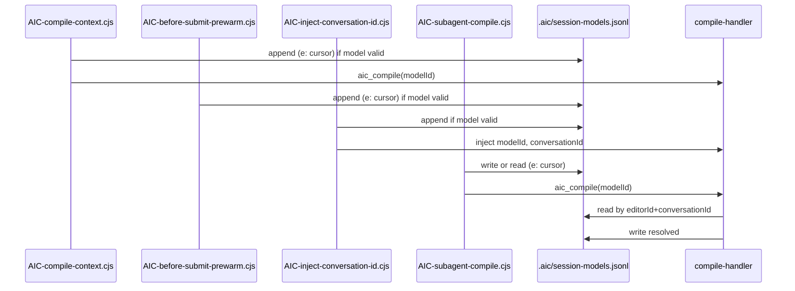
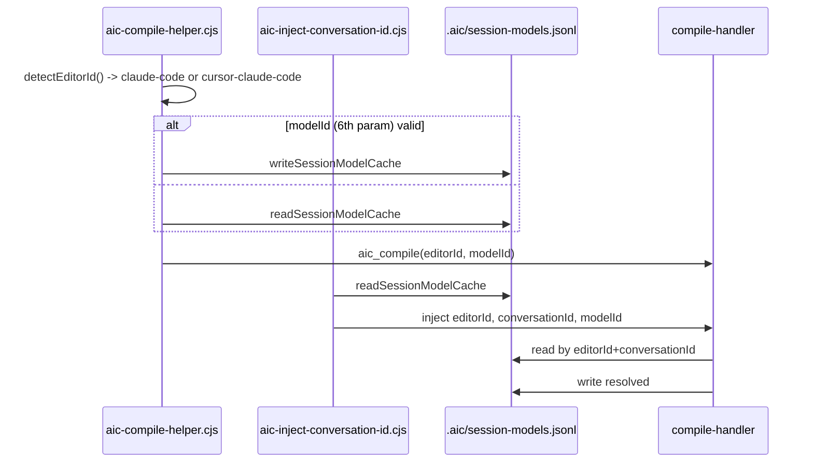

# Task 201: Document current model ID flow per editor

> **Status:** Pending
> **Phase:** AF — Model ID Resolution Simplification
> **Layer:** documentation
> **Depends on:** —

## Goal

Create a single reference document that describes the current (as-is) model ID capture, cache write, cache read, and server-side resolution flow for each editor (Cursor, Claude Code, cursor-claude-code), with sequence diagrams, to support refactoring and debugging.

## Architecture Notes

- Documentation lives in `documentation/`; kebab-case filenames. No phase names or task numbers in body (temporal robustness).
- Content is derived from verified code paths in integrations (Cursor/Claude hooks) and `mcp/src/handlers/compile-handler.ts`.

## Files

| Action | Path                                      |
| ------ | ----------------------------------------- |
| Create | `documentation/model-id-flow-per-editor.md` |

## Change Specification

### Change 1: Create new document

**Current text:** (none — new file)

**Required change:** Create the document with the following sections and content so the executor can create the file verbatim.

**Target text:**

```markdown
# Model ID flow per editor

This document describes the **current** model ID lifecycle: where each editor captures the model identifier, where it is written to or read from the session cache, and how the server resolves the final value. It covers the three editor identities: Cursor (`cursor`), Claude Code (`claude-code`), and Cursor-running-Claude-Code (`cursor-claude-code`).

## Session cache

- **Path:** `<projectRoot>/.aic/session-models.jsonl`
- **Format:** One JSON object per line (JSONL). Each entry has:
  - `c` — conversation ID (string; may be empty)
  - `m` — model ID (string; 1–256 chars, printable ASCII)
  - `e` — editor ID (`cursor`, `claude-code`, or `cursor-claude-code`)
  - `timestamp` — ISO 8601 string
- **Normalization:** The value `"default"` (case-insensitive) is normalized to `"auto"` before write and when read; all other values are used as-is.
- **Validation:** `isValidModelId(s)` requires length 1–256 and `/^[\x20-\x7E]+$/`. Invalid rows are skipped when reading.

## Server-side resolution

The compile handler resolves the model ID in this order:

1. `args.modelId` (from the `aic_compile` tool arguments)
2. `modelIdOverride` (from project config `model.id`, if set)
3. `readSessionModelCache(projectRoot, conversationId, editorId)` — last matching line by `e` and optionally `c`
4. `getModelId(editorId)` — detector default (e.g. config files, env)

The resolved value is normalized; if non-null, it is written back to the cache. Implementation: `mcp/src/handlers/compile-handler.ts` `resolveAndCacheModelId`.

## Cursor (editorId `cursor`)

Model capture and cache write happen in four hooks:

| Hook | File | Behavior |
| ---- | ---- | -------- |
| sessionStart | `AIC-compile-context.cjs` | Reads `hookInput.model`; if valid, normalizes, appends to cache with `e: "cursor"`, passes `modelId` in compile args to `aic_compile`. |
| beforeSubmitPrompt | `AIC-before-submit-prewarm.cjs` | Reads `input.model`; if valid, normalizes, appends to cache. Does not call `aic_compile`. |
| preToolUse | `AIC-inject-conversation-id.cjs` | If tool is `aic_compile`: when `input.model` is valid, normalizes, appends to cache, injects `modelId` and `conversationId` into tool input. |
| subagentStart | `AIC-subagent-compile.cjs` | Model from `modelIdFromSubagentStartPayload(hookInput)` (reads `subagent_model` via `subagent-start-model-id.cjs`). If present: write cache, use it; else read cache (filter `e === "cursor"`), use cached value. Passes `modelId` to `aic_compile`. |



## Claude Code (editorId `claude-code` or `cursor-claude-code`)

Editor ID is chosen by `detectEditorId()`: if `CURSOR_TRACE_ID` is set and non-empty, `cursor-claude-code`; else `claude-code`. All hooks that call the MCP server go through `aic-compile-helper.cjs`; PreToolUse is handled by `aic-inject-conversation-id.cjs`.

| Hook / path | File | Behavior |
| ----------- | ---- | -------- |
| SessionStart, UserPromptSubmit, SubagentStart, etc. | `aic-compile-helper.cjs` | `editorId = detectEditorId()`. If 6th param `modelId` valid: normalize, `writeSessionModelCache(projectRoot, resolved, conversationId, editorId)`. Else: `cached = readSessionModelCache(projectRoot, conversationId, editorId)`; if non-null, use `normalizeModelId(cached)`. Passes `editorId` and `modelId` in `aic_compile` args. |
| PreToolUse | `aic-inject-conversation-id.cjs` | `eid = detectEditorId()`; `cachedModelId = readSessionModelCache(projectRoot, conversationId, eid)`. Injects `editorId`, `conversationId`, `modelId` (cached) into tool input. Does not write to cache. |



## cursor-claude-code

Same implementation as Claude Code. When the Claude Code integration runs inside Cursor, `CURSOR_TRACE_ID` is set, so `detectEditorId()` returns `cursor-claude-code`. Cache entries use `e: "cursor-claude-code"`. The server’s `getModelId(editorId)` uses the same resolution (e.g. Cursor config when applicable).
```

## Writing Standards

- **Tone:** Technical, concise; developer reference.
- **Audience:** Developers working on integrations or the compile handler; implementers of follow-on refactors.
- **Terminology:** Use `editorId` (cursor, claude-code, cursor-claude-code), `modelId`, `session-models.jsonl`, `resolveAndCacheModelId`, hook names and file names as in the codebase.
- **Formatting:** Headings for each section; tables for hook/file/behavior; Mermaid code blocks for sequence diagrams. No phase names or task numbers in body.
- **Temporal robustness:** Describe current behavior only; do not reference phases or future tasks.

## Cross-Reference Map

| Document | References this doc | This doc references | Consistency check |
| -------- | ------------------- | ------------------- | ----------------- |
| `mvp-progress.md` | After creation — Phase AF | Phase AF (concept only, no link required) | Align terminology |
| `cursor-integration-layer.md` | Optional — model ID details | — | — |
| `claude-code-integration-layer.md` | Optional — model ID details | — | — |

## Config Changes

None.

## Steps

### Step 1: Create the document

Create `documentation/model-id-flow-per-editor.md` with the exact content from the Change Specification target text above (the full markdown including title, sections, tables, and Mermaid blocks). Preserve line breaks and structure. Do not add a Table of Contents (document is short).

**Verify:** File exists; `head -5 documentation/model-id-flow-per-editor.md` shows the title and first section.

### Step 2: Final verification

Run: `pnpm lint` (no doc-specific lint). Grep `documentation/model-id-flow-per-editor.md` for banned temporal references: `Phase [A-Z]`, `[A-Z][0-9]{2}:`, "will be added", "in the next", "recently", "upcoming", "future task". Expected: zero matches in body. Cross-check: each hook filename and `resolveAndCacheModelId` appear in the codebase (Grep).

**Verify:** No banned phrases; all code artifact names exist in the repo.

## Tests

| Test case | Description |
| --------- | ----------- |
| doc_exists | File `documentation/model-id-flow-per-editor.md` exists after Step 1 |
| no_temporal_refs | No phase names, task IDs, or future-milestone phrases in document body |
| artifact_names_valid | Every hook filename and handler name mentioned in the doc exists in the codebase |

## Acceptance Criteria

- [ ] `documentation/model-id-flow-per-editor.md` created with content per Change Specification
- [ ] Document includes overview, cache format, server resolution order, Cursor table and diagram, Claude Code table and diagram, cursor-claude-code section
- [ ] No phase names, task numbers, or temporal milestones in body
- [ ] All hook and handler names in the doc match actual file names in `integrations/` and `mcp/src/handlers/`
- [ ] Mermaid blocks are valid (sequenceDiagram with stated participants and flows)

## Blocked?

If during execution you encounter something unexpected:

1. **Stop immediately** — do not guess or improvise
2. Append a `## Blocked` section with what you tried, what went wrong, what decision you need
3. Report to the user and wait for guidance

**Circuit breaker:** If you find yourself making 3+ workarounds or adaptations to make something work, stop. List the adaptations, report to the user, and re-evaluate before continuing.
